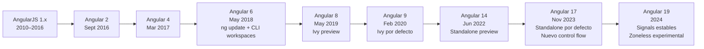

# Capítulo 1 - Parte 1: Historia, versiones y el renacimiento de Angular

> **Parte 1 de 4** · Capítulo 1 · PARTE I - Primeros Pasos con Angular

Angular es hoy uno de los frameworks de frontend más maduros del ecosistema web. Detrás de su versión actual hay más de una década de evolución, decisiones valientes y una reescritura completa que dividió a la comunidad antes de unirla más fuerte que nunca. Para entender Angular de verdad, necesitamos conocer su historia: de dónde viene, por qué cambió tan radicalmente y hacia dónde apunta el framework en 2024 y más allá.

## De AngularJS a Angular: la gran ruptura

AngularJS nació en 2010 de la mano de Miško Hevery, un ingeniero de Google. La propuesta era revolucionaria para la época: llevar la potencia del enlace de datos bidireccional (two-way data binding) al navegador con una sintaxis declarativa en HTML. Los desarrolladores podían construir aplicaciones interactivas sin escribir imperativamente cada manipulación del DOM. AngularJS se convirtió rápidamente en el estándar de facto para aplicaciones empresariales de una sola página (SPA).

Sin embargo, AngularJS cargaba con limitaciones estructurales difíciles de resolver sin una reescritura. Su sistema de detección de cambios basado en `$scope` y el ciclo de `$digest` resultaba impredecible y difícil de optimizar. La llegada de componentes web, TypeScript y las nuevas APIs de los navegadores hacía evidente que una evolución incremental no era suficiente.

En 2016, el equipo de Angular en Google lanzó Angular 2, una reescritura completa del framework. No era una actualización: era un producto nuevo. El cambio rompió la compatibilidad hacia atrás con AngularJS de forma intencional, lo que generó controversia pero permitió tomar decisiones de diseño fundamentalmente mejores. Angular 2+ adoptó TypeScript como lenguaje principal, introdujo el concepto de componentes con un ciclo de vida definido, y reemplazó el sistema de inyección de dependencias con uno más potente y predecible.

Para evitar la confusión entre versiones, el equipo adoptó una convención simple: "AngularJS" se refiere a la versión 1.x, y "Angular" (sin JS) se refiere a la versión 2 en adelante.

## El ciclo de releases y el versionado semántico

A partir de Angular 2, el equipo adoptó el versionado semántico (SemVer) y un ciclo de releases predecible que la comunidad podía planificar con confianza. Cada seis meses se publica una versión mayor (major), con dos o tres releases menores intermedios y parches de corrección según se necesiten.

El ciclo de soporte también está bien definido: cada versión mayor recibe soporte activo durante 18 meses y soporte de largo plazo (LTP) por 24 meses adicionales para equipos que necesitan estabilidad extendida. Esto significa que nunca hay una brecha mayor de seis meses entre versiones, y las migraciones pueden planificarse con tiempo suficiente.

La disciplina semántica ha sido fundamental para la adopción enterprise. Los equipos con ciclos de release lentos pueden permanecer en una versión LTS sabiendo exactamente cuándo deben migrar y qué herramientas automatizadas (`ng update`) están disponibles para hacerlo.

## Línea de tiempo de versiones principales

Una aclaración para quienes se preguntan por qué no existe Angular 3: la versión 3 fue saltada deliberadamente para alinear los números de versión del paquete `@angular/router`, que ya estaba en 3.x. Desde Angular 4 en adelante, todos los paquetes del framework avanzan juntos.

## Angular Ivy: el compilador que lo cambió todo

Angular Ivy es el nombre del compilador y motor de renderizado introducido como opción experimental en Angular 8 y habilitado por defecto a partir de Angular 9 en febrero de 2020. Ivy representó la mayor mejora interna del framework desde Angular 2: reescribió completamente cómo Angular compila los templates y genera código JavaScript.

Los beneficios de Ivy son tangibles. Los bundles de producción redujeron su tamaño significativamente gracias a una mejor eliminación de código muerto (tree shaking). Los tiempos de compilación mejoraron porque Ivy compila cada componente de forma independiente en lugar de analizar la aplicación entera. Los mensajes de error se volvieron más precisos porque el compilador tiene más información de contexto.

Ivy también sentó la base técnica para todas las innovaciones que vendrían: los componentes Standalone, los Signals y el camino hacia una arquitectura sin Zone.js.

## La era Standalone: Angular sin NgModule

Durante años, una de las críticas más comunes a Angular fue la obligatoriedad de los NgModules. Para usar un componente en una vista había que declararlo en un módulo, importar ese módulo en el módulo que lo necesitaba, y gestionar esta jerarquía de forma manual. Era poderoso pero verboso, y la curva de aprendizaje inicial resultaba empinada.

Angular 14 introdujo los componentes Standalone como característica experimental. Angular 17, lanzado en noviembre de 2023, los hizo el modo por defecto al generar nuevos proyectos. Un componente standalone se basta a sí mismo: declara sus propias dependencias directamente en el decorador `@Component`, eliminando la necesidad de NgModules para la mayoría de casos de uso.

Esto no significa que los NgModules desaparezcan. Millones de líneas de código en producción usan módulos, y Angular mantendrá soporte para ellos de forma indefinida. Pero los proyectos nuevos y los ejemplos de este libro usarán standalone, porque es el camino hacia el que evoluciona el ecosistema.

## Signals: la reactividad del futuro

Angular Signals es el sistema de reactividad de grano fino introducido en Angular 16 como experimental y estabilizado en Angular 17. Señala (valga el juego de palabras) el cambio más significativo en el modelo de programación de Angular desde la introducción de RxJS como librería central.

Un Signal es un valor reactivo: cuando cambia, Angular sabe exactamente qué partes de la interfaz dependen de él y solo actualiza esas partes. Esto contrasta con el modelo basado en Zone.js, donde Angular re-evalúa el árbol de componentes completo para detectar cambios. Signals hacen posible un Angular sin Zone.js (Zoneless), lo que reduce el tamaño del bundle y mejora el rendimiento en aplicaciones complejas.

## Por qué Angular sigue siendo relevante en 2024

Angular no es el framework más popular en GitHub stars ni el que más se menciona en tutoriales virales. Pero en el mercado enterprise, donde los equipos grandes construyen aplicaciones críticas que deben mantenerse durante años, Angular tiene ventajas únicas: TypeScript estricto como ciudadano de primera clase, un sistema de inyección de dependencias robusto, herramientas de testing integradas, una CLI que automatiza tareas complejas y un ciclo de releases predecible con rutas de migración asistidas.

Las encuestas de Stack Overflow y el ecosistema de npm confirman una base de usuarios estable y profesional. Empresas como Google, Microsoft, IBM, Deutsche Bank y miles de organizaciones medianas tienen equipos dedicados a Angular. La demanda laboral se mantiene alta precisamente porque Angular no es fácil de dominar: quienes lo conocen bien tienen un perfil diferenciado.

## Puntos clave

- AngularJS (1.x) y Angular (2+) son productos distintos; la ruptura fue intencional y necesaria
- El ciclo semestral de releases con SemVer permite planificar actualizaciones con confianza
- Angular Ivy (v9) mejoró radicalmente la compilación, el tamaño de bundle y sentó las bases de las innovaciones posteriores
- Los componentes Standalone son el modo por defecto desde Angular 17 y el camino recomendado para proyectos nuevos
- Angular Signals introduce reactividad de grano fino y abre la puerta a una arquitectura sin Zone.js

## ¿Qué sigue?

En la Parte 2 comparamos Angular con React y Vue de forma objetiva para ayudarte a entender en qué contextos cada herramienta brilla, y por qué el carácter "opinionated" de Angular es una ventaja en equipos profesionales.
