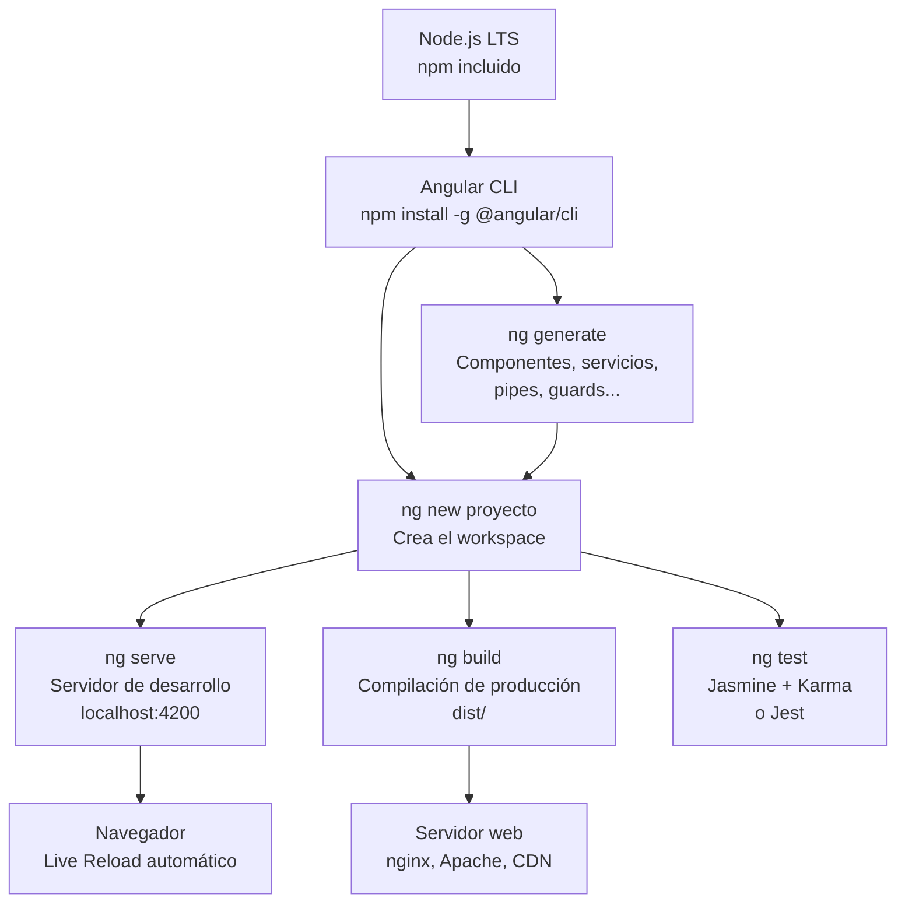

# Capítulo 1 - Parte 3: Instalación de Node, Angular CLI y VS Code

> **Parte 3 de 4** · Capítulo 1 · PARTE I - Primeros Pasos con Angular

Antes de escribir una sola línea de Angular, necesitamos construir el entorno de desarrollo correcto. Esto no es un trámite burocrático: un entorno bien configurado se traduce en retroalimentación inmediata al escribir código, errores detectados antes de guardar el archivo y comandos que automatizan tareas repetitivas. Invertir quince minutos aquí ahorra horas cada semana.

## Requisitos del sistema

Angular no requiere hardware de última generación, pero sí necesita algunos componentes de software instalados correctamente. Los requisitos mínimos para Angular 17+ son:

- **Node.js 18.13 o superior** (recomendado: Node.js 20 LTS o 22 LTS)
- **npm 9+** (viene incluido con Node.js)
- Sistema operativo: Windows 10+, macOS 11+, o cualquier distribución Linux moderna
- Al menos 4 GB de RAM (8 GB recomendado para proyectos grandes)

La versión de Node.js importa porque Angular CLI depende de APIs modernas del entorno. Usar una versión demasiado antigua produce errores crípticos difíciles de diagnosticar. Verifica siempre la tabla de compatibilidad en la documentación oficial de Angular antes de actualizar a una nueva versión mayor del framework.

## Instalando Node.js LTS

La forma recomendada de instalar Node.js es a través de un gestor de versiones, porque te permite cambiar entre versiones de Node según lo necesite cada proyecto. Las dos opciones más populares son `nvm` (Node Version Manager) para macOS y Linux, y `nvm-windows` para Windows.

Con `nvm` instalado, obtener la versión LTS más reciente es un único comando:

```bash
# Instalar la versión LTS más reciente
nvm install --lts

# Activarla como versión por defecto
nvm use --lts

# Verificar que está activa
node --version   # Debería mostrar v20.x.x o v22.x.x
npm --version    # Debería mostrar 9.x.x o superior
```

Si prefieres instalar Node.js directamente sin un gestor de versiones, descarga el instalador LTS desde el sitio oficial de Node.js. El instalador para Windows y macOS configura automáticamente las variables de entorno necesarias. En Linux, es preferible usar el gestor de paquetes de tu distribución o `nvm`.

## Instalando Angular CLI

Angular CLI (Command Line Interface) es la herramienta central del ecosistema Angular. Gestiona la creación de proyectos, la generación de componentes y servicios, la compilación, el servidor de desarrollo y las migraciones entre versiones. Se instala de forma global con npm:

```bash
# Instalar Angular CLI globalmente
npm install -g @angular/cli

# Verificar la instalación
ng version
```

La salida de `ng version` muestra la versión de Angular CLI junto con las versiones de Node.js, npm y otros componentes relevantes del entorno. Si ves algo como `Angular CLI: 17.x.x` o superior, la instalación fue exitosa.

Si trabajas en múltiples proyectos con diferentes versiones de Angular, es importante saber que la CLI global puede ser de una versión y cada proyecto puede tener su propia CLI en `node_modules`. Cuando ejecutas `ng` dentro de un proyecto, Angular siempre usa la versión local de la CLI (si existe), no la global. Esto garantiza que cada proyecto use la versión correcta.

```bash
# Actualizar Angular CLI a la última versión
npm install -g @angular/cli@latest

# Ver todos los comandos disponibles
ng help
```

## El toolchain de desarrollo



Este diagrama muestra cómo las piezas del entorno se relacionan entre sí. Node.js es la base sobre la que corre todo; Angular CLI es la interfaz que orquesta el trabajo; el servidor de desarrollo (`ng serve`) se comunica directamente con el navegador mediante hot reload.

## Configurando VS Code

Visual Studio Code es el editor más usado en el ecosistema Angular, y no es coincidencia. Tiene soporte nativo para TypeScript (ambos son proyectos de Microsoft), una extensión oficial de Angular mantenida por el equipo del framework, y un ecosistema de plugins que cubre todas las necesidades del desarrollo frontend moderno.

Instala VS Code desde el sitio oficial si aún no lo tienes. Una vez instalado, las siguientes extensiones transforman la experiencia de desarrollo con Angular:

**Angular Language Service** (ID: `angular.ng-template`) - Esta es la extensión fundamental. La mantiene el equipo oficial de Angular y aporta autocompletado, navegación a definición, detección de errores y refactoring dentro de los templates HTML de Angular. Sin ella, el editor trata los templates como HTML estático y pierde toda inteligencia contextual.

**ESLint** (ID: `dbaeumer.vscode-eslint`) - Angular CLI puede configurar ESLint en tu proyecto. Esta extensión hace que VS Code muestre los avisos de ESLint directamente en el editor, subrayando el código problemático en tiempo real.

**Prettier - Code formatter** (ID: `esbenp.prettier-vscode`) - Prettier formatea automáticamente el código al guardar, eliminando debates sobre estilo en los code reviews. Configura VS Code para que Prettier sea el formateador por defecto:

```json
// .vscode/settings.json - configuración específica del proyecto
{
  "editor.defaultFormatter": "esbenp.prettier-vscode",
  "editor.formatOnSave": true,
  "editor.codeActionsOnSave": {
    "source.fixAll.eslint": "explicit"
  },
  "[typescript]": {
    "editor.defaultFormatter": "esbenp.prettier-vscode"
  },
  "[html]": {
    "editor.defaultFormatter": "esbenp.prettier-vscode"
  }
}
```

**GitLens** (ID: `eamodio.gitlens`) - Añade información de git directamente en el editor: quién escribió cada línea, cuándo y en qué commit. Muy útil en proyectos de equipo.

**Error Lens** (ID: `usernamehw.errorlens`) - Muestra los mensajes de error y advertencia directamente en la línea donde ocurren, sin necesidad de pasar el cursor sobre el símbolo subrayado.

**Thunder Client** (ID: `rangav.vscode-thunder-client`) - Cliente HTTP integrado en VS Code, útil para probar los endpoints de tu API durante el desarrollo, sin necesidad de abrir una herramienta externa.

## Verificación final del entorno

Antes de crear el primer proyecto, una verificación rápida confirma que todo está en orden:

```bash
# Versión de Node.js (debe ser 18.13+ o 20+ LTS)
node --version

# Versión de npm (debe ser 9+)
npm --version

# Versión de Angular CLI
ng version

# Crear un proyecto de prueba para verificar que la CLI funciona
ng new proyecto-prueba --dry-run
# El flag --dry-run simula la creación sin escribir archivos
```

La opción `--dry-run` es tu mejor amiga al explorar comandos de Angular CLI: simula la ejecución y muestra qué archivos se crearían o modificarían, sin hacer nada. Es un hábito muy útil antes de ejecutar comandos que no conoces bien.

## Puntos clave

- Node.js 18.13+ es el mínimo; usa siempre una versión LTS para proyectos de producción
- `npm install -g @angular/cli` instala la CLI globalmente; cada proyecto puede tener su propia versión local
- Angular Language Service es la extensión indispensable para VS Code: sin ella el editor no entiende los templates de Angular
- El archivo `.vscode/settings.json` permite compartir la configuración del editor con todo el equipo via control de versiones
- `ng --dry-run` es una forma segura de explorar qué haría un comando antes de ejecutarlo

## ¿Qué sigue?

En la Parte 4 usamos este entorno recién configurado para crear nuestra primera aplicación Angular con `ng new` y exploramos cada archivo que genera la CLI para entender para qué sirve.
