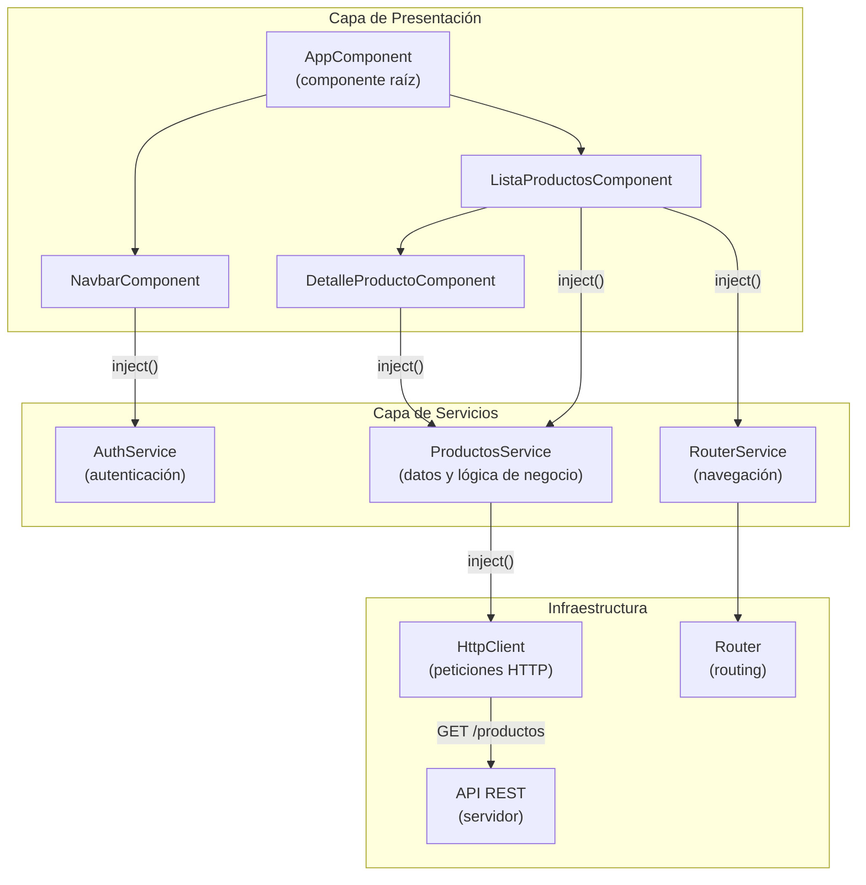

# Capítulo 2 - Parte 1: Visión general: módulos, componentes, servicios

> **Parte 1 de 4** · Capítulo 2 · PARTE I - Primeros Pasos con Angular

Angular no es una colección de funciones sueltas: es un sistema donde cada pieza tiene un rol definido y se comunica con las demás siguiendo reglas claras. Entender esta arquitectura desde el principio evita errores de diseño que son costosos de corregir más tarde. No se trata de memorizar conceptos; se trata de internalizar un modelo mental que guiará cada decisión de diseño a lo largo del libro.

## Los bloques constructivos de Angular

Angular organiza las aplicaciones en torno a tres conceptos centrales que trabajan juntos: componentes, servicios y el sistema de configuración (ya sea NgModules o la configuración standalone moderna). Comprender qué responsabilidad tiene cada uno es el punto de partida para escribir código Angular mantenible.

**Los componentes** son las unidades de interfaz de usuario. Cada componente es responsable de mostrar una porción de la pantalla y responder a las interacciones del usuario en esa porción. Un componente sabe cómo dibujarse, pero no sabe nada del servidor, de la base de datos ni de otros componentes que no sean sus hijos directos. Esta limitación es intencional: mantiene los componentes simples y reutilizables.

**Los servicios** encapsulan la lógica que no pertenece a ninguna vista en particular: llamadas HTTP, transformaciones de datos, estado compartido entre componentes, comunicación con APIs externas. Un servicio es una clase TypeScript ordinaria marcada con el decorador `@Injectable`. Puede inyectarse en cualquier componente, directiva o incluso otro servicio que lo necesite.

**La configuración de la aplicación** (en proyectos modernos, `app.config.ts` con providers; en proyectos legacy, NgModules) es el sistema que registra qué servicios están disponibles y cómo se organizan los diferentes bloques de la aplicación.

## La separación de responsabilidades en la práctica

La regla de oro de Angular es que los componentes no deberían contener lógica de negocio ni lógica de acceso a datos. Un componente recibe datos de un servicio, los muestra en pantalla y emite eventos cuando el usuario interactúa. El servicio hace el trabajo pesado.

Pensemos en una pantalla de lista de productos. El componente `ListaProductosComponent` es responsable de mostrar los productos y responder al clic del usuario (por ejemplo, navegar al detalle). El `ProductosService` es responsable de obtener los productos de la API, cachearlos si corresponde y transformar el formato de datos del servidor al formato que necesita la vista.

```typescript
import { Component, OnInit, inject } from '@angular/core';
import { ProductosService } from '../core/services/productos.service';

// Interfaz que define la forma del dato - tipado estricto
interface Producto {
  id: number;
  nombre: string;
  precio: number;
}

@Component({
  selector: 'app-lista-productos',
  standalone: true,
  template: `
    <ul>
      @for (producto of productos; track producto.id) {
        <li>{{ producto.nombre }} - {{ producto.precio | currency }}</li>
      }
    </ul>
  `
})
export class ListaProductosComponent implements OnInit {
  // El componente delega la obtención de datos al servicio
  private productosService = inject(ProductosService);
  productos: Producto[] = [];

  ngOnInit(): void {
    // El componente solo llama al servicio, no sabe cómo obtiene los datos
    this.productos = this.productosService.obtenerTodos();
  }
}
```

El componente no sabe si los datos vienen de una API HTTP, de localStorage o de datos en memoria. Esa decisión vive en el servicio. Si mañana cambia la fuente de datos, el componente no necesita ninguna modificación.

## El flujo de datos en Angular

Angular sigue un flujo de datos unidireccional de arriba hacia abajo para la mayoría de los casos, con eventos que fluyen de abajo hacia arriba. Los datos bajan del componente padre al hijo a través de `@Input()`. Las acciones del usuario suben del componente hijo al padre a través de `@Output()` y eventos.

Los servicios son los canales de comunicación para datos que deben compartirse entre componentes que no tienen relación padre-hijo: la barra de navegación y la pantalla principal pueden compartir estado a través de un servicio sin que ninguno de los dos sepa que el otro existe.

## Diagrama de la arquitectura



Este diagrama muestra cómo las tres capas se relacionan. Los componentes dependen de los servicios (nunca al revés). Los servicios dependen de la infraestructura (HttpClient, Router). Las dependencias fluyen siempre hacia abajo, nunca hacia arriba ni de forma circular.

## Los NgModules y el mundo standalone

Históricamente, Angular usaba NgModules para agrupar y configurar bloques de la aplicación. Un NgModule declaraba qué componentes pertenecían a él, qué módulos externos necesitaba y qué servicios proveía. Era un sistema poderoso pero verboso que añadía una capa de indirección entre el desarrollador y los componentes que realmente importaban.

Desde Angular 17, el modo standalone es el predeterminado. En lugar de declarar un componente en un módulo, el componente mismo declara sus dependencias. No hay NgModule de por medio. Los proyectos nuevos que creamos en este libro seguirán siempre el modelo standalone.

Para aplicaciones heredadas con NgModules, el modelo conceptual es el mismo: componentes, servicios y configuración. Solo cambia el mecanismo de registro. La comprensión de los NgModules sigue siendo relevante para trabajar con código existente; los cubriremos en detalle en la PARTE V.

## El sistema de inyección de dependencias

El pegamento que mantiene todo unido es el sistema de inyección de dependencias (DI) de Angular. Cuando un componente declara que necesita un servicio (a través de `inject()` o del constructor), Angular busca en su árbol de inyectores, encuentra la instancia correspondiente y se la entrega. El componente nunca construye el servicio por sí mismo.

Este patrón tiene dos consecuencias prácticas muy importantes. Primero, hace que el código sea testeable: en los tests podemos reemplazar el servicio real por un doble de prueba sin modificar el componente. Segundo, garantiza que los servicios sean singletons por defecto: toda la aplicación comparte la misma instancia del servicio, lo que significa que el estado que guarda un servicio es naturalmente compartido.

## Puntos clave

- Los componentes son responsables de la UI; los servicios, de la lógica de negocio y el acceso a datos
- El flujo de datos en Angular es unidireccional hacia abajo (padre a hijo) con eventos que suben (hijo a padre)
- Los servicios son el mecanismo de comunicación entre componentes no relacionados
- El sistema de DI inyecta las dependencias automáticamente, sin que los componentes construyan sus propias instancias
- En proyectos standalone (Angular 17+), no hay NgModules: cada componente declara sus propias dependencias

## ¿Qué sigue?

En la Parte 2 exploramos Angular CLI a fondo: todos los comandos que usaremos a diario, los flags más útiles y el concepto de schematics que permite extender la CLI con generadores personalizados.
