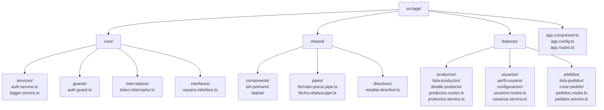

# Capítulo 2 - Parte 3: Estructura de carpetas y convenciones de proyecto

> **Parte 3 de 4** · Capítulo 2 · PARTE I - Primeros Pasos con Angular

La estructura de carpetas de un proyecto Angular no está impuesta por el framework, pero sí existe una convención ampliamente adoptada por la comunidad y respaldada por la guía de estilo oficial de Angular. Seguirla tiene un beneficio concreto: cualquier desarrollador Angular puede orientarse en tu proyecto en minutos, porque la ubicación de cada tipo de archivo es predecible. La arbitrariedad en la organización tiene un costo que se paga con fricción acumulada durante años.

## Las convenciones de nombres de Angular

Antes de hablar de carpetas, conviene tener claras las convenciones de nombres que Angular aplica en todos sus archivos:

**kebab-case para nombres de archivo:** Angular usa guiones para separar palabras en los nombres de archivo. Un componente de lista de productos vive en `lista-productos.component.ts`, no en `listaProductos.component.ts` ni en `ListaProductos.component.ts`. Esta convención es consistente en todos los tipos de artefactos: `auth.service.ts`, `formato-precio.pipe.ts`, `resaltar.directive.ts`.

**PascalCase para nombres de clase:** Las clases TypeScript siempre usan PascalCase. La clase del componente anterior se llama `ListaProductosComponent`. El servicio de autenticación es `AuthService`. El pipe de formato de precio es `FormatoPrecioPipe`.

**Sufijos descriptivos en los nombres de clase:** Angular requiere que las clases lleven un sufijo que indique su tipo: `Component`, `Service`, `Pipe`, `Directive`, `Guard`, `Resolver`, `Interceptor`. Esto no es una preferencia estética; es una convención que el compilador y las herramientas de Angular (incluyendo VS Code con Angular Language Service) usan para inferir el tipo de artefacto y aplicar las reglas correctas.

## La estructura recomendada por features

La organización más mantenible para proyectos de tamaño mediano y grande es la estructura por features (funcionalidades). En lugar de agrupar todos los componentes juntos y todos los servicios juntos, se agrupan todos los artefactos relacionados con una funcionalidad en el mismo directorio.



## El directorio `core`

`core` contiene los artefactos que son esenciales para toda la aplicación y que existen como singletons: se instancian una vez y están disponibles en cualquier parte del proyecto. La regla de oro de `core` es que sus artefactos no dependen de ninguna feature específica.

Aquí van los servicios de infraestructura (autenticación, logging, analytics), los guards de navegación global, los interceptores HTTP, las interfaces y tipos que se usan en todo el proyecto, y los resolvers de rutas principales.

```typescript
// src/app/core/services/logger.service.ts
import { Injectable } from '@angular/core';

@Injectable({
  providedIn: 'root' // Singleton disponible en toda la aplicación
})
export class LoggerService {
  // Centraliza el logging para facilitar cambiar la implementación
  log(mensaje: string, contexto?: string): void {
    const prefijo = contexto ? `[${contexto}]` : '';
    console.log(`${prefijo} ${mensaje}`);
  }

  error(mensaje: string, error?: unknown): void {
    console.error(mensaje, error);
  }
}
```

## El directorio `shared`

`shared` contiene los artefactos que se reutilizan en múltiples features pero que no son infraestructura global. La distinción con `core` es sutil pero importante: `shared` contiene UI reutilizable (botones, tarjetas, modales genéricos), pipes de transformación de datos y directivas de atributo comunes.

La regla de `shared` es que sus componentes no tienen estado propio significativo: son puramente presentacionales o aplican comportamientos genéricos. Un componente `TarjetaComponent` que renderiza un contenedor con sombra y bordes redondeados es un buen candidato para `shared`. Un componente `TarjetaProductoComponent` que sabe cómo mostrar los datos de un producto específico va en la feature de productos.

```typescript
// src/app/shared/components/tarjeta/tarjeta.component.ts
import { Component, Input } from '@angular/core';
import { NgClass } from '@angular/common';

@Component({
  selector: 'app-tarjeta',
  standalone: true,
  imports: [NgClass],
  template: `
    <div class="tarjeta" [ngClass]="{ 'tarjeta--elevada': elevada }">
      <ng-content /> <!-- Proyecta el contenido que pase el padre -->
    </div>
  `,
  styleUrl: './tarjeta.component.scss'
})
export class TarjetaComponent {
  @Input() elevada = false; // Variante opcional de la tarjeta
}
```

## El directorio `features`

Aquí vive la mayor parte del código de negocio. Cada feature tiene su propio directorio con todo lo que necesita: sus componentes, sus rutas, sus servicios específicos. Esta encapsulación tiene un beneficio directo: si el día de mañana decides eliminar o mover la feature de "pedidos", sabes exactamente qué archivos toca.

La convención es que cada feature tenga su propio archivo de rutas (`productos.routes.ts`) y sus servicios propios cuando la lógica es específica de esa feature. Los servicios que viven dentro de una feature no deben usarse en otras features: si necesitas compartir lógica entre dos features, muévela a `core`.

## Convenciones adicionales del proyecto

**Un componente por directorio:** Cada componente vive en su propio directorio, no todos los componentes de una feature en el mismo directorio plano. Esto simplifica encontrar los archivos relacionados (template, estilos, spec) y mantener el árbol de archivos legible.

**Índices de exportación (barrel files):** Para simplificar los imports en proyectos grandes, es común crear un archivo `index.ts` en cada directorio principal que reexporta todos los símbolos públicos:

```typescript
// src/app/shared/components/index.ts
// Permite importar desde 'app/shared/components' sin especificar la ruta exacta
export { TarjetaComponent } from './tarjeta/tarjeta.component';
export { BtnPrimarioComponent } from './btn-primario/btn-primario.component';
```

**Interfaces en su propio directorio:** Los tipos e interfaces que describen el modelo de datos del dominio van en `core/interfaces/` o, si son específicos de una feature, dentro del directorio de esa feature. Nunca definir tipos inline en los componentes si el mismo tipo se usa en más de un lugar.

## Puntos clave

- kebab-case para nombres de archivo, PascalCase para nombres de clase, sufijos descriptivos (`Component`, `Service`, etc.) son convenciones obligatorias en proyectos Angular profesionales
- `core/` contiene infraestructura singleton (servicios globales, guards, interceptores); `shared/` contiene UI y utilidades reutilizables; `features/` contiene la lógica de negocio organizada por dominio
- Un componente por directorio mantiene el árbol de archivos limpio y los archivos relacionados agrupados
- La lógica específica de una feature vive dentro de esa feature; la lógica compartida entre features vive en `core` o `shared`
- Los barrel files (`index.ts`) simplifican los imports en proyectos grandes pero deben usarse con moderación para no ocultar dependencias

## ¿Qué sigue?

En la Parte 4 exploramos en detalle cómo Angular arranca: qué hace `bootstrapApplication()`, el rol de `APP_INITIALIZER`, y cómo se configuran `provideRouter` y `provideHttpClient` para inicializar los subsistemas del framework.
