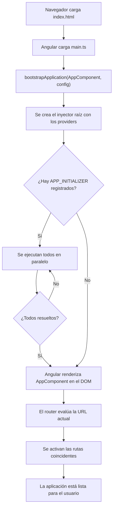

# Capítulo 2 - Parte 4: El proceso de arranque: main.ts, AppModule y bootstrap

> **Parte 4 de 4** · Capítulo 2 · PARTE I - Primeros Pasos con Angular

Cuando ejecutamos `ng serve` y el navegador abre nuestra aplicación, Angular pone en marcha una cadena de inicialización cuidadosamente orquestada. Todo comienza en un único archivo: `main.ts`. Entender ese proceso nos da control total sobre qué sucede antes de que el usuario vea el primer píxel de nuestra interfaz.

## De platformBrowserDynamic a bootstrapApplication

En Angular anterior a la versión 14, el punto de entrada de cualquier aplicación era `platformBrowserDynamic().bootstrapModule(AppModule)`. Esta función cargaba el módulo raíz, resolvía todas sus dependencias declaradas y montaba el componente raíz en el DOM. El modelo basado en módulos funcionó durante años, pero imponía un coste: cada componente necesitaba estar declarado en algún `NgModule`, y ese módulo debía ser importado donde se usara.

A partir de Angular 14, y consolidado como el estándar en Angular 17, disponemos de `bootstrapApplication()`. Esta función prescinde completamente del módulo raíz: recibe directamente el componente raíz y un objeto de configuración opcional. El resultado es un arranque más directo, con menos código de infraestructura y mejor soporte para tree-shaking, porque solo se incluye lo que declaramos explícitamente.

```typescript
// main.ts - punto de entrada de la aplicación Angular 17+
import { bootstrapApplication } from '@angular/platform-browser';
import { AppComponent } from './app/app.component';
import { configuracionApp } from './app/app.config';

bootstrapApplication(AppComponent, configuracionApp)
  .catch((error: unknown) => console.error('Error al iniciar la aplicación:', error));
```

El segundo argumento, `configuracionApp`, es un objeto de tipo `ApplicationConfig` que centralizamos en un archivo separado. Esto mantiene `main.ts` legible y permite reutilizar la configuración en entornos de prueba.

## El archivo app.config.ts: el nuevo centro de configuración

Con el modelo standalone, toda la configuración que antes vivía en el decorador `@NgModule` (providers, importaciones de módulos de Angular) se traslada a `app.config.ts`. Este archivo exporta un `ApplicationConfig` que pasamos a `bootstrapApplication`.

```typescript
// app/app.config.ts
import { ApplicationConfig, provideZoneChangeDetection } from '@angular/core';
import { provideRouter } from '@angular/router';
import { provideHttpClient, withInterceptorsFromDi } from '@angular/common/http';
import { provideAnimationsAsync } from '@angular/platform-browser/animations/async';
import { rutasApp } from './app.routes';

export const configuracionApp: ApplicationConfig = {
  providers: [
    // Optimiza la detección de cambios agrupando eventos en una sola zona
    provideZoneChangeDetection({ eventCoalescing: true }),
    // Registra el router con nuestras rutas
    provideRouter(rutasApp),
    // Habilita HttpClient en toda la aplicación
    provideHttpClient(withInterceptorsFromDi()),
    // Carga animaciones de forma asíncrona (no bloquea el arranque)
    provideAnimationsAsync(),
  ],
};
```

Cada función `provideX()` es una función de factory que registra un conjunto de providers en el inyector raíz. Esta API reemplaza las importaciones de módulos como `RouterModule.forRoot()` o `HttpClientModule`, con la ventaja de ser más explícita y de permitir que el compilador elimine código no utilizado del bundle final.

## APP_INITIALIZER: ejecutar código antes de mostrar la aplicación

Hay escenarios donde necesitamos que algo ocurra antes de que Angular renderice cualquier componente: cargar configuración desde el servidor, verificar autenticación, inicializar una librería externa, o cargar traducciones. Para eso existe el token `APP_INITIALIZER`.

```typescript
// app/app.config.ts - ejemplo con APP_INITIALIZER
import { ApplicationConfig, APP_INITIALIZER, inject } from '@angular/core';
import { provideHttpClient } from '@angular/common/http';
import { ConfiguracionService } from './core/services/configuracion.service';

// Función factory que retorna una función que retorna una Promise
function inicializarApp(): () => Promise<void> {
  const configuracion = inject(ConfiguracionService);
  return () => configuracion.cargarDesdeServidor();
}

export const configuracionApp: ApplicationConfig = {
  providers: [
    provideHttpClient(),
    {
      provide: APP_INITIALIZER,
      useFactory: inicializarApp,
      multi: true, // Permite múltiples inicializadores en paralelo
    },
  ],
};
```

El detalle clave está en `multi: true`: podemos registrar varios `APP_INITIALIZER` y Angular los ejecuta todos antes de renderizar. Si alguno retorna una `Promise` o un `Observable`, Angular espera a que se resuelva. Esto convierte el arranque en una barrera de seguridad: nada se muestra hasta que toda la inicialización termine.

```typescript
// core/services/configuracion.service.ts
import { Injectable, inject } from '@angular/core';
import { HttpClient } from '@angular/common/http';
import { firstValueFrom } from 'rxjs';

interface ConfiguracionRemota {
  apiUrl: string;
  version: string;
  caracteristicas: Record<string, boolean>;
}

@Injectable({ providedIn: 'root' })
export class ConfiguracionService {
  private http = inject(HttpClient);
  configuracion!: ConfiguracionRemota;

  cargarDesdeServidor(): Promise<void> {
    // firstValueFrom convierte el Observable a Promise para APP_INITIALIZER
    return firstValueFrom(
      this.http.get<ConfiguracionRemota>('/assets/config.json')
    ).then(datos => {
      this.configuracion = datos;
    });
  }
}
```

Este patrón garantiza que cuando cualquier componente pida `ConfiguracionService`, los datos ya estarán disponibles. Sin `APP_INITIALIZER`, tendríamos que manejar el estado de carga en cada componente que necesite esa configuración.

## El flujo completo de arranque

El proceso tiene una secuencia bien definida que conviene tener clara para depurar problemas de inicialización.



Este diagrama muestra por qué la aplicación puede parecer "colgada" si un `APP_INITIALIZER` falla o tarda demasiado: Angular está esperando que se resuelva antes de continuar. Por eso es fundamental manejar errores dentro de los inicializadores y establecer timeouts cuando sea apropiado.

## provideRouter, provideHttpClient y provideAnimations

Vale la pena examinar brevemente qué aporta cada función de configuración, porque cada una tiene variantes que permiten ajustar el comportamiento:

`provideRouter(rutas)` registra el sistema de routing. Acepta características adicionales como `withComponentInputBinding()` (que permite recibir parámetros de ruta como `@Input`), `withViewTransitions()` para animaciones entre rutas, o `withPreloading(PreloadAllModules)` para cargar módulos lazy en segundo plano.

`provideHttpClient()` habilita el cliente HTTP. Con `withInterceptorsFromDi()` activamos los interceptores registrados como providers. Con `withFetch()` reemplazamos `XMLHttpRequest` por la API `fetch` del navegador, lo que mejora el rendimiento en Angular Universal.

`provideAnimationsAsync()` carga el módulo de animaciones de forma diferida. Si no necesitamos animaciones, usamos `provideNoopAnimations()` para indicarlo explícitamente y reducir el bundle.

```typescript
// app/app.config.ts - configuración avanzada del router
import { ApplicationConfig } from '@angular/core';
import { provideRouter, withComponentInputBinding, withViewTransitions } from '@angular/router';
import { provideHttpClient, withFetch } from '@angular/common/http';
import { rutasApp } from './app.routes';

export const configuracionApp: ApplicationConfig = {
  providers: [
    provideRouter(
      rutasApp,
      withComponentInputBinding(),   // Rutas como @Input en componentes
      withViewTransitions()          // Transiciones animadas entre rutas
    ),
    provideHttpClient(
      withFetch()                    // Usa fetch() en lugar de XHR
    ),
  ],
};
```

La composición de características mediante funciones `withX()` es un patrón deliberado: el compilador puede eliminar las características que no declaramos, mientras que con módulos el comportamiento venía incluido en el módulo completo sin posibilidad de reducirlo.

## Puntos clave

- `bootstrapApplication(Componente, config)` reemplaza `platformBrowserDynamic().bootstrapModule()` en Angular 17+
- La configuración de providers centralizada en `app.config.ts` reemplaza las importaciones del `AppModule`
- `APP_INITIALIZER` permite ejecutar código asíncrono antes de que Angular renderice el primer componente
- Las funciones `provideRouter()`, `provideHttpClient()` y `provideAnimationsAsync()` aceptan características adicionales con las funciones `withX()`
- Un `APP_INITIALIZER` que falla bloquea el arranque completo de la aplicación

## ¿Qué sigue?

En el Capítulo 3 comenzamos a explorar la plantilla de Angular en profundidad: la sintaxis de interpolación, los bindings de propiedad y evento, y el nuevo flujo de control con `@if`, `@for` y `@switch`.
