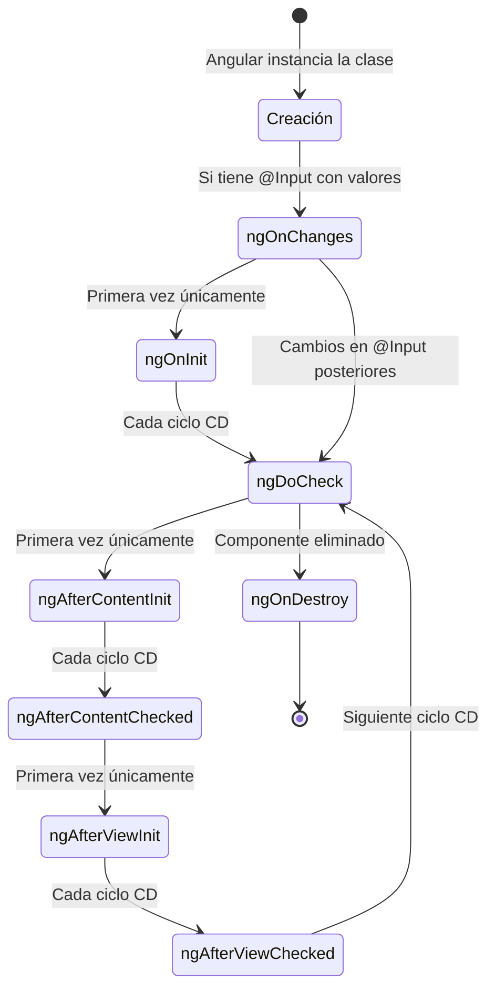

# Capítulo 3 - Parte 2: Ciclo de vida: OnInit, OnChanges, OnDestroy y los demás

> **Parte 2 de 4** · Capítulo 3 · PARTE II - Componentes: El Alma de Angular

Cuando Angular crea un componente, no lo hace de golpe. Lo construye en etapas: primero instancia la clase, luego enlaza los inputs, después compila el template, y finalmente lo inserta en el DOM. Cada una de esas etapas dispara un evento que el componente puede interceptar implementando una interfaz de ciclo de vida. Conocer el orden exacto en que ocurren es indispensable para escribir código correcto y evitar errores sutiles que solo aparecen en producción.

## Los ocho hooks en orden de ejecución

Angular define ocho interfaces de ciclo de vida, cada una con un método correspondiente que el framework llama automáticamente en el momento apropiado:

1. **`ngOnChanges`** - Se ejecuta antes de `ngOnInit` y cada vez que cambia un `@Input()` del componente. Recibe un objeto `SimpleChanges` con los valores anterior y actual.
2. **`ngOnInit`** - Se ejecuta una sola vez, justo después del primer `ngOnChanges`. Es el lugar correcto para inicializar datos: llamar a servicios, hacer peticiones HTTP, configurar estado inicial.
3. **`ngDoCheck`** - Se ejecuta en cada ciclo de Change Detection, incluso cuando Angular no detecta cambios en los inputs. Úsalo solo cuando necesitas lógica de detección de cambios personalizada; mal usado puede dañar el rendimiento.
4. **`ngAfterContentInit`** - Se ejecuta una sola vez, justo después de que Angular proyecta contenido externo (ng-content) en el componente.
5. **`ngAfterContentChecked`** - Se ejecuta después de cada verificación del contenido proyectado. Corre junto a `ngDoCheck`.
6. **`ngAfterViewInit`** - Se ejecuta una sola vez, después de que Angular inicializa la vista del componente y la de sus hijos. Es el primer momento en que `@ViewChild` y `@ViewChildren` tienen valor.
7. **`ngAfterViewChecked`** - Se ejecuta después de cada verificación de la vista del componente y sus hijos.
8. **`ngOnDestroy`** - Se ejecuta justo antes de que Angular destruya el componente. Es el lugar para cancelar suscripciones, limpiar timers y liberar recursos.

## Diagrama del ciclo de vida completo



## ngOnInit: el lugar correcto para inicializar datos

El constructor de la clase existe para recibir dependencias inyectadas, no para ejecutar lógica de negocio. En el constructor, Angular aún no ha enlazado los `@Input()`, por lo que leer su valor ahí daría `undefined`. `ngOnInit` se ejecuta cuando los inputs ya están disponibles y el componente está listo para funcionar.

```typescript
import { Component, OnInit, inject } from '@angular/core';
import { ProductosService } from '../servicios/productos.service';
import { Producto } from '../modelos/producto.model';
import { NgFor } from '@angular/common';

@Component({
  selector: 'app-lista-productos',
  standalone: true,
  imports: [NgFor],
  template: `
    <ul>
      <li *ngFor="let p of productos">{{ p.nombre }}</li>
    </ul>
  `
})
export class ListaProductosComponent implements OnInit {
  productos: Producto[] = [];

  // El servicio se inyecta aquí, pero NO se usan sus métodos en el constructor
  private productosService = inject(ProductosService);

  ngOnInit(): void {
    // Aquí sí: los @Input están disponibles y el componente está listo
    this.productos = this.productosService.obtenerTodos();
  }
}
```

Implementar la interfaz `OnInit` (escribir `implements OnInit`) es técnicamente opcional porque TypeScript no puede forzar que el framework llame al método. Sin embargo, es una práctica recomendada porque hace explícita la intención, activa el autocompletado del IDE y produce un error de compilación si el nombre del método está mal escrito.

## ngOnChanges: reaccionar a cambios de @Input

Mientras que `ngOnInit` corre una sola vez, `ngOnChanges` corre cada vez que un valor de `@Input` cambia. Recibe un parámetro de tipo `SimpleChanges` que contiene, para cada input modificado, el valor anterior (`previousValue`) y el nuevo (`currentValue`), además de una bandera `firstChange` que indica si es la primera vez que se asigna.

```typescript
import { Component, Input, OnChanges, SimpleChanges } from '@angular/core';

@Component({
  selector: 'app-barra-progreso',
  standalone: true,
  template: `
    <div class="barra">
      <div class="relleno" [style.width.%]="porcentaje"></div>
    </div>
    <p>{{ mensaje }}</p>
  `,
  styles: [`.barra { background: #eee; height: 8px; }
            .relleno { background: #1976d2; height: 100%; transition: width 0.3s; }`]
})
export class BarraProgresoComponent implements OnChanges {
  @Input() porcentaje: number = 0;
  mensaje: string = '';

  ngOnChanges(cambios: SimpleChanges): void {
    if (cambios['porcentaje']) {
      const anterior = cambios['porcentaje'].previousValue ?? 0;
      const actual = cambios['porcentaje'].currentValue;
      // Calculamos si avanzó o retrocedió
      this.mensaje = actual > anterior ? `Progreso: ${actual}%` : `Reiniciado a ${actual}%`;
    }
  }
}
```

Un detalle importante: `ngOnChanges` solo responde a cambios en referencias primitivas o referencias de objeto nuevas. Si mutas un array u objeto existente (por ejemplo, `this.items.push(...)` en el componente padre) sin reasignar la referencia, `ngOnChanges` no detectará el cambio. Este es uno de los motivos por los que el patrón de inmutabilidad es tan valioso en Angular.

## ngOnDestroy: limpiando antes de irse

Cada recurso que un componente abre durante su vida debe cerrarse cuando el componente desaparece. Las suscripciones a Observables son el ejemplo más común: si no se cancelan, el callback sigue ejecutándose aunque el componente ya no exista, lo que provoca memory leaks y efectos secundarios impredecibles.

```typescript
import { Component, OnInit, OnDestroy } from '@angular/core';
import { Subscription, interval } from 'rxjs';

@Component({
  selector: 'app-reloj',
  standalone: true,
  template: `<p>Segundos activo: {{ segundos }}</p>`
})
export class RelojComponent implements OnInit, OnDestroy {
  segundos: number = 0;

  // Guardamos la referencia para poder cancelarla en OnDestroy
  private suscripcion!: Subscription;

  ngOnInit(): void {
    // interval() emite un número cada 1000ms
    this.suscripcion = interval(1000).subscribe(() => {
      this.segundos++;
    });
  }

  ngOnDestroy(): void {
    // Sin esta línea, el Observable seguiría emitiendo en memoria
    this.suscripcion.unsubscribe();
  }
}
```

En Angular 16+ existe una alternativa más elegante: `takeUntilDestroyed()`, un operador de RxJS que cancela la suscripción automáticamente cuando el componente se destruye, sin necesidad de gestionar la suscripción manualmente. Lo exploraremos en profundidad en la Parte IX del libro.

## ngAfterViewInit: cuando el DOM está listo

Hay situaciones en las que necesitas acceder al DOM directamente, por ejemplo para inicializar una librería de terceros que requiere un elemento HTML real. `ngAfterViewInit` es el primer momento en que el DOM del componente y de sus hijos existe completamente.

```typescript
import { Component, AfterViewInit, ViewChild, ElementRef } from '@angular/core';

@Component({
  selector: 'app-canvas-grafico',
  standalone: true,
  template: `<canvas #lienzo width="400" height="300"></canvas>`
})
export class CanvasGraficoComponent implements AfterViewInit {
  // La referencia al elemento canvas estará disponible en ngAfterViewInit
  @ViewChild('lienzo') lienzo!: ElementRef<HTMLCanvasElement>;

  ngAfterViewInit(): void {
    const ctx = this.lienzo.nativeElement.getContext('2d')!;
    // Solo aquí podemos usar el canvas: el DOM ya existe
    ctx.fillStyle = '#1976d2';
    ctx.fillRect(10, 10, 150, 100);
  }
}
```

Intentar acceder a `this.lienzo` en `ngOnInit` retornaría `undefined`, porque la vista aún no se ha construido en ese punto. `ngAfterViewInit` garantiza que el elemento existe.

## Puntos clave

- Los ocho hooks de ciclo de vida se ejecutan en un orden preciso y determinista; conocerlo evita bugs sutiles.
- `ngOnInit` es el lugar correcto para inicializar datos: los `@Input()` ya están disponibles y es una sola ejecución.
- `ngOnChanges` reacciona a cambios en `@Input()` y recibe los valores anterior y actual a través de `SimpleChanges`.
- `ngOnDestroy` es obligatorio para cancelar suscripciones, limpiar timers y liberar cualquier recurso que el componente haya abierto.
- `ngAfterViewInit` es el primer momento en que el DOM del componente está disponible; úsalo para integrar librerías que necesiten elementos HTML reales.

## ¿Qué sigue?

En la Parte 3 estudiamos la comunicación entre componentes: cómo un componente padre envía datos hacia abajo con `@Input()` y cómo un componente hijo notifica eventos hacia arriba con `@Output()`.
