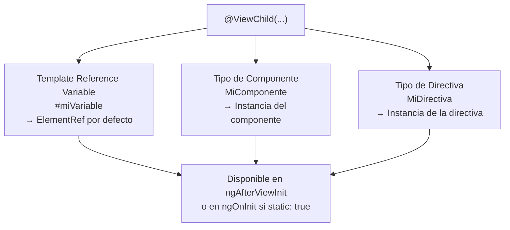

# Capítulo 4 - Parte 1: ViewChild, ViewChildren y ElementRef

> **Parte 1 de 4** · Capítulo 4 · PARTE II - Componentes: El Alma de Angular

Hasta ahora, la comunicación entre un componente y su template ha sido a través del data binding: el template lee propiedades de la clase, y los eventos del template llaman a métodos de la clase. Pero hay casos en que necesitamos ir en la dirección opuesta: que la clase acceda directamente a un elemento del DOM, a un componente hijo o a una directiva que vive en el template. Para eso existen `@ViewChild` y `@ViewChildren`.

## @ViewChild: acceso a un único elemento del template

`@ViewChild` permite obtener una referencia a la primera coincidencia de un selector dentro de la vista del componente. Puede usarse de tres formas distintas dependiendo de qué se quiere obtener:

**Por nombre de template reference variable**: cuando el template tiene una variable `#nombreVariable`, `@ViewChild('nombreVariable')` obtiene la referencia a ese elemento o componente.

**Por tipo de componente o directiva**: `@ViewChild(MiComponenteHijo)` obtiene la instancia del primer `MiComponenteHijo` encontrado en el template.

**Por tipo de directiva**: `@ViewChild(MiDirectiva)` obtiene la instancia de la primera directiva del tipo especificado.

```typescript
// archivo: formulario-enfocado.component.ts
import { Component, ViewChild, ElementRef, AfterViewInit } from '@angular/core';

@Component({
  selector: 'app-formulario-enfocado',
  standalone: true,
  template: `
    <input #campoNombre type="text" placeholder="Tu nombre" />
    <button (click)="enfocarCampo()">Enfocar campo</button>
  `
})
export class FormularioEnfocadoComponent implements AfterViewInit {
  // Angular resuelve la referencia al <input> con la variable #campoNombre
  @ViewChild('campoNombre') campoNombre!: ElementRef<HTMLInputElement>;

  ngAfterViewInit(): void {
    // El elemento ya existe en el DOM: podemos enfocarlo automáticamente
    this.campoNombre.nativeElement.focus();
  }

  enfocarCampo(): void {
    this.campoNombre.nativeElement.focus();
  }
}
```

`ElementRef<T>` es un wrapper que Angular proporciona para acceder al elemento nativo del DOM. La propiedad `nativeElement` devuelve el elemento HTML real. Es importante usarla con moderación: manipular el DOM directamente bypasea las optimizaciones de Angular y puede causar problemas con el renderizado en servidor (SSR). Para la mayoría de los casos de DOM manipulation, las directivas y el binding son la solución correcta.

## La opción { static: true } vs { static: false }

`@ViewChild` acepta un segundo argumento con opciones. La más importante es `static`:

**`{ static: false }`** (valor por defecto): la referencia se resuelve después de la primera ejecución de Change Detection, lo que significa que está disponible en `ngAfterViewInit`. Úsalo para elementos que existen condicionalmente en el template (dentro de `@if`, por ejemplo).

**`{ static: true }`**: la referencia se resuelve antes de que corra el primer Change Detection, lo que significa que está disponible ya en `ngOnInit`. Solo funciona para elementos que siempre están presentes en el template, sin condicionales.

```typescript
import { Component, ViewChild, ElementRef, OnInit, AfterViewInit } from '@angular/core';

@Component({
  selector: 'app-demo-static',
  standalone: true,
  template: `
    <!-- Este elemento siempre existe: puede ser static: true -->
    <div #contenedorFijo>Siempre visible</div>

    <!-- Este elemento puede no existir si mostrarPanel es false -->
    @if (mostrarPanel) {
      <div #panelCondicional>Panel opcional</div>
    }
  `
})
export class DemoStaticComponent implements OnInit, AfterViewInit {
  mostrarPanel = true;

  // static: true → disponible en ngOnInit
  @ViewChild('contenedorFijo', { static: true })
  contenedor!: ElementRef<HTMLDivElement>;

  // static: false → disponible en ngAfterViewInit (default, puede omitirse)
  @ViewChild('panelCondicional', { static: false })
  panel?: ElementRef<HTMLDivElement>;

  ngOnInit(): void {
    // Funciona porque static: true
    console.log(this.contenedor.nativeElement.textContent);

    // INCORRECTO: "panel" sería undefined aquí incluso con static: true
    // porque está dentro de un @if
  }

  ngAfterViewInit(): void {
    // Aquí sí está disponible (si mostrarPanel es true)
    console.log(this.panel?.nativeElement.textContent);
  }
}
```

## Acceder a un componente hijo con @ViewChild

Cuando el tipo pasado a `@ViewChild` es un componente, Angular devuelve la instancia de ese componente, dando acceso a sus propiedades y métodos públicos. Este patrón se usa para orquestar comportamiento entre componentes sin pasar por un servicio compartido.

```typescript
// archivo: panel-reproductor.component.ts
import { Component, ViewChild, AfterViewInit } from '@angular/core';
import { ReproductorAudioComponent } from './reproductor-audio.component';

@Component({
  selector: 'app-panel-reproductor',
  standalone: true,
  imports: [ReproductorAudioComponent],
  template: `
    <app-reproductor-audio [src]="cancionActual" />
    <button (click)="detenerYReiniciar()">Reiniciar</button>
  `
})
export class PanelReproductorComponent implements AfterViewInit {
  cancionActual = 'assets/audio/cancion.mp3';

  // Angular devuelve la instancia de ReproductorAudioComponent
  @ViewChild(ReproductorAudioComponent)
  reproductor!: ReproductorAudioComponent;

  ngAfterViewInit(): void {
    // Podemos llamar métodos públicos del componente hijo
    this.reproductor.reproducirAutomaticamente();
  }

  detenerYReiniciar(): void {
    this.reproductor.detener();
    this.reproductor.irAlInicio();
  }
}
```

## @ViewChildren: acceso a múltiples elementos

Cuando el template contiene varios elementos del mismo tipo, `@ViewChildren` obtiene todos ellos como un `QueryList<T>`. `QueryList` es una colección "viva": se actualiza automáticamente cuando los elementos se añaden o eliminan del template (por ejemplo, dentro de un `@for`).

```typescript
import { Component, ViewChildren, QueryList, ElementRef, AfterViewInit } from '@angular/core';

@Component({
  selector: 'app-galeria',
  standalone: true,
  template: `
    @for (imagen of imagenes; track imagen.id) {
      
    }
    <button (click)="aplicarEfecto()">Aplicar efecto a todas</button>
  `
})
export class GaleriaComponent implements AfterViewInit {
  imagenes = [
    { id: 1, url: 'assets/img1.jpg', alt: 'Imagen 1' },
    { id: 2, url: 'assets/img2.jpg', alt: 'Imagen 2' },
    { id: 3, url: 'assets/img3.jpg', alt: 'Imagen 3' },
  ];

  // QueryList contiene los tres  con variable #imgRef
  @ViewChildren('imgRef') imagenesDom!: QueryList<ElementRef<HTMLImageElement>>;

  ngAfterViewInit(): void {
    // QueryList es iterable
    this.imagenesDom.forEach(img => {
      console.log(img.nativeElement.naturalWidth);
    });

    // También podemos suscribirnos a cambios en la lista
    this.imagenesDom.changes.subscribe((lista: QueryList<ElementRef<HTMLImageElement>>) => {
      console.log(`La galería ahora tiene ${lista.length} imágenes`);
    });
  }

  aplicarEfecto(): void {
    this.imagenesDom.forEach(img => {
      img.nativeElement.style.filter = 'grayscale(100%)';
    });
  }
}
```

La propiedad `.changes` de `QueryList` devuelve un Observable que emite cada vez que la lista cambia. Esto es especialmente útil cuando los elementos del `@for` se añaden o eliminan dinámicamente y necesitas reaccionar a esos cambios.

## Diagrama: tipos de referencia que acepta @ViewChild



## Puntos clave

- `@ViewChild` obtiene la referencia al primer elemento, componente o directiva del tipo indicado que existe en el template del componente.
- `{ static: true }` hace la referencia disponible en `ngOnInit`, pero solo funciona para elementos que siempre están en el template, sin condicionales.
- `{ static: false }` (por defecto) hace la referencia disponible en `ngAfterViewInit`, y funciona con elementos condicionales.
- Cuando `@ViewChild` apunta a un componente, devuelve la instancia completa, dando acceso a sus propiedades y métodos públicos.
- `@ViewChildren` devuelve un `QueryList<T>` que contiene todos los elementos que coinciden y se actualiza automáticamente cuando el template cambia.

## ¿Qué sigue?

En la Parte 2 estudiamos `ng-content`: la proyección de contenido que permite que los componentes padre inyecten HTML arbitrario dentro del template de un componente hijo, habilitando patrones de composición muy potentes.
