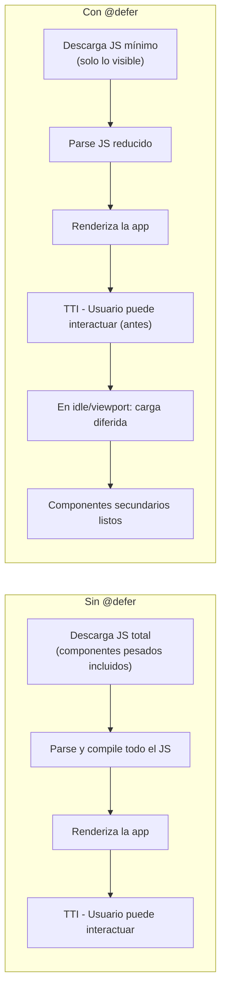

# Capítulo 4 - Parte 4: Deferrable Views con @defer: carga diferida de UI

> **Parte 4 de 4** · Capítulo 4 · PARTE II - Componentes: El Alma de Angular

La velocidad percibida de una aplicación no depende solo de cuántos kilobytes descarga el usuario, sino de cuándo puede interactuar con lo que ve. Angular 17 introdujo `@defer` como una primitiva nativa del compilador para diferir la carga de partes de la interfaz hasta que realmente se necesiten. A diferencia de la carga lazy de rutas, `@defer` opera al nivel del template: cualquier bloque de UI puede volverse diferido con una sintaxis declarativa, sin necesidad de crear rutas separadas ni configurar el router.

## La anatomía de un bloque @defer

Un bloque `@defer` envuelve el contenido que queremos diferir y puede acompañarse de tres bloques auxiliares que controlan lo que el usuario ve en cada fase del proceso de carga.

```html
<!-- Ejemplo completo de @defer con todos sus bloques -->
@defer (on viewport) {
  <!-- Este contenido se carga cuando entra en el viewport -->
  <app-grafico-ventas [datos]="datosVentas" />
}
@loading (minimum 300ms) {
  <!-- Se muestra mientras se descarga el componente diferido -->
  <div class="skeleton-grafico"></div>
}
@error {
  <!-- Se muestra si la carga del componente falla -->
  <p class="error-carga">No se pudo cargar el gráfico. Intenta de nuevo.</p>
}
@placeholder (minimum 200ms) {
  <!-- Se muestra ANTES de que se dispare la carga -->
  <div class="espacio-reservado">📊 Gráfico de ventas</div>
}
```

El orden de aparición de los bloques importa para entender el flujo: `@placeholder` es lo que el usuario ve desde el principio, antes de que ocurra ninguna carga. Cuando se cumple el trigger, aparece `@loading` mientras Angular descarga el JavaScript del componente diferido. Una vez cargado, se renderiza el contenido principal del `@defer`. Si algo sale mal, `@error` toma el control.

La opción `minimum` en `@loading` y `@placeholder` garantiza un tiempo mínimo de visualización, evitando el efecto de parpadeo cuando la carga es muy rápida. Sin este valor, el skeleton podría aparecer y desaparecer en milisegundos, causando una experiencia visualmente incómoda.

## Triggers: cuándo activar la carga

La decisión de cuándo cargar el contenido diferido es tan importante como la carga en sí. Angular ofrece una variedad de triggers para cubrir distintos casos de uso.

```html
<!-- on viewport: carga cuando el placeholder entra en el área visible -->
@defer (on viewport) {
  <app-seccion-comentarios />
}

<!-- on interaction: carga cuando el usuario hace clic o enfoca el placeholder -->
@defer (on interaction) {
  <app-editor-enriquecido />
}

<!-- on timer: carga después de N milisegundos -->
@defer (on timer(2000)) {
  <app-banner-promocional />
}

<!-- when: carga cuando una expresión se vuelve verdadera -->
@defer (when usuarioAutenticado()) {
  <app-panel-usuario />
}
```

El trigger `on hover` carga el contenido cuando el usuario pasa el cursor sobre el placeholder, útil para tooltips o paneles de previsualización. El trigger `on idle` aprovecha los momentos en que el navegador está inactivo, ideal para contenido secundario que no queremos que compita con el renderizado inicial.

Podemos combinar múltiples triggers con el operador implícito OR: basta separarlos con punto y coma. El primero que se cumpla dispara la carga.

```html
<!-- Se carga cuando entra al viewport O cuando el usuario interactúa con él -->
@defer (on viewport; on interaction) {
  <app-mapa-interactivo />
}
@placeholder {
  
}
```

## Referencia a elementos externos como triggers

Una característica especialmente útil es poder usar un elemento del DOM externo al bloque `@defer` como trigger. Esto permite patrones como "cargar el panel de configuración cuando el usuario hace clic en el botón de engranaje", sin que el botón forme parte del contenido diferido.

```html
<!-- El botón está fuera del @defer, pero actúa como trigger de interacción -->
<button #botonConfiguracion type="button">
  Abrir configuración
</button>

@defer (on interaction(botonConfiguracion)) {
  <app-panel-configuracion />
}
@loading {
  <div class="spinner-pequeno"></div>
}
@placeholder {
  <!-- El placeholder puede estar vacío cuando el trigger es externo -->
}
```

La variable de template `#botonConfiguracion` sirve como referencia que pasamos al trigger. Angular escucha los eventos de interacción en ese elemento y dispara la carga cuando corresponde.

## Impacto en LCP y TTI

El impacto de `@defer` en las métricas de rendimiento web es directo y significativo. El LCP (Largest Contentful Paint) mide cuándo el elemento más grande visible termina de renderizarse. El TTI (Time to Interactive) mide cuándo la página responde a interacciones del usuario.

Cuando diferimos componentes pesados como gráficos de datos, editores de texto enriquecido, o mapas interactivos, reducimos el JavaScript que el navegador debe parsear y ejecutar durante el arranque. Esto acelera tanto el LCP (porque el navegador puede priorizar el contenido visible) como el TTI (porque el hilo principal está menos ocupado).



La diferencia real depende del tamaño de los componentes diferidos. En aplicaciones con dashboards complejos o secciones con librerías externas pesadas, reducir el bundle inicial puede significar varios segundos de mejora en TTI en conexiones lentas.

## Prefetch: descargar sin renderizar

`@defer` admite una directiva de prefetch separada del trigger de renderizado. Esto permite que Angular descargue el JavaScript del componente antes de que el trigger de renderizado se active, reduciendo la latencia percibida cuando finalmente se muestra.

```html
<!-- 
  prefetch on idle: descarga el JS cuando el navegador esté inactivo
  on interaction: pero solo renderiza cuando el usuario interactúa
-->
@defer (on interaction; prefetch on idle) {
  <app-modal-configuracion-avanzada />
}
@placeholder {
  <button type="button" class="btn-configuracion">
    Configuración avanzada
  </button>
}
```

Con esta configuración, el JavaScript se descarga silenciosamente en segundo plano mientras el navegador está inactivo. Cuando el usuario hace clic, la carga ya está lista y el modal aparece instantáneamente. Es la combinación óptima para contenido secundario importante.

## Diferencia entre lazy loading de rutas y @defer

Vale la pena clarificar cuándo usar cada mecanismo, porque se complementan más de lo que compiten.

El lazy loading de rutas (→ Ver Capítulo 11) divide la aplicación en chunks por página o sección de navegación. El usuario descarga el código de una ruta solo cuando navega a ella. Es la granularidad gruesa.

`@defer` opera dentro de una ruta: una vez que el usuario llegó a la página, podemos diferir partes de esa página hasta que sean necesarias. Es la granularidad fina. Ambas estrategias juntas producen aplicaciones que cargan rápido al inicio y cargan más contenido de forma inteligente conforme el usuario interactúa.

```typescript
// Componente que usa @defer - no requiere configuración especial
// El compilador detecta automáticamente los componentes en bloques @defer
import { Component, signal } from '@angular/core';
import { GraficoVentasComponent } from './graficos/grafico-ventas.component';
import { TablaDetalleComponent } from './tablas/tabla-detalle.component';

@Component({
  selector: 'app-dashboard',
  standalone: true,
  // GraficoVentasComponent y TablaDetalleComponent se importan normalmente
  // Angular detecta que están en @defer y los extrae a chunks separados
  imports: [GraficoVentasComponent, TablaDetalleComponent],
  templateUrl: './dashboard.component.html',
})
export class DashboardComponent {
  mostrarDetalle = signal(false);
}
```

Una observación importante: los componentes que aparecen dentro de un bloque `@defer` deben igualmente estar en el array `imports` del componente. Angular analiza los imports y, al detectar que el uso está dentro de `@defer`, los extrae automáticamente a un chunk separado durante la compilación.

## Puntos clave

- `@defer` es una primitiva del compilador: no requiere configuración especial, solo usarla en el template
- Los bloques `@placeholder`, `@loading` y `@error` controlan la UX durante el ciclo de carga diferida
- Los triggers `on viewport`, `on interaction`, `on timer`, `on idle` y `when condición` cubren la mayoría de casos de uso
- El prefetch separado del trigger de render permite descargar en segundo plano y mostrar instantáneamente
- `@defer` y el lazy loading de rutas son estrategias complementarias, no excluyentes

## ¿Qué sigue?

En el Capítulo 5 exploramos la comunicación entre componentes más allá de `@Input` y `@Output`: el sistema de contenido con `ng-content`, los view queries con `viewChild()` y `contentChild()`, y cómo coordinan componentes padre e hijo en escenarios complejos.
