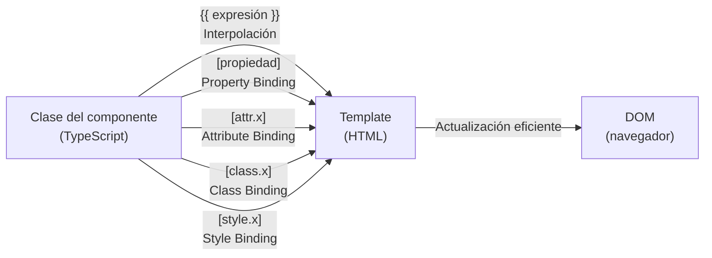

# Capítulo 5 - Parte 1: Interpolación `{{ }}` y Property Binding `[prop]`

> **Parte 1 de 4** · Capítulo 5 · PARTE III - Templates y Directivas

El template de un componente Angular no es HTML estático: es un lenguaje declarativo que conecta la clase TypeScript con el DOM de forma eficiente y reactiva. La interpolación y el property binding son los dos mecanismos más fundamentales de esa conexión. Entender bien la diferencia entre ambos -y saber cuándo usar cada uno- es la base sobre la que se construye todo lo demás en esta parte del libro.

## Interpolación: `{{ expresión }}`

La interpolación permite incrustar el resultado de una expresión TypeScript directamente en el texto del template. Angular evalúa la expresión, la convierte a cadena de texto y la inserta en el lugar indicado. El delimitador `{{ }}` convierte cualquier valor en texto mediante `toString()`.

```typescript
// producto.component.ts
import { Component } from '@angular/core';

@Component({
  selector: 'app-producto',
  standalone: true,
  template: `
    <h1>{{ nombreProducto }}</h1>
    <p>Precio: {{ precio | number:'1.2-2' }}</p>
    <p>Disponible: {{ stock > 0 ? 'Sí' : 'No' }}</p>
    <p>{{ obtenerDescripcion() }}</p>
  `
})
export class ProductoComponent {
  nombreProducto = 'Monitor 4K';
  precio = 1299.99;
  stock = 5;

  obtenerDescripcion(): string {
    return `${this.nombreProducto} - $${this.precio}`;
  }
}
```

Dentro de `{{ }}` se puede usar cualquier expresión TypeScript que produzca un valor: propiedades, métodos, operadores ternarios, encadenamiento opcional (`?.`), y pipes (el caracter `|` aplicado dentro de la interpolación). Lo que no se permite son sentencias: no se puede usar `=`, `new`, ni bloques de control como `if` o `for`. La razón es que las expresiones en templates deben ser puras -sin efectos secundarios- para que Angular pueda evaluarlas de forma segura durante la detección de cambios.

## Property Binding: `[propiedad]`

El property binding vincula una propiedad del elemento DOM (no el atributo HTML) a una expresión de la clase del componente. La sintaxis usa corchetes `[]` rodeando el nombre de la propiedad DOM:

```typescript
import { Component } from '@angular/core';

@Component({
  selector: 'app-formulario',
  standalone: true,
  template: `
    <input [value]="termino" [disabled]="bloqueado" [placeholder]="textoAyuda" />
    
    <button [type]="tipoBtnEnvio">Enviar</button>
  `
})
export class FormularioComponent {
  termino = 'Angular';
  bloqueado = false;
  textoAyuda = 'Busca un producto...';
  rutaImagen = '/assets/logo.png';
  descripcionImagen = 'Logo de la empresa';
  tipoBtnEnvio = 'submit';
}
```

El property binding es unidireccional: los datos fluyen desde la clase hacia el template. Cuando la propiedad de la clase cambia, Angular actualiza automáticamente el DOM. La dirección inversa -del DOM hacia la clase- requiere event binding, que cubrimos en la Parte 2.

## La diferencia crítica: atributo vs. propiedad en el DOM

Este es uno de los conceptos que más confusión genera, y comprender bien la diferencia evita horas de depuración. En el DOM existen dos cosas distintas:

- **Atributo HTML**: definido en el HTML inicial, existe en el elemento como cadena de texto y lo inspecciona el parser al cargar la página. Una vez que el DOM está construido, los atributos ya no cambian (son la "configuración inicial").
- **Propiedad DOM**: pertenece al objeto JavaScript del elemento, refleja el estado actual en tiempo de ejecución y puede cambiar dinámicamente.

El ejemplo más claro es `<input value="hola">`: el atributo `value` fija el valor inicial, pero la propiedad `value` del objeto `HTMLInputElement` es la que el usuario modifica al escribir. Si lees `inputEl.getAttribute('value')` siempre obtienes `'hola'`, pero `inputEl.value` refleja lo que el usuario escribió.

Angular usa property binding de forma predeterminada porque opera sobre el DOM en tiempo de ejecución, no sobre el HTML estático. Por eso `[value]="..."` es diferente a simplemente escribir `value="..."` en el template: el primero establece la propiedad DOM en cada ciclo de detección de cambios; el segundo solo define el atributo inicial.

## Attribute Binding: `[attr.nombre]`

Hay casos en los que realmente necesitas establecer un atributo HTML en lugar de una propiedad DOM. Esto ocurre principalmente con atributos de accesibilidad (ARIA) y atributos SVG que no tienen propiedad DOM correspondiente:

```typescript
import { Component } from '@angular/core';

@Component({
  selector: 'app-barra-progreso',
  standalone: true,
  template: `
    <div
      role="progressbar"
      [attr.aria-valuenow]="progreso"
      [attr.aria-valuemin]="0"
      [attr.aria-valuemax]="100"
      [attr.aria-label]="etiquetaProgreso"
    >
      {{ progreso }}%
    </div>
    <!-- En SVG, colspan no tiene propiedad DOM equivalente -->
    <table>
      <tr>
        <td [attr.colspan]="columnas">Celda fusionada</td>
      </tr>
    </table>
  `
})
export class BarraProgresoComponent {
  progreso = 65;
  etiquetaProgreso = 'Cargando archivo';
  columnas = 3;
}
```

La sintaxis `[attr.nombre]` establece el atributo del elemento (no la propiedad), y si el valor es `null`, Angular elimina el atributo del DOM por completo, lo que es el comportamiento correcto para atributos ARIA opcionales.

## Class Binding y Style Binding

Dos variantes especiales de property binding permiten manipular clases CSS y estilos en línea de forma ergonómica:

```typescript
import { Component } from '@angular/core';

@Component({
  selector: 'app-tarjeta',
  standalone: true,
  template: `
    <!-- [class.nombre] agrega/quita una clase según condición booleana -->
    <div
      [class.activo]="estaActivo"
      [class.destacado]="esPrincipal"
      [class.error]="tieneError"
    >
      Contenido de la tarjeta
    </div>

    <!-- [style.propiedad] y [style.propiedad.unidad] para estilos en línea -->
    <p
      [style.color]="colorTexto"
      [style.font-size.px]="tamanoFuente"
      [style.opacity]="estaActivo ? 1 : 0.4"
    >
      Texto con estilo dinámico
    </p>
  `,
  styles: [`
    .activo { border: 2px solid #4caf50; }
    .destacado { background: #fff3cd; }
    .error { border-color: #f44336; }
  `]
})
export class TarjetaComponent {
  estaActivo = true;
  esPrincipal = false;
  tieneError = false;
  colorTexto = '#333';
  tamanoFuente = 16;
}
```

La forma `[style.font-size.px]` es especialmente conveniente: le dice a Angular que el valor es un número en píxeles y genera `font-size: 16px` automáticamente. Puedes usar `.em`, `.rem`, `.%`, y cualquier otra unidad CSS.

## Diagrama: flujo de datos en los bindings de datos hacia la vista



Este flujo es siempre unidireccional en estos tipos de binding: desde la clase hacia el DOM. Angular compara el valor anterior con el nuevo durante la detección de cambios y solo actualiza el DOM si detecta una diferencia, lo que lo hace eficiente incluso con muchos bindings activos.

## Puntos clave

- `{{ expresión }}` convierte cualquier valor a texto y lo inserta en el DOM; admite expresiones pero no sentencias.
- `[propiedad]` vincula una propiedad del objeto DOM JavaScript, no el atributo HTML inicial.
- Los atributos HTML son la configuración estática; las propiedades DOM son el estado dinámico en tiempo de ejecución.
- Usa `[attr.nombre]` cuando necesites modificar un atributo real (ARIA, SVG, `colspan`).
- `[class.nombre]` y `[style.propiedad]` son atajos ergonómicos para manipulación de presentación.

## ¿Qué sigue?

En la Parte 2 completamos el circuito de datos con el event binding -que captura eventos del DOM- y el two-way binding con `[(ngModel)]`, que combina property binding y event binding en una sola sintaxis.
