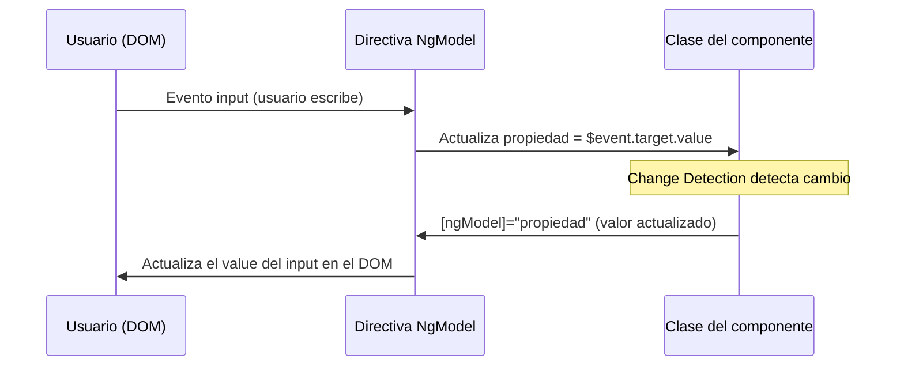

# Capítulo 5 - Parte 2: Event Binding `(event)` y Two-way Binding `[(ngModel)]`

> **Parte 2 de 4** · Capítulo 5 · PARTE III - Templates y Directivas

La Parte 1 estableció cómo los datos fluyen desde la clase hacia el template. Ahora cerramos el circuito: el event binding captura lo que ocurre en el DOM y lo comunica de vuelta a la clase. Cuando combinamos ambas direcciones en un solo mecanismo obtenemos el two-way binding, la base de los formularios simples en Angular.

## Event Binding: `(evento)`

La sintaxis de event binding usa paréntesis `()` rodeando el nombre del evento DOM que se quiere escuchar. Cuando el evento ocurre, Angular ejecuta la expresión del lado derecho:

```typescript
import { Component } from '@angular/core';

@Component({
  selector: 'app-contador',
  standalone: true,
  template: `
    <p>Contador: {{ cuenta }}</p>
    <button (click)="incrementar()">+1</button>
    <button (click)="resetear()">Resetear</button>
    <!-- La expresión puede ser directa, no solo una llamada a método -->
    <button (click)="cuenta = cuenta - 1">-1</button>
  `
})
export class ContadorComponent {
  cuenta = 0;

  incrementar(): void {
    this.cuenta++;
  }

  resetear(): void {
    this.cuenta = 0;
  }
}
```

Angular escucha cualquier evento DOM estándar: `click`, `dblclick`, `mouseover`, `mouseout`, `focus`, `blur`, `submit`, `keydown`, `keyup`, `scroll`, y todos los demás. También puede escuchar eventos personalizados emitidos por componentes hijos (→ Ver Capítulo 3, Parte 3).

## El objeto `$event`

Cuando Angular invoca el manejador del evento, pone a disposición el objeto del evento nativo de DOM bajo la variable especial `$event`. Podemos pasarlo al método o usar sus propiedades directamente en la expresión:

```typescript
import { Component } from '@angular/core';

@Component({
  selector: 'app-buscador',
  standalone: true,
  template: `
    <input
      type="text"
      (input)="alEscribir($event)"
      (focus)="enFoco = true"
      (blur)="enFoco = false"
    />
    <p *ngIf="enFoco">Campo activo - término: "{{ termino }}"</p>
  `
})
export class BuscadorComponent {
  termino = '';
  enFoco = false;

  // $event es de tipo Event; para acceder a value necesitamos castear
  alEscribir(evento: Event): void {
    const input = evento.target as HTMLInputElement;
    this.termino = input.value;
  }
}
```

El cast `as HTMLInputElement` es necesario porque TypeScript tipifica `evento.target` como `EventTarget | null`, que es la interfaz base. En la Parte 3 veremos cómo las template reference variables eliminan la necesidad de este cast.

## Filtros de tecla: `(keyup.enter)`, `(keydown.escape)`

Angular extiende la sintaxis de event binding con filtros de tecla que evitan escribir lógica de comparación de `event.key` dentro del manejador:

```typescript
import { Component } from '@angular/core';

@Component({
  selector: 'app-campo-busqueda',
  standalone: true,
  template: `
    <input
      type="text"
      [(ngModel)]="termino"
      (keyup.enter)="buscar()"
      (keydown.escape)="limpiar()"
      placeholder="Presiona Enter para buscar..."
    />
    <button (click)="buscar()">Buscar</button>
  `
})
export class CampoBusquedaComponent {
  termino = '';

  buscar(): void {
    console.log('Buscando:', this.termino);
  }

  limpiar(): void {
    this.termino = '';
  }
}
```

La sintaxis `(keyup.enter)` equivale a `(keyup)` con un manejador que comprueba `event.key === 'Enter'`. Angular soporta también `(keyup.shift.enter)`, `(keydown.control.z)` y combinaciones con modificadores.

## Two-way Binding: `[(ngModel)]` - la "banana in a box"

El nombre coloquial "banana in a box" describe visualmente la sintaxis `[()]`: los corchetes `[]` del property binding contienen los paréntesis `()` del event binding, como una banana dentro de una caja. Conceptualmente, `[(ngModel)]` es azúcar sintáctica que combina exactamente esas dos operaciones:

```
[(ngModel)]="propiedad"
  es equivalente a:
[ngModel]="propiedad" (input)="propiedad = $event"
```

Para usar `ngModel` hay que importar `FormsModule`:

```typescript
import { Component } from '@angular/core';
import { FormsModule } from '@angular/forms';

@Component({
  selector: 'app-perfil',
  standalone: true,
  imports: [FormsModule], // FormsModule provee la directiva NgModel
  template: `
    <label>Nombre:
      <input type="text" [(ngModel)]="nombre" />
    </label>
    <label>Edad:
      <input type="number" [(ngModel)]="edad" />
    </label>
    <p>Hola, {{ nombre }}. Tienes {{ edad }} años.</p>
  `
})
export class PerfilComponent {
  nombre = 'María';
  edad = 28;
}
```

Cada vez que el usuario escribe en el campo, `ngModel` captura el evento `input`, extrae el valor y lo asigna a la propiedad. Cada vez que la propiedad cambia en la clase, `ngModel` actualiza el campo del formulario. El resultado es sincronización bidireccional continua.

## La forma equivalente manual: `[value]` + `(input)`

Es importante entender que `[(ngModel)]` no hace nada mágico que no se pueda hacer manualmente. La forma explícita sirve para casos donde `FormsModule` no está disponible o se prefiere control total:

```typescript
import { Component } from '@angular/core';

@Component({
  selector: 'app-manual',
  standalone: true,
  template: `
    <input
      [value]="correo"
      (input)="correo = $any($event.target).value"
    />
    <p>Correo: {{ correo }}</p>
  `
})
export class ManualComponent {
  correo = '';
}
```

`$any()` es una función especial de los templates de Angular que suprime la verificación de tipos del compilador, equivalente a un cast a `any`. Se usa con moderación cuando el tipado estricto genera falsos positivos en situaciones como esta.

## Two-way Binding con Signal Inputs en Angular 17+

Con la llegada de los Signals, Angular introdujo `model()` como nueva forma de crear propiedades con two-way binding en componentes hijos. Esto reemplaza el patrón `@Input() valor` + `@Output() valorChange`:

```typescript
import { Component, model } from '@angular/core';

// Componente hijo con model signal
@Component({
  selector: 'app-calificacion',
  standalone: true,
  template: `
    @for (estrella of estrellas; track estrella) {
      <span
        [style.color]="estrella <= puntuacion() ? 'gold' : 'gray'"
        (click)="puntuacion.set(estrella)"
        style="cursor: pointer; font-size: 24px"
      >★</span>
    }
  `
})
export class CalificacionComponent {
  // model() crea un Signal que soporta [(modelo)] desde el padre
  puntuacion = model<number>(0);
  estrellas = [1, 2, 3, 4, 5];
}
```

```typescript
import { Component, signal } from '@angular/core';
import { CalificacionComponent } from './calificacion.component';

// Componente padre usando [(puntuacion)]
@Component({
  selector: 'app-resena',
  standalone: true,
  imports: [CalificacionComponent],
  template: `
    <app-calificacion [(puntuacion)]="miPuntuacion" />
    <p>Tu puntuación: {{ miPuntuacion() }}/5</p>
  `
})
export class ResenaComponent {
  miPuntuacion = signal(3);
}
```

El signal creado con `model()` funciona exactamente como `[(ngModel)]` pero en el nivel de comunicación entre componentes: cuando el componente hijo llama a `puntuacion.set(valor)`, el padre recibe la actualización automáticamente porque `[(puntuacion)]` es el azúcar sintáctica para `[puntuacion]="miPuntuacion" (puntuacionChange)="miPuntuacion.set($event)"`.

## Diagrama: cómo funciona internamente el two-way binding



## Puntos clave

- `(evento)` escucha eventos DOM; la expresión del lado derecho se ejecuta cuando el evento ocurre.
- `$event` contiene el objeto nativo del evento o el valor emitido por un `@Output()` de un componente hijo.
- `(keyup.enter)`, `(keydown.escape)` y similares filtran por tecla sin necesidad de lógica en el manejador.
- `[(ngModel)]` es azúcar sintáctica sobre `[value]` + `(input)`; requiere importar `FormsModule`.
- `model()` de Angular 17+ reemplaza el patrón `@Input` + `@Output` para two-way binding entre componentes.

## ¿Qué sigue?

En la Parte 3 estudiamos las template reference variables (`#ref`) y cómo `@ViewChild` permite acceder desde la clase TypeScript a elementos e instancias del template.
