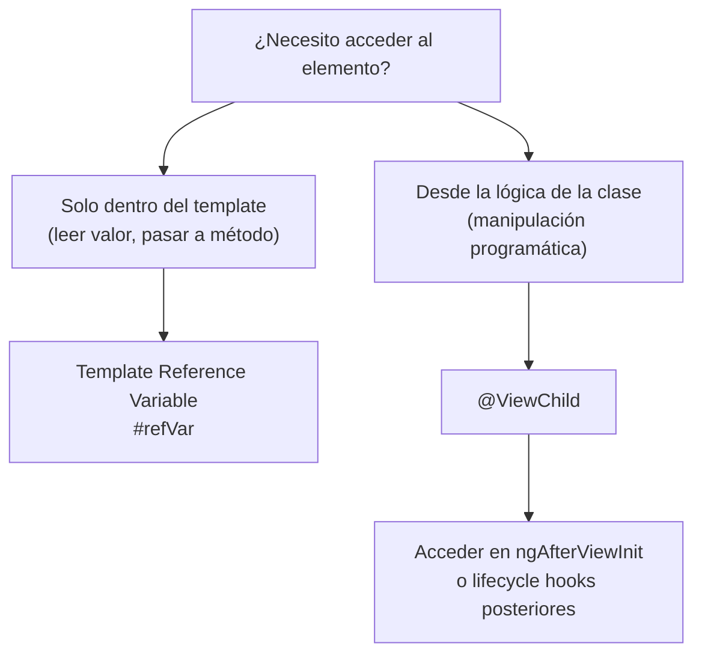

# Capítulo 5 - Parte 3: Template Reference Variables y @ViewChild

> **Parte 3 de 4** · Capítulo 5 · PARTE III - Templates y Directivas

Las template reference variables y `@ViewChild` resuelven un problema concreto: ¿cómo acceder a un elemento del DOM o a una instancia de un componente hijo desde el template o desde la clase TypeScript? Son dos mecanismos distintos para el mismo propósito, con alcances y casos de uso diferentes.

## Template Reference Variables: `#refVar`

Una template reference variable se declara colocando un identificador precedido por `#` en cualquier elemento del template. Angular crea una referencia al elemento DOM o a la directiva/componente que ese elemento represente:

```typescript
import { Component } from '@angular/core';
import { FormsModule } from '@angular/forms';

@Component({
  selector: 'app-busqueda-simple',
  standalone: true,
  imports: [FormsModule],
  template: `
    <!-- #campoBusqueda referencia el HTMLInputElement nativo -->
    <input #campoBusqueda type="text" placeholder="Busca un producto..." />

    <!-- Usamos la referencia directamente en el mismo template -->
    <button (click)="buscar(campoBusqueda.value)">Buscar</button>
    <button (click)="campoBusqueda.value = ''">Limpiar</button>

    <p>Longitud del texto: {{ campoBusqueda.value.length }}</p>
  `
})
export class BusquedaSimpleComponent {
  buscar(termino: string): void {
    console.log('Buscando:', termino);
  }
}
```

La referencia `campoBusqueda` apunta al `HTMLInputElement` nativo, lo que permite acceder a todas sus propiedades (`value`, `focus()`, `select()`, etc.) directamente en el template. Nótese que en el método `buscar()` pasamos `campoBusqueda.value` como argumento: el template extrae el valor y lo pasa a la clase, pero la clase no necesita mantener una propiedad reactiva para ello.

## ¿A qué apunta la referencia?

El valor que toma la referencia depende del tipo de elemento:

- En un elemento HTML nativo (`<input>`, `<div>`, etc.): apunta al objeto DOM nativo (`HTMLInputElement`, `HTMLDivElement`...).
- En un componente Angular: apunta a la **instancia de la clase** del componente. Esto permite llamar sus métodos públicos.
- En una directiva o con el valor explícito `#ref="nombreExportado"`: apunta a la instancia de la directiva.

```typescript
import { Component } from '@angular/core';

// Componente hijo con un método público
@Component({
  selector: 'app-panel-colapsable',
  standalone: true,
  template: `
    <div [hidden]="!abierto">
      <ng-content />
    </div>
  `
})
export class PanelColapsableComponent {
  abierto = true;

  // Método público accesible desde el template del padre
  alternar(): void {
    this.abierto = !this.abierto;
  }
}
```

```typescript
import { Component } from '@angular/core';
import { PanelColapsableComponent } from './panel-colapsable.component';

@Component({
  selector: 'app-pagina',
  standalone: true,
  imports: [PanelColapsableComponent],
  template: `
    <!-- #panel apunta a la instancia de PanelColapsableComponent -->
    <app-panel-colapsable #panel>
      <p>Contenido del panel</p>
    </app-panel-colapsable>

    <!-- Llamamos directamente al método del componente hijo -->
    <button (click)="panel.alternar()">Mostrar / Ocultar</button>
  `
})
export class PaginaComponent {}
```

Este patrón es poderoso para coordinación ligera entre padre e hijo sin necesidad de `@Input`/`@Output`, pero debe usarse con moderación: si la coordinación se vuelve compleja, un servicio compartido es mejor opción.

## Pasar referencias a métodos de la clase

Las referencias también pueden pasarse como argumentos a métodos, lo que permite que la clase opere sobre el elemento sin mantenerlo como propiedad:

```typescript
import { Component } from '@angular/core';

@Component({
  selector: 'app-campo-con-foco',
  standalone: true,
  template: `
    <input #campoNombre type="text" placeholder="Tu nombre" />
    <input #campoEmail type="email" placeholder="Tu correo" />

    <button (click)="enfocarSiguiente(campoNombre, campoEmail)">
      Siguiente campo
    </button>
    <button (click)="seleccionarTodo(campoNombre)">
      Seleccionar nombre
    </button>
  `
})
export class CampoConFocoComponent {
  enfocarSiguiente(actual: HTMLInputElement, siguiente: HTMLInputElement): void {
    if (actual.value.trim().length > 0) {
      siguiente.focus();
    }
  }

  seleccionarTodo(campo: HTMLInputElement): void {
    campo.select(); // Selecciona todo el texto del input
  }
}
```

## `@ViewChild`: acceso desde la clase TypeScript

Mientras las template reference variables funcionan dentro del template, `@ViewChild` permite que la clase TypeScript obtenga una referencia a un elemento, componente o directiva del template. Es el equivalente "del lado de la clase" de las referencias del template:

```typescript
import { Component, ViewChild, ElementRef, AfterViewInit } from '@angular/core';

@Component({
  selector: 'app-busqueda-avanzada',
  standalone: true,
  template: `
    <input #campoBusqueda type="text" placeholder="Busca..." />
    <ul>
      @for (resultado of resultados; track resultado.id) {
        <li>{{ resultado.nombre }}</li>
      }
    </ul>
  `
})
export class BusquedaAvanzadaComponent implements AfterViewInit {
  // ViewChild obtiene el ElementRef que envuelve el HTMLInputElement nativo
  @ViewChild('campoBusqueda') campoBusqueda!: ElementRef<HTMLInputElement>;

  resultados: Array<{ id: number; nombre: string }> = [];

  // El template solo está disponible a partir de AfterViewInit
  ngAfterViewInit(): void {
    // Dar foco automáticamente al campo al inicializar el componente
    this.campoBusqueda.nativeElement.focus();
  }

  buscar(termino: string): void {
    // Lógica de búsqueda - simplificada aquí
    this.resultados = [{ id: 1, nombre: `Resultado para "${termino}"` }];
  }
}
```

El decorador `@ViewChild` acepta como primer argumento un selector que puede ser:
- El nombre de una template reference variable como string: `@ViewChild('campoBusqueda')`.
- La clase de un componente o directiva: `@ViewChild(MiComponenteComponent)`.
- Un token de inyección de dependencias.

La propiedad decorada con `@ViewChild` no está disponible hasta que Angular termina de renderizar el template, por eso siempre se accede en `ngAfterViewInit()` o después. El `!` al final del tipo (`ElementRef<HTMLInputElement>!`) es el operador de aserción de TypeScript que indica que la propiedad estará definida aunque no lo esté en la declaración.

## Diferencias entre template reference y `@ViewChild`

La elección entre ambos mecanismos depende del alcance y la complejidad de lo que se necesita hacer:



Usa template references cuando la interacción es simple y ocurre en el template: pasar valores, llamar métodos directamente, mostrar propiedades en la vista. Usa `@ViewChild` cuando necesitas acceso desde lógica TypeScript: enfocar programáticamente al recibir un Observable, leer dimensiones del elemento, integrar con librerías de terceros que requieren el nodo DOM.

## Ejemplo completo: campo de búsqueda con ambas técnicas

Este ejemplo combina una template reference para el evento `keyup.enter` con `@ViewChild` para el foco automático al inicializar:

```typescript
import { Component, ViewChild, ElementRef, AfterViewInit } from '@angular/core';

interface Producto {
  id: number;
  nombre: string;
  precio: number;
}

@Component({
  selector: 'app-buscador-productos',
  standalone: true,
  template: `
    <div class="buscador">
      <input
        #inputBusqueda
        type="text"
        placeholder="Nombre del producto..."
        (keyup.enter)="ejecutarBusqueda(inputBusqueda.value)"
      />
      <button (click)="ejecutarBusqueda(inputBusqueda.value)">Buscar</button>
    </div>

    @if (resultados.length > 0) {
      <ul>
        @for (p of resultados; track p.id) {
          <li>{{ p.nombre }} - ${{ p.precio }}</li>
        }
      </ul>
    } @else {
      <p>Sin resultados</p>
    }
  `
})
export class BuscadorProductosComponent implements AfterViewInit {
  @ViewChild('inputBusqueda') inputBusqueda!: ElementRef<HTMLInputElement>;

  resultados: Producto[] = [];

  // Catálogo simulado
  private catalogo: Producto[] = [
    { id: 1, nombre: 'Monitor 4K', precio: 1299 },
    { id: 2, nombre: 'Teclado mecánico', precio: 149 },
    { id: 3, nombre: 'Mouse inalámbrico', precio: 59 },
  ];

  ngAfterViewInit(): void {
    // Foco automático al cargar - requiere @ViewChild
    this.inputBusqueda.nativeElement.focus();
  }

  ejecutarBusqueda(termino: string): void {
    const terminoLower = termino.toLowerCase();
    this.resultados = this.catalogo.filter(p =>
      p.nombre.toLowerCase().includes(terminoLower)
    );
  }
}
```

## Puntos clave

- `#refVar` en el template crea una referencia local al elemento DOM, componente o directiva; solo es accesible dentro del mismo template.
- En un elemento HTML nativo, la referencia apunta al objeto DOM; en un componente Angular, apunta a la instancia de la clase.
- Pasar referencias como argumentos a métodos evita mantener propiedades innecesarias en la clase.
- `@ViewChild('selector')` expone el elemento a la clase TypeScript, pero solo está disponible a partir de `ngAfterViewInit`.
- Prefiere template references para interacciones simples dentro del template; usa `@ViewChild` cuando la lógica TypeScript necesita operar sobre el elemento.

## ¿Qué sigue?

En la Parte 4 exploramos la nueva sintaxis de control de flujo de Angular 17+: `@if`, `@for` y `@switch`, que reemplazan a las directivas estructurales `*ngIf` y `*ngFor` con una sintaxis más clara y con importantes mejoras de rendimiento.
