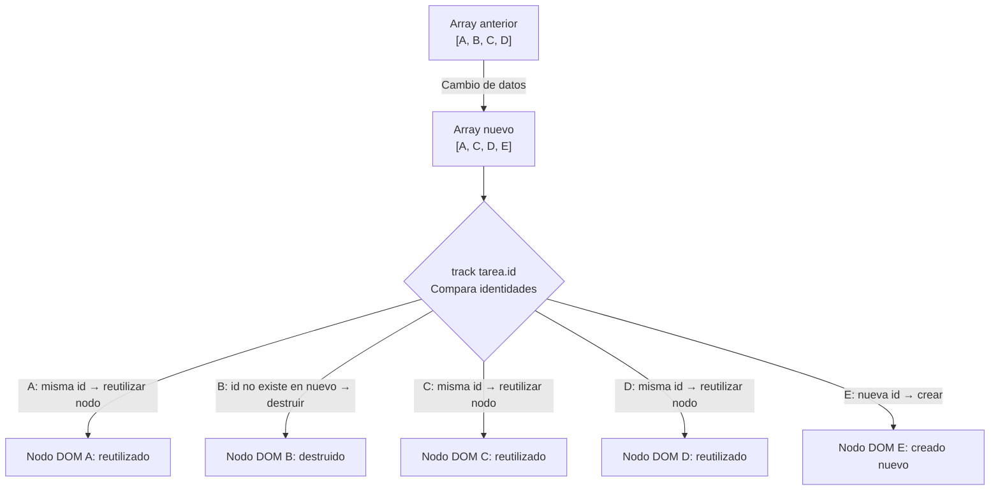

# Capítulo 5 - Parte 4: Nueva sintaxis de control de flujo: @if, @for, @switch

> **Parte 4 de 4** · Capítulo 5 · PARTE III - Templates y Directivas

Angular 17 introdujo una sintaxis de control de flujo nativa en los templates que reemplaza a las directivas estructurales `*ngIf`, `*ngFor` y `*ngSwitch`. La nueva sintaxis es más legible, elimina importaciones adicionales, habilita mejor análisis estático por parte del compilador y, en el caso de `@for`, ofrece una ganancia de rendimiento real gracias al `track` obligatorio.

## `@if`, `@else if` y `@else`

La directiva `*ngIf` siempre tuvo una limitación: el bloque `else` requería una template reference a un `<ng-template>` separado, lo cual resultaba verboso. La nueva sintaxis de `@if` integra los tres ramos directamente en el template:

```typescript
import { Component } from '@angular/core';

type EstadoPedido = 'pendiente' | 'enviado' | 'entregado' | 'cancelado';

@Component({
  selector: 'app-estado-pedido',
  standalone: true,
  template: `
    @if (estadoPedido === 'pendiente') {
      <p class="alerta-info">Tu pedido está siendo procesado.</p>
    } @else if (estadoPedido === 'enviado') {
      <p class="alerta-exito">¡Tu pedido está en camino!</p>
    } @else if (estadoPedido === 'entregado') {
      <p class="alerta-exito">Pedido entregado. ¡Disfrútalo!</p>
    } @else {
      <p class="alerta-error">Pedido cancelado. Contáctanos si tienes dudas.</p>
    }
  `
})
export class EstadoPedidoComponent {
  estadoPedido: EstadoPedido = 'enviado';
}
```

Además de la claridad visual, `@if` permite exportar el valor evaluado para usarlo dentro del bloque, lo que elimina la necesidad de llamar a un método dos veces o de guardar el resultado en una variable intermedia:

```typescript
import { Component } from '@angular/core';

interface Usuario {
  nombre: string;
  rol: 'admin' | 'editor' | 'lector';
}

@Component({
  selector: 'app-perfil-usuario',
  standalone: true,
  template: `
    <!-- @if con "as" exporta el resultado de la expresión -->
    @if (obtenerUsuarioActual(); as usuario) {
      <h2>Bienvenido, {{ usuario.nombre }}</h2>
      <p>Rol: {{ usuario.rol }}</p>
    } @else {
      <p>No has iniciado sesión.</p>
    }
  `
})
export class PerfilUsuarioComponent {
  obtenerUsuarioActual(): Usuario | null {
    return { nombre: 'Ana García', rol: 'admin' };
  }
}
```

La cláusula `; as usuario` después de la expresión captura el valor truthy en la variable `usuario`, disponible solo dentro del bloque `@if`. Esto es especialmente útil con Observables y Signals pasados a través de `async pipe`.

## `@for`, `track` obligatorio y `@empty`

El `@for` reemplaza a `*ngFor` con una diferencia fundamental: el `track` no es opcional sino obligatorio. Esta decisión de diseño fue deliberada porque `track` tiene un impacto directo y medible en el rendimiento.

```typescript
import { Component } from '@angular/core';

interface Tarea {
  id: number;
  titulo: string;
  completada: boolean;
}

@Component({
  selector: 'app-lista-tareas',
  standalone: true,
  template: `
    <h3>Tareas pendientes</h3>

    @for (tarea of tareas; track tarea.id) {
      <div class="tarea" [class.completada]="tarea.completada">
        <span>{{ tarea.titulo }}</span>
        <button (click)="completar(tarea.id)">✓</button>
      </div>
    } @empty {
      <!-- @empty se muestra cuando el array está vacío -->
      <p class="sin-tareas">No hay tareas pendientes. ¡Bien hecho!</p>
    }
  `
})
export class ListaTareasComponent {
  tareas: Tarea[] = [
    { id: 1, titulo: 'Leer documentación Angular', completada: false },
    { id: 2, titulo: 'Completar ejercicio de @for', completada: false },
  ];

  completar(id: number): void {
    const tarea = this.tareas.find(t => t.id === id);
    if (tarea) tarea.completada = true;
  }
}
```

El bloque `@empty` es una adición muy conveniente que antes requería combinar `*ngIf` con `*ngFor` y una variable auxiliar. Ahora vive como parte natural del bucle.

## Variables contextuales en `@for`

Al igual que `*ngFor`, el nuevo `@for` expone variables locales dentro del bucle. La diferencia es que deben declararse explícitamente con la cláusula `let`:

```typescript
import { Component } from '@angular/core';

@Component({
  selector: 'app-tabla-productos',
  standalone: true,
  template: `
    <table>
      <thead>
        <tr><th>#</th><th>Producto</th><th>Estado</th></tr>
      </thead>
      <tbody>
        @for (
          producto of productos;
          track producto.id;
          let i = $index,
          let primero = $first,
          let ultimo = $last,
          let par = $even
        ) {
          <tr [class.fila-par]="par" [class.primer-item]="primero">
            <td>{{ i + 1 }}</td>
            <td>{{ producto.nombre }}</td>
            <td>{{ ultimo ? '(último)' : '' }}</td>
          </tr>
        }
      </tbody>
    </table>
  `
})
export class TablaProductosComponent {
  productos = [
    { id: 1, nombre: 'Monitor 4K' },
    { id: 2, nombre: 'Teclado mecánico' },
    { id: 3, nombre: 'Mouse inalámbrico' },
  ];
}
```

Las variables disponibles son: `$index`, `$first`, `$last`, `$even`, `$odd` y `$count` (total de elementos). Se acceden con el prefijo `$` y se capturan con `let`.

## Por qué `track` es crítico para el rendimiento

Para comprender el papel de `track`, necesitamos entender brevemente cómo Angular reconcilia listas en el DOM. Cuando el array de datos cambia -porque se agrega, elimina o reordena un elemento- Angular necesita saber qué nodo DOM corresponde a qué elemento del array. Sin esta información, destruiría todos los nodos existentes y recrearía la lista desde cero, lo que es costoso y además destruye el estado de los elementos (posición del cursor en un input, animaciones en curso, etc.).

El `track` le da a Angular una función de identidad: una forma de asignar un identificador único a cada elemento de la lista. Con ese identificador, Angular puede hacer una comparación eficiente:



Sin `track`, Angular compara por posición en el array, lo que lleva a destruir y recrear nodos innecesariamente cuando el orden cambia. Con una lista de 1000 elementos, esta diferencia puede ser la que separa una experiencia fluida de una lenta.

Cuando los elementos no tienen un identificador único, se puede usar `$index` como fallback, aunque esto anula parte de la optimización en casos de reordenamiento:

```html
<!-- Aceptable para listas pequeñas y estáticas sin reordenamiento -->
@for (nombre of nombres; track $index) {
  <li>{{ nombre }}</li>
}
```

## `@switch`, `@case` y `@default`

La nueva sintaxis de switch es visualmente más clara que `*ngSwitch` y elimina la necesidad de `NgSwitch`, `NgSwitchCase` y `NgSwitchDefault` como tres directivas separadas:

```typescript
import { Component } from '@angular/core';

type Permiso = 'admin' | 'editor' | 'lector' | 'invitado';

@Component({
  selector: 'app-panel-permisos',
  standalone: true,
  template: `
    @switch (rolActual) {
      @case ('admin') {
        <div class="panel-admin">
          <h3>Panel de Administración</h3>
          <p>Acceso total al sistema.</p>
        </div>
      }
      @case ('editor') {
        <div class="panel-editor">
          <h3>Panel de Editor</h3>
          <p>Puedes crear y editar contenido.</p>
        </div>
      }
      @case ('lector') {
        <p>Solo tienes acceso de lectura.</p>
      }
      @default {
        <p>Acceso restringido. Por favor inicia sesión.</p>
      }
    }
  `
})
export class PanelPermisosComponent {
  rolActual: Permiso = 'editor';
}
```

A diferencia de JavaScript, el `@switch` de Angular no tiene "fall-through": cada `@case` es independiente y no requiere `break`. El `@default` es opcional pero recomendable.

## Diferencias con la sintaxis legacy `*ngIf` y `*ngFor`

Las directivas estructurales clásicas siguen funcionando en Angular 17+ pero se consideran legacy. La tabla siguiente resume las diferencias más relevantes:

| Aspecto | Legacy (`*ngIf`, `*ngFor`) | Nueva (`@if`, `@for`) |
|---|---|---|
| Importaciones necesarias | `CommonModule` o `NgIf`, `NgFor` | Ninguna (built-in del compilador) |
| Bloque else | `<ng-template #sino>` separado | `@else { }` inline |
| Lista vacía | Combinar `*ngIf` y `*ngFor` | `@empty { }` nativo |
| Track | Opcional en `trackBy` | Obligatorio en `track` |
| Variables contextuales | `let i = index; let p = $implicit` | `let i = $index` |
| Legibilidad de if/else if | Requiere múltiples ng-template | `@if @else if @else` directo |

## Puntos clave

- `@if / @else if / @else` reemplaza a `*ngIf` con mejor legibilidad y sin importaciones adicionales.
- La cláusula `; as variable` en `@if` captura el valor de la expresión para usarlo dentro del bloque.
- `@for` requiere `track` obligatorio; usar el identificador único del objeto, no `$index`, cuando sea posible.
- `@empty` dentro de `@for` maneja el caso de lista vacía de forma natural y sin directivas auxiliares.
- El algoritmo de reconciliación de `@for` usa `track` para reutilizar nodos DOM existentes en lugar de recrearlos.
- `@switch / @case / @default` no tiene fall-through y elimina las tres directivas `NgSwitch*` del legacy.

## ¿Qué sigue?

El Capítulo 6 profundiza en las directivas de Angular: primero las estructurales built-in que todavía se encuentran en proyectos existentes -`*ngIf`, `*ngFor`, `*ngSwitch`- y luego cómo crear nuestras propias directivas personalizadas.
