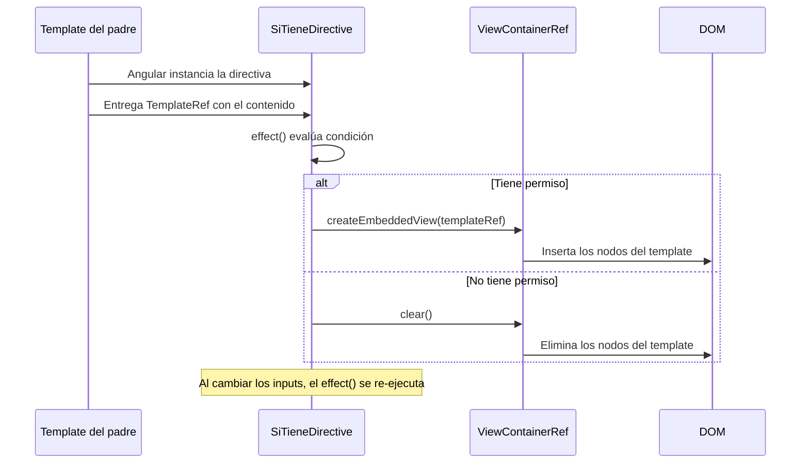

# Capítulo 6 - Parte 4: HostListener, HostBinding y directivas estructurales propias

> **Parte 4 de 4** · Capítulo 6 · PARTE III - Templates y Directivas

Hemos visto cómo las directivas de atributo modifican la apariencia de un elemento respondiendo a eventos (→ Ver Capítulo 6, Parte 3). Ahora damos el siguiente paso: explorar `@HostBinding` para enlazar propiedades y clases del elemento host directamente a propiedades de la directiva, y adentrarnos en el territorio más avanzado: las directivas estructurales personalizadas, que tienen el poder de añadir o eliminar elementos del DOM en función de cualquier lógica que necesitemos.

## @HostBinding: enlazar propiedades del elemento host

Mientras `@HostListener` escucha eventos, `@HostBinding` enlaza propiedades del elemento host a propiedades de la directiva. Cuando la propiedad de la directiva cambia, Angular actualiza automáticamente el elemento en el DOM. Es el mecanismo declarativo y reactivo para lo que en la Parte 3 hacíamos de forma imperativa con `Renderer2`.

```typescript
// directivas/boton-cargando.directive.ts
import {
  Directive, HostBinding, HostListener, input, signal
} from '@angular/core';

@Directive({
  selector: '[appBotonCargando]',
  standalone: true,
})
export class BotonCargandoDirective {
  tiempoEspera = input<number>(1500); // Milisegundos de bloqueo simulado

  // Enlaza el atributo disabled del elemento host
  @HostBinding('disabled')
  estaDeshabilitado = false;

  // Enlaza la clase CSS 'cargando' del elemento host
  @HostBinding('class.cargando')
  estaCargando = false;

  // Enlaza el atributo aria-busy para accesibilidad
  @HostBinding('attr.aria-busy')
  get ariaBusy(): string {
    return this.estaCargando ? 'true' : 'false';
  }

  @HostListener('click')
  alHacerClic(): void {
    this.estaCargando = true;
    this.estaDeshabilitado = true;

    // Después del tiempo de espera, restauramos el estado
    setTimeout(() => {
      this.estaCargando = false;
      this.estaDeshabilitado = false;
    }, this.tiempoEspera());
  }
}
```

El poder de `@HostBinding` está en la sincronización automática: no necesitamos llamar a `Renderer2` manualmente cada vez que cambia el estado. Angular detecta el cambio en `estaCargando` y actualiza la clase CSS del elemento host en el próximo ciclo de detección de cambios. Combinarlo con `attr.aria-` también garantiza accesibilidad sin esfuerzo adicional.

## @HostListener con modificadores y parámetros de evento

`@HostListener` acepta modificadores de evento como segundo argumento, y también puede recibir datos del evento usando la variable `$event`.

```typescript
// directivas/trampa-foco.directive.ts
import { Directive, HostListener, ElementRef, inject } from '@angular/core';

@Directive({
  selector: '[appTrampaFoco]',
  standalone: true,
})
export class TrampaFocoDirective {
  private elementoRef = inject(ElementRef);

  // Escucha keydown solo cuando la tecla es 'Tab'
  @HostListener('keydown.tab', ['$event'])
  alPressTab(evento: KeyboardEvent): void {
    const elementosFocusables = this.elementoRef.nativeElement
      .querySelectorAll<HTMLElement>(
        'button, [href], input, select, textarea, [tabindex]:not([tabindex="-1"])'
      );

    const primero = elementosFocusables[0];
    const ultimo = elementosFocusables[elementosFocusables.length - 1];

    // Si estamos en el último, volvemos al primero (trampa de foco para modales)
    if (document.activeElement === ultimo) {
      evento.preventDefault();
      primero.focus();
    }
  }

  // Escucha keydown.escape usando la notación de punto
  @HostListener('keydown.escape')
  alPressEscape(): void {
    this.elementoRef.nativeElement.dispatchEvent(
      new CustomEvent('cerrar-modal', { bubbles: true })
    );
  }
}
```

La sintaxis `'keydown.tab'` y `'keydown.escape'` es azúcar sintáctico de Angular que elimina la necesidad de comparar `event.key` manualmente. El array `['$event']` como segundo argumento de `@HostListener` le dice a Angular qué argumentos pasar al método.

## Directivas estructurales: la capa más poderosa

Las directivas estructurales modifican la estructura del DOM: añaden, eliminan o reordenan elementos. Las conocemos bien: `*ngIf`, `*ngFor`, `@if`, `@for`. Pero podemos crear las nuestras para encapsular lógica condicional o de repetición específica de nuestro dominio.

La clave está en dos clases del framework: `TemplateRef<unknown>` representa el contenido del template que queremos controlar, y `ViewContainerRef` es el contenedor donde podemos insertar o eliminar vistas creadas a partir de ese template.

```typescript
// directivas/si-tiene.directive.ts
import {
  Directive, TemplateRef, ViewContainerRef, inject, input, effect
} from '@angular/core';

// Tipo para los permisos de la aplicación
type Permiso = 'admin' | 'editor' | 'lector' | 'invitado';

@Directive({
  selector: '[appSiTiene]',
  standalone: true,
})
export class SiTieneDirective {
  // El permiso requerido para mostrar el contenido
  appSiTiene = input.required<Permiso>();

  // Los permisos que tiene el usuario actual (normalmente vendría de un servicio)
  appSiTienePermisos = input<Permiso[]>([]);

  private templateRef = inject(TemplateRef<unknown>);
  private viewContainer = inject(ViewContainerRef);

  constructor() {
    // effect() reacciona automáticamente cuando cambian los inputs
    effect(() => {
      const permisoRequerido = this.appSiTiene();
      const permisosUsuario = this.appSiTienePermisos();
      const tieneAcceso = permisosUsuario.includes(permisoRequerido);

      this.viewContainer.clear(); // Limpiamos antes de actualizar

      if (tieneAcceso) {
        // createEmbeddedView inserta el template en el DOM
        this.viewContainer.createEmbeddedView(this.templateRef);
      }
    });
  }
}
```

La línea `this.viewContainer.createEmbeddedView(this.templateRef)` es el corazón de cualquier directiva estructural: toma el template que Angular nos entregó y lo instancia en el DOM. `this.viewContainer.clear()` elimina todas las vistas creadas previamente. El uso de `effect()` garantiza que la directiva reacciona automáticamente cuando los signals de los inputs cambian.

## Uso de la directiva *appSiTiene en templates

La directiva estructural se usa con el prefijo `*` que Angular desazucara automáticamente, expandiendo `*appSiTiene="'admin'"` en su forma equivalente con `ng-template`.

```html
<!-- Uso básico con el prefijo asterisco -->
<div *appSiTiene="'admin'; permisos: permisosUsuario">
  <button class="btn-peligroso">Eliminar todos los registros</button>
</div>

<!-- Equivalente expandido (lo que Angular lee internamente) -->
<ng-template
  appSiTiene="'admin'"
  [appSiTienePermisos]="permisosUsuario"
>
  <div>
    <button class="btn-peligroso">Eliminar todos los registros</button>
  </div>
</ng-template>

<!-- Más usos en el template -->
<nav>
  <a *appSiTiene="'editor'; permisos: permisosUsuario" routerLink="/editar">
    Panel de edición
  </a>
  <a *appSiTiene="'lector'; permisos: permisosUsuario" routerLink="/reportes">
    Ver reportes
  </a>
</nav>
```

El micro-sintaxis `'admin'; permisos: permisosUsuario` que usamos con el prefijo `*` se traduce así: el valor después del selector es el input principal (`appSiTiene`), y `permisos:` es un alias para el input `appSiTienePermisos`. Para que este micro-sintaxis funcione, Angular espera que los inputs adicionales sigan la convención de nombrado `[selector][AliasEnMayúsculas]`.

## El ciclo de vida de una vista embebida

Comprender qué ocurre internamente con `ViewContainerRef` y `TemplateRef` nos ayuda a evitar fugas de memoria y comportamientos inesperados.



Cuando Angular destruye el componente padre, también destruye el `ViewContainerRef` y todas las vistas embebidas que contiene, liberando memoria automáticamente. No necesitamos manejar esto manualmente.

## Comparación: directiva estructural vs @if nativo

Con el nuevo flujo de control de Angular 17 (`@if`, `@for`, `@switch`), la mayoría de los casos simples ya no requieren directivas estructurales propias. La pregunta correcta es: ¿cuándo vale la pena crear una directiva estructural?

La respuesta es cuando la lógica de control es específica del dominio y se repetiría en múltiples templates. `*appSiTiene` encapsula la lógica de permisos y la hace reutilizable. Si tuviéramos que usar `@if (permisosUsuario.includes('admin'))` en cada template, repetiríamos lógica y dificultaríamos el mantenimiento. Una directiva estructural convierte esa lógica en una abstracción con nombre.

## Puntos clave

- `@HostBinding('propiedad')` enlaza propiedades, atributos y clases del elemento host a propiedades de la directiva de forma declarativa y reactiva
- `@HostListener('keydown.tab', ['$event'])` usa la notación de punto para filtrar teclas específicas sin comparar `event.key` manualmente
- Las directivas estructurales usan `TemplateRef` y `ViewContainerRef`: la primera representa el template, la segunda controla su inserción en el DOM
- `effect()` en directivas estructurales garantiza que la lógica de inserción/eliminación se re-ejecuta cuando cambian los signals
- La micro-sintaxis con `*` en el template se expande a `<ng-template>` con bindings explícitos internamente

## ¿Qué sigue?

En el Capítulo 7 entramos al mundo de los pipes: qué son, cómo funcionan los pipes puros e impuros, y cómo crear pipes personalizados para transformar datos en los templates de forma declarativa y eficiente.
