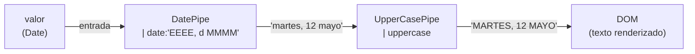

# Capítulo 7 - Parte 2: Parámetros de pipes y encadenamiento

> **Parte 2 de 4** · Capítulo 7 · PARTE IV - Pipes: Transformando Datos

Ya sabemos que los pipes transforman valores en el template. Lo que los hace verdaderamente expresivos es que aceptan parámetros para personalizar su comportamiento y que pueden componerse en cadena, de la misma forma en que encadenamos transformaciones en una tubería real. Comprender la sintaxis y el orden de evaluación evita errores sutiles que son difíciles de rastrear cuando los pipes interactúan entre sí.

## Sintaxis de parámetros: el operador dos puntos

Los parámetros se pasan al pipe inmediatamente después de su nombre, separados por dos puntos (`:`). El primer dos puntos separa el nombre del pipe de su primer parámetro; cada dos puntos adicional introduce el siguiente parámetro. No hay comas ni paréntesis, a diferencia de las llamadas a funciones de TypeScript.

```typescript
import { Component } from '@angular/core';
import { DatePipe, CurrencyPipe, DecimalPipe } from '@angular/common';

@Component({
  selector: 'app-parametros',
  standalone: true,
  imports: [DatePipe, CurrencyPipe, DecimalPipe],
  template: `
    <!--
      Sintaxis: valor | pipe:param1:param2:param3
      DatePipe acepta: formato, zona horaria, locale
    -->
    <p>{{ evento | date:'EEEE d MMMM':'UTC':'es' }}</p>

    <!--
      CurrencyPipe acepta: código divisa, visualización, formato dígitos, locale
    -->
    <p>{{ importe | currency:'EUR':'symbol':'1.2-2':'es' }}</p>

    <!--
      DecimalPipe acepta: formato de dígitos, locale
    -->
    <p>{{ distancia | number:'1.1-3':'es' }}</p>
  `
})
export class ParametrosComponent {
  evento = new Date('2026-05-12T18:00:00Z');
  importe = 4999.5;
  distancia = 12.34567;
}
```

Cada pipe documenta sus parámetros en un orden fijo. Saltarse un parámetro intermedio para llegar al siguiente no es posible directamente: si queremos pasar el tercer parámetro de `DatePipe` (locale) pero no queremos cambiar la zona horaria, debemos proporcionar la zona horaria de todas formas, aunque sea una cadena vacía (`''`) para que tome el valor por defecto.

## Parámetros dinámicos: binding desde la clase

Los parámetros no tienen que ser literales de cadena. Pueden ser expresiones de Angular que se resuelven en tiempo de ejecución, incluyendo propiedades del componente, llamadas a métodos o ternarios.

```typescript
import { Component, signal } from '@angular/core';
import { DatePipe, CurrencyPipe } from '@angular/common';

@Component({
  selector: 'app-params-dinamicos',
  standalone: true,
  imports: [DatePipe, CurrencyPipe],
  template: `
    <!-- El formato de fecha cambia según la preferencia del usuario -->
    <p>{{ ahora | date:formatoFecha }}</p>

    <!-- La divisa se determina en tiempo de ejecución -->
    <p>{{ precio | currency:divisaActiva() }}</p>

    <!-- Ternario como parámetro: cambia el símbolo según el contexto -->
    <p>{{ precio | currency:'USD':(mostrarCodigo ? 'code' : 'symbol') }}</p>
  `
})
export class ParamsDinamicosComponent {
  ahora = new Date();
  precio = 299.99;
  mostrarCodigo = false;

  // Signal que controla la divisa activa
  divisaActiva = signal<string>('EUR');

  // Propiedad que el usuario puede cambiar en tiempo de ejecución
  formatoFecha = 'dd/MM/yyyy HH:mm';
}
```

Cuando un parámetro es dinámico, Angular lo trata como cualquier otra expresión de binding. Si el parámetro cambia, el pipe se re-ejecuta con el nuevo valor. Esto es especialmente útil para aplicaciones con soporte de múltiples monedas o con preferencias de formato configurables por el usuario.

## Encadenamiento de pipes: composición en el template

El encadenamiento conecta la salida de un pipe como entrada del siguiente, de izquierda a derecha. La barra vertical (`|`) actúa como operador de composición.

```typescript
import { Component } from '@angular/core';
import { DatePipe, UpperCasePipe, CurrencyPipe, SlicePipe } from '@angular/common';

@Component({
  selector: 'app-cadena',
  standalone: true,
  imports: [DatePipe, UpperCasePipe, CurrencyPipe, SlicePipe],
  template: `
    <!--
      1. date formatea la fecha como 'EEEE, d MMMM y'
      2. uppercase convierte todo a mayúsculas
      Resultado: "MARTES, 12 MAYO 2026"
    -->
    <h2>{{ evento | date:'EEEE, d MMMM y' | uppercase }}</h2>

    <!--
      1. slice toma los primeros 3 elementos del array
      2. json serializa el resultado para depuración
    -->
    <pre>{{ listaIds | slice:0:3 | json }}</pre>

    <!--
      El mismo valor se puede mostrar con diferentes cadenas
      según el contexto, sin duplicar lógica en la clase
    -->
    <p>{{ descripcion | slice:0:100 | uppercase }}</p>
  `
})
export class CadenaComponent {
  evento = new Date('2026-05-12');
  listaIds = [1, 2, 3, 4, 5, 6, 7, 8];
  descripcion = 'Esta es una descripción larga que será truncada y convertida.';
}
```

La evaluación siempre es de izquierda a derecha y cada pipe recibe exactamente el valor que salió del pipe anterior. No hay ambigüedad en el orden de operaciones porque la tubería es lineal, sin ramificaciones.

## El flujo de evaluación paso a paso

Para entender qué ocurre exactamente cuando Angular procesa `{{ valor | dateFormat | uppercase }}`, conviene visualizar el flujo:



Angular evalúa la expresión completa durante el ciclo de change detection. Si el pipe es puro (el caso de todos los built-in excepto `json` y `async`), Angular memoiza[^1] el resultado: si `valor` no ha cambiado desde la última verificación, reutiliza el resultado anterior sin invocar la función `transform()` de nuevo.

[^1]: **Memoizar**: guardar en caché el resultado de una función para un conjunto de parámetros dados y reutilizarlo si los parámetros no han cambiado.

## Qué pasa cuando un pipe devuelve null

Cuando la entrada de un pipe es `null` o `undefined`, la mayoría de los pipes built-in de Angular devuelven `null` en lugar de lanzar un error. Angular renderiza `null` como una cadena vacía en el template, lo que significa que el elemento existe pero no muestra texto. En una cadena de pipes, si el primer pipe devuelve `null`, todos los pipes siguientes reciben `null` y también devuelven `null`.

```typescript
import { Component } from '@angular/core';
import { DatePipe, UpperCasePipe } from '@angular/common';

@Component({
  selector: 'app-null-pipe',
  standalone: true,
  imports: [DatePipe, UpperCasePipe],
  template: `
    <!--
      Si fechaOpcional es null:
      - DatePipe devuelve null
      - UpperCasePipe recibe null y devuelve null
      - El template muestra una cadena vacía, sin error
    -->
    <p>Última actividad: {{ fechaOpcional | date:'shortDate' | uppercase }}</p>

    <!--
      Mejor práctica: usar @if para manejar el null explícitamente
      y mostrar un mensaje significativo al usuario
    -->
    @if (fechaOpcional) {
      <p>Última actividad: {{ fechaOpcional | date:'shortDate' | uppercase }}</p>
    } @else {
      <p>Sin actividad registrada</p>
    }
  `
})
export class NullPipeComponent {
  fechaOpcional: Date | null = null;
}
```

La propagación silenciosa de `null` es conveniente porque evita errores de runtime, pero puede ocultar problemas en los datos. La buena práctica es hacer explícito el manejo del `null` con `@if` cuando la ausencia de un valor tiene significado semántico para el usuario -como en este caso, donde "sin fecha" y "fecha vacía" son mensajes diferentes.

## Encadenamiento con AsyncPipe: el patrón más frecuente

El encadenamiento donde `async` es el primer pipe es el patrón más común en aplicaciones reales. `AsyncPipe` resuelve el Observable y entrega el valor; los pipes siguientes formatean ese valor.

```typescript
import { Component, inject } from '@angular/core';
import { AsyncPipe, DatePipe, UpperCasePipe, CurrencyPipe } from '@angular/common';
import { Observable } from 'rxjs';
import { PedidosService } from '../services/pedidos.service';

interface Pedido {
  id: number;
  fechaCreacion: Date;
  total: number;
  estado: string;
}

@Component({
  selector: 'app-pedidos',
  standalone: true,
  imports: [AsyncPipe, DatePipe, UpperCasePipe, CurrencyPipe],
  template: `
    @if (pedidos$ | async; as pedidos) {
      @for (pedido of pedidos; track pedido.id) {
        <div class="pedido">
          <!--
            async entrega la lista; @for itera;
            luego los pipes formatean cada campo individualmente
          -->
          <span>{{ pedido.fechaCreacion | date:'dd/MM/yyyy' }}</span>
          <span>{{ pedido.total | currency:'EUR' }}</span>
          <span>{{ pedido.estado | uppercase }}</span>
        </div>
      }
    }
  `
})
export class PedidosComponent {
  private pedidosService = inject(PedidosService);
  pedidos$: Observable<Pedido[]> = this.pedidosService.listar();
}
```

Nótese que en este patrón `async` no encadena su salida directamente a otros pipes: el `@for` itera sobre la lista que `async` entregó, y dentro del loop cada campo se formatea con su propio pipe. Esto es lo correcto porque `async` devuelve el array completo y no tiene sentido pasarlo por `date` o `currency`; son los campos individuales de cada objeto los que se formatean.

## Casos donde el encadenamiento requiere precaución

Hay situaciones donde el orden importa de maneras no inmediatamente obvias. Considera `| number | json`: `DecimalPipe` devuelve una cadena formateada, y `JsonPipe` serializa esa cadena rodeándola de comillas. El resultado es `"1.234,56"` -una cadena JSON, no el número que probablemente querías mostrar. Para combinar pipes, conviene verificar qué tipo devuelve cada uno antes de pasarlo al siguiente.

Otro caso frecuente es `| slice | async`. `SlicePipe` espera un array como entrada, pero `async` aún no ha emitido cuando el componente inicializa. La forma correcta es `| async | slice`: primero resolvemos el Observable, luego cortamos el array resultante.

## Puntos clave

- Los parámetros de un pipe se pasan con la sintaxis `| pipe:param1:param2`; no hay comas ni paréntesis.
- Los parámetros pueden ser literales, propiedades del componente, Signals o cualquier expresión válida de Angular.
- El encadenamiento evalúa de izquierda a derecha: la salida de cada pipe es la entrada del siguiente.
- Cuando la entrada es `null`, los pipes built-in devuelven `null` sin lanzar errores; el template muestra cadena vacía.
- El orden importa: `| async | slice` y `| slice | async` no son equivalentes.

## ¿Qué sigue?

En la Parte 3 creamos nuestros propios pipes implementando la interfaz `PipeTransform`, con ejemplos reales de filtrado y truncado de texto.
