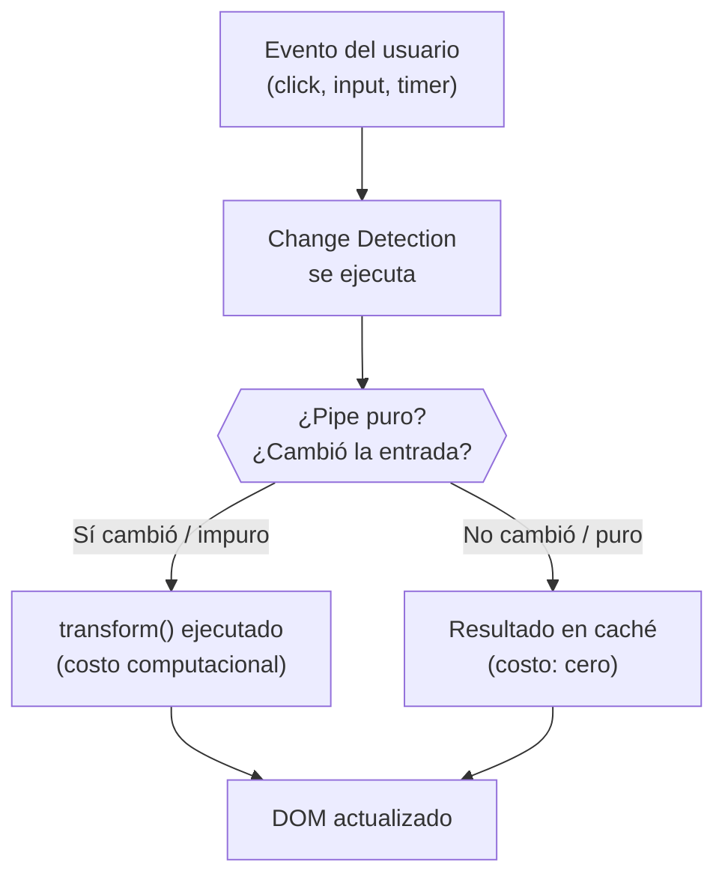

# Capítulo 7 - Parte 4: Pipes puros vs impuros: impacto en rendimiento

> **Parte 4 de 4** · Capítulo 7 · PARTE IV - Pipes: Transformando Datos

Hasta ahora hemos trabajado con pipes puros, que son el tipo por defecto. La distinción entre puro e impuro determina con qué frecuencia Angular decide ejecutar el método `transform()` de un pipe, y esa frecuencia tiene un impacto directo en el rendimiento de la aplicación. Entender este mecanismo es lo que separa a un desarrollador que "usa pipes" de uno que los usa correctamente.

## Qué es un pipe puro

Un pipe puro hace una promesa implícita al framework: dada la misma entrada y los mismos parámetros, siempre devolverá la misma salida. Matemáticamente es una función pura: sin efectos secundarios, sin estado interno que cambie entre invocaciones, sin dependencia de contexto externo.

Angular explota esta promesa para optimizar el rendimiento. En lugar de invocar `transform()` en cada ciclo de change detection, solo lo hace cuando detecta que el valor de entrada o alguno de los parámetros ha cambiado. La comparación es por referencia para objetos y arrays, y por valor para primitivos (strings, numbers, booleans).

```typescript
import { Pipe, PipeTransform } from '@angular/core';

// pure: true es el valor por defecto; se puede omitir
@Pipe({ name: 'calcularDescuento', standalone: true, pure: true })
export class CalcularDescuentoPipe implements PipeTransform {

  transform(precio: number, porcentaje: number): number {
    // Misma entrada → mismo resultado, siempre.
    // Angular puede memoizar este resultado con confianza.
    return precio * (1 - porcentaje / 100);
  }
}
```

Mientras `precio` y `porcentaje` sean los mismos números, Angular reutiliza el último resultado sin llamar a `transform()`. En una lista de 500 productos con un pipe de descuento, esto significa que en el segundo ciclo de change detection -si los datos no han cambiado- no se realiza ningún cálculo.

## Por qué la comparación por referencia importa

El corolario directo del comportamiento de los pipes puros es que mutar un objeto o array en lugar de reemplazarlo hace que el pipe no se actualice, aunque los datos internos hayan cambiado. Angular compara referencias, no contenido.

```typescript
import { Component } from '@angular/core';
import { FiltrarPorPipe } from '../pipes/filtrar-por.pipe';

@Component({
  selector: 'app-lista-mutable',
  standalone: true,
  imports: [FiltrarPorPipe],
  template: `
    @for (
      item of items | filtrarPor:'activo':true;
      track item.id
    ) {
      <p>{{ item.nombre }}</p>
    }
    <button (click)="agregarMutando()">Agregar (INCORRECTO)</button>
    <button (click)="agregarInmutablemente()">Agregar (CORRECTO)</button>
  `
})
export class ListaMutableComponent {
  items = [
    { id: 1, nombre: 'Elemento A', activo: true },
    { id: 2, nombre: 'Elemento B', activo: false },
  ];

  agregarMutando(): void {
    // INCORRECTO: push muta el mismo array; la referencia no cambia.
    // El pipe puro no detecta el cambio y no se re-ejecuta.
    this.items.push({ id: 3, nombre: 'Elemento C', activo: true });
  }

  agregarInmutablemente(): void {
    // CORRECTO: el operador spread crea un nuevo array con nueva referencia.
    // El pipe puro detecta la nueva referencia y se re-ejecuta.
    this.items = [...this.items, { id: 3, nombre: 'Elemento C', activo: true }];
  }
}
```

Este es el error más común al trabajar con pipes puros. La solución no es hacer el pipe impuro -eso solo parchea el síntoma- sino adoptar patrones inmutables para actualizar colecciones: spread operator, `Array.map()`, `Array.filter()`, o librerías de estado inmutable.

## Qué es un pipe impuro y cuándo Angular lo ejecuta

Un pipe impuro tiene `pure: false` en su decorador. La consecuencia es directa: Angular invoca `transform()` en cada ciclo de change detection, independientemente de si el valor de entrada ha cambiado. No hay memoización, no hay comparación de referencias. El pipe se ejecuta siempre.

```typescript
import { Pipe, PipeTransform } from '@angular/core';

@Pipe({
  name: 'filtrarActivos',
  standalone: true,
  pure: false  // Angular ejecutará transform() en cada ciclo de CD
})
export class FiltrarActivosPipe implements PipeTransform {

  transform<T extends { activo: boolean }>(items: T[]): T[] {
    // Este código se ejecutará decenas de veces por segundo
    // si hay interacciones de usuario frecuentes
    return items.filter(item => item.activo);
  }
}
```

El único escenario legítimo donde `pure: false` se justifica es cuando el resultado del pipe depende de algo externo al valor de entrada y los parámetros: el tiempo actual, el estado de un servicio global, o -como hace `AsyncPipe` internamente- una suscripción a un Observable. Los pipes built-in `async` y `json` son impuros por esta razón.

## El costo real de un pipe impuro

Para hacer tangible el impacto, consideremos una aplicación con una lista de 200 productos y un pipe impuro de filtrado. Angular ejecuta change detection en respuesta a cualquier evento: un click, un hover, la resolución de un timer, un mensaje WebSocket. En una aplicación activa, eso puede significar decenas de ciclos por segundo.



Con un pipe impuro de filtrado sobre 200 elementos, cada evento de usuario desencadena un `Array.filter()` sobre 200 items. Si el usuario está escribiendo en un campo de búsqueda -generando eventos `input` a 10 por segundo- eso son 2000 iteraciones por segundo solo para ese pipe. Si hay más pipes impuros en el mismo template, el costo se multiplica.

## Las alternativas correctas al pipe impuro

La mejor solución en la mayoría de los casos es mover la lógica de transformación a la clase del componente, donde tenemos control total sobre cuándo se ejecuta.

**Alternativa 1: transformar en el componente con una propiedad derivada**

```typescript
import { Component } from '@angular/core';

interface Empleado {
  id: number;
  nombre: string;
  departamento: string;
  activo: boolean;
}

@Component({
  selector: 'app-empleados',
  standalone: true,
  template: `
    <!-- empleadosActivos ya está filtrado; no hay pipe impuro -->
    @for (emp of empleadosActivos; track emp.id) {
      <p>{{ emp.nombre }}</p>
    }
  `
})
export class EmpleadosComponent {
  private _empleados: Empleado[] = [];

  // La propiedad derivada se actualiza solo cuando asignamos nuevos empleados
  empleadosActivos: Empleado[] = [];

  set empleados(lista: Empleado[]) {
    this._empleados = lista;
    // El filtrado ocurre una sola vez, al actualizar los datos
    this.empleadosActivos = lista.filter(e => e.activo);
  }

  get empleados(): Empleado[] {
    return this._empleados;
  }
}
```

**Alternativa 2: usar `computed()` de Signals para derivaciones reactivas**

Esta es la forma más elegante y moderna en Angular 17+. `computed()` recalcula automáticamente cuando sus dependencias cambian, y Angular garantiza que solo se recalcula cuando es necesario.

```typescript
import { Component, signal, computed } from '@angular/core';

interface Empleado {
  id: number;
  nombre: string;
  departamento: string;
  activo: boolean;
}

@Component({
  selector: 'app-empleados-signals',
  standalone: true,
  template: `
    <input
      type="text"
      [value]="terminoBusqueda()"
      (input)="terminoBusqueda.set($any($event.target).value)"
      placeholder="Filtrar por nombre..."
    />

    <!--
      empleadosFiltrados() es un computed(): se recalcula solo cuando
      empleados() o terminoBusqueda() cambian. Cero ejecuciones innecesarias.
    -->
    @for (emp of empleadosFiltrados(); track emp.id) {
      <p>{{ emp.nombre }} - {{ emp.departamento }}</p>
    }
  `
})
export class EmpleadosSignalsComponent {
  empleados = signal<Empleado[]>([
    { id: 1, nombre: 'Ana García',   departamento: 'Ingeniería', activo: true },
    { id: 2, nombre: 'Luis Pérez',   departamento: 'Diseño',     activo: true },
    { id: 3, nombre: 'Marta Ruiz',   departamento: 'Ingeniería', activo: false },
  ]);

  terminoBusqueda = signal('');

  // computed() reemplaza al pipe impuro con precisión quirúrgica
  empleadosFiltrados = computed(() => {
    const termino = this.terminoBusqueda().toLowerCase();
    return this.empleados().filter(e =>
      e.activo && e.nombre.toLowerCase().includes(termino)
    );
  });
}
```

`computed()` es superiora al pipe impuro en todos los aspectos: se ejecuta exactamente cuando sus dependencias cambian (no en cada ciclo de CD), el valor calculado está disponible como Signal y puede ser leído desde cualquier parte del componente o de un template, y su rendimiento es predecible.

**Alternativa 3: AsyncPipe con Observable filtrado en el servicio**

Para datos que llegan del servidor o de un estado global, la mejor práctica es filtrar en el servicio o en la cadena de operadores RxJS, no en el template.

```typescript
import { Component, inject } from '@angular/core';
import { AsyncPipe } from '@angular/common';
import { Observable, combineLatest } from 'rxjs';
import { map } from 'rxjs/operators';
import { EmpleadosService } from '../services/empleados.service';

@Component({
  selector: 'app-empleados-rx',
  standalone: true,
  imports: [AsyncPipe],
  template: `
    @if (empleadosActivos$ | async; as lista) {
      @for (emp of lista; track emp.id) {
        <p>{{ emp.nombre }}</p>
      }
    }
  `
})
export class EmpleadosRxComponent {
  private service = inject(EmpleadosService);

  // El filtrado ocurre en el Observable, no en el template
  empleadosActivos$: Observable<{ id: number; nombre: string }[]> =
    this.service.empleados$.pipe(
      map(lista => lista.filter(e => e.activo))
    );
}
```

Este patrón delega la transformación a RxJS, que está optimizado para ello, y usa `AsyncPipe` para la suscripción. El template no contiene ninguna lógica de filtrado.

## Benchmarks conceptuales: puro vs impuro vs computed

La siguiente tabla resume el comportamiento de cada estrategia en términos de cuándo se ejecuta la lógica de filtrado:

| Estrategia | ¿Cuándo se ejecuta? | Costo relativo |
|---|---|---|
| Pipe impuro (`pure: false`) | En cada ciclo de change detection | Alto y constante |
| Pipe puro (`pure: true`) | Solo cuando cambia la referencia del array | Bajo, con la precaución de usar inmutabilidad |
| Propiedad derivada en el componente | Solo cuando el setter asigna nuevos datos | Mínimo |
| `computed()` de Signals | Solo cuando cambia una Signal dependiente | Mínimo y predecible |
| Operador RxJS `map` | Solo cuando el Observable emite un nuevo valor | Mínimo |

La elección entre ellas no es dogmática: en una aplicación pequeña con datos que raramente cambian, un pipe impuro simple puede no ser un problema práctico. Pero en listas grandes, componentes con alta frecuencia de actualización o aplicaciones con estrategia `OnPush`, la diferencia es medible y puede degradar la experiencia del usuario de forma visible.

## Cuándo sí tiene sentido un pipe impuro

Hay escenarios legítimos donde `pure: false` es la decisión correcta:

- **Pipes que dependen del tiempo**: un pipe que formatea "hace 5 minutos" necesita re-ejecutarse periódicamente aunque el valor de entrada no haya cambiado.
- **Pipes que acceden a estado global que no se puede pasar como parámetro**: si el estado es difícil de exponer como parámetro y cambia frecuentemente, un pipe impuro puede ser pragmático.
- **`AsyncPipe` y `JsonPipe`**: son impuros por diseño y con una razón bien fundada; no son el tipo de pipe impuro que debemos evitar.

En todos estos casos, la solución más moderna en Angular 17+ es reemplazar el pipe impuro por un `computed()` Signal o por un Observable bien estructurado. Los Signals son reactivos de forma precisa: saben exactamente qué valores observan y se actualizan únicamente cuando esos valores cambian, sin el costo de re-ejecutarse en cada ciclo de change detection.

## Puntos clave

- Un pipe puro solo ejecuta `transform()` cuando la referencia del valor de entrada o sus parámetros cambian; es el tipo por defecto y el preferido.
- Un pipe impuro (`pure: false`) se ejecuta en cada ciclo de change detection, lo que puede degradar el rendimiento de forma significativa en listas grandes.
- Mutar arrays u objetos en lugar de reemplazarlos hace que los pipes puros no detecten el cambio; usar patrones inmutables es la solución correcta.
- La alternativa moderna y recomendada al pipe impuro de filtrado es `computed()` de Signals, que se recalcula solo cuando sus dependencias cambian.
- `AsyncPipe` y `JsonPipe` son impuros de forma justificada; son la excepción, no el modelo a seguir para pipes personalizados.

## ¿Qué sigue?

El Capítulo 8 abre la PARTE V del libro con los servicios de Angular: qué son, cómo se crean y por qué son la pieza central de la arquitectura de cualquier aplicación Angular escalable.
