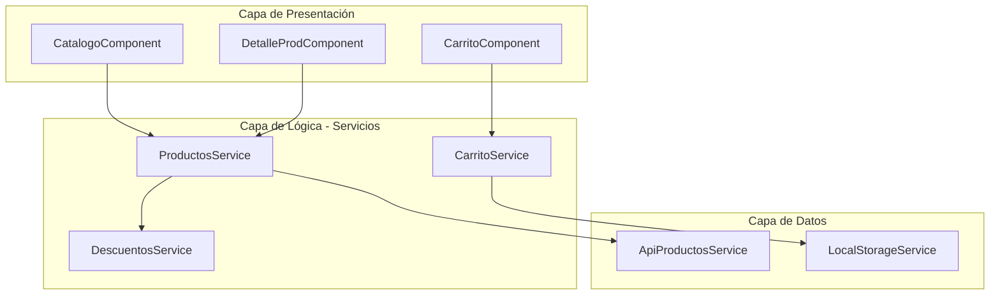

# Capítulo 8 - Parte 1: ¿Qué es un servicio? Responsabilidad única y separación de capas

> **Parte 1 de 4** · Capítulo 8 · PARTE V - Servicios e Inyección de Dependencias

Cuando una aplicación Angular crece más allá de los primeros componentes, emerge un problema silencioso: la lógica empieza a acumularse dentro de los componentes. Un componente que muestra un listado de productos termina también llamando a la API, transformando los datos, calculando totales y guardando el estado del carrito. El componente deja de ser una unidad de presentación y se convierte en un monolito que hace todo. Esta acumulación tiene nombre: violación del principio de responsabilidad única.

Los servicios existen para resolver exactamente ese problema. Un servicio en Angular es una clase de TypeScript cuyo propósito es encapsular lógica que no pertenece a la capa de presentación: acceso a datos, cálculos compartidos, reglas de negocio, comunicación entre partes no relacionadas de la aplicación. Al mover esa lógica fuera del componente, el componente recupera su responsabilidad real: coordinar la vista y reaccionar a las interacciones del usuario.

## El principio de responsabilidad única aplicado a Angular

El principio de responsabilidad única (SRP, de sus siglas en inglés) establece que una clase debe tener una sola razón para cambiar. Un componente debería cambiar solo cuando cambia la forma en que se presenta la información al usuario. Si también cambia cuando cambia la URL de la API, o cuando el algoritmo de cálculo de descuentos se modifica, entonces ese componente tiene demasiadas responsabilidades.

La separación correcta en Angular se organiza en tres capas bien definidas. La capa de presentación la ocupan los componentes: reciben datos, los muestran y emiten eventos. La capa de lógica la ocupan los servicios: centralizan reglas de negocio y coordinan operaciones. La capa de datos también puede estar en servicios especializados (a veces llamados repositorios o gateways) que abstraen cómo se obtienen y persisten los datos, sin importar si vienen de una API REST, de `localStorage` o de una base de datos en memoria. Esta separación no es dogma: es pragmatismo que hace el código más testeable y más fácil de mantener.

## El componente que hace demasiado

Veamos un componente que viola el principio de responsabilidad única. Todo lo que está mal en él es intencional: es el punto de partida que los servicios van a resolver.

```typescript
import { Component, OnInit } from '@angular/core';
import { HttpClient } from '@angular/common/http';
import { CurrencyPipe, NgFor, NgIf } from '@angular/common';

interface Producto {
  id: number;
  nombre: string;
  precio: number;
  stock: number;
}

@Component({
  selector: 'app-catalogo',
  standalone: true,
  imports: [CurrencyPipe, NgFor, NgIf],
  template: `
    <div *ngIf="cargando">Cargando...</div>
    <ul *ngIf="!cargando">
      <li *ngFor="let p of productosConDescuento">
        {{ p.nombre }} - {{ p.precioFinal | currency:'USD' }}
      </li>
    </ul>
  `
})
export class CatalogoComponent implements OnInit {
  cargando = true;
  // Mezcla de estado de UI, lógica de negocio y acceso a datos - todo junto
  productosConDescuento: Array<Producto & { precioFinal: number }> = [];

  constructor(private http: HttpClient) {}

  ngOnInit(): void {
    // Llamada HTTP directamente en el componente
    this.http.get<Producto[]>('https://api.ejemplo.com/productos').subscribe(productos => {
      // Lógica de negocio (descuento) mezclada con la carga
      this.productosConDescuento = productos
        .filter(p => p.stock > 0)
        .map(p => ({ ...p, precioFinal: p.precio * 0.9 })); // 10 % de descuento
      this.cargando = false;
    });
  }
}
```

Este componente tiene tres razones para cambiar: si la URL de la API cambia, si la lógica de descuento cambia, y si el diseño de la lista cambia. Ninguna de esas razones es la misma, lo que hace que el componente sea frágil y difícil de probar de forma aislada.

## El componente que delega correctamente

El mismo componente, refactorizado para delegar la lógica a un servicio, quedaría así:

```typescript
import { Component, OnInit, inject } from '@angular/core';
import { CurrencyPipe } from '@angular/common';
import { ProductosService } from '../core/services/productos.service';

interface ProductoConPrecio {
  nombre: string;
  precioFinal: number;
}

@Component({
  selector: 'app-catalogo',
  standalone: true,
  imports: [CurrencyPipe],
  template: `
    @if (cargando) {
      <div>Cargando...</div>
    } @else {
      <ul>
        @for (producto of productos; track producto.nombre) {
          <li>{{ producto.nombre }} - {{ producto.precioFinal | currency:'USD' }}</li>
        }
      </ul>
    }
  `
})
export class CatalogoComponent implements OnInit {
  // El componente solo sabe mostrar datos y gestionar estado de UI
  private productosService = inject(ProductosService);
  cargando = true;
  productos: ProductoConPrecio[] = [];

  ngOnInit(): void {
    this.productosService.obtenerProductosConDescuento().subscribe(lista => {
      this.productos = lista;
      this.cargando = false;
    });
  }
}
```

Ahora el componente tiene una sola razón para cambiar: si cambia cómo se presenta la información. La lógica de la API y el cálculo del descuento viven en `ProductosService`, que tiene su propia razón para cambiar independiente del componente.

## Arquitectura en capas de una aplicación Angular

El siguiente diagrama muestra cómo se relacionan las tres capas en una aplicación Angular típica. Las flechas indican la dirección de la dependencia: la capa de presentación depende de la de lógica, y esta depende de la de datos. Nunca al revés.



Esta separación no es solo estética. Tiene consecuencias prácticas: `ProductosService` puede ser probado unitariamente sin necesidad de renderizar ningún componente. `ApiProductosService` puede ser reemplazado por una implementación en memoria durante las pruebas. Y si mañana la lógica de descuentos cambia, solo se modifica `DescuentosService`, no todos los componentes que muestran precios.

## Puntos clave

- Los servicios encapsulan lógica que no pertenece a la presentación: acceso a datos, reglas de negocio y estado compartido.
- El principio de responsabilidad única dice que un componente debe tener una sola razón para cambiar: cómo se presenta la información.
- Las tres capas en Angular son presentación (componentes), lógica (servicios) y datos (servicios de acceso a datos o repositorios).
- Un componente que llama a la API directamente mezcla capas y se vuelve difícil de probar y mantener.
- La separación en capas no es burocracia: es lo que permite que cada parte del sistema cambie de forma independiente.

## ¿Qué sigue?

En la Parte 2 creamos nuestro primer servicio completo con `@Injectable` y vemos las dos formas modernas de inyectarlo en un componente: por constructor y con la función `inject()`.
