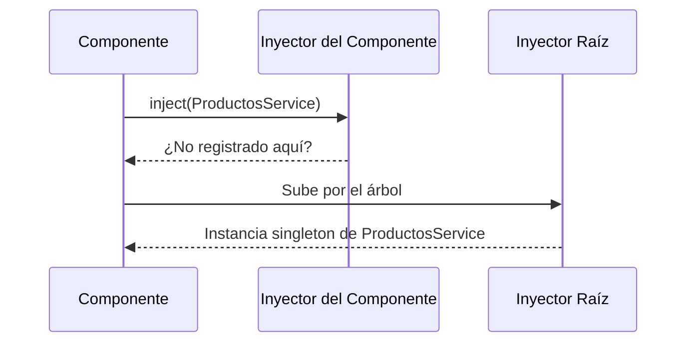

# Capítulo 8 - Parte 3: Inyección de Dependencias: el sistema DI de Angular

> **Parte 3 de 4** · Capítulo 8 · PARTE V - Servicios e Inyección de Dependencias

La Inyección de Dependencias (DI) es el mecanismo que hace que `inject(ProductosService)` funcione. No es Angular buscando mágicamente qué clase instanciar: es un contenedor de objetos que sabe cómo crear y entregar instancias de clases, valores o factories según una clave de registro llamada token. Entender cómo funciona este sistema convierte al desarrollador de alguien que usa DI a alguien que puede diseñar con DI.

## Qué es un token de inyección

Cuando Angular ve `inject(ProductosService)`, usa la clase `ProductosService` como token de búsqueda. Un token es simplemente una clave: puede ser una clase, una cadena de texto o -la forma más tipada y segura- un `InjectionToken<T>`. El contenedor DI mantiene un mapa de tokens a proveedores: dado un token, sabe qué valor devolver.

Las clases son excelentes tokens cuando se inyectan instancias de esa misma clase. Pero hay valores que no son clases: una URL base, un flag de configuración, un objeto de opciones. Para esos casos existe `InjectionToken<T>`, que crea un token único con tipado genérico.

```typescript
import { InjectionToken } from '@angular/core';

// Definimos la forma del objeto de configuración
export interface ConfiguracionApp {
  apiUrl: string;
  timeout: number;
  modoDebug: boolean;
}

// El token es un objeto único - no hay colisión de nombres aunque dos librerías
// usen el mismo string internamente
export const CONFIG_APP = new InjectionToken<ConfiguracionApp>(
  'ConfiguracionApp', // Descripción para el debugger - no es la clave real
  {
    // Podemos dar un valor por defecto via factory
    providedIn: 'root',
    factory: () => ({
      apiUrl: 'https://api.ejemplo.com',
      timeout: 5000,
      modoDebug: false
    })
  }
);
```

El `InjectionToken` con `factory` es equivalente a registrar un proveedor con `providedIn: 'root'`, pero para valores que no son clases. La descripción del constructor es solo para las herramientas de desarrollo; la identidad del token es el objeto mismo, no el string.

## Consumiendo InjectionToken con inject()

Una vez definido el token, cualquier clase o función dentro del contexto de inyección puede consumirlo:

```typescript
import { Injectable, inject } from '@angular/core';
import { HttpClient } from '@angular/common/http';
import { Observable } from 'rxjs';
import { CONFIG_APP, ConfiguracionApp } from '../tokens/config.token';

@Injectable({ providedIn: 'root' })
export class ApiService {
  // inject() acepta InjectionToken igual que acepta clases
  private config = inject(CONFIG_APP);
  private http = inject(HttpClient);

  get<T>(ruta: string): Observable<T> {
    // Usamos config.apiUrl directamente - sin hardcodear URLs
    return this.http.get<T>(`${this.config.apiUrl}${ruta}`);
  }
}
```

Este patrón permite sobrescribir la configuración en pruebas sin tocar el código de producción. En el archivo de spec, se puede proveer un `CONFIG_APP` diferente con una URL de servidor de pruebas.

## @Inject() en constructores

Antes de `inject()`, la forma de consumir tokens no-clase era el decorador `@Inject()` en el constructor. Todavía se encuentra en código existente y en algunas situaciones específicas vale entenderlo:

```typescript
import { Injectable, Inject } from '@angular/core';
import { CONFIG_APP, ConfiguracionApp } from '../tokens/config.token';

@Injectable({ providedIn: 'root' })
export class LoggerService {
  constructor(
    // @Inject dice explícitamente qué token usar para este parámetro
    @Inject(CONFIG_APP) private config: ConfiguracionApp
  ) {}

  debug(mensaje: string): void {
    if (this.config.modoDebug) {
      console.log(`[DEBUG] ${mensaje}`);
    }
  }
}
```

Con `inject()` esto se escribe simplemente como `private config = inject(CONFIG_APP)` en el cuerpo de la clase. La versión del constructor con `@Inject` es más verbosa y solo tiene ventaja en escenarios donde el constructor es obligatorio por razones externas.

## inject() fuera de clases: guards e interceptores funcionales

La ventaja decisiva de `inject()` sobre el constructor es que funciona en cualquier contexto de inyección activo, no solo dentro de clases. Los guards funcionales y los interceptores funcionales (Angular 15+) son funciones puras que no tienen constructor, y aún así pueden consumir servicios:

```typescript
import { inject } from '@angular/core';
import { CanActivateFn, Router } from '@angular/router';
import { AuthService } from '../core/services/auth.service';

// Guard funcional: es una función, no una clase
export const guardSesion: CanActivateFn = (ruta, estado) => {
  // inject() funciona aquí porque Angular establece el contexto de inyección
  // antes de llamar a la función del guard
  const authService = inject(AuthService);
  const router = inject(Router);

  if (authService.estaAutenticado()) {
    return true;
  }

  // Si no está autenticado, redirige al login
  return router.createUrlTree(['/login']);
};
```

Lo mismo aplica a interceptores funcionales:

```typescript
import { inject } from '@angular/core';
import { HttpInterceptorFn } from '@angular/common/http';
import { AuthService } from '../core/services/auth.service';

export const interceptorToken: HttpInterceptorFn = (req, next) => {
  const authService = inject(AuthService);
  const token = authService.obtenerToken();

  // Si hay token, clonamos la petición y agregamos el header
  const reqConToken = token
    ? req.clone({ setHeaders: { Authorization: `Bearer ${token}` } })
    : req;

  return next(reqConToken);
};
```

En ambos casos, Angular establece el contexto de inyección antes de invocar la función. Fuera de ese contexto (por ejemplo, en un `setTimeout` o en una función utilitaria no registrada), `inject()` lanzaría un error en tiempo de ejecución.

## Cómo Angular resuelve las dependencias

Cuando Angular necesita crear una instancia de `ProductosService`, sigue estos pasos. Primero busca el token `ProductosService` en el inyector actual (el del componente que lo solicita). Si no lo encuentra, sube al inyector padre. Continúa subiendo por el árbol de inyectores hasta llegar al inyector raíz. Si tampoco lo encuentra ahí, lanza un error de tipo `NullInjectorError`.

Este proceso de "burbujeo hacia arriba" es central para entender la jerarquía de inyectores, que exploramos a fondo en la Parte 4. Por ahora, lo importante es que el sistema es determinista: siempre resuelve el token desde el inyector más específico al más general.



## Puntos clave

- Un token de inyección es la clave que el contenedor DI usa para encontrar un proveedor. Puede ser una clase, un string o un `InjectionToken<T>`.
- `InjectionToken<T>` es la forma tipada y segura de registrar valores que no son clases: configuración, flags, factories.
- `@Inject()` en constructores y `inject()` en el cuerpo de clase son equivalentes; en código nuevo, prefiere `inject()`.
- `inject()` funciona en cualquier contexto de inyección activo: clases, guards funcionales, interceptores funcionales.
- Angular resuelve dependencias subiendo por el árbol de inyectores desde el más específico hasta el raíz.

## ¿Qué sigue?

En la Parte 4 exploramos la jerarquía de inyectores en detalle: qué diferencia hay entre `providedIn: 'root'`, proveer en un módulo y proveer en un componente, y cuándo cada opción tiene sentido.
