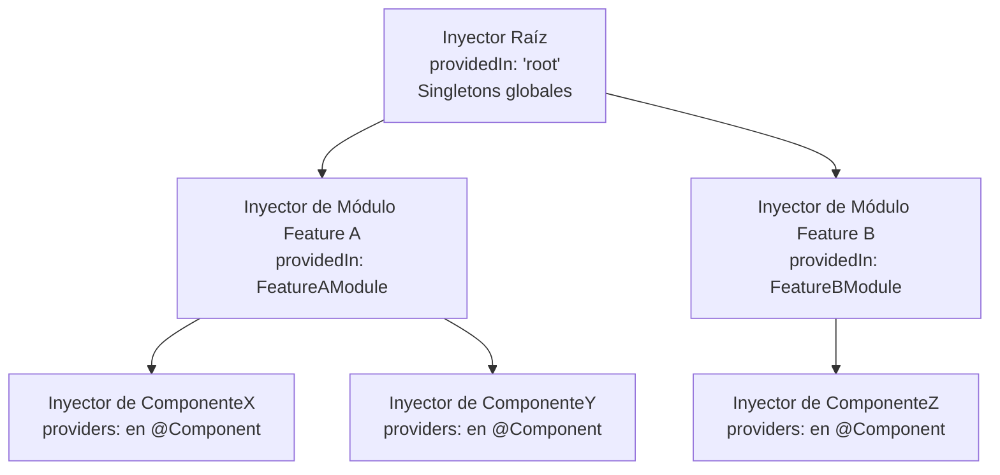
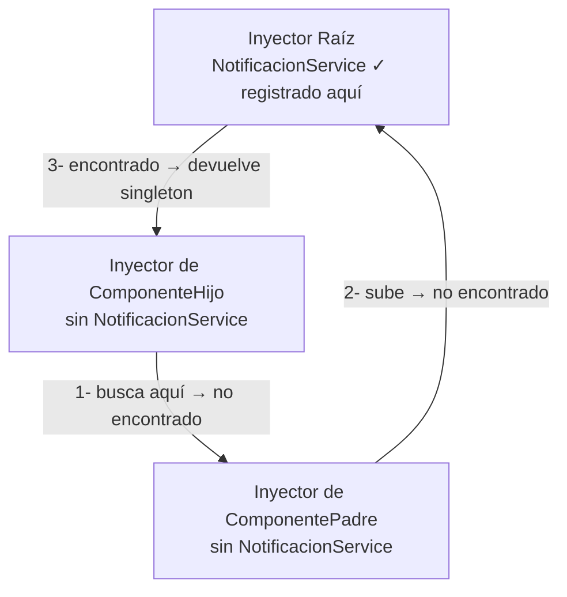

# Capítulo 8 - Parte 4: Jerarquía de inyectores: root, módulo y componente

> **Parte 4 de 4** · Capítulo 8 · PARTE V - Servicios e Inyección de Dependencias

Angular no tiene un único contenedor de inyección de dependencias: tiene un árbol de inyectores que refleja la estructura de la aplicación. Cada componente tiene su propio inyector. Cada módulo cargado tiene el suyo. Y existe un inyector raíz que engloba a todos. Entender esta jerarquía es lo que separa el uso instintivo de DI del uso informado: saber exactamente cuántas instancias de un servicio existen en un momento dado y por qué.

## El árbol de inyectores

Cuando Angular inicializa una aplicación, crea una cadena de inyectores encadenados. La búsqueda de un token siempre empieza en el inyector más interno (el del componente que solicita la dependencia) y sube hacia el raíz si no encuentra el token. Esta propagación se llama "burbujeo" y es determinista: siempre llega a la misma instancia para el mismo token en el mismo nivel del árbol.



Cada nodo del árbol es un inyector independiente. Si `ComponenteX` registra su propia instancia de un servicio, esa instancia es invisible para `ComponenteZ` y para el inyector raíz.

## providedIn: 'root' - el singleton global

Esta es la opción más común y la que usamos en las partes anteriores. El servicio se registra en el inyector raíz y existe una única instancia para toda la aplicación. Cualquier componente, guard o interceptor que lo inyecte recibe la misma instancia.

```typescript
import { Injectable } from '@angular/core';

@Injectable({
  providedIn: 'root' // Una instancia. Compartida por toda la app.
})
export class SesionService {
  private usuarioActual: string | null = null;

  iniciarSesion(usuario: string): void {
    this.usuarioActual = usuario;
  }

  obtenerUsuario(): string | null {
    return this.usuarioActual;
  }
}
```

`SesionService` tiene que ser singleton global porque su estado (el usuario actual) debe ser consistente en toda la aplicación. Si cada componente tuviera su propia instancia, cada uno vería un estado diferente del usuario.

## Proveer en un módulo - instancia compartida dentro del módulo

Antes de que existiera `providedIn: 'root'`, la forma de registrar servicios era en el array `providers` de un `@NgModule`. Esta opción sigue siendo válida cuando se quiere restringir un servicio a un módulo de funcionalidad:

```typescript
import { NgModule } from '@angular/core';
import { ReportesService } from './reportes.service';

@NgModule({
  providers: [
    ReportesService // Solo disponible para los componentes de este módulo
  ]
})
export class ReportesModule {}
```

Sin embargo, hay un matiz importante: los módulos Angular cargados de forma eager (no lazy) comparten el inyector raíz. Solo los módulos cargados con lazy loading tienen un inyector separado. Por eso, `providedIn: SomeModule` solo crea una instancia verdaderamente aislada si ese módulo se carga de forma diferida.

## Proveer en un componente - instancias separadas por árbol de vistas

La opción más granular es registrar un servicio directamente en el decorador `@Component`. Esto crea una nueva instancia del servicio para ese componente y todos sus hijos. Cuando el componente se destruye, la instancia también se destruye.

```typescript
import { Component } from '@angular/core';
import { FormularioService } from './formulario.service';

@Component({
  selector: 'app-wizard-pago',
  standalone: true,
  template: `<!-- wizard de varios pasos -->`,
  // Una nueva instancia de FormularioService para cada wizard montado
  providers: [FormularioService]
})
export class WizardPagoComponent {
  // Este formulario service es exclusivo de este wizard y sus hijos
}
```

Este patrón es útil cuando el servicio mantiene estado que debe ser privado al árbol de componentes. Si el usuario abre dos wizards simultáneamente en la misma página (por ejemplo en un modal y en la vista principal), cada wizard tendrá su propia instancia de `FormularioService` con su propio estado, completamente aislado.

## Resolución de dependencias: el burbujeo en acción

Para ilustrar cómo Angular decide qué instancia entregar, consideremos este escenario: `ComponenteHijo` inyecta `NotificacionService`. Angular busca de adentro hacia afuera.



Ahora, si `ComponentePadre` registra su propia versión del servicio en `providers`, el burbujeo se detiene ahí y `ComponenteHijo` recibe la instancia del padre, no la del inyector raíz:

```typescript
import { Component } from '@angular/core';
import { NotificacionService } from '../services/notificacion.service';

@Component({
  selector: 'app-panel-notificaciones',
  standalone: true,
  template: `<app-lista-notificaciones />`,
  // Al proveer aquí, tanto este componente como sus hijos
  // usarán esta instancia, ignorando la del inyector raíz
  providers: [NotificacionService]
})
export class PanelNotificacionesComponent {}
```

## Cuándo usar cada nivel

La elección del nivel de provisión no es arbitraria. Existe una guía práctica basada en el ciclo de vida y el alcance del estado que el servicio gestiona.

Si el estado es global y debe ser consistente en toda la app (sesión del usuario, configuración, caché global), usa `providedIn: 'root'`. Si el estado es específico a un flujo de funcionalidad y ese módulo se carga bajo demanda (carrito de compras, panel de administración), considera proveer en el módulo lazy. Si el estado es privado a un árbol de componentes y debe destruirse cuando el componente se destruye (estado de un formulario complejo, selección temporal), usa `providers` en el componente.

## Puntos clave

- Angular mantiene un árbol de inyectores que refleja la estructura de módulos y componentes de la aplicación.
- `providedIn: 'root'` crea un singleton global disponible en toda la aplicación, con tree-shaking automático.
- Los servicios en `providers` de un `@Component` crean instancias separadas para cada árbol de vistas donde el componente aparece.
- La resolución de dependencias burbujea hacia arriba: del inyector del componente hasta el inyector raíz.
- El nivel de provisión debe reflejar el alcance del estado: global → root, por módulo lazy → módulo, por árbol de componentes → componente.

## ¿Qué sigue?

El Capítulo 9 cambia el foco de los servicios a los módulos: aprenderemos la anatomía completa de `@NgModule`, cuándo todavía se necesitan en 2024 y cómo los componentes standalone están cambiando la forma en que organizamos las aplicaciones Angular.
