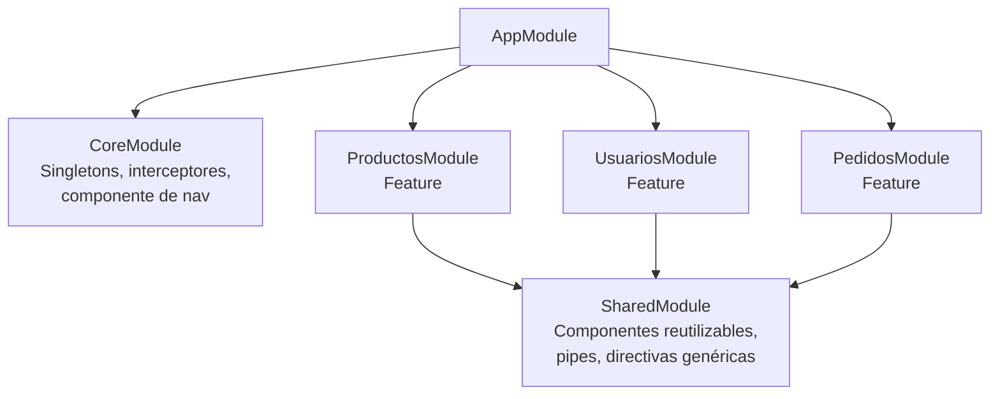

# Capítulo 9 - Parte 2: Módulo Core, Shared y de funcionalidad

> **Parte 2 de 4** · Capítulo 9 · PARTE V - Servicios e Inyección de Dependencias

Tener claro que un módulo puede contener componentes, servicios y pipes es solo el primer paso. El verdadero reto arquitectónico es decidir en qué módulo va cada pieza. Sin una estrategia de organización, los módulos crecen sin orden y las dependencias circulares aparecen. El patrón de los tres tipos de módulos -Core, Shared y Feature- resuelve este problema con reglas simples y con alta cohesión dentro de cada módulo y bajo acoplamiento entre ellos.

## Los tres tipos de módulos

Cada módulo de la aplicación encaja en una de tres categorías según su propósito. El módulo Core agrupa todo lo que es singleton global: servicios de autenticación, interceptores HTTP, el componente de navegación principal que aparece una sola vez. El módulo Shared agrupa todo lo reutilizable por múltiples features: componentes genéricos, pipes utilitarios, directivas transversales. Los módulos Feature encapsulan un dominio de negocio completo: productos, usuarios, pedidos, reportes.



Los módulos Feature importan SharedModule para acceder a los componentes reutilizables. Los módulos Feature no se importan entre sí: si dos features necesitan compartir algo, ese algo debe estar en SharedModule o en CoreModule. CoreModule solo lo importa AppModule, nunca los módulos Feature.

## CoreModule: singletons y la guarda forRoot()

CoreModule contiene servicios que deben existir como singletons globales y componentes que se usan una única vez en la aplicación (el header, el footer, el sidebar de navegación). Un riesgo real con CoreModule es que alguien lo importe en un módulo Feature por error, instanciando los servicios de nuevo.

La solución clásica es el patrón `forRoot()` con una guarda de importación doble:

```typescript
import { NgModule, Optional, SkipSelf } from '@angular/core';
import { HTTP_INTERCEPTORS } from '@angular/common/http';

import { NavbarComponent } from './components/navbar/navbar.component';
import { FooterComponent } from './components/footer/footer.component';
import { AuthService } from './services/auth.service';
import { interceptorAutenticacion } from './interceptors/auth.interceptor';

@NgModule({
  declarations: [NavbarComponent, FooterComponent],
  exports: [NavbarComponent, FooterComponent],
  providers: [
    AuthService,
    {
      provide: HTTP_INTERCEPTORS,
      useValue: interceptorAutenticacion,
      multi: true
    }
  ]
})
export class CoreModule {
  // Constructor con guarda: lanza un error si CoreModule se importa más de una vez
  constructor(@Optional() @SkipSelf() moduloPadre: CoreModule) {
    if (moduloPadre) {
      throw new Error(
        'CoreModule ya fue cargado. Solo debe importarse en AppModule.'
      );
    }
  }
}
```

`@SkipSelf()` le dice a Angular que busque la instancia de `CoreModule` en el inyector padre, no en el actual. Si encuentra una, significa que ya fue importado antes, y el constructor lanza el error. `@Optional()` evita que Angular falle cuando no hay instancia previa (la primera vez que se importa).

## SharedModule: la caja de herramientas reutilizable

SharedModule es el módulo que todos los módulos Feature importan. Contiene componentes, pipes y directivas que no tienen estado global y que múltiples dominios necesitan. Un componente de tarjeta genérica, un pipe de formato de moneda propio, una directiva de tooltip personalizada.

```typescript
import { NgModule } from '@angular/core';
import { CommonModule } from '@angular/common';
import { ReactiveFormsModule } from '@angular/forms';

import { TarjetaComponent } from './components/tarjeta/tarjeta.component';
import { BotonesAccionComponent } from './components/botones-accion/botones-accion.component';
import { MonedaPipe } from './pipes/moneda.pipe';
import { DestacarDirective } from './directives/destacar.directive';

@NgModule({
  declarations: [
    TarjetaComponent,
    BotonesAccionComponent,
    MonedaPipe,
    DestacarDirective
  ],
  imports: [
    CommonModule,
    ReactiveFormsModule
  ],
  // Reexportamos todo para que los Feature modules no tengan que importar
  // CommonModule y ReactiveFormsModule por separado
  exports: [
    CommonModule,
    ReactiveFormsModule,
    TarjetaComponent,
    BotonesAccionComponent,
    MonedaPipe,
    DestacarDirective
  ]
})
export class SharedModule {}
```

SharedModule no tiene `providers`. Si un componente de Shared necesita un servicio, ese servicio debe estar en CoreModule o en `providedIn: 'root'`. Poner servicios en SharedModule y luego exportarlo implica que cada módulo Feature que lo importe podría instanciar el servicio por separado, rompiendo el patrón singleton.

## Módulos Feature: el dominio de negocio encapsulado

Un módulo Feature encapsula todo lo relacionado con un dominio específico de la aplicación. Sus componentes, sus propios servicios locales (no globales), su routing interno. Los componentes de un Feature module raramente se exportan; están diseñados para uso interno del dominio.

```typescript
import { NgModule } from '@angular/core';
import { RouterModule } from '@angular/router';
import { SharedModule } from '../shared/shared.module';

import { CatalogoComponent } from './components/catalogo/catalogo.component';
import { DetalleProductoComponent } from './components/detalle/detalle-producto.component';
import { ProductoCardComponent } from './components/producto-card/producto-card.component';
import { FiltroProductosComponent } from './components/filtro/filtro-productos.component';
import { rutasProductos } from './productos.routes';

@NgModule({
  declarations: [
    CatalogoComponent,
    DetalleProductoComponent,
    ProductoCardComponent,
    FiltroProductosComponent
  ],
  imports: [
    SharedModule,    // Obtiene CommonModule, pipes y componentes genéricos
    RouterModule.forChild(rutasProductos) // Rutas locales del feature
  ]
  // Sin exports: estos componentes son privados al módulo de productos
  // Sin providers adicionales: los servicios de productos usan providedIn: 'root'
})
export class ProductosModule {}
```

El módulo Feature es el candidato ideal para el lazy loading: Angular puede cargar el módulo de Productos completo solo cuando el usuario navega a la ruta de productos, reduciendo el bundle inicial. → Ver Capítulo 11, Parte 1.

## La regla de oro

Cada módulo debería poder responder "sí" a estas tres preguntas: ¿Todas sus declaraciones pertenecen al mismo dominio o propósito? ¿Sus dependencias de `imports` son mínimas y justificadas? ¿Su lista de `exports` es intencionalmente pequeña? Si alguna respuesta es "no", el módulo tiene responsabilidades mezcladas y probablemente se beneficiaría de una división.

## Puntos clave

- CoreModule contiene singletons globales y componentes de layout; solo lo importa AppModule.
- El patrón `forRoot()` con `@SkipSelf()` y `@Optional()` protege contra importaciones accidentales de CoreModule en módulos Feature.
- SharedModule no tiene `providers`; solo componentes, directivas y pipes sin estado global.
- SharedModule puede reexportar `CommonModule` y `ReactiveFormsModule` para simplificar los imports de los módulos Feature.
- Los módulos Feature encapsulan un dominio completo y son candidatos naturales para lazy loading.

## ¿Qué sigue?

En la Parte 3 damos el salto al mundo standalone: cómo componentes, directivas y pipes declaran sus propias dependencias sin necesidad de ningún módulo, y cómo esto simplifica radicalmente la organización de aplicaciones nuevas.
