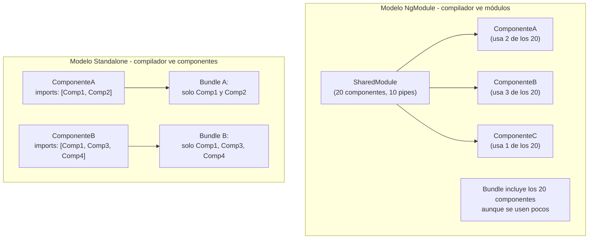

# Capítulo 9 - Parte 3: El mundo Standalone: componentes, directivas y pipes sin módulo

> **Parte 3 de 4** · Capítulo 9 · PARTE V - Servicios e Inyección de Dependencias

Durante años, `NgModule` fue el pegamento invisible que sostenía las aplicaciones Angular. Cada componente debía ser declarado en un módulo, cada módulo debía importar los módulos que sus componentes necesitaban, y la proliferación de módulos compartidos era casi inevitable en proyectos medianos. Angular 14 introdujo los componentes standalone como una opción opt-in; Angular 17 los convirtió en el estándar. Hoy, crear un `NgModule` para una aplicación nueva sería nadar contra la corriente.

## standalone: true - la opción que lo cambia todo

Cualquier `@Component`, `@Directive` o `@Pipe` puede ser standalone con una única línea en su decorador. Cuando es standalone, se convierte en su propia unidad de compilación: ya no necesita ser declarado en ningún módulo.

```typescript
// componentes/tarjeta-producto.component.ts
import { Component, input, output } from '@angular/core';
import { CurrencyPipe } from '@angular/common';
import { RouterLink } from '@angular/router';

interface Producto {
  id: number;
  nombre: string;
  precio: number;
  urlImagen: string;
}

@Component({
  selector: 'app-tarjeta-producto',
  standalone: true,
  // imports reemplaza a declarations: aquí van las dependencias del template
  imports: [CurrencyPipe, RouterLink],
  template: `
    <article class="tarjeta">
      
      <h3>{{ producto().nombre }}</h3>
      <p class="precio">{{ producto().precio | currency:'COP':'symbol':'1.0-0' }}</p>
      <a [routerLink]="['/productos', producto().id]">Ver detalle</a>
      <button (click)="agregarAlCarrito.emit(producto().id)">
        Agregar al carrito
      </button>
    </article>
  `,
})
export class TarjetaProductoComponent {
  producto = input.required<Producto>();
  agregarAlCarrito = output<number>();
}
```

El array `imports` del decorador `@Component` es el cambio conceptual más importante. En el modelo de módulos, `CurrencyPipe` estaría disponible porque `CommonModule` estaba importado en el módulo del componente. Ahora, cada componente declara explícitamente sus dependencias. El resultado es un grafo de dependencias más transparente y, crucialmente, más apto para tree-shaking.

## imports: el nuevo declarations + imports en uno

En el modelo tradicional de módulos, `declarations` listaba los componentes, directivas y pipes propios del módulo, mientras que `imports` listaba los módulos externos que necesitábamos. Con standalone, esta distinción desaparece: el array `imports` del decorador acepta tanto componentes y directivas standalone como módulos completos cuando la compatibilidad lo requiere.

```typescript
// features/catalogo/catalogo.component.ts
import { Component, signal, inject } from '@angular/core';
import { AsyncPipe } from '@angular/common';
import { FormsModule } from '@angular/forms';
import { TarjetaProductoComponent } from '../../componentes/tarjeta-producto.component';
import { FiltroCategoriaPipe } from '../../pipes/filtro-categoria.pipe';
import { CarritoService } from '../../servicios/carrito.service';

@Component({
  selector: 'app-catalogo',
  standalone: true,
  imports: [
    // Componente standalone propio
    TarjetaProductoComponent,
    // Pipe standalone propio
    FiltroCategoriaPipe,
    // Pipe standalone de Angular
    AsyncPipe,
    // Módulo de Angular (compatible con standalone)
    FormsModule,
  ],
  templateUrl: './catalogo.component.html',
})
export class CatalogoComponent {
  private carritoService = inject(CarritoService);
  categoriaSeleccionada = signal<string>('todas');
  // ...
}
```

Podemos importar tanto piezas standalone individuales como módulos completos en el mismo array. Esto es esencial durante la migración de proyectos existentes: podemos ir haciendo standalone los componentes propios sin necesidad de reescribir inmediatamente todas las dependencias de terceros que aún usan módulos.

## Directivas y pipes standalone

La opción `standalone: true` no es exclusiva de los componentes. Las directivas y pipes también pueden ser standalone, con el mismo beneficio: se importan directamente donde se usan, sin módulo intermediario.

```typescript
// pipes/filtro-categoria.pipe.ts
import { Pipe, PipeTransform } from '@angular/core';

interface ItemConCategoria {
  categoria: string;
}

@Pipe({
  name: 'filtroCategoria',
  standalone: true,
  pure: true, // Solo recalcula cuando cambia la referencia del input
})
export class FiltroCategoriaPipe implements PipeTransform {
  transform<T extends ItemConCategoria>(
    items: T[],
    categoria: string
  ): T[] {
    if (categoria === 'todas') return items;
    return items.filter(item => item.categoria === categoria);
  }
}
```

```typescript
// directivas/tooltip.directive.ts
import { Directive, HostListener, input, inject } from '@angular/core';
import { Overlay, OverlayRef } from '@angular/cdk/overlay';

@Directive({
  selector: '[appTooltip]',
  standalone: true,
})
export class TooltipDirective {
  appTooltip = input.required<string>();
  private overlay = inject(Overlay);

  @HostListener('mouseenter')
  mostrarTooltip(): void {
    // Lógica de mostrar tooltip con CDK Overlay
    console.log(`Tooltip: ${this.appTooltip()}`);
  }
}
```

Tanto el pipe como la directiva se importan en el array `imports` de cualquier componente que los necesite, exactamente igual que `TarjetaProductoComponent` en el ejemplo anterior. Esta uniformidad es uno de los beneficios más apreciados del modelo standalone: hay un solo mecanismo para declarar dependencias.

## Ventajas en tree-shaking y lazy loading

El tree-shaking es el proceso por el cual el bundler elimina del bundle final el código que nunca se usa. Con `NgModule`, el compilador debía analizar transitividad de módulos para determinar qué código incluir, lo cual era complejo y a veces conservador. Con standalone, el compilador ve exactamente qué componentes importa cada componente, generando un grafo de dependencias preciso.



Con lazy loading, la ventaja es aún más pronunciada. Cuando una ruta carga un componente standalone de forma diferida, Angular incluye en ese chunk exactamente las dependencias declaradas en su `imports`. Con módulos lazy, el chunk incluía todo el módulo aunque el usuario solo navegara a una parte de él.

## importProvidersFrom: compatibilidad con módulos legacy

Hay casos donde necesitamos usar un módulo de Angular o de una librería de terceros que aún no ofrece su API en forma de providers funcionales. `importProvidersFrom()` actúa como puente: extrae los providers de un módulo y los hace disponibles en el contexto standalone.

```typescript
// app/app.config.ts - usando importProvidersFrom para compatibilidad
import { ApplicationConfig, importProvidersFrom } from '@angular/core';
import { provideRouter } from '@angular/router';
import { BrowserAnimationsModule } from '@angular/platform-browser/animations';
import { NgxChartsModule } from '@swimlane/ngx-charts'; // Librería legacy con NgModule

export const configuracionApp: ApplicationConfig = {
  providers: [
    provideRouter([/* rutas */]),
    // importProvidersFrom extrae los providers de módulos que aún no son standalone
    importProvidersFrom(
      BrowserAnimationsModule,
      NgxChartsModule,
    ),
  ],
};
```

`importProvidersFrom` también funciona a nivel de componente, dentro del array `imports`:

```typescript
@Component({
  selector: 'app-formulario',
  standalone: true,
  imports: [
    ReactiveFormsModule,
    // Si alguna librería de formularios usa NgModule internamente
    importProvidersFrom(AlgunaLibreriaFormulariosModule),
  ],
  // ...
})
```

Este mecanismo garantiza que la migración a standalone puede hacerse de forma incremental: los módulos de terceros que aún no actualizaron su API siguen funcionando sin necesidad de esperar a que lo hagan.

## Eliminando los módulos compartidos

Uno de los patrones más comunes en aplicaciones Angular basadas en módulos era el `SharedModule`: un módulo que importaba y re-exportaba `CommonModule`, `FormsModule`, y todos los componentes de uso frecuente, para que otros módulos pudieran importar solo uno en lugar de muchos.

Con standalone, el `SharedModule` deja de tener sentido. Cada componente importa exactamente lo que necesita. No hay re-exportaciones, no hay módulos intermediarios, no hay riesgo de importar componentes en un módulo y olvidar incluirlos en el `SharedModule` para que otros los vean.

```typescript
// Lo que YA NO necesitamos con standalone:
// shared/shared.module.ts - este archivo debería eliminarse
@NgModule({
  declarations: [
    TarjetaComponent, BotoneraComponent, SpinnerComponent,
    FechaRelativaPipe, TruncatePipe, // ...y más
  ],
  imports: [CommonModule, FormsModule, RouterModule],
  exports: [
    TarjetaComponent, BotoneraComponent, SpinnerComponent,
    FechaRelativaPipe, TruncatePipe,
    CommonModule, FormsModule, RouterModule,
  ],
})
export class SharedModule {}
// Con standalone: cada componente importa directamente lo que usa. Fin.
```

## Puntos clave

- `standalone: true` en `@Component`, `@Directive` y `@Pipe` elimina la necesidad de declarar esos elementos en un `NgModule`
- El array `imports` del decorador reemplaza la combinación de `declarations` + `imports` del módulo, aceptando tanto elementos standalone como módulos completos
- El tree-shaking mejora con standalone porque el compilador ve dependencias exactas en lugar de módulos transitivos
- `importProvidersFrom()` extrae providers de módulos legacy para usarlos en contextos standalone
- Los módulos compartidos (`SharedModule`) pierden su razón de existir: cada componente standalone declara sus dependencias explícitamente

## ¿Qué sigue?

En la Parte 4 abordamos la migración práctica: cómo convertir una aplicación existente basada en `NgModule` al modelo standalone, usando tanto las herramientas automáticas del CLI como la migración manual controlada.
