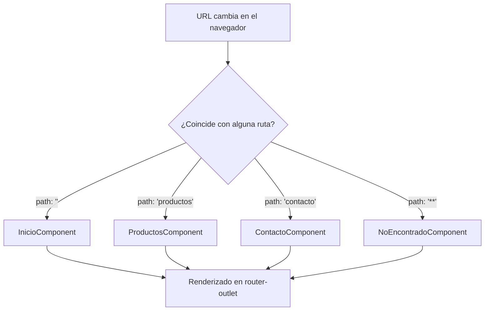

# Capítulo 10 - Parte 1: Configuración del Router: provideRouter y rutas básicas

> **Parte 1 de 4** · Capítulo 10 · PARTE VI - Navegación y Routing

El sistema de routing de Angular es lo que transforma una colección de componentes en una aplicación de múltiples páginas. A diferencia de un servidor web tradicional, donde cada URL devuelve un documento HTML distinto, Angular intercepta los cambios de URL en el navegador y renderiza el componente que corresponde a esa ruta -todo sin recargar la página. Este modelo se denomina Single-Page Application (SPA), y el router de Angular es su corazón.

Desde Angular 14, y consolidado en Angular 17+, la arquitectura standalone eliminó la necesidad de `RouterModule` y `AppRoutingModule` como bloques intermediarios. Hoy configuramos el router directamente en `bootstrapApplication`, pasando las rutas como parte de la función `provideRouter`. El resultado es una configuración más explícita, trazable y fácil de mantener.

## Configurando el router con provideRouter

La función `provideRouter` recibe el array de rutas de la aplicación y devuelve un conjunto de providers que el sistema de inyección de dependencias registra globalmente. Se usa dentro de `bootstrapApplication`, que es el punto de entrada de toda app standalone.

```typescript
// main.ts
import { bootstrapApplication } from '@angular/platform-browser';
import { provideRouter } from '@angular/router';
import { AppComponent } from './app/app.component';
import { rutas } from './app/app.routes';

bootstrapApplication(AppComponent, {
  providers: [
    provideRouter(rutas) // registra el router con nuestras rutas
  ]
}).catch(err => console.error(err));
```

Este único cambio en `main.ts` es todo lo que necesita Angular para activar el sistema de routing. No hay ningún módulo que importar, ninguna clase que extender. `provideRouter` acepta un segundo argumento opcional con *features* del router -como preloading y debug logging- que veremos en el Capítulo 11.

## El array Routes y el objeto de ruta

Las rutas se definen en un array de tipo `Routes`, que es simplemente un alias de `Route[]`. Cada elemento de ese array es un objeto que describe qué componente debe mostrarse cuando la URL coincide con determinado patrón.

```typescript
// app/app.routes.ts
import { Routes } from '@angular/router';
import { InicioComponent } from './paginas/inicio.component';
import { ProductosComponent } from './paginas/productos.component';
import { ContactoComponent } from './paginas/contacto.component';
import { NoEncontradoComponent } from './paginas/no-encontrado.component';

export const rutas: Routes = [
  {
    path: '',              // URL raíz: /
    component: InicioComponent
  },
  {
    path: 'productos',     // URL: /productos
    component: ProductosComponent
  },
  {
    path: 'contacto',      // URL: /contacto
    component: ContactoComponent
  },
  {
    path: '',              // redirige / a /inicio de forma explícita
    redirectTo: 'inicio',
    pathMatch: 'full'      // 'full' exige que toda la URL sea ''
  },
  {
    path: '**',            // cualquier ruta no reconocida
    component: NoEncontradoComponent
  }
];
```

Cada objeto de ruta tiene propiedades con roles bien definidos. `path` es el segmento de URL que activa la ruta, sin barra inicial. `component` es el componente que Angular renderizará en el `<router-outlet>` cuando esa ruta esté activa. `redirectTo` permite redirigir a otro path sin renderizar nada, y `pathMatch: 'full'` garantiza que la redirección solo ocurra cuando la URL completa coincide con el string vacío -no solo cuando la URL *comienza* con él.

## La ruta wildcard y la redirección

La ruta wildcard (`path: '**'`) actúa como el bloque `default` de un `switch`: captura cualquier URL que no haya coincidido con ninguna ruta anterior. Angular evalúa las rutas en orden, de arriba hacia abajo, y usa la primera coincidencia que encuentra. Por eso la ruta wildcard siempre va al final del array; si estuviera primera, capturaría todas las URLs sin dar oportunidad a las demás.

La combinación `redirectTo` + `pathMatch: 'full'` merece atención especial. La propiedad `pathMatch` puede ser `'full'` o `'prefix'`. Con `'prefix'` (el valor por defecto), una ruta con `path: ''` coincide con *cualquier* URL porque toda URL comienza con una cadena vacía. Con `'full'`, solo coincide cuando la URL completa es exactamente igual al path -es decir, cuando el usuario visita la raíz del sitio. Esta distinción es crítica para evitar bucles de redirección.

## Ejemplo completo: app de tres rutas

Veamos cómo quedaría la estructura completa de una pequeña aplicación con inicio, catálogo y página de error 404:

```typescript
// app/app.component.ts
import { Component } from '@angular/core';
import { RouterOutlet } from '@angular/router';

@Component({
  selector: 'app-root',
  standalone: true,
  imports: [RouterOutlet],
  template: `
    <header>
      <h1>Mi Tienda</h1>
    </header>
    <main>
      <router-outlet />   <!-- aquí se renderizan los componentes de ruta -->
    </main>
  `
})
export class AppComponent {}
```

```typescript
// app/paginas/inicio.component.ts
import { Component } from '@angular/core';

@Component({
  selector: 'app-inicio',
  standalone: true,
  template: `<h2>Bienvenido a la tienda</h2>`
})
export class InicioComponent {}
```

El componente raíz `AppComponent` solo necesita importar `RouterOutlet` del paquete `@angular/router`. El `<router-outlet>` es el marcador de posición donde Angular inyectará el componente correspondiente a la URL activa. Cuando el usuario navega a `/productos`, Angular destruye el componente anterior, instancia `ProductosComponent` y lo coloca donde está el outlet. La cabecera permanece intacta porque vive fuera del outlet.

## Diagrama del ciclo de resolución de rutas



## Puntos clave

- `provideRouter(rutas)` reemplaza a `RouterModule.forRoot()` en aplicaciones standalone Angular 17+
- El array `Routes` se evalúa en orden: la primera ruta que coincide gana
- `pathMatch: 'full'` es obligatorio en rutas con `path: ''` que usen `redirectTo` para evitar coincidencias no deseadas
- La ruta wildcard `path: '**'` siempre va al final del array
- `<router-outlet>` en el componente raíz es el punto de montaje donde Angular renderiza las vistas

## ¿Qué sigue?

En la Parte 2 aprendemos a construir menús de navegación con `RouterLink` y a navegar entre rutas desde el código con `Router.navigate()`.
