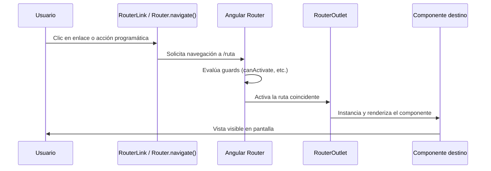

# Capítulo 10 - Parte 2: RouterLink, RouterOutlet y navegación programática

> **Parte 2 de 4** · Capítulo 10 · PARTE VI - Navegación y Routing

Con las rutas definidas y el router configurado (→ Ver Capítulo 10, Parte 1), el siguiente paso es construir la navegación visible para el usuario. Angular provee dos mecanismos complementarios: la directiva `RouterLink` para navegación declarativa en el template, y el servicio `Router` para navegación programática desde la clase del componente. Ambos trabajan sobre la misma infraestructura interna y producen el mismo resultado, pero cada uno tiene su lugar natural de uso.

## RouterOutlet: el punto de montaje

`RouterOutlet` es una directiva que actúa como marcador de posición en el template. Cuando la URL activa cambia, Angular destruye el componente previamente renderizado en el outlet e instancia el nuevo. Todo lo que esté *fuera* del `<router-outlet>` permanece intacto -lo que lo convierte en el mecanismo ideal para layouts con cabecera, pie de página o barras de navegación persistentes.

Para usar `RouterOutlet` en un componente standalone, basta con importarlo del paquete `@angular/router`:

```typescript
import { Component } from '@angular/core';
import { RouterOutlet } from '@angular/router';

@Component({
  selector: 'app-root',
  standalone: true,
  imports: [RouterOutlet],
  template: `
    <nav><!-- menú persistente --></nav>
    <router-outlet />  <!-- solo esta parte cambia con cada ruta -->
    <footer>Pie de página fijo</footer>
  `
})
export class AppComponent {}
```

## RouterLink: navegación declarativa

`RouterLink` es la directiva que convierte cualquier elemento HTML -típicamente un `<a>`- en un enlace de Angular. A diferencia de un `href` normal, `RouterLink` intercepta el clic, previene la recarga de página y delega la navegación al router de Angular.

Puede recibir un string simple o un array de segmentos. El array es especialmente útil cuando los segmentos incluyen parámetros de ruta dinámicos (que veremos en la Parte 3):

```typescript
import { Component } from '@angular/core';
import { RouterLink, RouterLinkActive, RouterOutlet } from '@angular/router';

@Component({
  selector: 'app-root',
  standalone: true,
  imports: [RouterOutlet, RouterLink, RouterLinkActive],
  template: `
    <nav>
      <!-- string simple para rutas fijas -->
      <a routerLink="/">Inicio</a>

      <!-- array de segmentos: equivalente a /productos -->
      <a [routerLink]="['/productos']">Productos</a>

      <!-- con parámetro: navega a /productos/42 -->
      <a [routerLink]="['/productos', 42]">Producto 42</a>

      <!-- routerLinkActive agrega la clase CSS cuando la ruta está activa -->
      <a routerLink="/contacto"
         routerLinkActive="enlace-activo"
         [routerLinkActiveOptions]="{ exact: true }">
        Contacto
      </a>
    </nav>
    <router-outlet />
  `
})
export class AppComponent {}
```

La diferencia entre `routerLink="/"` (sin corchetes) y `[routerLink]="['/']"` (con corchetes) es la misma que en cualquier binding de Angular: sin corchetes el valor es un string literal; con corchetes es una expresión TypeScript que puede ser dinámica.

## routerLinkActive y routerLinkActiveOptions

`routerLinkActive` añade una o más clases CSS al elemento cuando la ruta asociada está activa. Por defecto usa comparación por prefijo: la ruta `/` estará activa siempre que la URL comience con `/`, lo que significa que se marcaría como activa en *todas* las páginas. Para evitarlo, usamos `routerLinkActiveOptions` con `{ exact: true }`, que exige coincidencia exacta de la URL completa.

```typescript
// En el template - ejemplo de menú completo con estilos de estado
// ...
<a routerLink="/"
   routerLinkActive="activo"
   [routerLinkActiveOptions]="{ exact: true }">
  Inicio
</a>
<a routerLink="/catalogo"
   routerLinkActive="activo">
  Catálogo
</a>
```

```css
/* styles.css */
nav a { color: #333; text-decoration: none; padding: 0.5rem; }
nav a.activo { color: #1976d2; font-weight: bold; border-bottom: 2px solid #1976d2; }
```

## Navegación programática con Router

Cuando la navegación debe ocurrir como consecuencia de lógica de negocio -tras validar un formulario, después de una petición HTTP exitosa, en respuesta a un evento del teclado- usamos el servicio `Router` desde la clase del componente.

`Router.navigate()` recibe el mismo array de segmentos que `RouterLink`. `Router.navigateByUrl()` recibe una URL completa como string. La diferencia principal es que `navigate()` es relativo al contexto de la ruta activa si no usamos `/` como primer segmento, mientras que `navigateByUrl()` siempre es absoluto y reemplaza la URL completa incluyendo query params y fragmento.

```typescript
import { Component, inject } from '@angular/core';
import { Router } from '@angular/router';

@Component({
  selector: 'app-login',
  standalone: true,
  template: `
    <button (click)="iniciarSesion()">Entrar</button>
    <button (click)="irAlCatalogo()">Ver catálogo</button>
  `
})
export class LoginComponent {
  private router = inject(Router);

  iniciarSesion(): void {
    // lógica de autenticación...
    // tras éxito, navegamos al dashboard
    this.router.navigate(['/dashboard']);
  }

  irAlCatalogo(): void {
    // navigateByUrl para URL completa con query params
    this.router.navigateByUrl('/catalogo?categoria=ofertas');
  }
}
```

`navigate()` también acepta un segundo argumento con opciones adicionales: `queryParams`, `fragment`, `replaceUrl` (reemplaza la entrada en el historial en lugar de agregar una nueva) y `relativeTo` (para navegación relativa dentro de rutas hijas).

```typescript
// Navegación relativa y con opciones extra
this.router.navigate(['detalle', productoId], {
  relativeTo: this.activatedRoute, // relativo a la ruta actual
  queryParams: { origen: 'lista' },
  fragment: 'resenas'
});
```

## Ejemplo: menú de navegación completo

Integremos todo en un componente de layout real que combina outlet, links activos y navegación programática:

```typescript
import { Component, inject } from '@angular/core';
import { Router, RouterLink, RouterLinkActive, RouterOutlet } from '@angular/router';

@Component({
  selector: 'app-layout',
  standalone: true,
  imports: [RouterOutlet, RouterLink, RouterLinkActive],
  template: `
    <header>
      <span class="logo">MiApp</span>
      <nav>
        <a routerLink="/" routerLinkActive="activo"
           [routerLinkActiveOptions]="{ exact: true }">Inicio</a>
        <a routerLink="/productos" routerLinkActive="activo">Productos</a>
        <a routerLink="/contacto" routerLinkActive="activo">Contacto</a>
      </nav>
      <button (click)="cerrarSesion()">Salir</button>
    </header>
    <main>
      <router-outlet />
    </main>
  `
})
export class LayoutComponent {
  private router = inject(Router);

  cerrarSesion(): void {
    // limpiar token, estado, etc.
    this.router.navigate(['/login']);
  }
}
```

## Diagrama de flujo de navegación



## Puntos clave

- `RouterOutlet` es el marcador de posición donde Angular monta los componentes de ruta; todo lo exterior permanece estático
- `RouterLink` con string es equivalente a un `href` pero sin recarga de página; con array permite construir URLs dinámicas
- `routerLinkActive` aplica clases CSS al elemento activo; `{ exact: true }` evita falsos positivos en la ruta raíz
- `Router.navigate()` usa segmentos de path y permite opciones como `relativeTo` y `queryParams`
- `Router.navigateByUrl()` acepta una URL completa absoluta y es ideal cuando ya se tiene la URL armada como string

## ¿Qué sigue?

En la Parte 3 añadimos dinamismo a nuestras rutas: parámetros de segmento como `:id` y query params que permiten compartir estado entre vistas sin perderlo al navegar.
