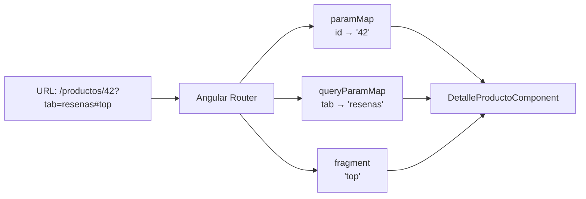

# Capítulo 10 - Parte 3: Rutas con parámetros :id y Query Params

> **Parte 3 de 4** · Capítulo 10 · PARTE VI - Navegación y Routing

Las rutas estáticas que vimos en las partes anteriores son suficientes para una navegación básica, pero la mayoría de las aplicaciones reales necesitan rutas dinámicas: la URL `/productos/42` debe mostrar el producto con ID 42, y `/busqueda?q=angular&pagina=2` debe ejecutar una búsqueda con los parámetros indicados. Angular resuelve esto con dos mecanismos complementarios: los parámetros de segmento (`:id`) y los query params.

## Parámetros de segmento con :id

Un parámetro de segmento se define prefijando dos puntos al nombre del segmento variable en el path de la ruta. Angular capturará cualquier valor en esa posición de la URL y lo pondrá disponible en el componente:

```typescript
// app/app.routes.ts
import { Routes } from '@angular/router';
import { ListaProductosComponent } from './productos/lista-productos.component';
import { DetalleProductoComponent } from './productos/detalle-producto.component';

export const rutas: Routes = [
  { path: 'productos', component: ListaProductosComponent },
  { path: 'productos/:id', component: DetalleProductoComponent },
  // :id puede ser cualquier valor: 42, 'angular-guide', 'ABC-123
];
```

Cuando el router activa la ruta `productos/:id` con la URL `/productos/42`, el valor `'42'` queda disponible en el servicio `ActivatedRoute` bajo la clave `'id'`. Importante: todos los parámetros son strings, aunque la URL contenga un número. La conversión a `number` es responsabilidad del componente.

## ActivatedRoute: snapshot vs paramMap Observable

El servicio `ActivatedRoute` expone los parámetros de la ruta activa a través de dos APIs. La primera es `snapshot`, que es una fotografía inmutable del estado de la ruta en el momento en que el componente fue creado:

```typescript
import { Component, OnInit, inject } from '@angular/core';
import { ActivatedRoute } from '@angular/router';

@Component({
  selector: 'app-detalle-producto',
  standalone: true,
  template: `<p>Producto ID: {{ productoId }}</p>`
})
export class DetalleProductoComponent implements OnInit {
  private ruta = inject(ActivatedRoute);
  productoId: string = '';

  ngOnInit(): void {
    // snapshot.params es simple pero tiene un problema importante
    this.productoId = this.ruta.snapshot.params['id'];
  }
}
```

`snapshot` funciona perfectamente cuando el componente siempre se destruye y se recrea al cambiar el parámetro. El problema surge cuando el usuario navega de `/productos/42` a `/productos/99` *y el mismo componente ya está activo*: Angular puede reusar la instancia existente sin destruirla, lo que significa que `ngOnInit` no se vuelve a ejecutar y el componente queda mostrando datos del producto 42.

La solución es suscribirse al Observable `paramMap`, que emite cada vez que los parámetros cambian, incluso si el componente no se destruye:

```typescript
import { Component, OnInit, inject, signal } from '@angular/core';
import { ActivatedRoute } from '@angular/router';
import { toSignal } from '@angular/core/rxjs-interop';
import { map } from 'rxjs/operators';

@Component({
  selector: 'app-detalle-producto',
  standalone: true,
  template: `<p>Producto ID: {{ productoId() }}</p>`
})
export class DetalleProductoComponent {
  private ruta = inject(ActivatedRoute);

  // toSignal convierte el Observable en un Signal reactivo
  // El componente se actualiza automáticamente cuando el param cambia
  productoId = toSignal(
    this.ruta.paramMap.pipe(
      map(params => params.get('id') ?? '')
    ),
    { initialValue: '' }
  );
}
```

`paramMap` es un `Observable<ParamMap>` que expone el método `get(key)` para leer parámetros de forma segura (devuelve `null` si la clave no existe, en lugar de `undefined`). Usar `toSignal` es la forma idiomática en Angular 17+ porque integra automáticamente la cancelación de la suscripción cuando el componente se destruye.

## Query Params y Fragment

Los query params son los pares clave-valor que aparecen después del `?` en la URL. No forman parte de la definición de la ruta -cualquier ruta puede tener query params opcionales sin que sea necesario declararlos en `app.routes.ts`. El fragment es la parte de la URL después del `#`.

```typescript
// URL de ejemplo: /busqueda?q=angular&pagina=2#resultados

import { Component, inject } from '@angular/core';
import { ActivatedRoute } from '@angular/router';
import { toSignal } from '@angular/core/rxjs-interop';
import { map } from 'rxjs/operators';

@Component({
  selector: 'app-busqueda',
  standalone: true,
  template: `
    <p>Buscando: {{ termino() }}</p>
    <p>Página: {{ pagina() }}</p>
  `
})
export class BusquedaComponent {
  private ruta = inject(ActivatedRoute);

  // queryParamMap funciona igual que paramMap pero para los query params
  termino = toSignal(
    this.ruta.queryParamMap.pipe(map(p => p.get('q') ?? '')),
    { initialValue: '' }
  );

  pagina = toSignal(
    this.ruta.queryParamMap.pipe(map(p => Number(p.get('pagina') ?? 1))),
    { initialValue: 1 }
  );
}
```

Para navegar con query params desde el código o desde un template:

```typescript
// Desde el componente
import { Router } from '@angular/router';

private router = inject(Router);

buscar(termino: string): void {
  this.router.navigate(['/busqueda'], {
    queryParams: { q: termino, pagina: 1 },
    fragment: 'resultados'
  });
}
```

```html
<!-- En el template -->
<a [routerLink]="['/busqueda']"
   [queryParams]="{ q: 'angular', pagina: 2 }"
   fragment="resultados">
  Buscar Angular - página 2
</a>
```

## Ejemplo completo: página de detalle de producto

Integremos parámetros de segmento y query params en un componente realista que carga un producto y recuerda la pestaña activa:

```typescript
// URL destino: /productos/42?tab=resenas

import { Component, inject } from '@angular/core';
import { ActivatedRoute, RouterLink } from '@angular/router';
import { toSignal } from '@angular/core/rxjs-interop';
import { map, switchMap } from 'rxjs/operators';
import { ProductosService } from '../core/services/productos.service';

@Component({
  selector: 'app-detalle-producto',
  standalone: true,
  imports: [RouterLink],
  template: `
    <h2>{{ producto()?.nombre }}</h2>
    <nav>
      <a [routerLink]="[]" [queryParams]="{ tab: 'info' }">Info</a>
      <a [routerLink]="[]" [queryParams]="{ tab: 'resenas' }">Reseñas</a>
    </nav>
    @if (tabActiva() === 'resenas') {
      <section>Reseñas del producto</section>
    } @else {
      <section>Información general</section>
    }
  `
})
export class DetalleProductoComponent {
  private ruta = inject(ActivatedRoute);
  private productosService = inject(ProductosService);

  // El producto se recarga automáticamente si el :id cambia
  producto = toSignal(
    this.ruta.paramMap.pipe(
      map(params => params.get('id') ?? ''),
      switchMap(id => this.productosService.obtenerPorId(id))
    )
  );

  tabActiva = toSignal(
    this.ruta.queryParamMap.pipe(map(p => p.get('tab') ?? 'info')),
    { initialValue: 'info' }
  );
}
```

El uso de `[routerLink]="[]"` con `[queryParams]` es una técnica elegante: `[]` mantiene la URL actual y solo reemplaza los query params, evitando construir la ruta completa a mano.

## Diagrama del flujo de parámetros



## Puntos clave

- Los parámetros de segmento se declaran con `:nombre` en el path; todos son strings
- `snapshot.params` es simple pero no reacciona si el componente se reusa al cambiar el parámetro
- `paramMap` como Observable (o via `toSignal`) siempre refleja el parámetro actual, incluso si el componente no se destruye
- Los query params no se declaran en las rutas; se leen con `queryParamMap` y se envían con `queryParams` en navigate o RouterLink
- `[routerLink]="[]"` mantiene la ruta actual y solo modifica los query params cuando se combina con `[queryParams]`

## ¿Qué sigue?

En la Parte 4 exploramos las rutas hijas, que permiten construir layouts de sección donde múltiples componentes comparten una zona de la pantalla y tienen su propia subnav.
