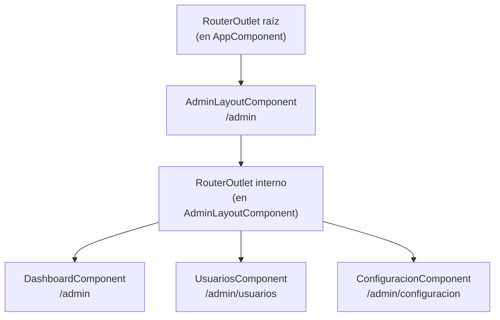

# Capítulo 10 - Parte 4: Rutas hijas (Child Routes) y outlets secundarios

> **Parte 4 de 4** · Capítulo 10 · PARTE VI - Navegación y Routing

Hasta ahora cada ruta renderiza un único componente en el `<router-outlet>` raíz. Pero muchas aplicaciones tienen secciones con su propio layout interno: un panel de administración con sidebar, una página de producto con pestañas, un wizard de pasos. Para estos casos, Angular ofrece las rutas hijas y los outlets con nombre.

## Cuándo usar rutas hijas

Las rutas hijas son apropiadas cuando un conjunto de vistas comparte una estructura visual común -un sidebar, una barra de herramientas contextual, un header de sección- y cuando cada sub-vista tiene su propia URL navegable. Sin rutas hijas tendríamos que duplicar ese layout en cada componente hijo, o resolver el problema con lógica condicional en el template. Con rutas hijas, Angular lo maneja automáticamente: activa el componente padre (que contiene el layout) y dentro de él renderiza el componente hijo correspondiente a la URL.

Un panel de administración es el caso de uso más ilustrativo. La URL `/admin` muestra el panel completo con sidebar; `/admin/usuarios` muestra la sección de usuarios dentro de ese mismo panel; `/admin/configuracion` muestra configuración, también dentro del panel. El sidebar es siempre el mismo, solo el contenido central cambia.

## Definiendo rutas hijas con children

La propiedad `children` en un objeto de ruta recibe un array de rutas que son relativas al path del padre:

```typescript
// app/app.routes.ts
import { Routes } from '@angular/router';
import { AdminLayoutComponent } from './admin/admin-layout.component';
import { DashboardComponent } from './admin/dashboard.component';
import { UsuariosComponent } from './admin/usuarios.component';
import { ConfiguracionComponent } from './admin/configuracion.component';

export const rutas: Routes = [
  {
    path: 'admin',
    component: AdminLayoutComponent, // contiene el layout con sidebar
    children: [
      {
        path: '',           // /admin → muestra el dashboard
        component: DashboardComponent
      },
      {
        path: 'usuarios',   // /admin/usuarios
        component: UsuariosComponent
      },
      {
        path: 'configuracion', // /admin/configuracion
        component: ConfiguracionComponent
      }
    ]
  }
];
```

Cuando el router activa `/admin/usuarios`, instancia `AdminLayoutComponent` en el outlet raíz y dentro de él busca un segundo `<router-outlet>` donde montará `UsuariosComponent`. Si el usuario navega a `/admin/configuracion`, solo reemplaza el componente hijo; `AdminLayoutComponent` permanece intacto.

## El RouterOutlet anidado

El componente padre que tiene rutas hijas necesita su propio `<router-outlet>`. Este outlet interno es donde Angular renderizará los componentes hijos:

```typescript
// admin/admin-layout.component.ts
import { Component } from '@angular/core';
import { RouterOutlet, RouterLink, RouterLinkActive } from '@angular/router';

@Component({
  selector: 'app-admin-layout',
  standalone: true,
  imports: [RouterOutlet, RouterLink, RouterLinkActive],
  template: `
    <div class="admin-contenedor">
      <aside class="sidebar">
        <nav>
          <!-- Los paths son relativos al padre /admin -->
          <a routerLink="/admin" routerLinkActive="activo"
             [routerLinkActiveOptions]="{ exact: true }">
            Dashboard
          </a>
          <a routerLink="/admin/usuarios" routerLinkActive="activo">
            Usuarios
          </a>
          <a routerLink="/admin/configuracion" routerLinkActive="activo">
            Configuración
          </a>
        </nav>
      </aside>

      <main class="contenido-principal">
        <!-- Aquí se montan los componentes hijos -->
        <router-outlet />
      </main>
    </div>
  `
})
export class AdminLayoutComponent {}
```

El sidebar vive en `AdminLayoutComponent` y se mantiene mientras el usuario navega dentro de la sección `/admin`. Solo el `<router-outlet>` interno cambia de contenido. Esto es más limpio que gestionar visibilidad con `@if` en cada componente hijo.

## Outlets con nombre

Angular permite múltiples outlets en la misma vista usando atributos `name`. Un outlet con nombre se activa con la propiedad `outlet` en la definición de la ruta o con `outlets` en la navegación programática:

```typescript
// Definición de ruta con outlet nombrado
{
  path: 'ayuda',
  component: PanelAyudaComponent,
  outlet: 'lateral'  // solo se activa en el outlet llamado 'lateral'
}
```

```html
<!-- En el template: dos outlets conviviendo -->
<router-outlet />                    <!-- outlet primario -->
<router-outlet name="lateral" />     <!-- outlet secundario -->
```

```typescript
// Navegación hacia un outlet nombrado
this.router.navigate([
  { outlets: { primary: ['dashboard'], lateral: ['ayuda'] } }
]);
```

Los outlets con nombre son una característica potente pero que debe usarse con moderación. Son ideales para paneles deslizantes, drawers contextuales o vistas partidas donde dos secciones independientes tienen su propia historia de navegación. Para la mayoría de los casos, las rutas hijas simples con un único outlet anidado son suficientes y más simples de mantener.

## Ejemplo completo: panel de administración

Veamos el conjunto completo con componentes hijos funcionales:

```typescript
// admin/dashboard.component.ts
import { Component } from '@angular/core';

@Component({
  selector: 'app-dashboard',
  standalone: true,
  template: `
    <h2>Dashboard</h2>
    <p>Resumen general del sistema</p>
  `
})
export class DashboardComponent {}
```

```typescript
// admin/usuarios.component.ts
import { Component } from '@angular/core';

@Component({
  selector: 'app-usuarios',
  standalone: true,
  template: `
    <h2>Gestión de Usuarios</h2>
    <p>Lista de usuarios del sistema</p>
  `
})
export class UsuariosComponent {}
```

```typescript
// main.ts - bootstrap con las rutas que incluyen hijas
import { bootstrapApplication } from '@angular/platform-browser';
import { provideRouter } from '@angular/router';
import { AppComponent } from './app/app.component';
import { rutas } from './app/app.routes';

bootstrapApplication(AppComponent, {
  providers: [provideRouter(rutas)]
});
```

La navegación dentro del panel de administración actualiza la URL correctamente (`/admin/usuarios`, `/admin/configuracion`) lo que significa que el usuario puede usar el botón Atrás del navegador, compartir la URL de una sección específica y que funciona el refresco de página -tres requisitos de una buena SPA.

## Diagrama de árbol de rutas hijas



## Puntos clave

- Las rutas hijas se definen con la propiedad `children` en el objeto de ruta padre
- El componente padre necesita su propio `<router-outlet>` donde Angular montará los hijos
- El componente padre permanece activo mientras el usuario navega entre rutas hijas; solo cambia el outlet interno
- Los outlets con nombre (`outlet: 'lateral'`) permiten múltiples regiones de routing independientes en la misma vista
- Usar rutas hijas cuando varios componentes comparten un layout visual y cada uno necesita su propia URL navegable

## ¿Qué sigue?

En el Capítulo 11 llevamos el router al siguiente nivel: lazy loading para dividir el bundle, guards para proteger rutas y resolvers para precargar datos antes de mostrar la vista.
