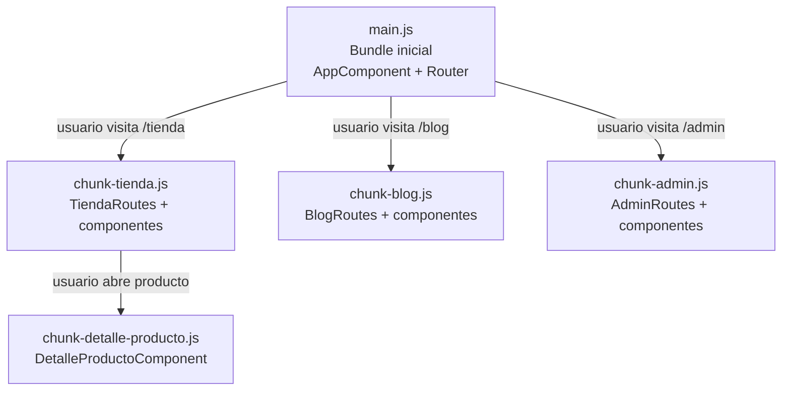

# Capítulo 11 - Parte 1: Lazy Loading: cargando módulos y componentes bajo demanda

> **Parte 1 de 4** · Capítulo 11 · PARTE VI - Navegación y Routing

Cuando Angular compila la aplicación, por defecto incluye todos los componentes, servicios y dependencias en un único bundle JavaScript que el navegador descarga al abrir la app. Para aplicaciones pequeñas esto es aceptable, pero cuando la app crece -con docenas de secciones, librerías de terceros y componentes pesados- ese bundle inicial puede volverse un cuello de botella que degrada el tiempo de carga y la experiencia del usuario.

El lazy loading resuelve esto permitiendo que Angular divida el bundle en *chunks* (fragmentos) separados que se descargan solo cuando el usuario navega a la sección correspondiente. Un usuario que nunca abre el panel de administración jamás descargará el código de ese módulo. El impacto en el rendimiento inicial es directo y medible.

## loadComponent: lazy loading para standalone

En aplicaciones Angular 17+ basadas en componentes standalone, la forma de activar lazy loading es con la propiedad `loadComponent` en la definición de la ruta. En lugar de importar el componente en la parte superior del archivo de rutas, usamos una función que devuelve un import dinámico:

```typescript
// app/app.routes.ts
import { Routes } from '@angular/router';

export const rutas: Routes = [
  {
    path: '',
    loadComponent: () =>
      // import() devuelve una Promesa que resuelve al módulo
      import('./paginas/inicio/inicio.component')
        .then(m => m.InicioComponent)
  },
  {
    path: 'catalogo',
    loadComponent: () =>
      import('./paginas/catalogo/catalogo.component')
        .then(m => m.CatalogoComponent)
  },
  {
    path: 'admin',
    loadComponent: () =>
      import('./admin/admin-layout.component')
        .then(m => m.AdminLayoutComponent)
  }
];
```

El import dinámico es una función nativa de JavaScript (ES2020) que divide el bundle en el momento de la compilación. El compilador de Angular (via esbuild en Angular 17+) detecta cada `import()` y genera un chunk separado para el componente referenciado y todas sus dependencias exclusivas.

## loadChildren: lazy loading con agrupación de rutas

`loadComponent` carga un único componente de forma diferida. Pero cuando queremos cargar perezosamente un conjunto completo de rutas -como todas las rutas del área de administración con sus hijas- usamos `loadChildren`. Esta propiedad recibe una función que devuelve el array de rutas de la sección:

```typescript
// app/app.routes.ts
import { Routes } from '@angular/router';

export const rutas: Routes = [
  {
    path: 'admin',
    // Carga el archivo de rutas del área de administración
    // Este archivo y todos sus imports son un chunk separado
    loadChildren: () =>
      import('./admin/admin.routes')
        .then(m => m.rutasAdmin)
  },
  {
    path: 'tienda',
    loadChildren: () =>
      import('./tienda/tienda.routes')
        .then(m => m.rutasTienda)
  }
];
```

```typescript
// admin/admin.routes.ts - este archivo vive en su propio chunk
import { Routes } from '@angular/router';

export const rutasAdmin: Routes = [
  {
    path: '',
    loadComponent: () =>
      import('./admin-layout.component').then(m => m.AdminLayoutComponent),
    children: [
      {
        path: 'usuarios',
        loadComponent: () =>
          import('./usuarios/usuarios.component').then(m => m.UsuariosComponent)
      },
      {
        path: 'configuracion',
        loadComponent: () =>
          import('./configuracion/configuracion.component')
            .then(m => m.ConfiguracionComponent)
      }
    ]
  }
];
```

Esta estructura es especialmente útil cuando trabajamos en equipo: cada sección de la app tiene su propio archivo de rutas, que a su vez puede tener lazy loading interno. El bundle de producción queda dividido en fragmentos que corresponden a las secciones naturales de la aplicación.

## Impacto en el bundle y verificación en DevTools

El beneficio más inmediato del lazy loading es la reducción del bundle inicial. Angular CLI reporta el tamaño de los chunks al compilar:

```bash
ng build --configuration=production
```

La salida muestra los chunks generados. Los archivos con nombres como `chunk-ABCDEF.js` corresponden a componentes o grupos de rutas con lazy loading. El archivo `main.js` es el bundle inicial que el navegador descarga al abrir la app; todos los demás se cargan bajo demanda.

Para verificar en tiempo de ejecución, abrimos Chrome DevTools, pestaña **Network**, filtramos por `JS` y recargamos la app. Solo veremos descargar los chunks iniciales. Al navegar a `/admin`, aparecerá una nueva descarga del chunk correspondiente. La primera vez habrá un pequeño retardo mientras se descarga; las visitas posteriores usan el caché del navegador.

```typescript
// Ejemplo con 3 secciones con lazy loading total
// app/app.routes.ts

import { Routes } from '@angular/router';

export const rutas: Routes = [
  {
    path: '',
    loadComponent: () =>
      import('./inicio/inicio.component').then(m => m.InicioComponent)
  },
  {
    path: 'tienda',
    loadChildren: () =>
      import('./tienda/tienda.routes').then(m => m.rutasTienda)
  },
  {
    path: 'blog',
    loadChildren: () =>
      import('./blog/blog.routes').then(m => m.rutasBlog)
  },
  {
    path: 'admin',
    loadChildren: () =>
      import('./admin/admin.routes').then(m => m.rutasAdmin)
  },
  {
    path: '**',
    loadComponent: () =>
      import('./no-encontrado/no-encontrado.component')
        .then(m => m.NoEncontradoComponent)
  }
];
```

Con esta configuración, el bundle inicial solo contiene el código del router, el componente raíz y el componente de inicio. El código de tienda, blog y administración se carga solo cuando el usuario navega a esas secciones.

## Diagrama de chunks generados



## Puntos clave

- `loadComponent` carga un único componente standalone de forma diferida usando import dinámico
- `loadChildren` carga un archivo de rutas completo y todo su árbol de componentes como un chunk separado
- Angular CLI divide automáticamente el bundle en chunks cuando detecta `import()` en las rutas
- El bundle inicial puede reducirse drásticamente con lazy loading: solo se descarga el código de la sección activa
- Chrome DevTools Network tab es la herramienta inmediata para verificar qué chunks se descargan y cuándo

## ¿Qué sigue?

En la Parte 2 protegemos el acceso a estas rutas con guards funcionales: lógica que Angular ejecuta antes de activar una ruta para decidir si el usuario tiene permiso de acceder a ella.
