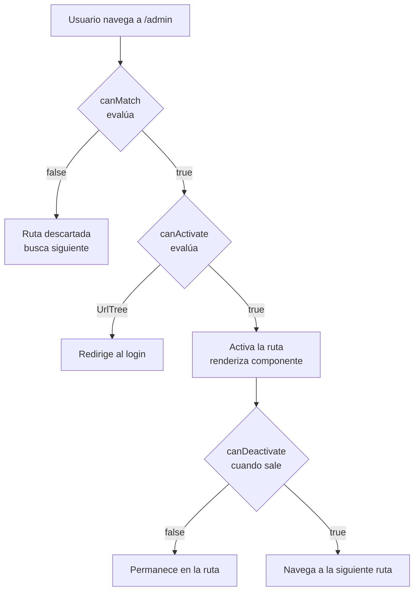

# Capítulo 11 - Parte 2: Guards funcionales: canActivate, canDeactivate, canMatch

> **Parte 2 de 4** · Capítulo 11 · PARTE VI - Navegación y Routing

Los guards son funciones que Angular ejecuta antes de activar, desactivar o cargar una ruta. Actúan como porteros: si el guard devuelve `true`, la navegación continúa; si devuelve `false` o una `UrlTree`, la navegación se cancela -potencialmente redirigiendo al usuario a otra ruta. Desde Angular 14, los guards se escriben como funciones simples de TypeScript en lugar de clases, lo que los hace más ligeros, más fáciles de testear y completamente compatibles con `inject()`.

## La forma funcional de los guards

Antes de Angular 14, los guards se implementaban como clases que implementaban interfaces como `CanActivate`. La forma moderna abandona completamente las clases: un guard es simplemente una función que recibe el estado de la ruta y devuelve un booleano, una `UrlTree`, o un Observable/Promesa de cualquiera de los dos.

Los tipos `CanActivateFn`, `CanDeactivateFn` y `CanMatchFn` son alias de TypeScript que documentan la firma esperada, pero no es obligatorio usarlos explícitamente si la función cumple el contrato:

```typescript
// auth/guards/autenticacion.guard.ts
import { inject } from '@angular/core';
import { CanActivateFn, Router } from '@angular/router';
import { AuthService } from '../services/auth.service';

// Un guard es una función que devuelve boolean | UrlTree
export const guardAutenticacion: CanActivateFn = (ruta, estado) => {
  const authService = inject(AuthService);   // inject() funciona aquí
  const router = inject(Router);

  if (authService.estaAutenticado()) {
    return true; // navegación permitida
  }

  // createUrlTree crea una UrlTree (redirige) en lugar de devolver false
  // Esto preserva la URL destino para redirigir tras el login
  return router.createUrlTree(['/login'], {
    queryParams: { returnUrl: estado.url }
  });
};
```

El guard se aplica en la definición de la ruta con la propiedad `canActivate`:

```typescript
// app/app.routes.ts
import { Routes } from '@angular/router';
import { guardAutenticacion } from './auth/guards/autenticacion.guard';

export const rutas: Routes = [
  {
    path: 'admin',
    canActivate: [guardAutenticacion], // array: pueden aplicarse múltiples guards
    loadChildren: () =>
      import('./admin/admin.routes').then(m => m.rutasAdmin)
  }
];
```

## inject() dentro de un guard

La función `inject()` puede usarse dentro de guards funcionales porque Angular los ejecuta en un contexto de inyección activo. Esto permite acceder a cualquier servicio registrado en el inyector sin necesidad de un constructor:

```typescript
// Ejemplo de guard que verifica rol de administrador
import { inject } from '@angular/core';
import { CanActivateFn, Router } from '@angular/router';
import { AuthService } from '../services/auth.service';

export const guardAdministrador: CanActivateFn = () => {
  const auth = inject(AuthService);
  const router = inject(Router);

  // Verificamos tanto autenticación como rol
  if (auth.estaAutenticado() && auth.tieneRol('admin')) {
    return true;
  }

  // Si está autenticado pero sin rol admin, lo enviamos a inicio
  if (auth.estaAutenticado()) {
    return router.createUrlTree(['/']);
  }

  // Si no está autenticado, va al login
  return router.createUrlTree(['/login']);
};
```

## CanDeactivate: confirmación al salir de un formulario

`CanDeactivateFn` se ejecuta cuando el usuario intenta *salir* de una ruta. El caso de uso más común es alertar al usuario si tiene cambios no guardados en un formulario. El tipo recibe el componente activo como primer parámetro, lo que permite consultar su estado:

```typescript
// shared/guards/cambios-sin-guardar.guard.ts
import { CanDeactivateFn } from '@angular/router';

// Interfaz que los componentes que quieren protección deben implementar
export interface TieneCambiosSinGuardar {
  tieneCambiosSinGuardar(): boolean;
}

export const guardCambiosSinGuardar: CanDeactivateFn<TieneCambiosSinGuardar> =
  (componente) => {
    if (componente.tieneCambiosSinGuardar()) {
      // confirm() es síncrono; en producción usaríamos un Dialog de Angular Material
      return confirm(
        '¿Salir sin guardar? Los cambios no guardados se perderán.'
      );
    }
    return true; // sin cambios pendientes, dejamos salir libremente
  };
```

```typescript
// editor/editor-articulo.component.ts
import { Component, signal } from '@angular/core';
import { TieneCambiosSinGuardar } from '../shared/guards/cambios-sin-guardar.guard';

@Component({
  selector: 'app-editor-articulo',
  standalone: true,
  template: `
    <textarea (input)="marcarModificado()"></textarea>
    <button (click)="guardar()">Guardar</button>
  `
})
export class EditorArticuloComponent implements TieneCambiosSinGuardar {
  private modificado = signal(false);

  marcarModificado(): void {
    this.modificado.set(true);
  }

  guardar(): void {
    // lógica de guardado...
    this.modificado.set(false);
  }

  tieneCambiosSinGuardar(): boolean {
    return this.modificado();
  }
}
```

```typescript
// Aplicando canDeactivate en la ruta
{
  path: 'editor/:id',
  component: EditorArticuloComponent,
  canDeactivate: [guardCambiosSinGuardar]
}
```

## CanMatch: controlar si una ruta aplica

`CanMatchFn` es diferente a `canActivate`: en lugar de decidir si el usuario puede *entrar* a una ruta ya coincidente, decide si la ruta *es candidata* para coincidir con la URL. Esto permite tener dos rutas con el mismo `path` pero que se activan para diferentes tipos de usuario:

```typescript
// guards/version-admin.guard.ts
import { inject } from '@angular/core';
import { CanMatchFn } from '@angular/router';
import { AuthService } from '../services/auth.service';

export const soloParaAdmins: CanMatchFn = () => {
  return inject(AuthService).tieneRol('admin');
};
```

```typescript
// Dos rutas con el mismo path, distintas vistas según el rol
export const rutas: Routes = [
  {
    path: 'dashboard',
    canMatch: [soloParaAdmins],
    loadComponent: () =>
      import('./dashboard/dashboard-admin.component')
        .then(m => m.DashboardAdminComponent)
  },
  {
    path: 'dashboard',
    // sin canMatch: aplica para todos los que lleguen aquí
    loadComponent: () =>
      import('./dashboard/dashboard-usuario.component')
        .then(m => m.DashboardUsuarioComponent)
  }
];
```

Si el primer guard devuelve `false`, Angular descarta esa ruta y evalúa la siguiente. El usuario administrador ve `DashboardAdminComponent`; el usuario regular ve `DashboardUsuarioComponent`. Ambos acceden a `/dashboard`.

## Diagrama de evaluación de guards



## Puntos clave

- Los guards modernos son funciones simples, no clases; se les llama *guards funcionales* (Angular 14+)
- `inject()` funciona dentro de guards porque Angular los ejecuta en contexto de inyección activo
- `canActivate` protege la entrada a una ruta; devolver `router.createUrlTree()` redirige limpiamente
- `canDeactivate` protege la salida de una ruta; recibe el componente activo para consultarle su estado
- `canMatch` decide si la ruta es candidata a coincidir; permite tener rutas con el mismo path para diferentes roles

## ¿Qué sigue?

En la Parte 3 añadimos resolvers: funciones que el router ejecuta antes de renderizar el componente para precargar los datos que este necesita, eliminando el estado de "vista vacía mientras carga".
