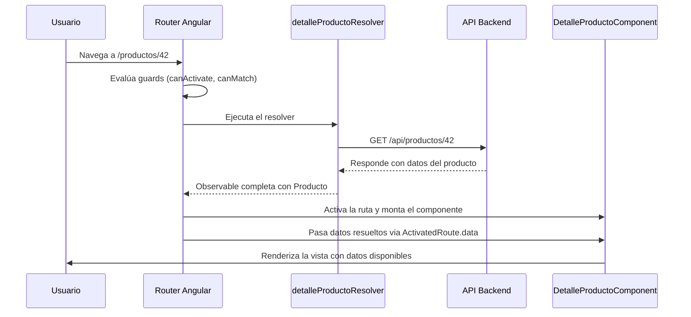

# Capítulo 11 - Parte 3: Resolvers: precargando datos antes de navegar

> **Parte 3 de 4** · Capítulo 11 · PARTE VI - Navegación y Routing

Navegar a una ruta y encontrar la pantalla vacía mientras los datos se cargan es una experiencia de usuario aceptable en muchos contextos, pero hay situaciones donde necesitamos que los datos estén listos antes de que el componente de destino siquiera se monte. Para eso existen los resolvers: funciones que el router ejecuta antes de activar una ruta, garantizando que cuando el componente se inicializa, sus datos ya están disponibles.

## ResolveFn: resolvers como funciones

Antes de Angular 14, los resolvers se implementaban como clases que implementaban la interfaz `Resolve<T>`. Desde Angular 14, el enfoque recomendado es funcional: una función que devuelve el tipo `ResolveFn<T>`. Esto los hace más simples, testables y compatibles con `inject()`.

```typescript
// rutas/resolvers/detalle-producto.resolver.ts
import { inject } from '@angular/core';
import { ResolveFn, ActivatedRouteSnapshot } from '@angular/router';
import { ProductosService } from '../../servicios/productos.service';
import { Producto } from '../../modelos/producto.model';

// ResolveFn<T> es el tipo de la función resolver
export const detalleProductoResolver: ResolveFn<Producto> = (
  ruta: ActivatedRouteSnapshot
) => {
  const productosService = inject(ProductosService);
  const idProducto = Number(ruta.paramMap.get('id'));

  // Puede retornar un Observable, Promise, o valor sincrónico
  // El router espera a que el Observable complete antes de activar la ruta
  return productosService.obtenerPorId(idProducto);
};
```

La simplicidad del resolver funcional es notable: es solo una función con la firma correcta. `inject()` funciona dentro de ella porque el router la ejecuta en un contexto de inyección. El tipo de retorno puede ser un `Observable<T>`, una `Promise<T>`, o directamente un valor `T` si los datos están disponibles de forma sincrónica.

## Registrando el resolver en la configuración de rutas

El resolver se asocia a una ruta mediante la propiedad `resolve` del objeto de configuración. La clave que usamos en `resolve` es el nombre con el que accederemos al dato en el componente.

```typescript
// app/app.routes.ts
import { Routes } from '@angular/router';
import { detalleProductoResolver } from './rutas/resolvers/detalle-producto.resolver';

export const rutasApp: Routes = [
  {
    path: 'productos/:id',
    // Lazy loading del componente - el resolver se ejecuta antes de cargarlo
    loadComponent: () =>
      import('./features/productos/detalle-producto.component')
        .then(m => m.DetalleProductoComponent),
    resolve: {
      // 'producto' es la clave con la que accederemos al dato
      producto: detalleProductoResolver,
    },
  },
  {
    path: 'usuarios/:id/pedidos',
    loadComponent: () =>
      import('./features/usuarios/pedidos-usuario.component')
        .then(m => m.PedidosUsuarioComponent),
    resolve: {
      // Podemos registrar múltiples resolvers en la misma ruta
      usuario: usuarioResolver,
      pedidos: pedidosUsuarioResolver,
    },
  },
];
```

Cuando el router procesa la ruta `productos/:id`, ejecuta todos los resolvers registrados en paralelo y espera a que todos completen antes de activar el componente. Si algún resolver lanza un error o retorna un Observable que emite un error, el router cancela la navegación (a menos que configuremos un manejo de errores explícito).

## Accediendo a los datos resueltos en el componente

Hay dos formas de acceder a los datos que un resolver preparó: mediante `ActivatedRoute.data` o con `input()` cuando usamos `withComponentInputBinding()`.

La primera forma usa `ActivatedRoute`:

```typescript
// features/productos/detalle-producto.component.ts
import { Component, inject, OnInit, signal } from '@angular/core';
import { ActivatedRoute } from '@angular/router';
import { Producto } from '../../modelos/producto.model';
import { CurrencyPipe } from '@angular/common';

@Component({
  selector: 'app-detalle-producto',
  standalone: true,
  imports: [CurrencyPipe],
  template: `
    @if (producto(); as prod) {
      <article>
        <h1>{{ prod.nombre }}</h1>
        <p class="precio">{{ prod.precio | currency:'COP':'symbol':'1.0-0' }}</p>
        <p class="descripcion">{{ prod.descripcion }}</p>
      </article>
    }
  `,
})
export class DetalleProductoComponent implements OnInit {
  private rutaActiva = inject(ActivatedRoute);
  producto = signal<Producto | null>(null);

  ngOnInit(): void {
    // data es un Observable que emite los datos resueltos
    this.rutaActiva.data.subscribe(datos => {
      // La clave 'producto' coincide con la clave en el objeto resolve
      this.producto.set(datos['producto'] as Producto);
    });
  }
}
```

La segunda forma, más limpia, usa `withComponentInputBinding()` en la configuración del router (→ Ver Capítulo 2, Parte 4). Con esta opción activada, los datos resueltos se pasan automáticamente como `@Input` o `input()` al componente:

```typescript
// features/productos/detalle-producto.component.ts - con input binding
import { Component, input } from '@angular/core';
import { Producto } from '../../modelos/producto.model';
import { CurrencyPipe } from '@angular/common';

@Component({
  selector: 'app-detalle-producto',
  standalone: true,
  imports: [CurrencyPipe],
  template: `
    <article>
      <h1>{{ producto().nombre }}</h1>
      <p>{{ producto().precio | currency:'COP' }}</p>
    </article>
  `,
})
export class DetalleProductoComponent {
  // El nombre del input debe coincidir con la clave en 'resolve'
  // Angular lo inyecta automáticamente gracias a withComponentInputBinding()
  producto = input.required<Producto>();
}
```

Esta segunda forma es significativamente más limpia: no hay suscripción manual, no hay `ActivatedRoute` en el componente, y el tipado es directo. La condición es que `withComponentInputBinding()` esté activo en la configuración del router.

## El flujo de una navegación con resolver

Entender la secuencia exacta ayuda a depurar comportamientos inesperados, especialmente cuando el resolver tarda o falla.



Mientras el resolver está en ejecución, la aplicación permanece en la ruta anterior. El router no muestra nada de la nueva ruta hasta que todos los resolvers hayan completado. Este punto es crucial para entender cuándo un resolver es la elección correcta y cuándo no.

## Cuándo NO usar resolvers

Los resolvers son la herramienta adecuada en escenarios específicos, pero no son la solución universal para la carga de datos. Hay situaciones donde la experiencia de usuario mejora notablemente si NO usamos un resolver.

**Cuando los datos tardan más de 200-300ms:** El usuario ve que la navegación "se colgó" porque sigue viendo la página anterior mientras espera. La alternativa es navegar inmediatamente y mostrar un skeleton loader mientras se cargan los datos en el componente.

**Cuando parte de los datos está en caché:** Si el servicio tiene los datos en caché y puede responder inmediatamente, el resolver es invisible para el usuario. Pero si a veces hay datos en caché y a veces no, la experiencia es inconsistente.

**Cuando hay actualizaciones en tiempo real:** Si los datos cambian mientras el usuario está en la página, un resolver que cargó los datos en la navegación quedará desactualizado. En estos casos, es mejor suscribirse a un Observable que se mantenga activo dentro del componente.

La regla práctica: usemos resolvers cuando la página es completamente inutilizable sin los datos (un formulario de edición que necesita el objeto original, por ejemplo) y prefiramos skeleton loaders cuando la página puede mostrar su estructura aunque los datos lleguen un momento después.

## Manejo de errores en resolvers

Si el backend devuelve un 404 o la red falla, el resolver recibe un error. Por defecto, el router cancela la navegación silenciosamente. Podemos capturar y manejar estos errores dentro del resolver usando operadores de RxJS:

```typescript
// rutas/resolvers/detalle-producto.resolver.ts - con manejo de error
import { inject } from '@angular/core';
import { ResolveFn, ActivatedRouteSnapshot, Router } from '@angular/router';
import { catchError, EMPTY } from 'rxjs';
import { ProductosService } from '../../servicios/productos.service';
import { Producto } from '../../modelos/producto.model';

export const detalleProductoResolver: ResolveFn<Producto> = (
  ruta: ActivatedRouteSnapshot
) => {
  const productosService = inject(ProductosService);
  const router = inject(Router);
  const idProducto = Number(ruta.paramMap.get('id'));

  return productosService.obtenerPorId(idProducto).pipe(
    catchError(() => {
      // Si el producto no existe, redirigimos a la lista
      router.navigate(['/productos']);
      // EMPTY completa el Observable sin emitir valores,
      // lo que cancela la navegación a la ruta original
      return EMPTY;
    })
  );
};
```

Con este patrón, un producto inexistente no produce un error visible: el usuario es redirigido a la lista de forma transparente.

## Puntos clave

- `ResolveFn<T>` es el tipo funcional moderno para resolvers: una función que puede retornar `Observable<T>`, `Promise<T>` o `T`
- El router ejecuta todos los resolvers de una ruta en paralelo antes de activar el componente
- Con `withComponentInputBinding()`, los datos resueltos se inyectan directamente como `input()` en el componente, eliminando la necesidad de `ActivatedRoute`
- Los resolvers son ideales cuando la página es inutilizable sin datos, pero skeleton loaders dan mejor UX cuando la carga puede tomar tiempo
- Un resolver que retorna `EMPTY` cancela la navegación, permitiendo redirigir al usuario cuando hay errores

## ¿Qué sigue?

En la Parte 4 exploramos las estrategias de preloading para mejorar aún más la experiencia de navegación: cómo Angular puede descargar módulos lazy en segundo plano antes de que el usuario los necesite.
