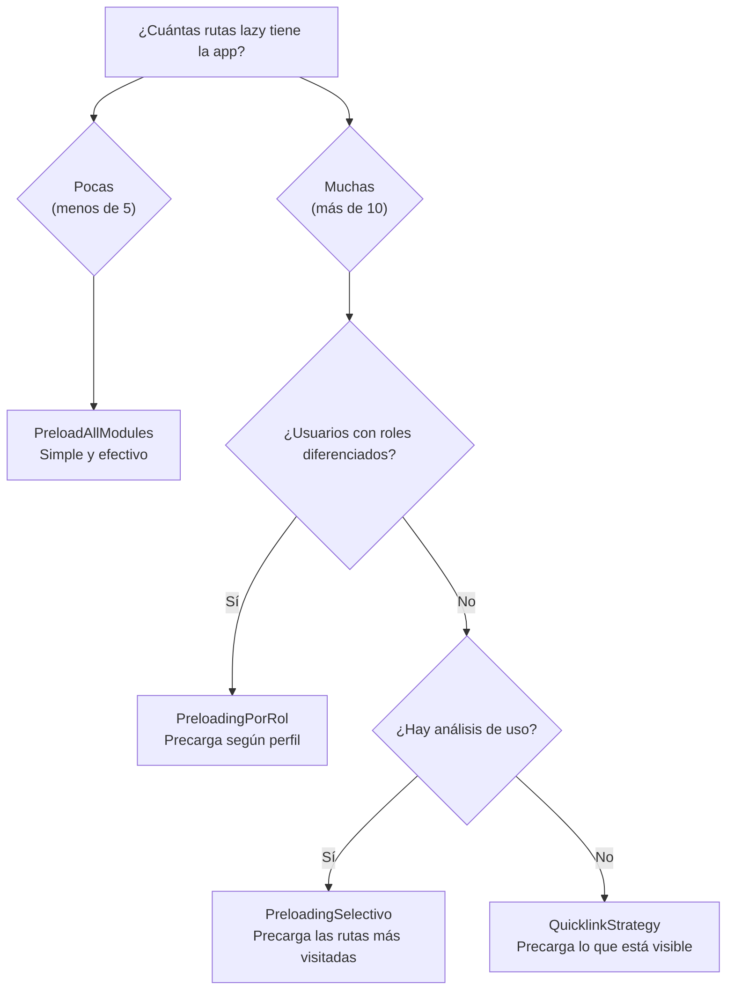

# Capítulo 11 - Parte 4: Estrategias de preloading: PreloadAllModules y personalizadas

> **Parte 4 de 4** · Capítulo 11 · PARTE VI - Navegación y Routing

El lazy loading resuelve el problema del bundle inicial grande: el usuario descarga solo el código que necesita para la ruta actual. Pero crea un nuevo problema: si el usuario navega a una ruta lazy que nunca ha visitado, debe esperar mientras el navegador descarga e interpreta ese chunk. El preloading es la estrategia intermedia: descargamos los chunks en segundo plano, después de que la aplicación inicial ya cargó, para que cuando el usuario navegue, el código ya esté listo.

## NoPreloading: el comportamiento por defecto

Sin configuración adicional, el router usa `NoPreloading`: los chunks lazy se descargan únicamente cuando el usuario navega a la ruta correspondiente. Esto minimiza el ancho de banda usado, pero puede producir retrasos perceptibles en la navegación si los chunks son grandes o la conexión es lenta.

```typescript
// app/app.config.ts - sin preloading (comportamiento por defecto)
import { ApplicationConfig } from '@angular/core';
import { provideRouter, NoPreloading, withPreloading } from '@angular/router';
import { rutasApp } from './app.routes';

export const configuracionApp: ApplicationConfig = {
  providers: [
    provideRouter(
      rutasApp,
      withPreloading(NoPreloading) // Equivalente a no especificar nada
    ),
  ],
};
```

`NoPreloading` es apropiado cuando el ancho de banda es crítico (aplicaciones móviles con datos limitados) o cuando los usuarios típicamente solo visitan una o dos rutas por sesión.

## PreloadAllModules: precargar todo en segundo plano

`PreloadAllModules` es la estrategia más simple: una vez que la aplicación inicial termina de cargar, el router descarga todos los chunks lazy en segundo plano, en orden de aparición en la configuración de rutas. Cuando el usuario navega, el código ya está en caché del navegador y la transición es instantánea.

```typescript
// app/app.config.ts - preloading de todos los módulos
import { ApplicationConfig } from '@angular/core';
import {
  provideRouter,
  PreloadAllModules,
  withPreloading
} from '@angular/router';
import { rutasApp } from './app.routes';

export const configuracionApp: ApplicationConfig = {
  providers: [
    provideRouter(
      rutasApp,
      withPreloading(PreloadAllModules)
    ),
  ],
};
```

El router espera a que el navegador esté inactivo (usando `requestIdleCallback` internamente) antes de iniciar las descargas de preloading, para no competir con el renderizado inicial. Las descargas ocurren de forma secuencial para no saturar la red, aunque esto puede configurarse.

La contrapartida de `PreloadAllModules` es que descarga código que el usuario puede que nunca visite. En aplicaciones con muchas rutas y usuarios que típicamente usan solo una sección, esto puede desperdiciar ancho de banda. Para esos casos, necesitamos estrategias más selectivas.

## Estrategia personalizada: preloading selectivo

Podemos crear una estrategia de preloading personalizada implementando la interfaz `PreloadingStrategy`. Esta interfaz tiene un único método `preload()` que el router llama para cada ruta lazy, y que debe retornar un `Observable`: si emite cualquier valor, el router precarga esa ruta; si retorna `EMPTY`, no la precarga.

```typescript
// rutas/estrategias/preloading-selectivo.strategy.ts
import { Injectable } from '@angular/core';
import { PreloadingStrategy, Route } from '@angular/router';
import { Observable, EMPTY, of } from 'rxjs';

@Injectable({ providedIn: 'root' })
export class PreloadingSelectivoStrategy implements PreloadingStrategy {
  preload(ruta: Route, cargar: () => Observable<unknown>): Observable<unknown> {
    // Solo precargamos rutas que tienen data.preload = true
    if (ruta.data?.['preload'] === true) {
      // Llamar a cargar() inicia la descarga del chunk
      return cargar();
    }
    // EMPTY indica al router que no precargue esta ruta
    return EMPTY;
  }
}
```

El método `preload()` recibe dos argumentos: la configuración de la ruta (`Route`) y una función `cargar()` que, cuando se llama y se suscribe, inicia la descarga del chunk. Si retornamos el Observable de `cargar()`, el router descarga; si retornamos `EMPTY`, no lo hace.

La configuración de las rutas ahora usa el campo `data` para marcar cuáles deben precargarse:

```typescript
// app/app.routes.ts - rutas con datos de preloading
import { Routes } from '@angular/router';

export const rutasApp: Routes = [
  {
    path: 'catalogo',
    loadComponent: () =>
      import('./features/catalogo/catalogo.component')
        .then(m => m.CatalogoComponent),
    data: { preload: true }, // ← Esta ruta se precargará
  },
  {
    path: 'carrito',
    loadComponent: () =>
      import('./features/carrito/carrito.component')
        .then(m => m.CarritoComponent),
    data: { preload: true }, // ← Alta probabilidad de visita
  },
  {
    path: 'administracion',
    loadChildren: () =>
      import('./features/admin/admin.routes')
        .then(m => m.rutasAdmin),
    // Sin data.preload - solo administradores, no precargamos
  },
  {
    path: 'configuracion-avanzada',
    loadComponent: () =>
      import('./features/config/configuracion-avanzada.component')
        .then(m => m.ConfiguracionAvanzadaComponent),
    data: { preload: false }, // Explícitamente excluida
  },
];
```

Para usar la estrategia personalizada, la registramos en la configuración del router:

```typescript
// app/app.config.ts - con estrategia de preloading personalizada
import { ApplicationConfig } from '@angular/core';
import { provideRouter, withPreloading } from '@angular/router';
import { PreloadingSelectivoStrategy } from './rutas/estrategias/preloading-selectivo.strategy';
import { rutasApp } from './app.routes';

export const configuracionApp: ApplicationConfig = {
  providers: [
    provideRouter(
      rutasApp,
      withPreloading(PreloadingSelectivoStrategy)
    ),
  ],
};
```

## Estrategia con lógica de negocio: preloading basado en perfiles

El verdadero poder de las estrategias personalizadas se manifiesta cuando incorporamos lógica de negocio. Podemos precargamos rutas según el rol del usuario, el tipo de dispositivo, o el historial de navegación.

```typescript
// rutas/estrategias/preloading-por-rol.strategy.ts
import { Injectable, inject } from '@angular/core';
import { PreloadingStrategy, Route } from '@angular/router';
import { Observable, EMPTY, of } from 'rxjs';
import { AutenticacionService } from '../../servicios/autenticacion.service';

type RolUsuario = 'admin' | 'editor' | 'lector';

@Injectable({ providedIn: 'root' })
export class PreloadingPorRolStrategy implements PreloadingStrategy {
  private autenticacion = inject(AutenticacionService);

  preload(ruta: Route, cargar: () => Observable<unknown>): Observable<unknown> {
    const rolesPermitidos = ruta.data?.['preloadParaRoles'] as RolUsuario[] | undefined;

    // Si la ruta no especifica roles de preloading, no precargar
    if (!rolesPermitidos) return EMPTY;

    const rolActual = this.autenticacion.rolUsuario();

    // Precargar solo si el usuario tiene uno de los roles especificados
    if (rolActual && rolesPermitidos.includes(rolActual)) {
      return cargar();
    }

    return EMPTY;
  }
}
```

```typescript
// Uso en las rutas:
{
  path: 'panel-admin',
  loadChildren: () => import('./features/admin/admin.routes').then(m => m.rutasAdmin),
  data: { preloadParaRoles: ['admin'] }, // Solo se precarga para administradores
},
{
  path: 'editor-contenido',
  loadComponent: () => import('./features/editor/editor.component').then(m => m.EditorComponent),
  data: { preloadParaRoles: ['admin', 'editor'] }, // Para admins y editores
},
```

## QuicklinkStrategy: preloading basado en el viewport

Existe una estrategia de terceros ampliamente usada en la comunidad Angular: `QuicklinkStrategy`, inspirada en la librería Quicklink de Google. En lugar de precargar rutas según metadatos estáticos, observa qué links `routerLink` están visibles en el viewport actual y precarga esas rutas.

La lógica es intuitiva: si el usuario puede ver un link, es probable que lo haga clic. Precargamos proactivamente lo que está a la vista.

```typescript
// Instalación:
// npm install ngx-quicklink

// app/app.config.ts - con QuicklinkStrategy
import { ApplicationConfig } from '@angular/core';
import { provideRouter, withPreloading } from '@angular/router';
import { QuicklinkStrategy, quicklinkProviders } from 'ngx-quicklink';
import { rutasApp } from './app.routes';

export const configuracionApp: ApplicationConfig = {
  providers: [
    quicklinkProviders, // Providers necesarios para la estrategia
    provideRouter(
      rutasApp,
      withPreloading(QuicklinkStrategy)
    ),
  ],
};
```

`QuicklinkStrategy` usa `IntersectionObserver` bajo el capó para detectar qué links están en el viewport, por lo que no precarga rutas que el usuario nunca verá. Es especialmente efectiva en aplicaciones con menús de navegación laterales o superiores donde todos los items son visibles desde el inicio.

## Comparando las estrategias

Cada estrategia tiene su caso de uso ideal. El diagrama siguiente muestra cuándo conviene cada una.



La elección correcta depende de conocer a los usuarios: si tienen roles bien diferenciados, la estrategia por rol evita descargar código innecesario. Si el acceso es homogéneo pero tenemos datos de analytics sobre qué rutas se visitan más, el preloading selectivo con `data.preload` es la opción más directa y sin dependencias externas.

## Combinando preloading con @defer

Vale la pena mencionar que el preloading de rutas y `@defer` (→ Ver Capítulo 4, Parte 4) son estrategias complementarias. El preloading opera a nivel de rutas: descarga el chunk de una ruta completa. `@defer` opera dentro de una ruta: difiere partes de la UI de una página ya cargada. Podemos y debemos usar ambas simultáneamente para optimizar tanto la navegación entre páginas como el renderizado dentro de cada página.

## Puntos clave

- `NoPreloading` (por defecto) descarga chunks solo cuando el usuario navega; `PreloadAllModules` descarga todo en segundo plano después del arranque
- Una estrategia personalizada implementa `PreloadingStrategy` con el método `preload()`: retornar `cargar()` descarga el chunk, retornar `EMPTY` lo omite
- El campo `data` de la configuración de rutas es el mecanismo estándar para pasar metadatos a las estrategias de preloading
- `QuicklinkStrategy` es una alternativa basada en viewport que precarga los links visibles en pantalla, sin necesidad de metadatos manuales
- Preloading de rutas y `@defer` son complementarios: uno optimiza la navegación entre páginas, el otro optimiza el renderizado dentro de una página

## ¿Qué sigue?

En el Capítulo 12 entramos al mundo de los formularios: la diferencia entre formularios reactivos y por template, cuándo elegir cada enfoque, y cómo construir formularios complejos con validación sincrónica y asincrónica.
