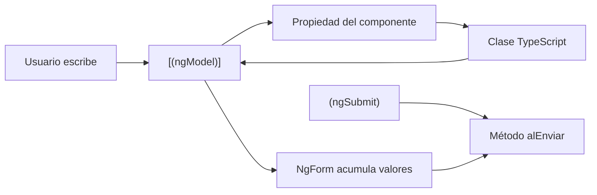

# Capítulo 12 - Parte 1: Fundamentos: ngModel, ngForm y FormsModule

> **Parte 1 de 4** · Capítulo 12 · PARTE VII - Formularios

Los formularios template-driven de Angular toman su nombre de donde vive la mayor parte de la lógica: en el template HTML. Angular lee las directivas y atributos del template en tiempo de ejecución para construir automáticamente una representación del formulario en memoria. Esto los hace ideales para formularios de complejidad baja a media, donde la legibilidad del template es más valiosa que el control programático fino.

## Preparando el terreno: FormsModule

Antes de poder usar cualquier directiva de formularios template-driven, necesitamos importar `FormsModule` en nuestro componente standalone. Este módulo contiene `NgModel`, `NgForm` y todas las directivas relacionadas con este enfoque.

```typescript
import { Component } from '@angular/core';
import { FormsModule } from '@angular/forms';

@Component({
  selector: 'app-login',
  standalone: true,
  imports: [FormsModule], // Sin esto, ngModel no existirá en el template
  templateUrl: './login.component.html'
})
export class LoginComponent {
  credenciales = {
    correo: '',
    contrasena: ''
  };
}
```

`FormsModule` registra las directivas globalmente dentro del contexto del componente. Sin él, Angular no reconocerá `[(ngModel)]` y lanzará errores en tiempo de compilación con el compilador estricto activado.

## La directiva ngModel y el atributo name obligatorio

`[(ngModel)]` implementa el two-way data binding entre un campo de formulario HTML y una propiedad de la clase. La sintaxis de "caja de bananas" `[()]` combina property binding (entrada) y event binding (salida) en una sola expresión.

Existe una regla crítica que muchos desarrolladores descubren de la peor manera: **todo campo con `[(ngModel)]` dentro de un `<form>` debe tener el atributo `name`**. Angular usa este atributo para registrar el control dentro del objeto `NgForm` padre. Sin `name`, Angular lanza un error en tiempo de ejecución.

```html
<!-- login.component.html -->
<form>
  <!-- name="correo" es obligatorio cuando se usa ngModel dentro de un form -->
  <input
    type="email"
    name="correo"
    [(ngModel)]="credenciales.correo"
    placeholder="tu@correo.com"
  />

  <input
    type="password"
    name="contrasena"
    [(ngModel)]="credenciales.contrasena"
    placeholder="Contraseña"
  />

  <button type="submit">Ingresar</button>
</form>
```

El binding `[(ngModel)]="credenciales.correo"` mantiene el campo sincronizado con la propiedad en ambas direcciones: si el usuario escribe, la propiedad se actualiza; si la propiedad cambia desde TypeScript, el campo se actualiza visualmente.

## NgForm: el objeto del formulario completo

Cuando Angular encuentra un elemento `<form>` en un template donde `FormsModule` está importado, automáticamente instancia la directiva `NgForm` sobre ese elemento. Esta directiva actúa como contenedor de todos los controles registrados dentro del formulario.

Podemos obtener una referencia a este objeto usando una variable de referencia de template con la asignación `#formulario="ngForm"`. Esto nos da acceso programático al estado del formulario completo:

```html
<form #formulario="ngForm" (ngSubmit)="alEnviar(formulario)">
  <input
    type="email"
    name="correo"
    [(ngModel)]="credenciales.correo"
  />
  <input
    type="password"
    name="contrasena"
    [(ngModel)]="credenciales.contrasena"
  />

  <!-- formulario.valid refleja si todos los campos son válidos -->
  <button type="submit" [disabled]="!formulario.valid">
    Ingresar
  </button>
</form>
```

La propiedad `formulario.valid` es `true` solo cuando todos los controles del formulario pasan sus validaciones. La propiedad `formulario.value` es un objeto con todos los valores actuales, con la estructura definida por los atributos `name` de cada campo.

## El objeto de valor y el submit

El manejo del envío se hace a través del evento `(ngSubmit)` en lugar del `(submit)` nativo. Esta distinción es importante: `(ngSubmit)` previene automáticamente el comportamiento por defecto del formulario HTML (recargar la página) y además garantiza que Angular haya procesado todos los valores antes de que el manejador sea llamado.

```typescript
import { Component } from '@angular/core';
import { FormsModule, NgForm } from '@angular/forms';

@Component({
  selector: 'app-login',
  standalone: true,
  imports: [FormsModule],
  template: `
    <form #formulario="ngForm" (ngSubmit)="alEnviar(formulario)">
      <div>
        <label for="correo">Correo electrónico</label>
        <input
          id="correo"
          type="email"
          name="correo"
          [(ngModel)]="credenciales.correo"
          required
          email
        />
      </div>
      <div>
        <label for="contrasena">Contraseña</label>
        <input
          id="contrasena"
          type="password"
          name="contrasena"
          [(ngModel)]="credenciales.contrasena"
          required
          minlength="8"
        />
      </div>
      <button type="submit" [disabled]="!formulario.valid">
        Ingresar
      </button>
    </form>
  `
})
export class LoginComponent {
  credenciales = {
    correo: '',
    contrasena: ''
  };

  alEnviar(formulario: NgForm): void {
    if (formulario.valid) {
      // formulario.value contiene { correo: '...', contrasena: '...' }
      console.log('Datos enviados:', formulario.value);
      // También podemos usar this.credenciales directamente
      console.log('Por two-way binding:', this.credenciales);
    }
  }
}
```

Hay dos formas equivalentes de acceder a los datos en el submit: a través de `formulario.value` (el objeto construido por Angular desde los `name` de los campos) o directamente desde la propiedad de la clase `this.credenciales` (actualizada por el two-way binding). Ambas contienen los mismos valores; cuál usar depende de la preferencia del equipo.

## Flujo de datos en formularios template-driven



El diagrama muestra el flujo bidireccional: los cambios del usuario viajan hacia la propiedad, y cualquier cambio en la propiedad (por ejemplo, un reset) viaja de vuelta al campo. `NgForm` observa todos los controles registrados y `(ngSubmit)` dispara el procesamiento final.

## Accediendo al estado del formulario en el template

Más allá de `valid`, `NgForm` expone otras propiedades útiles directamente en el template:

```html
<p>¿Formulario válido? {{ formulario.valid }}</p>
<p>¿Fue modificado? {{ formulario.dirty }}</p>
<p>¿Fue tocado? {{ formulario.touched }}</p>
<p>Valores actuales: {{ formulario.value | json }}</p>
```

La propiedad `dirty` es `true` cuando el usuario ha modificado al menos un campo. La propiedad `touched` es `true` cuando al menos un campo perdió el foco. Estas propiedades son fundamentales para mostrar mensajes de error de manera apropiada, algo que exploraremos en profundidad en las siguientes partes.

## Puntos clave

- `FormsModule` debe importarse en el array `imports` del componente standalone para activar las directivas template-driven
- Todo `<input>` con `[(ngModel)]` dentro de un `<form>` necesita el atributo `name` obligatoriamente
- `#formulario="ngForm"` crea una referencia al objeto `NgForm` que expone `valid`, `value`, `dirty` y `touched`
- Usar `(ngSubmit)` en lugar de `(submit)` para manejar el envío del formulario de forma segura con Angular
- Los valores del formulario están disponibles tanto en `formulario.value` como en las propiedades de la clase vinculadas con two-way binding

## ¿Qué sigue?

En la Parte 2 agregamos validaciones reales al formulario: atributos HTML nativos como `required` y `email`, directivas de Angular como `minlength` y `pattern`, y las clases CSS de estado que Angular aplica automáticamente para reflejar la validez de cada campo.
