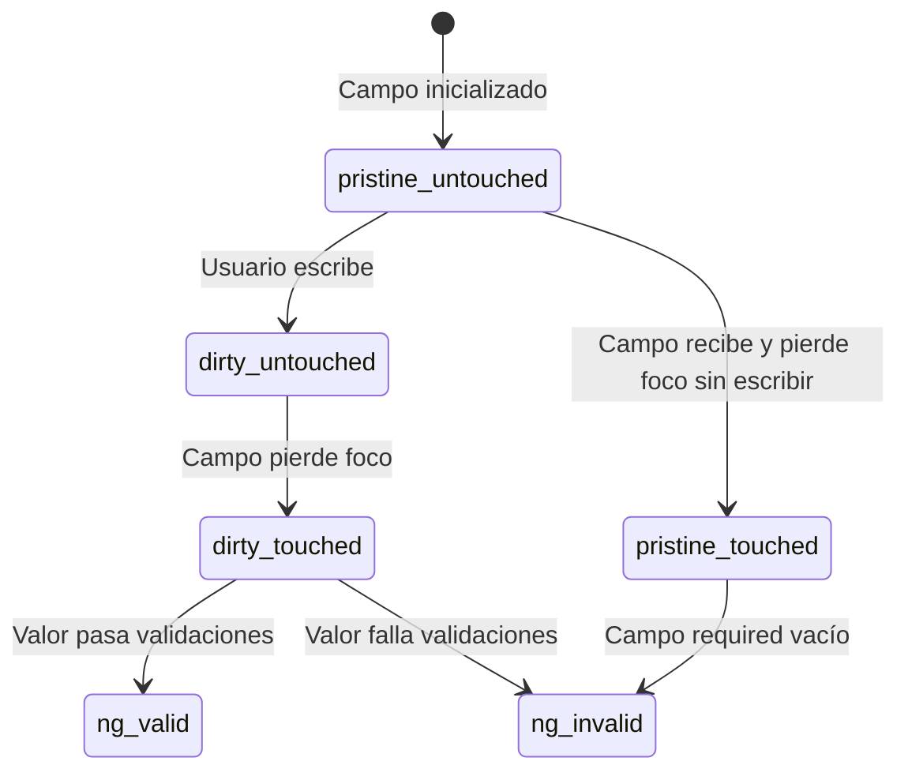

# Capítulo 12 - Parte 2: Validación con atributos HTML y directivas de Angular

> **Parte 2 de 4** · Capítulo 12 · PARTE VII - Formularios

Angular no reinventa la validación de formularios desde cero: aprovecha los atributos HTML estándar que los desarrolladores ya conocen y los integra en su sistema de validación reactivo. La clave está en que `FormsModule` intercepta estos atributos y construye validadores internos a partir de ellos, conectándolos al estado del campo representado por `NgModel`.

## Atributos de validación y su funcionamiento interno

Cuando Angular encuentra `required` en un campo con `ngModel`, no se limita a la validación nativa del navegador: registra un validador interno llamado `RequiredValidator`. Lo mismo ocurre con `minlength`, `maxlength`, `pattern` y `email`. Esto significa que la validación es consistente entre navegadores y está completamente bajo el control de Angular, independientemente de lo que el navegador nativo haga con esos atributos.

```html
<form #formulario="ngForm" (ngSubmit)="alEnviar(formulario)">

  <!-- required: campo obligatorio -->
  <!-- email: formato de correo electrónico válido -->
  <input
    type="email"
    name="correo"
    [(ngModel)]="datos.correo"
    required
    email
  />

  <!-- minlength y maxlength controlan la longitud de caracteres -->
  <input
    type="text"
    name="usuario"
    [(ngModel)]="datos.usuario"
    required
    minlength="4"
    maxlength="20"
  />

  <!-- pattern acepta una expresión regular -->
  <input
    type="text"
    name="telefono"
    [(ngModel)]="datos.telefono"
    pattern="^\+?[0-9]{7,15}$"
  />

</form>
```

Cada uno de estos atributos genera una entrada específica en el objeto `errors` del control cuando la validación falla. Por ejemplo, si `minlength="4"` no se cumple, `control.errors` contendrá `{ minlength: { requiredLength: 4, actualLength: 2 } }`. Este objeto de errores es la fuente de verdad para mostrar mensajes al usuario.

## Las clases CSS de estado

Una de las características más elegantes de `FormsModule` es que Angular agrega y quita automáticamente clases CSS en cada elemento de formulario para reflejar su estado actual. No necesitamos ningún código adicional: solo definir los estilos.

| Clase CSS | Significado |
|---|---|
| `ng-valid` | El campo pasa todas sus validaciones |
| `ng-invalid` | El campo falla al menos una validación |
| `ng-pristine` | El usuario no ha modificado el campo todavía |
| `ng-dirty` | El usuario ha escrito algo en el campo |
| `ng-untouched` | El campo no ha recibido y perdido el foco |
| `ng-touched` | El campo recibió y luego perdió el foco (blur) |
| `ng-pending` | Hay un validador asíncrono en proceso (→ Ver Capítulo 13, Parte 2) |

Estas clases son mutuamente excluyentes en pares: un campo es `pristine` o `dirty`, `touched` o `untouched`, `valid` o `invalid`. Podemos usarlas directamente en CSS:

```css
/* Borde verde cuando el campo es válido y fue tocado */
input.ng-valid.ng-touched {
  border-color: #22c55e;
}

/* Borde rojo cuando el campo es inválido y fue tocado */
input.ng-invalid.ng-touched {
  border-color: #ef4444;
}

/* No mostrar estado hasta que el usuario haya interactuado */
input.ng-pristine {
  border-color: #d1d5db;
}
```

La combinación `ng-invalid.ng-touched` es particularmente útil: no muestra el estado de error mientras el campo está vacío y el usuario no lo ha tocado aún, lo que evita una interfaz que parece rota desde el primer momento.

## Variables de referencia en campos individuales

Así como usamos `#formulario="ngForm"` para acceder al formulario completo, podemos usar `#campo="ngModel"` en un campo individual para acceder al estado de ese control específico. Esto nos da acceso a sus propiedades `valid`, `invalid`, `touched`, `dirty`, `errors` y más, directamente en el template.

```html
<div>
  <label for="correo">Correo electrónico</label>
  <input
    id="correo"
    type="email"
    name="correo"
    [(ngModel)]="datos.correo"
    required
    email
    #campoCorreo="ngModel"
  />

  <!-- Mostrar error solo si el campo fue tocado y es inválido -->
  @if (campoCorreo.invalid && campoCorreo.touched) {
    <span class="error">
      @if (campoCorreo.errors?.['required']) {
        El correo es obligatorio.
      }
      @if (campoCorreo.errors?.['email']) {
        Ingresa un correo electrónico válido.
      }
    </span>
  }
</div>
```

La expresión `campoCorreo.errors?.['required']` usa el operador de encadenamiento opcional porque `errors` es `null` cuando el campo es válido. Acceder a una propiedad de `null` causaría un error en tiempo de ejecución, por lo que el operador `?.` es esencial aquí.

## Formulario de registro completo con múltiples campos validados

Veamos un ejemplo realista que combina todos los conceptos anteriores en un formulario de registro de usuario:

```typescript
import { Component } from '@angular/core';
import { FormsModule, NgForm } from '@angular/forms';

@Component({
  selector: 'app-registro',
  standalone: true,
  imports: [FormsModule],
  templateUrl: './registro.component.html'
})
export class RegistroComponent {
  datos = {
    nombre: '',
    correo: '',
    contrasena: ''
  };

  alEnviar(formulario: NgForm): void {
    if (formulario.valid) {
      console.log('Registro exitoso:', this.datos);
    }
  }
}
```

```html
<!-- registro.component.html -->
<form #formulario="ngForm" (ngSubmit)="alEnviar(formulario)">

  <div class="campo">
    <label for="nombre">Nombre completo</label>
    <input
      id="nombre"
      type="text"
      name="nombre"
      [(ngModel)]="datos.nombre"
      required
      minlength="3"
      maxlength="50"
      #campoNombre="ngModel"
    />
    @if (campoNombre.invalid && campoNombre.touched) {
      <div class="errores">
        @if (campoNombre.errors?.['required']) {
          <span>El nombre es obligatorio.</span>
        }
        @if (campoNombre.errors?.['minlength']) {
          <span>Mínimo 3 caracteres.</span>
        }
      </div>
    }
  </div>

  <div class="campo">
    <label for="correo">Correo electrónico</label>
    <input
      id="correo"
      type="email"
      name="correo"
      [(ngModel)]="datos.correo"
      required
      email
      #campoCorreo="ngModel"
    />
    @if (campoCorreo.invalid && campoCorreo.touched) {
      <div class="errores">
        @if (campoCorreo.errors?.['required']) {
          <span>El correo es obligatorio.</span>
        }
        @if (campoCorreo.errors?.['email']) {
          <span>Formato de correo inválido.</span>
        }
      </div>
    }
  </div>

  <div class="campo">
    <label for="contrasena">Contraseña</label>
    <input
      id="contrasena"
      type="password"
      name="contrasena"
      [(ngModel)]="datos.contrasena"
      required
      minlength="8"
      pattern="(?=.*[A-Z])(?=.*[0-9]).{8,}"
      #campoContrasena="ngModel"
    />
    @if (campoContrasena.invalid && campoContrasena.touched) {
      <div class="errores">
        @if (campoContrasena.errors?.['required']) {
          <span>La contraseña es obligatoria.</span>
        }
        @if (campoContrasena.errors?.['minlength']) {
          <span>Mínimo 8 caracteres.</span>
        }
        @if (campoContrasena.errors?.['pattern']) {
          <span>Debe incluir al menos una mayúscula y un número.</span>
        }
      </div>
    }
  </div>

  <button type="submit" [disabled]="!formulario.valid">
    Crear cuenta
  </button>
</form>
```

Este formulario demuestra la combinación de validadores. El campo de contraseña usa tanto `minlength` (validador de Angular) como `pattern` (expresión regular). Si ambos fallan simultáneamente, `errors` contendrá las dos entradas, pero dado que `minlength` ya cubre el mínimo de caracteres, en la práctica `pattern` solo fallará cuando la longitud sea suficiente pero no se cumplan los requisitos de formato.

## El estado del formulario como suma de sus partes



El estado `ng-invalid.ng-touched` es el que usamos para mostrar errores: garantiza que el usuario ya interactuó con el campo y que hay algo que corregir.

## Puntos clave

- Los atributos `required`, `email`, `minlength`, `maxlength` y `pattern` activan validadores internos de Angular, no solo la validación nativa del navegador
- Angular agrega automáticamente clases CSS (`ng-valid`, `ng-invalid`, `ng-touched`, `ng-dirty`, `ng-pristine`) que podemos estilizar libremente
- `#campo="ngModel"` crea una referencia al estado del control individual, con acceso a `.errors`, `.valid`, `.touched`, etc.
- El objeto `.errors` es `null` cuando el campo es válido; siempre usar el operador `?.` al acceder a errores específicos
- La combinación `campo.invalid && campo.touched` es la estrategia más común para mostrar errores sin abrumar al usuario desde el inicio

## ¿Qué sigue?

En la Parte 3 profundizamos en estrategias avanzadas para los mensajes de error: cuándo mostrarlos, cómo construir un componente de campo reutilizable que gestione los mensajes automáticamente, y cómo resetear el formulario programáticamente.
