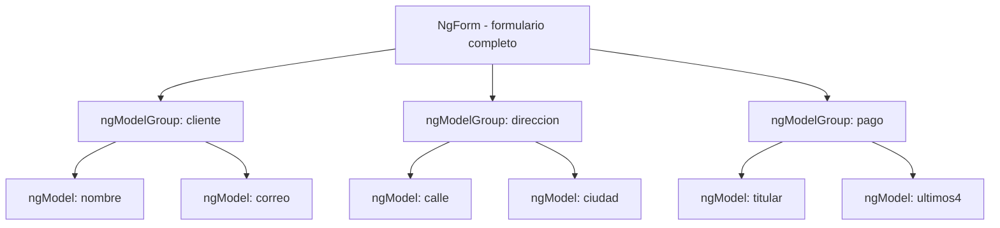

# Capítulo 12 - Parte 4: Formularios anidados con ngModelGroup

> **Parte 4 de 4** · Capítulo 12 · PARTE VII - Formularios

A medida que los formularios crecen, agrupar campos relacionados se convierte en una necesidad. Un formulario de checkout, por ejemplo, tiene campos para datos del cliente, dirección de envío y datos de pago: conceptualmente son grupos distintos aunque vivan en el mismo formulario. `ngModelGroup` resuelve exactamente esta necesidad, creando sub-objetos dentro del valor del formulario que reflejan esa agrupación lógica.

## Qué es ngModelGroup y cuándo tiene sentido

`ngModelGroup` es una directiva de `FormsModule` que agrupa campos de formulario bajo una clave común en el objeto `formulario.value`. Sin ella, todos los campos del formulario conviven en el mismo nivel. Con ella, el valor del formulario adquiere una estructura jerárquica que suele coincidir con la estructura de la entidad que representa.

Tiene sentido usar `ngModelGroup` cuando:

- Los campos pertenecen a una sub-entidad claramente identificable (dirección, contacto, configuración)
- Queremos enviar el objeto al backend con esa misma estructura anidada
- Queremos aplicar validaciones a nivel de grupo, no solo a nivel de campo individual
- El formulario tiene más de diez campos y la organización visual y semántica aporta legibilidad

No tiene sentido cuando el formulario es plano y simple, o cuando la agrupación sería artificial y solo añadiría complejidad sin beneficio.

## Sintaxis básica de ngModelGroup

`ngModelGroup` se aplica a cualquier elemento contenedor, típicamente un `<div>` o `<fieldset>`. Los campos dentro de ese contenedor se registran bajo la clave definida por la directiva:

```html
<form #formulario="ngForm" (ngSubmit)="alEnviar(formulario)">

  <!-- Campos del nivel raíz -->
  <input name="nombre" [(ngModel)]="datos.nombre" required />

  <!-- Grupo de dirección: sus campos estarán en formulario.value.direccion -->
  <div ngModelGroup="direccion">
    <input name="calle"    [(ngModel)]="datos.direccion.calle"    required />
    <input name="ciudad"   [(ngModel)]="datos.direccion.ciudad"   required />
    <input name="codigoPostal" [(ngModel)]="datos.direccion.codigoPostal" />
  </div>

</form>
```

Después del submit, `formulario.value` tendrá la siguiente forma:

```typescript
{
  nombre: 'Ana García',
  direccion: {
    calle: 'Av. Principal 123',
    ciudad: 'Buenos Aires',
    codigoPostal: '1000'
  }
}
```

El valor resultante es un objeto anidado que refleja exactamente la jerarquía del template. Esto facilita enormemente enviar los datos al backend sin transformaciones adicionales.

## Accediendo al estado del grupo con #grupo="ngModelGroup"

Al igual que usamos `#campo="ngModel"` para acceder al estado de un campo individual, podemos usar `#grupo="ngModelGroup"` para acceder al estado del grupo como unidad:

```html
<form #formulario="ngForm" (ngSubmit)="alEnviar(formulario)">

  <fieldset ngModelGroup="direccion" #grupoDireccion="ngModelGroup">
    <legend>Dirección de envío</legend>

    <input
      name="calle"
      [(ngModel)]="datos.direccion.calle"
      required
      #campoCalle="ngModel"
    />
    @if (campoCalle.invalid && campoCalle.touched) {
      <span class="error">La calle es obligatoria.</span>
    }

    <input
      name="ciudad"
      [(ngModel)]="datos.direccion.ciudad"
      required
    />
  </fieldset>

  <!-- El estado del grupo refleja la suma de sus campos -->
  @if (grupoDireccion.invalid && formulario.submitted) {
    <div class="alerta">
      Completa todos los campos de la dirección de envío.
    </div>
  }

  <button type="submit">Continuar</button>
</form>
```

`grupoDireccion.valid` es `true` solo cuando todos los campos dentro del grupo son válidos. `grupoDireccion.touched` es `true` cuando al menos uno de sus campos fue tocado. Esto nos permite mostrar un mensaje de error a nivel de grupo que resume el estado de todos sus campos sin entrar en detalles.

## Formulario completo de checkout con múltiples grupos

Veamos un ejemplo realista que combina grupos anidados con estructura de datos alineada:

```typescript
import { Component } from '@angular/core';
import { FormsModule, NgForm } from '@angular/forms';

interface DatosCheckout {
  cliente: {
    nombre: string;
    correo: string;
  };
  direccion: {
    calle: string;
    ciudad: string;
    pais: string;
  };
  pago: {
    titular: string;
    ultimos4: string;
  };
}

@Component({
  selector: 'app-checkout',
  standalone: true,
  imports: [FormsModule],
  templateUrl: './checkout.component.html'
})
export class CheckoutComponent {
  datos: DatosCheckout = {
    cliente:  { nombre: '', correo: '' },
    direccion: { calle: '', ciudad: '', pais: '' },
    pago:     { titular: '', ultimos4: '' }
  };

  alEnviar(formulario: NgForm): void {
    if (formulario.valid) {
      // formulario.value ya tiene la estructura anidada lista para el backend
      console.log('Orden enviada:', formulario.value);
    }
  }
}
```

```html
<!-- checkout.component.html -->
<form #formulario="ngForm" (ngSubmit)="alEnviar(formulario)">

  <!-- Grupo: Datos del cliente -->
  <fieldset ngModelGroup="cliente" #grupoCliente="ngModelGroup">
    <legend>Datos del cliente</legend>
    <div>
      <label>Nombre</label>
      <input name="nombre" [(ngModel)]="datos.cliente.nombre"
             required minlength="2" />
    </div>
    <div>
      <label>Correo</label>
      <input type="email" name="correo"
             [(ngModel)]="datos.cliente.correo"
             required email />
    </div>
  </fieldset>

  <!-- Grupo: Dirección de envío -->
  <fieldset ngModelGroup="direccion" #grupoDireccion="ngModelGroup">
    <legend>Dirección de envío</legend>
    <div>
      <label>Calle y número</label>
      <input name="calle" [(ngModel)]="datos.direccion.calle" required />
    </div>
    <div>
      <label>Ciudad</label>
      <input name="ciudad" [(ngModel)]="datos.direccion.ciudad" required />
    </div>
    <div>
      <label>País</label>
      <input name="pais" [(ngModel)]="datos.direccion.pais" required />
    </div>
  </fieldset>

  <!-- Grupo: Datos de pago (simplificado) -->
  <fieldset ngModelGroup="pago" #grupoPago="ngModelGroup">
    <legend>Datos de pago</legend>
    <div>
      <label>Titular de la tarjeta</label>
      <input name="titular" [(ngModel)]="datos.pago.titular" required />
    </div>
    <div>
      <label>Últimos 4 dígitos</label>
      <input name="ultimos4" [(ngModel)]="datos.pago.ultimos4"
             required pattern="[0-9]{4}" />
    </div>
  </fieldset>

  <!-- Resumen del estado de cada grupo -->
  <div class="resumen-estado">
    <span [class.ok]="grupoCliente.valid">Cliente ✓</span>
    <span [class.ok]="grupoDireccion.valid">Dirección ✓</span>
    <span [class.ok]="grupoPago.valid">Pago ✓</span>
  </div>

  <button type="submit" [disabled]="!formulario.valid">
    Confirmar orden
  </button>
</form>
```

El resultado de `formulario.value` al enviar es un objeto perfectamente estructurado con tres subgrupos, listo para ser enviado a una API REST sin ninguna transformación.

## Validación a nivel de grupo y ngModelGroup vs formulario plano

La validación a nivel de grupo es útil cuando queremos verificar condiciones que involucran múltiples campos del mismo grupo. Por ejemplo, validar que al menos uno de los teléfonos en un grupo de contacto esté completo. Sin embargo, `ngModelGroup` no acepta validadores directamente como sí lo hace `FormGroup` en formularios reactivos. Para validaciones inter-campo en formularios template-driven, la solución habitual es una directiva personalizada aplicada al contenedor del grupo.



La jerarquía de controles refleja exactamente la jerarquía del template. El estado `valid` del formulario completo es `true` solo cuando todos los grupos son válidos, y cada grupo es válido solo cuando todos sus controles son válidos.

La diferencia clave entre usar `ngModelGroup` y un formulario plano no es solo organizativa: afecta la estructura de `formulario.value`. En un formulario plano, todos los campos están al mismo nivel. Con grupos, el valor tiene la misma jerarquía que el template, lo que simplifica enormemente el trabajo con APIs que esperan objetos anidados.

## Puntos clave

- `ngModelGroup` agrupa campos bajo una clave en `formulario.value`, creando un objeto anidado que refleja la estructura del template
- `#grupo="ngModelGroup"` da acceso al estado del grupo como unidad: `valid`, `touched`, `dirty` y `errors`
- `<fieldset>` con `ngModelGroup` es semánticamente correcto para agrupar campos relacionados y mejora la accesibilidad
- El estado `valid` de un grupo es `true` solo cuando todos sus campos pasan sus validaciones
- Usar `ngModelGroup` cuando los campos representan una sub-entidad real; evitarlo si la agrupación es solo visual sin beneficio en el objeto de valor

## ¿Qué sigue?

El Capítulo 13 introduce los formularios reactivos de Angular, un enfoque alternativo donde la estructura y las validaciones se definen completamente en TypeScript mediante `FormControl`, `FormGroup` y `FormBuilder`, ofreciendo mayor control programático y mejor integración con tipado estricto.
