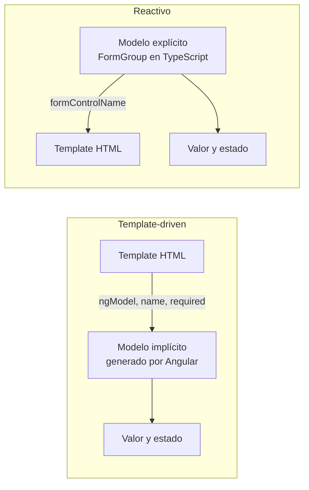

# Capítulo 13 - Parte 1: FormControl, FormGroup y FormBuilder

> **Parte 1 de 4** · Capítulo 13 · PARTE VII - Formularios

Los formularios reactivos invierten la relación entre template y TypeScript en comparación con el enfoque template-driven. En lugar de que Angular lea el template para construir el modelo del formulario, nosotros construimos el modelo explícitamente en TypeScript y el template simplemente lo refleja. Esto da un control fino sobre el estado del formulario, facilita el testing unitario y hace que la lógica compleja sea más fácil de razonar, porque toda la complejidad vive en la clase, no dispersa entre el template y la clase.

## ReactiveFormsModule: el punto de entrada

Para usar formularios reactivos, importamos `ReactiveFormsModule` en lugar de (o además de) `FormsModule`. Este módulo registra las directivas `[formGroup]`, `formControlName`, `[formControl]` y `formArrayName`, que son las que conectan el modelo TypeScript con el template.

```typescript
import { Component } from '@angular/core';
import { ReactiveFormsModule, FormControl,
         FormGroup, FormBuilder, Validators } from '@angular/forms';

@Component({
  selector: 'app-perfil',
  standalone: true,
  imports: [ReactiveFormsModule], // Único import necesario
  templateUrl: './perfil.component.html'
})
export class PerfilComponent {
  // El modelo del formulario vive aquí, en la clase
}
```

La separación es clara desde el inicio: `ReactiveFormsModule` conecta el DOM con el modelo, pero el modelo en sí se define con las clases de `@angular/forms`.

## FormControl: el átomo del formulario reactivo

`FormControl` representa un único campo de formulario. Encapsula el valor actual, los validadores y el estado del campo. A partir de Angular 14, `FormControl` es genérico, lo que nos permite especificar el tipo del valor con precisión:

```typescript
import { FormControl, Validators } from '@angular/forms';

// FormControl<string>: el valor es siempre string o null (si se llama reset sin argumento)
const nombre = new FormControl<string>('', {
  nonNullable: true, // reset() restaura '' en lugar de null
  validators: [Validators.required, Validators.minLength(3)]
});

// Acceder al valor: nombre.value es string (gracias a nonNullable: true)
console.log(nombre.value);        // ''
console.log(nombre.valid);        // false (required falla)
console.log(nombre.errors);       // { required: true }

nombre.setValue('María');
console.log(nombre.value);        // 'María'
console.log(nombre.valid);        // true
```

La opción `nonNullable: true` es importante en proyectos con `strict: true`: sin ella, `nombre.value` tendría tipo `string | null`, lo que requeriría comprobaciones adicionales de nulidad en cada uso. Con `nonNullable`, `reset()` restaura el valor inicial en lugar de establecer `null`.

## FormGroup: agrupando controles

`FormGroup` agrupa múltiples `FormControl` bajo un objeto. Esto es el equivalente reactivo de `ngForm` o `ngModelGroup`. El valor de un `FormGroup` es un objeto cuyos keys son los nombres de los controles:

```typescript
import { FormControl, FormGroup, Validators } from '@angular/forms';

const formularioLogin = new FormGroup({
  correo: new FormControl<string>('', {
    nonNullable: true,
    validators: [Validators.required, Validators.email]
  }),
  contrasena: new FormControl<string>('', {
    nonNullable: true,
    validators: [Validators.required, Validators.minLength(8)]
  })
});

// El tipo inferido de formularioLogin.value es:
// { correo: string; contrasena: string }

formularioLogin.setValue({ correo: 'a@b.com', contrasena: 'segura123' });
console.log(formularioLogin.valid);  // true
console.log(formularioLogin.value);  // { correo: 'a@b.com', contrasena: 'segura123' }
```

`FormGroup` expone las mismas propiedades que `FormControl` a nivel de grupo: `valid`, `invalid`, `touched`, `dirty`, `errors`, `value`. La validez del grupo es `true` solo cuando todos sus controles son válidos.

## FormBuilder: la forma ergonómica de construir formularios

Instanciar `FormControl` y `FormGroup` directamente funciona, pero es verboso cuando el formulario tiene muchos campos. `FormBuilder` es un servicio inyectable que ofrece métodos abreviados para construir el mismo modelo con menos código:

```typescript
import { Component, inject } from '@angular/core';
import { FormBuilder, ReactiveFormsModule, Validators } from '@angular/forms';

@Component({
  selector: 'app-registro',
  standalone: true,
  imports: [ReactiveFormsModule],
  templateUrl: './registro.component.html'
})
export class RegistroComponent {
  private fb = inject(FormBuilder);

  // FormBuilder.group() crea un FormGroup con la sintaxis corta
  formulario = this.fb.group({
    nombre:    ['', [Validators.required, Validators.minLength(3)]],
    correo:    ['', [Validators.required, Validators.email]],
    contrasena:['', [Validators.required, Validators.minLength(8)]]
  });
}
```

La sintaxis de `fb.group()` acepta un objeto donde cada valor puede ser:
- Un valor inicial simple: `'valor'` → equivale a `new FormControl('valor')`
- Un array de dos elementos: `[valor, validadores]`
- Un array de tres elementos: `[valor, validadoresSincronos, validadoresAsíncronos]`

## FormBuilder.nonNullable.group(): la variante tipo-segura

Para evitar tener que declarar `nonNullable: true` en cada control, `FormBuilder` ofrece la variante `nonNullable`, que hace que todos los controles del grupo sean no-nulables por defecto:

```typescript
import { Component, inject } from '@angular/core';
import { FormBuilder, ReactiveFormsModule, Validators } from '@angular/forms';

@Component({
  selector: 'app-registro',
  standalone: true,
  imports: [ReactiveFormsModule],
  templateUrl: './registro.component.html'
})
export class RegistroComponent {
  private fb = inject(FormBuilder);

  // Todos los controles son nonNullable automáticamente
  formulario = this.fb.nonNullable.group({
    nombre:     ['', [Validators.required, Validators.minLength(3)]],
    correo:     ['', [Validators.required, Validators.email]],
    contrasena: ['', [Validators.required, Validators.minLength(8)]]
  });

  alEnviar(): void {
    if (this.formulario.valid) {
      // formulario.getRawValue() devuelve los valores con el tipo completo
      const datos = this.formulario.getRawValue();
      // datos.nombre es string (no string | null), gracias a nonNullable
      console.log('Registrando:', datos);
    }
  }
}
```

`nonNullable.group()` es la forma recomendada en proyectos nuevos. La diferencia se nota especialmente en el tipo de `formulario.value`: sin `nonNullable`, los valores de controles deshabilitados son `undefined` en `value`; con `nonNullable`, `getRawValue()` siempre devuelve todos los valores con sus tipos completos.

## Vincular el modelo con el template

El template usa las directivas de `ReactiveFormsModule` para conectarse con el modelo TypeScript. La directiva `[formGroup]` vincula el `FormGroup` con el `<form>`, y `formControlName` vincula cada control por nombre:

```html
<!-- registro.component.html -->
<form [formGroup]="formulario" (ngSubmit)="alEnviar()">

  <div>
    <label for="nombre">Nombre</label>
    <input id="nombre" type="text" formControlName="nombre" />
    @if (formulario.get('nombre')?.invalid && formulario.get('nombre')?.touched) {
      <span class="error">
        @if (formulario.get('nombre')?.errors?.['required']) {
          El nombre es obligatorio.
        }
        @if (formulario.get('nombre')?.errors?.['minlength']) {
          Mínimo 3 caracteres.
        }
      </span>
    }
  </div>

  <div>
    <label for="correo">Correo</label>
    <input id="correo" type="email" formControlName="correo" />
  </div>

  <div>
    <label for="contrasena">Contraseña</label>
    <input id="contrasena" type="password" formControlName="contrasena" />
  </div>

  <button type="submit" [disabled]="formulario.invalid">
    Crear cuenta
  </button>
</form>
```

La diferencia más notable respecto a los formularios template-driven es que no hay `[(ngModel)]` ni `name`. El vínculo se establece por la combinación de `[formGroup]` en el form y `formControlName` en cada input. Angular busca el control con ese nombre dentro del `FormGroup` vinculado.

## Comparación con template-driven



En formularios template-driven, el template es la fuente de verdad y Angular infiere el modelo. En formularios reactivos, la clase TypeScript es la fuente de verdad y el template es solo una vista. Esto hace que los formularios reactivos sean más fáciles de testear (podemos manipular el `FormGroup` directamente en las pruebas, sin necesidad de interactuar con el DOM) y más predecibles en formularios complejos.

## Puntos clave

- `ReactiveFormsModule` debe importarse en el componente standalone para activar las directivas `[formGroup]` y `formControlName`
- `FormControl<string>('', { nonNullable: true })` crea un control con tipo estricto que no acepta `null` al hacer reset
- `FormBuilder.nonNullable.group()` es la forma más ergonómica y tipo-segura de definir formularios reactivos
- El template vincula el modelo con `[formGroup]` en el `<form>` y `formControlName` en cada campo, sin necesitar `[(ngModel)]`
- La validez y el estado del `FormGroup` se consultan directamente en la clase, haciendo el testing más simple que en el enfoque template-driven

## ¿Qué sigue?

En la Parte 2 exploramos los validadores built-in que Angular provee para formularios reactivos, tanto síncronos como asíncronos, y aprendemos a acceder al objeto de errores para mostrar mensajes precisos en el template.
