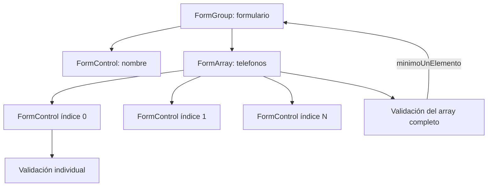

# Capítulo 13 - Parte 3: FormArray: listas dinámicas de controles

> **Parte 3 de 4** · Capítulo 13 · PARTE VII - Formularios

Hasta ahora hemos trabajado con formularios de estructura fija: un campo para el nombre, uno para el correo, uno para la edad. Pero el mundo real no siempre es tan predecible. Un usuario puede tener uno, dos o diez números de teléfono. Una factura puede tener una cantidad variable de líneas. Para esos escenarios, `FormArray` es exactamente la herramienta que necesitamos.

---

## ¿Qué es FormArray?

`FormArray` es una colección ordenada de controles de formulario. Al igual que `FormGroup`, es una subclase de `AbstractControl`, lo que significa que hereda estados como `valid`, `invalid`, `touched` y `dirty`. La diferencia es que sus hijos se indexan numéricamente en lugar de por nombre.

Veamos la anatomía básica:

```typescript
// telefonos.component.ts
import { Component, inject } from '@angular/core';
import {
  ReactiveFormsModule,
  FormBuilder,
  FormArray,
  FormControl,
  Validators,
} from '@angular/forms';

@Component({
  selector: 'app-telefonos',
  standalone: true,
  imports: [ReactiveFormsModule],
  templateUrl: './telefonos.component.html',
})
export class TelefonosComponent {
  private readonly fb = inject(FormBuilder);

  // FormArray tipado: solo acepta FormControl<string>
  readonly telefonos = new FormArray<FormControl<string>>([
    new FormControl('', {
      nonNullable: true,
      validators: [Validators.required, Validators.pattern(/^\+?[\d\s\-]{7,15}$/)],
    }),
  ]);
}
```

La anotación genérica `FormArray<FormControl<string>>` es fundamental cuando usamos TypeScript en modo strict: le dice al compilador qué tipo de controles viven en el array, lo que nos da autocompletado y verificación de tipos al acceder a `.value`.

---

## Agregar y eliminar controles

Las operaciones más comunes son `push()` para agregar al final y `removeAt(index)` para eliminar por posición:

```typescript
// telefonos.component.ts (métodos)
agregarTelefono(): void {
  const nuevoControl = new FormControl('', {
    nonNullable: true,
    validators: [
      Validators.required,
      Validators.pattern(/^\+?[\d\s\-]{7,15}$/),
    ],
  });
  this.telefonos.push(nuevoControl);
}

eliminarTelefono(indice: number): void {
  if (this.telefonos.length > 1) {
    this.telefonos.removeAt(indice);
  }
}
```

La guardia `length > 1` es una decisión de UX: garantizamos que siempre haya al menos un campo de teléfono visible. Podemos ajustar esto según las necesidades del negocio.

---

## Ejemplo completo: formulario de contacto con teléfonos dinámicos

Veamos el componente completo integrado en un `FormGroup` más amplio, que es el caso de uso más frecuente:

```typescript
// contacto.component.ts
import { Component, inject } from '@angular/core';
import {
  ReactiveFormsModule,
  FormBuilder,
  FormGroup,
  FormArray,
  FormControl,
  Validators,
} from '@angular/forms';

interface ContactoFormValue {
  nombre: string;
  telefonos: string[];
}

@Component({
  selector: 'app-contacto',
  standalone: true,
  imports: [ReactiveFormsModule],
  templateUrl: './contacto.component.html',
})
export class ContactoComponent {
  private readonly fb = inject(FormBuilder);

  readonly formulario: FormGroup = this.fb.group({
    nombre: ['', [Validators.required, Validators.minLength(2)]],
    telefonos: this.fb.array<FormControl<string>>([
      this.crearControlTelefono(),
    ]),
  });

  get telefonos(): FormArray<FormControl<string>> {
    return this.formulario.get('telefonos') as FormArray<FormControl<string>>;
  }

  private crearControlTelefono(): FormControl<string> {
    return this.fb.nonNullable.control('', [
      Validators.required,
      Validators.pattern(/^\+?[\d\s\-]{7,15}$/),
    ]);
  }

  agregarTelefono(): void {
    this.telefonos.push(this.crearControlTelefono());
  }

  eliminarTelefono(indice: number): void {
    if (this.telefonos.length > 1) {
      this.telefonos.removeAt(indice);
    }
  }

  guardar(): void {
    if (this.formulario.valid) {
      const valor = this.formulario.getRawValue() as ContactoFormValue;
      console.log('Datos guardados:', valor);
    }
  }
}
```

El getter `telefonos` es un patrón clave: encapsula el cast de tipo y lo centraliza. Lo usamos tanto en la clase como en el template. Nótese también que `crearControlTelefono()` es un método privado que nos evita repetir la configuración del control cada vez que agregamos uno nuevo.

---

## Iterar el array en el template

Esta es la parte donde muchos desarrolladores se traban por primera vez. La clave es usar `controls` (no `value`) para iterar, porque necesitamos el control en sí para vincularlo con `formControl`:

```html
<!-- contacto.component.html -->
<form [formGroup]="formulario" (ngSubmit)="guardar()">

  <label for="nombre">Nombre completo</label>
  <input id="nombre" formControlName="nombre" />

  <fieldset formArrayName="telefonos">
    <legend>Teléfonos</legend>

    @for (control of telefonos.controls; track $index) {
      <div class="fila-telefono">
        <input
          [formControl]="control"
          [attr.aria-label]="'Teléfono ' + ($index + 1)"
          placeholder="+52 55 1234 5678"
        />

        @if (control.invalid && control.touched) {
          <span class="error">
            @if (control.errors?.['required']) { Campo obligatorio. }
            @if (control.errors?.['pattern']) { Formato inválido. }
          </span>
        }

        <button
          type="button"
          (click)="eliminarTelefono($index)"
          [disabled]="telefonos.length === 1"
        >
          Eliminar
        </button>
      </div>
    }

  </fieldset>

  <button type="button" (click)="agregarTelefono()">
    + Agregar teléfono
  </button>

  <button type="submit" [disabled]="formulario.invalid">
    Guardar contacto
  </button>

</form>
```

Hay dos puntos importantes aquí. Primero, `formArrayName="telefonos"` vincula la sección del template con el `FormArray` del grupo padre. Segundo, dentro del `@for` usamos `[formControl]="control"` (binding de propiedad a la instancia directa), no `formControlName`, porque no estamos dentro de un `formGroupName` anidado.

---

## Validación del array completo

A veces necesitamos validar el `FormArray` como unidad, por ejemplo: "debe tener al menos dos teléfonos". Podemos agregar un validator al array completo:

```typescript
// validator-array.ts
import { AbstractControl, ValidationErrors } from '@angular/forms';

export function minimoUnElemento(
  minimo: number,
): (control: AbstractControl) => ValidationErrors | null {
  return (control: AbstractControl): ValidationErrors | null => {
    const array = control as { length?: number };
    if ((array.length ?? 0) < minimo) {
      return { minimoElementos: { requerido: minimo, actual: array.length } };
    }
    return null;
  };
}
```

```typescript
// en el componente, al construir el FormArray:
this.fb.array<FormControl<string>>(
  [this.crearControlTelefono()],
  { validators: [minimoUnElemento(1)] },
)
```

El validator recibe el `FormArray` completo como `control`, por lo que podemos inspeccionar su longitud, sus valores o cualquier otro aspecto del array.

---

## Diagrama del flujo de datos en FormArray



Este diagrama muestra que las validaciones fluyen en dos niveles: cada `FormControl` individual tiene sus propias reglas, y el `FormArray` como unidad puede tener sus propias reglas adicionales. Ambos niveles contribuyen al estado `valid/invalid` del `FormGroup` padre.

---

## Puntos clave

- `FormArray` maneja colecciones ordenadas de controles con índice numérico; es perfecto para listas donde el usuario decide cuántos elementos necesita.
- El tipado genérico `FormArray<FormControl<string>>` es esencial en TypeScript strict: evita los infames casts a `any`.
- El getter en la clase que expone el `FormArray` con el tipo correcto es el patrón estándar para acceder desde el template sin repetir el cast.
- En el template, iterar sobre `telefonos.controls` y vincular con `[formControl]="control"` (no `formControlName`) es la combinación correcta dentro de `formArrayName`.
- Los validators de nivel array reciben el `FormArray` completo, lo que permite reglas sobre la colección entera, no solo sobre controles individuales.

---

## ¿Qué sigue?

En la parte 4 aprenderemos a crear validadores personalizados y a hacer validación cruzada entre campos, como confirmar que dos contraseñas coinciden.
