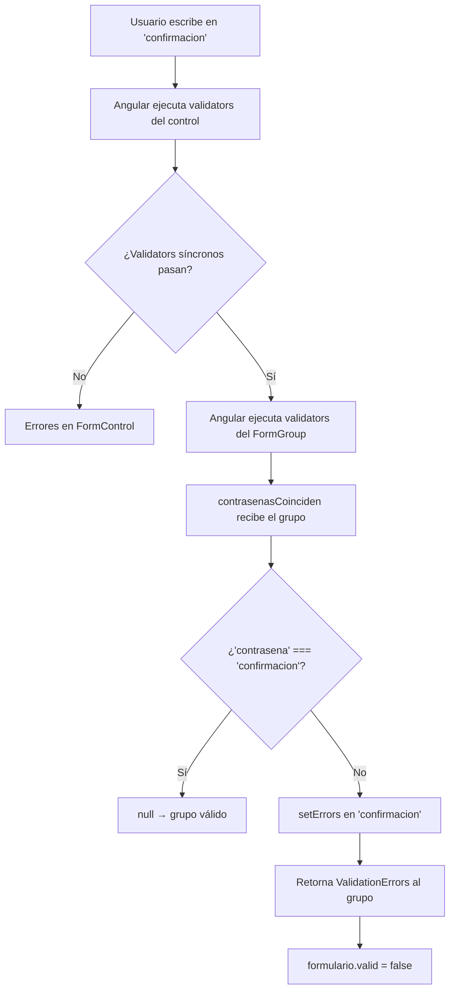

# Capítulo 13 - Parte 4: Validadores personalizados y cross-field validation

> **Parte 4 de 4** · Capítulo 13 · PARTE VII - Formularios

Los validators built-in de Angular cubren muchos escenarios, pero la realidad del desarrollo empresarial siempre presenta reglas de negocio que no encajan en un `Validators.pattern`. ¿Qué pasa cuando necesitamos que dos campos coincidan, o cuando una regla depende del valor de otro campo del mismo formulario? Para eso construimos nuestros propios validators. Veamos cómo hacerlo de forma limpia y tipada.

---

## Anatomía de un ValidatorFn

Un validador personalizado síncrono es simplemente una función con esta firma:

```typescript
// tipos de referencia (ya incluidos en @angular/forms)
// ValidatorFn = (control: AbstractControl) => ValidationErrors | null
// ValidationErrors = { [key: string]: unknown }
```

Si la validación pasa, devolvemos `null`. Si falla, devolvemos un objeto donde la clave identifica el error y el valor puede ser cualquier dato útil para el template. Construyamos un ejemplo concreto: validar que un nombre de usuario solo contenga letras, números y guiones bajos:

```typescript
// validators/nombre-usuario.validator.ts
import { AbstractControl, ValidationErrors } from '@angular/forms';

const PATRON_USUARIO = /^[a-zA-Z0-9_]+$/;

export function nombreUsuarioValido(
  control: AbstractControl,
): ValidationErrors | null {
  const valor = control.value as string;

  if (!valor) return null; // dejar que 'required' maneje el vacío

  if (!PATRON_USUARIO.test(valor)) {
    return {
      nombreUsuarioInvalido: {
        mensaje: 'Solo letras, números y guiones bajos.',
        valorRecibido: valor,
      },
    };
  }

  return null;
}
```

Para aplicarlo, simplemente lo pasamos en el array de validators:

```typescript
nombre: ['', [Validators.required, nombreUsuarioValido]],
```

---

## Cross-field validation: que dos campos coincidan

El caso más clásico de validación cruzada es el formulario de cambio de contraseña: el campo "confirmar contraseña" debe coincidir con el campo "contraseña". La clave aquí es que el validator debe vivir en el `FormGroup`, no en un `FormControl` individual, porque necesita acceder a ambos controles.

```typescript
// validators/contrasenas-coinciden.validator.ts
import { AbstractControl, ValidationErrors } from '@angular/forms';

export function contrasenasCoinciden(
  grupo: AbstractControl,
): ValidationErrors | null {
  const contrasena = grupo.get('contrasena');
  const confirmacion = grupo.get('confirmacion');

  if (!contrasena || !confirmacion) return null;

  if (contrasena.value !== confirmacion.value) {
    // Marcamos el error en el control hijo para que el template lo detecte
    confirmacion.setErrors({ noCoincide: true });
    return { noCoincide: true };
  }

  // Si coinciden, limpiamos solo el error 'noCoincide'
  // sin borrar otros posibles errores del control
  const erroresActuales = confirmacion.errors;
  if (erroresActuales) {
    const { noCoincide, ...restoErrores } = erroresActuales;
    confirmacion.setErrors(
      Object.keys(restoErrores).length > 0 ? restoErrores : null,
    );
  }

  return null;
}
```

Lo aplicamos al `FormGroup` directamente:

```typescript
// cambio-contrasena.component.ts
import { Component, inject } from '@angular/core';
import {
  ReactiveFormsModule,
  FormBuilder,
  FormGroup,
  Validators,
} from '@angular/forms';
import { contrasenasCoinciden } from './validators/contrasenas-coinciden.validator';

@Component({
  selector: 'app-cambio-contrasena',
  standalone: true,
  imports: [ReactiveFormsModule],
  templateUrl: './cambio-contrasena.component.html',
})
export class CambioContrasenaComponent {
  private readonly fb = inject(FormBuilder);

  readonly formulario: FormGroup = this.fb.group(
    {
      contrasena: ['', [Validators.required, Validators.minLength(8)]],
      confirmacion: ['', Validators.required],
    },
    { validators: [contrasenasCoinciden] },
  );
}
```

La diferencia sintáctica es que el validator del grupo va en el objeto de opciones como segundo argumento de `fb.group()`, bajo la clave `validators`.

---

## AbstractControl: acceder a controles hermanos

Dentro de un validator aplicado a un control individual, también podemos acceder a sus hermanos usando `control.parent`:

```typescript
// validators/fecha-fin-posterior.validator.ts
import { AbstractControl, ValidationErrors } from '@angular/forms';

export function fechaFinPosterior(
  control: AbstractControl,
): ValidationErrors | null {
  const grupo = control.parent;
  if (!grupo) return null;

  const fechaInicio = grupo.get('fechaInicio')?.value as string | null;
  const fechaFin = control.value as string | null;

  if (!fechaInicio || !fechaFin) return null;

  const inicio = new Date(fechaInicio);
  const fin = new Date(fechaFin);

  if (fin <= inicio) {
    return { fechaFinAnterior: { inicio: fechaInicio, fin: fechaFin } };
  }

  return null;
}
```

Este enfoque funciona, pero tiene una limitación: el validator solo se re-ejecuta cuando cambia el control al que está asignado, no cuando cambia `fechaInicio`. Para eso necesitamos escuchar cambios en `fechaInicio` y disparar `updateValueAndValidity()` en `fechaFin`, lo que veremos más adelante en el capítulo de formularios avanzados.

---

## AsyncValidatorFn: validación contra la API

Cuando necesitamos consultar el servidor para validar un dato, usamos `AsyncValidatorFn`. La firma es similar a la síncrona pero devuelve un `Observable<ValidationErrors | null>`. El desafío principal es evitar peticiones innecesarias usando `debounceTime` y `switchMap`:

```typescript
// validators/usuario-disponible.validator.ts
import { inject } from '@angular/core';
import {
  AbstractControl,
  AsyncValidatorFn,
  ValidationErrors,
} from '@angular/forms';
import { Observable, of, timer } from 'rxjs';
import { switchMap, map, catchError } from 'rxjs/operators';
import { UsuariosService } from '../services/usuarios.service';

export function usuarioDisponible(): AsyncValidatorFn {
  const usuariosService = inject(UsuariosService);

  return (control: AbstractControl): Observable<ValidationErrors | null> => {
    const valor = control.value as string;

    if (!valor || valor.length < 3) {
      return of(null);
    }

    // timer(400) actúa como debounce: espera 400 ms antes de consultar
    return timer(400).pipe(
      switchMap(() => usuariosService.existeUsuario(valor)),
      map((existe: boolean) =>
        existe ? { usuarioOcupado: { nombre: valor } } : null,
      ),
      catchError(() => of(null)),
    );
  };
}
```

La técnica de usar `timer(400)` como primer operador es el equivalente de `debounceTime` para validators asíncronos. Cada vez que cambia el valor del control, Angular cancela el observable anterior y crea uno nuevo, por lo que el timer se reinicia naturalmente con cada cambio.

```typescript
// en el componente
readonly formulario = this.fb.group({
  nombreUsuario: [
    '',
    [Validators.required, Validators.minLength(3)],
    [usuarioDisponible()],  // tercer argumento: validators asíncronos
  ],
});
```

---

## setErrors manual: errores desde el componente

Hay situaciones donde la validación ocurre fuera del contexto de un validator, por ejemplo, cuando el servidor rechaza el formulario completo con un error 409. En esos casos, podemos establecer errores manualmente:

```typescript
// cambio-contrasena.component.ts (fragmento)
guardar(): void {
  if (this.formulario.invalid) return;

  this.authService.cambiarContrasena(this.formulario.getRawValue()).subscribe({
    next: () => this.router.navigate(['/perfil']),
    error: (err: { status: number }) => {
      if (err.status === 400) {
        this.formulario.get('contrasena')?.setErrors({
          contrasenaInsegura: {
            mensaje: 'La contraseña no cumple con los requisitos de seguridad.',
          },
        });
      }
    },
  });
}
```

`setErrors` sobrescribe todos los errores del control. Si queremos preservar los existentes y solo agregar uno nuevo, debemos combinar los objetos manualmente, igual que hicimos en el validator de contraseñas.

---

## Mostrar errores personalizados en el template

La clave es acceder a los errores usando la notación de corchetes para nombres de propiedades dinámicas:

```html
<!-- cambio-contrasena.component.html -->
<form [formGroup]="formulario" (ngSubmit)="guardar()">

  <input type="password" formControlName="contrasena" />
  @if (formulario.get('contrasena')?.errors?.['contrasenaInsegura']) {
    <span class="error">
      {{ formulario.get('contrasena')?.errors?.['contrasenaInsegura']?.mensaje }}
    </span>
  }

  <input type="password" formControlName="confirmacion" />
  @if (formulario.get('confirmacion')?.errors?.['noCoincide'] &&
       formulario.get('confirmacion')?.touched) {
    <span class="error">Las contraseñas no coinciden.</span>
  }

  <!-- También podemos mostrar errores del grupo completo -->
  @if (formulario.errors?.['noCoincide']) {
    <div class="error-grupo">Verifica que las contraseñas sean iguales.</div>
  }

  <button type="submit" [disabled]="formulario.invalid">Cambiar contraseña</button>
</form>
```

---

## Diagrama del flujo de validación cruzada



---

## Puntos clave

- Un `ValidatorFn` es una función pura que recibe un `AbstractControl` y devuelve `ValidationErrors | null`; la clave del objeto de error identifica el tipo de fallo.
- La validación cruzada se implementa a nivel del `FormGroup`, no del `FormControl`, porque necesita acceso a múltiples controles simultáneamente.
- `control.parent` permite acceder a controles hermanos desde un validator de control individual, aunque hay que manejar la re-ejecución del validator manualmente.
- Los `AsyncValidatorFn` deben usar `timer(400)` o `debounceTime` para evitar saturar el servidor; `switchMap` garantiza que solo la última petición importa.
- `setErrors()` permite establecer errores desde fuera del validator, ideal para manejar respuestas de error del servidor después del envío.

---

## ¿Qué sigue?

En el siguiente capítulo exploraremos los interceptores HTTP funcionales de Angular 15+, que nos permiten interceptar y transformar todas las peticiones y respuestas de nuestra aplicación de forma centralizada.
