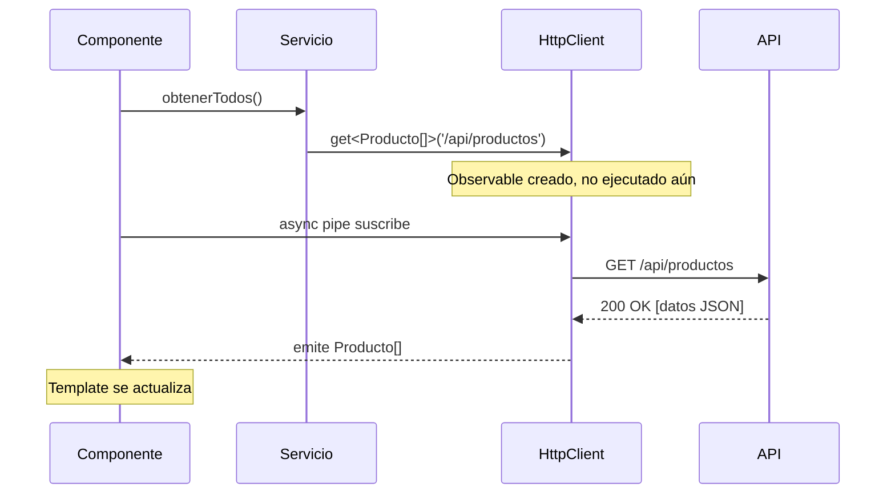

# Capítulo 14 - Parte 1: Configuración con provideHttpClient y primera petición GET

> **Parte 1 de 4** · Capítulo 14 · PARTE VIII - Comunicación HTTP

Angular incluye `HttpClient` como su cliente HTTP oficial, construido sobre el API `fetch` del navegador a partir de Angular 18. Antes de hacer cualquier petición, es necesario registrar el módulo en el sistema de inyección de dependencias de la aplicación. Con la arquitectura standalone, esto se hace directamente en `bootstrapApplication` usando la función de configuración `provideHttpClient`.

## Registrando HttpClient en la aplicación

El punto de entrada de cualquier aplicación standalone es `main.ts`. Aquí se pasan los providers globales mediante el segundo argumento de `bootstrapApplication`. Para HTTP, Angular ofrece `provideHttpClient` junto con una serie de funciones modificadoras que ajustan su comportamiento.

```typescript
// main.ts
import { bootstrapApplication } from '@angular/platform-browser';
import { provideHttpClient, withFetch } from '@angular/common/http';
import { AppComponent } from './app/app.component';

bootstrapApplication(AppComponent, {
  providers: [
    // withFetch() indica a Angular que use la API fetch nativa del navegador
    // en lugar de XMLHttpRequest, que era el comportamiento por defecto
    provideHttpClient(withFetch())
  ]
});
```

La función `withFetch` merece atención especial. Antes de Angular 18, `HttpClient` usaba internamente `XMLHttpRequest`. La opción `withFetch()` cambia la implementación subyacente a la API `fetch` nativa, que ya está disponible en todos los navegadores modernos y en Node.js 18+. Esto tiene implicaciones concretas: mejor compatibilidad con SSR (Server-Side Rendering), soporte nativo para `AbortController`, y menos sobrecarga en general. En Angular 18+ con SSR habilitado, `withFetch` se vuelve prácticamente obligatorio porque Node.js no implementa `XMLHttpRequest`.

La otra opción que verás frecuentemente es `withInterceptorsFromDi()`. Esta función habilita el sistema de interceptores basado en clases definidas como providers en el inyector de dependencias. Sin embargo, en Angular 15+ el enfoque recomendado son los interceptores funcionales registrados con `withInterceptors([...])`, que veremos en el Capítulo 15.

## Definiendo la interfaz del modelo de datos

Antes de inyectar `HttpClient` y hacer la primera petición, conviene definir la interfaz TypeScript que describe la forma de los datos que vamos a recibir. Esto permite que el compilador valide el tipado en toda la cadena de llamadas y que el editor de código ofrezca autocompletado real.

```typescript
// src/app/core/models/producto.model.ts

// Interfaz que representa un producto tal como lo devuelve la API
export interface Producto {
  id: number;
  nombre: string;
  precio: number;
  stock: number;
  categoriaId: number;
  activo: boolean;
}

// Interfaz para la respuesta paginada (patrón común en APIs REST)
export interface RespuestaPaginada<T> {
  datos: T[];
  total: number;
  pagina: number;
  porPagina: number;
}
```

Definir estas interfaces en un archivo separado dentro de `core/models` sigue la convención de estructura de carpetas establecida en capítulos anteriores. La interfaz `RespuestaPaginada<T>` usa genéricos para ser reutilizable con cualquier entidad, no solo productos.

## Inyectando HttpClient y haciendo la primera petición GET

Con el provider registrado y la interfaz definida, podemos crear el servicio que realizará las peticiones. La función `inject()` es la forma moderna de obtener dependencias fuera del constructor.

```typescript
// src/app/core/services/productos.service.ts
import { Injectable, inject } from '@angular/core';
import { HttpClient } from '@angular/common/http';
import { Observable } from 'rxjs';
import { Producto, RespuestaPaginada } from '../models/producto.model';

@Injectable({
  providedIn: 'root'
})
export class ProductosService {
  // Inyectamos HttpClient con la función inject()
  private http = inject(HttpClient);
  private readonly baseUrl = '/api/productos';

  // El tipo genérico <Producto[]> le dice a TypeScript qué esperar
  obtenerTodos(): Observable<Producto[]> {
    return this.http.get<Producto[]>(this.baseUrl);
  }

  obtenerPorId(id: number): Observable<Producto> {
    return this.http.get<Producto>(`${this.baseUrl}/${id}`);
  }
}
```

`http.get<T>()` devuelve un `Observable<T>`, no los datos directamente. Esto significa que la petición HTTP no se ejecuta hasta que alguien se suscriba al observable. Este comportamiento lazy (perezoso) es fundamental en el modelo reactivo de Angular.

## Suscripción manual vs async pipe

Hay dos formas de consumir el `Observable` que devuelve `obtenerTodos()`. La primera es la suscripción manual en el componente:

```typescript
// src/app/features/productos/lista-productos.component.ts
import { Component, OnInit, inject } from '@angular/core';
import { CommonModule } from '@angular/common';
import { ProductosService } from '../../core/services/productos.service';
import { Producto } from '../../core/models/producto.model';

@Component({
  selector: 'app-lista-productos',
  standalone: true,
  imports: [CommonModule],
  template: `
    @for (producto of productos; track producto.id) {
      <div>{{ producto.nombre }} - ${{ producto.precio }}</div>
    }
  `
})
export class ListaProductosComponent implements OnInit {
  private productosService = inject(ProductosService);
  productos: Producto[] = [];

  ngOnInit(): void {
    // La suscripción manual requiere cancelarla en ngOnDestroy
    this.productosService.obtenerTodos().subscribe(datos => {
      this.productos = datos;
    });
  }
}
```

La suscripción manual tiene una trampa: si el componente se destruye antes de que la petición termine, la suscripción sigue viva y puede causar memory leaks o errores al intentar mutar el componente destruido. La forma correcta de evitarlo es usar `takeUntilDestroyed` (→ Ver Capítulo 18, Parte 2).

La segunda forma, y la preferida cuando solo necesitamos mostrar los datos en el template, es el `async pipe`¹:

```typescript
// Versión con async pipe - sin suscripción manual
import { Component, inject } from '@angular/core';
import { AsyncPipe } from '@angular/common';
import { ProductosService } from '../../core/services/productos.service';
import { Observable } from 'rxjs';
import { Producto } from '../../core/models/producto.model';

@Component({
  selector: 'app-lista-productos',
  standalone: true,
  imports: [AsyncPipe],
  template: `
    @for (producto of (productos$ | async) ?? []; track producto.id) {
      <div>{{ producto.nombre }} - ${{ producto.precio }}</div>
    }
  `
})
export class ListaProductosComponent {
  private productosService = inject(ProductosService);
  // El $ al final es una convención para nombrar Observables
  productos$: Observable<Producto[]> = this.productosService.obtenerTodos();
}
```

Con `async pipe`, Angular gestiona automáticamente la suscripción y la cancelación cuando el componente se destruye. No hace falta implementar `OnDestroy`. Además, el pipe dispara la detección de cambios cuando llegan datos nuevos, lo que lo hace compatible con la estrategia `OnPush` sin configuración adicional.

## Diagrama del flujo de una petición GET



## Puntos clave

- `provideHttpClient(withFetch())` es la configuración recomendada en Angular 18+ para apps standalone, especialmente con SSR
- El tipo genérico `get<T>()` tipifica la respuesta en tiempo de compilación, sin necesidad de castings manuales
- `HttpClient.get()` devuelve un `Observable` frío: la petición no ocurre hasta la suscripción
- El `async pipe` es preferible a la suscripción manual porque maneja el ciclo de vida automáticamente
- Las interfaces del modelo deben vivir en `core/models` para ser reutilizables entre servicios y componentes

## ¿Qué sigue?

En la Parte 2 completamos el CRUD con `POST`, `PUT`, `PATCH` y `DELETE`, explorando el tipado genérico de respuestas para cada tipo de operación.

---

¹ *async pipe*: pipe¹ incorporado en Angular que suscribe a un Observable o Promise y devuelve el último valor emitido, cancelando la suscripción automáticamente cuando el componente se destruye.
