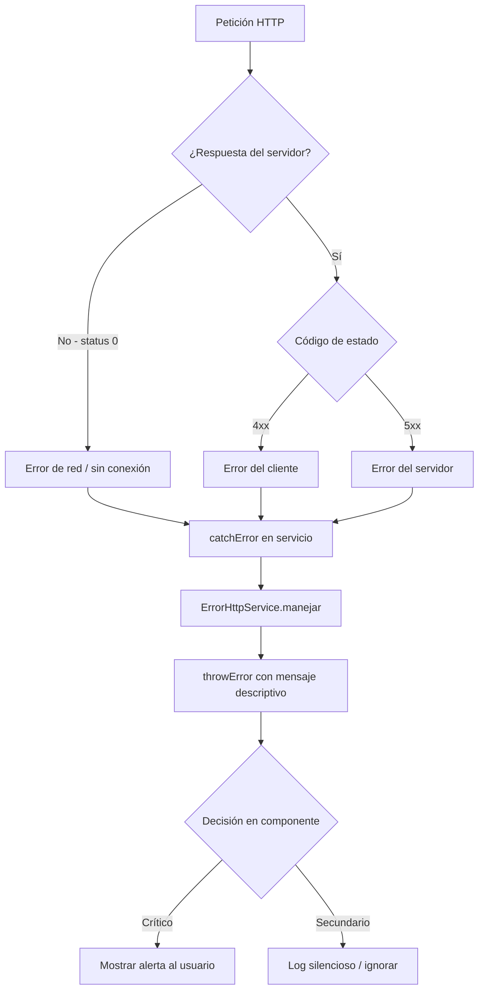

# Capítulo 14 - Parte 3: Manejo de errores con catchError y tipado de respuestas

> **Parte 3 de 4** · Capítulo 14 · PARTE VIII - Comunicación HTTP

Las peticiones HTTP fallan. La conexión se pierde, el servidor devuelve un 404, la sesión expira con un 401. Una aplicación robusta no trata estos escenarios como excepciones inesperadas: los anticipa, los clasifica y responde de forma apropiada a cada uno. Angular facilita este manejo a través de `HttpErrorResponse` y los operadores de RxJS `catchError` y `throwError`.

## Anatomía de HttpErrorResponse

Cuando una petición HTTP falla, Angular emite un error en el canal de errores del Observable. Ese error siempre es una instancia de `HttpErrorResponse`. Conocer sus propiedades es el primer paso para manejarlo bien:

```typescript
// Las propiedades más relevantes de HttpErrorResponse
import { HttpErrorResponse } from '@angular/common/http';

function inspeccionarError(error: HttpErrorResponse): void {
  // Código de estado HTTP: 400, 401, 403, 404, 500, etc.
  console.log(error.status);       // number - 0 si no hubo respuesta del servidor

  // Texto descriptivo del código: "Not Found", "Unauthorized", etc.
  console.log(error.statusText);   // string

  // Cuerpo de la respuesta de error tal como lo envió el servidor
  // Puede ser un objeto, string o null según la API
  console.log(error.error);        // unknown

  // URL de la petición que falló (útil para logging)
  console.log(error.url);          // string | null

  // true si el error ocurrió en el cliente (sin conexión, timeout)
  // false si el servidor respondió con un código de error (4xx, 5xx)
  console.log(error.error instanceof ProgressEvent); // sin conexión
}
```

La propiedad `status === 0` es la señal más confiable de que no hubo respuesta del servidor: el dispositivo está offline, el servidor no existe o la petición fue bloqueada por CORS. Esta distinción importa porque el mensaje al usuario debe ser diferente: "Sin conexión a internet" vs "El servidor encontró un problema".

## Distinguiendo errores del cliente y del servidor

La clasificación de errores tiene dos categorías principales. Los errores del **cliente** son los que ocurren antes de que la petición llegue al servidor (o cuando el servidor no responde). Los errores del **servidor** son respuestas HTTP con código 4xx o 5xx.

```typescript
// src/app/core/services/error-http.service.ts
import { Injectable } from '@angular/core';
import { HttpErrorResponse } from '@angular/common/http';
import { throwError } from 'rxjs';

@Injectable({ providedIn: 'root' })
export class ErrorHttpService {
  // Transforma cualquier HttpErrorResponse en un Observable que emite error
  manejar(error: HttpErrorResponse) {
    if (error.status === 0) {
      // Error de red: sin conexión o CORS bloqueado
      return throwError(() => new Error(
        'No se pudo conectar al servidor. Verifica tu conexión a internet.'
      ));
    }

    if (error.status >= 400 && error.status < 500) {
      // Error del cliente: recurso no encontrado, no autorizado, datos inválidos
      const mensaje = this.extraerMensajeApi(error) ??
        `Error ${error.status}: solicitud inválida`;
      return throwError(() => new Error(mensaje));
    }

    // Error del servidor (5xx): problema interno
    return throwError(() => new Error(
      'Error interno del servidor. Intenta nuevamente en unos momentos.'
    ));
  }

  // Intenta extraer el mensaje de error del cuerpo de la respuesta
  private extraerMensajeApi(error: HttpErrorResponse): string | null {
    // Las APIs suelen devolver { mensaje: string } o { error: string }
    const cuerpo = error.error;
    if (typeof cuerpo === 'object' && cuerpo !== null) {
      return (cuerpo as { mensaje?: string; error?: string }).mensaje
        ?? (cuerpo as { mensaje?: string; error?: string }).error
        ?? null;
    }
    return null;
  }
}
```

Centralizar esta lógica en un servicio evita duplicar el manejo de errores en cada servicio de datos. Todos los servicios HTTP de la aplicación llaman a `errorHttpService.manejar(error)` en su `catchError`.

## Usando catchError en el servicio

`catchError` es un operador de RxJS que intercepta el canal de errores de un Observable y permite devolver un Observable de reemplazo. En el contexto de HTTP, lo usamos para transformar el `HttpErrorResponse` en un error más descriptivo antes de que llegue al componente:

```typescript
// src/app/core/services/productos.service.ts
import { Injectable, inject } from '@angular/core';
import { HttpClient } from '@angular/common/http';
import { Observable } from 'rxjs';
import { catchError } from 'rxjs/operators';
import { Producto } from '../models/producto.model';
import { ErrorHttpService } from './error-http.service';

@Injectable({ providedIn: 'root' })
export class ProductosService {
  private http = inject(HttpClient);
  private errorService = inject(ErrorHttpService);
  private readonly baseUrl = '/api/productos';

  obtenerTodos(): Observable<Producto[]> {
    return this.http.get<Producto[]>(this.baseUrl).pipe(
      // catchError intercepta cualquier error del Observable
      catchError(error => this.errorService.manejar(error))
    );
  }

  obtenerPorId(id: number): Observable<Producto> {
    return this.http.get<Producto>(`${this.baseUrl}/${id}`).pipe(
      catchError(error => this.errorService.manejar(error))
    );
  }
}
```

El operador `pipe()` encadena transformaciones sobre el Observable. `catchError` recibe el error y debe devolver un Observable. Si usa `throwError(() => new Error(...))`, el error continúa propagándose hacia el componente, pero ya transformado. Si en cambio devolviera `of([])`, reemplazaría el error con un valor vacío y el componente no vería ningún error.

## Tipando el cuerpo del error de la API

Muchas APIs devuelven errores con una estructura consistente. Tipar esa estructura ayuda a extraer el mensaje con seguridad y sin castings ciegos:

```typescript
// src/app/core/models/error-api.model.ts

// Forma estándar del cuerpo de error de nuestra API
export interface ErrorApiCuerpo {
  codigo: string;      // Ej: "PRODUCTO_NO_ENCONTRADO"
  mensaje: string;     // Mensaje legible para el usuario
  detalle?: string;    // Información técnica adicional (opcional)
  campo?: string;      // Campo que causó el error, en errores de validación
}

// Type guard para verificar que el cuerpo del error tiene la forma esperada
export function esErrorApiCuerpo(valor: unknown): valor is ErrorApiCuerpo {
  return (
    typeof valor === 'object' &&
    valor !== null &&
    'codigo' in valor &&
    'mensaje' in valor
  );
}
```

Con el type guard, la extracción del mensaje es completamente segura en tipos:

```typescript
import { HttpErrorResponse } from '@angular/common/http';
import { ErrorApiCuerpo, esErrorApiCuerpo } from '../models/error-api.model';

function extraerMensajeSeguro(error: HttpErrorResponse): string {
  if (esErrorApiCuerpo(error.error)) {
    // TypeScript sabe que error.error es ErrorApiCuerpo aquí
    return error.error.mensaje;
  }
  return `Error ${error.status}`;
}
```

## Manejo en el componente: notificación vs log silencioso

Hay errores que el usuario debe conocer (no pudo guardar su pedido) y errores que solo el equipo de desarrollo necesita ver (un widget secundario no cargó). La decisión de notificar o registrar silenciosamente pertenece al componente, no al servicio:

```typescript
// En el componente, decidimos qué hacer con cada tipo de error
import { Component, inject, signal } from '@angular/core';
import { ProductosService } from '../../core/services/productos.service';
import { Producto } from '../../core/models/producto.model';

@Component({
  selector: 'app-lista-productos',
  standalone: true,
  template: `
    @if (errorCritico()) {
      <div class="alerta-error">{{ errorCritico() }}</div>
    }
    @for (p of productos(); track p.id) {
      <div>{{ p.nombre }}</div>
    }
  `
})
export class ListaProductosComponent {
  private productosService = inject(ProductosService);

  productos = signal<Producto[]>([]);
  errorCritico = signal<string | null>(null);

  ngOnInit(): void {
    this.productosService.obtenerTodos().subscribe({
      next: datos => this.productos.set(datos),
      error: (err: Error) => {
        // Este error es crítico: el usuario no puede ver la lista
        this.errorCritico.set(err.message);
        // Además lo registramos para monitoreo
        console.error('[ListaProductos]', err);
      }
    });
  }
}
```

## Diagrama del flujo de error HTTP



## Puntos clave

- `HttpErrorResponse.status === 0` indica error de red (sin conexión), no error del servidor
- Separar errores 4xx (del cliente) de 5xx (del servidor) permite mensajes más precisos al usuario
- `catchError` con `throwError(() => new Error(...))` transforma el error sin detenerlo: sigue propagándose
- Centralizar el manejo de errores en un `ErrorHttpService` evita duplicación en cada servicio de datos
- Los type guards (`esErrorApiCuerpo`) permiten extraer datos del cuerpo de error con seguridad de tipos

## ¿Qué sigue?

En la Parte 4 exploramos las opciones avanzadas de `HttpClient`: headers personalizados, query params, acceso a la respuesta completa y reporte de progreso para subida de archivos.
