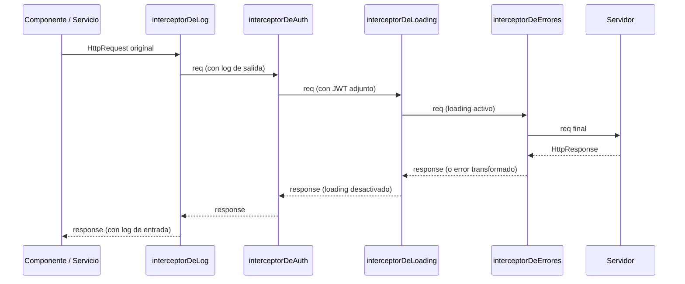
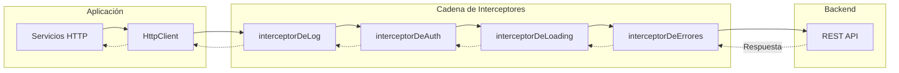

# Capítulo 15 - Parte 1: Interceptores funcionales (Angular 15+): concepto y estructura

> **Parte 1 de 4** · Capítulo 15 · PARTE VIII - Comunicación HTTP

Cuando una aplicación Angular crece, inevitablemente aparece la necesidad de hacer algo con todas las peticiones HTTP: adjuntar un token de autenticación, registrar los tiempos de respuesta, mostrar un indicador de carga, manejar errores de red de forma uniforme. Sin interceptores, esa lógica se dispersa por todos los servicios. Con interceptores, la centralizamos en un único lugar y la aplicamos automáticamente a cada petición que sale de la aplicación.

Angular 15 introdujo los interceptores funcionales, una alternativa más simple y alineada con el enfoque moderno sin NgModule. Veamos cómo funcionan.

---

## ¿Qué es un interceptor y para qué sirve?

Un interceptor es un mecanismo que se interpone en el flujo de comunicación HTTP entre la aplicación y el servidor. Puede inspeccionar, modificar o incluso cancelar peticiones antes de que salgan, y puede hacer lo mismo con las respuestas antes de que lleguen al código que las solicitó.

Los casos de uso más comunes son:

- **Autenticación**: adjuntar el JWT a cada petición que lo requiera.
- **Logging**: registrar la URL, el método y el tiempo de respuesta de cada llamada.
- **Loading global**: mostrar y ocultar un spinner centralizado.
- **Manejo de errores**: interceptar los errores HTTP y mostrar notificaciones al usuario.
- **Transformación de datos**: normalizar el formato de respuesta de la API antes de entregarlo a los servicios.

La gran ventaja frente a poner esta lógica en cada servicio es el principio DRY: un solo lugar de cambio, comportamiento consistente en toda la aplicación.

---

## HttpInterceptorFn: la firma que debemos conocer

En Angular 15+, un interceptor funcional es simplemente una función con esta firma:

```typescript
// firma de referencia (de @angular/common/http)
// type HttpInterceptorFn = (
//   req: HttpRequest<unknown>,
//   next: HttpHandlerFn
// ) => Observable<HttpEvent<unknown>>;
```

No hay clases, no hay interfaces que implementar, no hay `@Injectable()`. Solo una función. Veamos el interceptor más simple posible: uno que no hace nada y deja pasar la petición tal cual:

```typescript
// interceptores/transparente.interceptor.ts
import { HttpInterceptorFn } from '@angular/common/http';

export const interceptorTransparente: HttpInterceptorFn = (solicitud, siguiente) => {
  return siguiente(solicitud);
};
```

`solicitud` es el `HttpRequest` original. `siguiente` es la función que pasa la solicitud al próximo interceptor en la cadena (o al backend si no hay más interceptores). Siempre debemos devolver el observable que `siguiente` produce; de lo contrario, la petición muere en nuestro interceptor.

---

## request.clone(): inmutabilidad como principio

Un `HttpRequest` es inmutable. No podemos modificar sus propiedades directamente. Para enviar una versión modificada al siguiente eslabón de la cadena, usamos `clone()`:

```typescript
// interceptores/ejemplo-clone.interceptor.ts
import { HttpInterceptorFn } from '@angular/common/http';

export const interceptorEjemplo: HttpInterceptorFn = (solicitud, siguiente) => {
  const solicitudModificada = solicitud.clone({
    // Podemos modificar headers, URL, params, body, etc.
    headers: solicitud.headers
      .set('X-Cliente-Version', '2.1.0')
      .set('Accept-Language', 'es-MX'),
    url: solicitud.url.replace('http://', 'https://'),
  });

  return siguiente(solicitudModificada);
};
```

`clone()` crea una nueva instancia de `HttpRequest` copiando todas las propiedades y aplicando los cambios que especificamos. Los headers de `HttpHeaders` también son inmutables; `set()` siempre devuelve una nueva instancia con el header agregado o reemplazado.

---

## Registrar interceptores con provideHttpClient

La forma de registrar interceptores funcionales es a través de `withInterceptors()` dentro de `provideHttpClient()` en el `app.config.ts`:

```typescript
// app.config.ts
import { ApplicationConfig } from '@angular/core';
import { provideRouter } from '@angular/router';
import { provideHttpClient, withInterceptors } from '@angular/common/http';
import { interceptorDeLog } from './interceptores/log.interceptor';
import { interceptorDeAuth } from './interceptores/auth.interceptor';
import { interceptorDeLoading } from './interceptores/loading.interceptor';
import { interceptorDeErrores } from './interceptores/errores.interceptor';
import { rutas } from './app.routes';

export const appConfig: ApplicationConfig = {
  providers: [
    provideRouter(rutas),
    provideHttpClient(
      withInterceptors([
        interceptorDeLog,
        interceptorDeAuth,
        interceptorDeLoading,
        interceptorDeErrores,
      ]),
    ),
  ],
};
```

El orden en el array importa, y mucho.

---

## Orden de ejecución de interceptores

La cadena de interceptores funciona como una pila. En la petición (saliente) se ejecutan de izquierda a derecha; en la respuesta (entrante) se ejecutan de derecha a izquierda. Visualicémoslo con el ejemplo anterior:



Este flujo bidireccional es lo que hace a los interceptores tan poderosos: el mismo mecanismo que adjunta el token en la salida puede manejar el error 401 en la entrada.

---

## Uso de inject() dentro de interceptores funcionales

Una de las ventajas más importantes de los interceptores funcionales es que podemos usar `inject()` directamente dentro de la función, lo que nos da acceso a cualquier servicio del árbol de inyección:

```typescript
// interceptores/log.interceptor.ts
import { HttpInterceptorFn, HttpResponse } from '@angular/common/http';
import { inject } from '@angular/core';
import { tap } from 'rxjs/operators';
import { LogService } from '../services/log.service';

export const interceptorDeLog: HttpInterceptorFn = (solicitud, siguiente) => {
  const logService = inject(LogService);
  const inicio = Date.now();

  logService.debug(`→ ${solicitud.method} ${solicitud.url}`);

  return siguiente(solicitud).pipe(
    tap((evento) => {
      if (evento instanceof HttpResponse) {
        const duracion = Date.now() - inicio;
        logService.debug(
          `← ${evento.status} ${solicitud.url} (${duracion}ms)`,
        );
      }
    }),
  );
};
```

`inject()` se llama en el momento en que se ejecuta la función interceptora, que siempre ocurre dentro del contexto de inyección de Angular. Esto es equivalente a usar el constructor en la versión basada en clases, pero sin necesidad de decoradores.

---

## Diagrama completo de la arquitectura de interceptores



---

## Puntos clave

- Un interceptor funcional es una función pura que cumple el tipo `HttpInterceptorFn`; no requiere clases, decoradores ni implementar interfaces.
- `HttpRequest` es inmutable: siempre usamos `clone()` para crear versiones modificadas antes de pasarlas al siguiente interceptor.
- Los interceptores se registran en `provideHttpClient(withInterceptors([...]))` dentro de `app.config.ts`; el orden del array define el orden de ejecución en la petición.
- El flujo es bidireccional: los interceptores actúan como middleware tanto en la petición saliente como en la respuesta entrante.
- `inject()` funciona dentro del cuerpo de la función interceptora, lo que nos da acceso completo al árbol de inyección de dependencias sin boilerplate adicional.

---

## ¿Qué sigue?

En la parte 2 construiremos el interceptor de autenticación que adjunta automáticamente el JWT a cada petición, gestiona las URLs públicas y maneja el escenario de token expirado.
