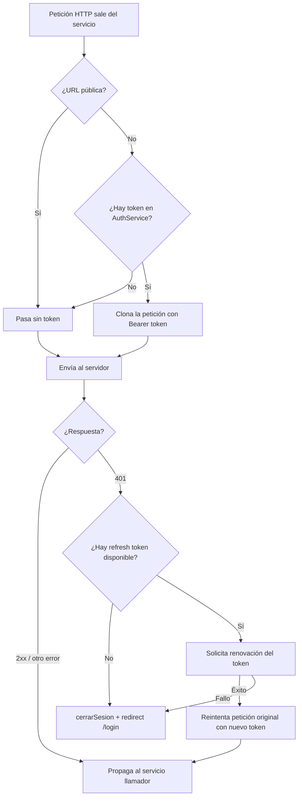

# Capítulo 15 - Parte 2: Interceptor de autenticación: adjuntando JWT automáticamente

> **Parte 2 de 4** · Capítulo 15 · PARTE VIII - Comunicación HTTP

El interceptor de autenticación es, sin duda, el más común en aplicaciones empresariales. Su responsabilidad es simple: leer el JWT del almacenamiento, adjuntarlo al header `Authorization` de cada petición que lo necesite, y reaccionar inteligentemente cuando el servidor responde con un 401. En esta parte construiremos esa pieza de extremo a extremo.

---

## El servicio de autenticación

Antes de escribir el interceptor, necesitamos un `AuthService` que maneje el token. El interceptor lo usará para leer el JWT actual:

```typescript
// services/auth.service.ts
import { Injectable, signal, computed } from '@angular/core';
import { Router } from '@angular/router';
import { inject } from '@angular/core';

export interface TokenPayload {
  sub: string;
  email: string;
  exp: number;
  roles: string[];
}

@Injectable({ providedIn: 'root' })
export class AuthService {
  private readonly router = inject(Router);
  private readonly CLAVE_TOKEN = 'jwt_token';

  private readonly _token = signal<string | null>(
    localStorage.getItem(this.CLAVE_TOKEN),
  );

  readonly estaAutenticado = computed(() => this._token() !== null);
  readonly token = this._token.asReadonly();

  guardarToken(token: string): void {
    localStorage.setItem(this.CLAVE_TOKEN, token);
    this._token.set(token);
  }

  cerrarSesion(): void {
    localStorage.removeItem(this.CLAVE_TOKEN);
    this._token.set(null);
    this.router.navigate(['/auth/login']);
  }
}
```

Guardamos el token en un `signal` para que cualquier parte de la aplicación pueda reaccionar reactivamente a cambios en el estado de autenticación. El interceptor usará `token()` para obtener el valor actual.

---

## URLs públicas: saber cuándo NO adjuntar el token

No todas las peticiones necesitan autenticación. El endpoint de login, el de registro y cualquier recurso público deben poder llamarse sin token. Definimos esas exclusiones en un lugar centralizado:

```typescript
// interceptores/auth.interceptor.ts
import { HttpInterceptorFn, HttpRequest } from '@angular/common/http';
import { inject } from '@angular/core';
import { AuthService } from '../services/auth.service';

const URLS_PUBLICAS = [
  '/api/auth/login',
  '/api/auth/register',
  '/api/auth/refresh',
  '/api/catalogo/publico',
];

function esUrlPublica(solicitud: HttpRequest<unknown>): boolean {
  return URLS_PUBLICAS.some((url) => solicitud.url.includes(url));
}
```

La función `esUrlPublica` usa `includes` para detectar si la URL de la petición contiene alguna de las rutas públicas. Para aplicaciones grandes, podría tener sentido hacer esta comparación más robusta con una expresión regular o con una comparación exacta del pathname.

---

## El interceptor: adjuntar el token

Con la lógica de exclusión lista, el interceptor principal es directo:

```typescript
// interceptores/auth.interceptor.ts (continuación)
import {
  HttpInterceptorFn,
  HttpRequest,
  HttpHandlerFn,
  HttpEvent,
} from '@angular/common/http';
import { inject } from '@angular/core';
import { Observable } from 'rxjs';
import { AuthService } from '../services/auth.service';

export const interceptorDeAuth: HttpInterceptorFn = (
  solicitud: HttpRequest<unknown>,
  siguiente: HttpHandlerFn,
): Observable<HttpEvent<unknown>> => {
  const authService = inject(AuthService);
  const token = authService.token();

  // Si no hay token o la URL es pública, dejamos pasar sin modificar
  if (!token || esUrlPublica(solicitud)) {
    return siguiente(solicitud);
  }

  const solicitudAutenticada = solicitud.clone({
    headers: solicitud.headers.set('Authorization', `Bearer ${token}`),
  });

  return siguiente(solicitudAutenticada);
};
```

La lógica es intencional en su simplicidad: o modificamos la petición o la dejamos pasar sin cambios. No hay estados intermedios confusos.

---

## Manejo del error 401: redirigir al login

El caso más delicado es cuando el servidor responde con 401 (no autorizado), lo que normalmente significa que el token expiró o fue invalidado. Debemos detectarlo y redirigir al usuario al login:

```typescript
// interceptores/auth.interceptor.ts (versión con manejo de 401)
import {
  HttpInterceptorFn,
  HttpRequest,
  HttpHandlerFn,
  HttpEvent,
  HttpErrorResponse,
} from '@angular/common/http';
import { inject } from '@angular/core';
import { Observable, throwError } from 'rxjs';
import { catchError } from 'rxjs/operators';
import { Router } from '@angular/router';
import { AuthService } from '../services/auth.service';

export const interceptorDeAuth: HttpInterceptorFn = (
  solicitud: HttpRequest<unknown>,
  siguiente: HttpHandlerFn,
): Observable<HttpEvent<unknown>> => {
  const authService = inject(AuthService);
  const router = inject(Router);
  const token = authService.token();

  const solicitudFinal = (!token || esUrlPublica(solicitud))
    ? solicitud
    : solicitud.clone({
        headers: solicitud.headers.set('Authorization', `Bearer ${token}`),
      });

  return siguiente(solicitudFinal).pipe(
    catchError((error: unknown) => {
      if (error instanceof HttpErrorResponse && error.status === 401) {
        authService.cerrarSesion(); // limpia el token y navega al login
      }
      return throwError(() => error);
    }),
  );
};
```

Nótese que después de manejar el 401, relanzamos el error con `throwError(() => error)`. Esto es importante: los servicios que hicieron la petición original deben saber que falló para que puedan manejar su propio estado de error si es necesario.

---

## Renovación de token: el escenario avanzado

En aplicaciones con tokens de corta duración, en lugar de redirigir al login ante un 401 podemos intentar renovar el token automáticamente. Este es un patrón más complejo que requiere coordinar múltiples peticiones:

```typescript
// interceptores/auth-con-refresh.interceptor.ts
import {
  HttpInterceptorFn,
  HttpRequest,
  HttpHandlerFn,
  HttpEvent,
  HttpErrorResponse,
} from '@angular/common/http';
import { inject } from '@angular/core';
import { Observable, throwError, BehaviorSubject, filter, take } from 'rxjs';
import { catchError, switchMap } from 'rxjs/operators';
import { AuthService } from '../services/auth.service';
import { TokenService } from '../services/token.service';

let renovandoToken = false;
const tokenRenovado$ = new BehaviorSubject<string | null>(null);

export const interceptorDeAuthConRefresh: HttpInterceptorFn = (
  solicitud: HttpRequest<unknown>,
  siguiente: HttpHandlerFn,
): Observable<HttpEvent<unknown>> => {
  const authService = inject(AuthService);
  const tokenService = inject(TokenService);
  const token = authService.token();

  const solicitudFinal = agregarToken(solicitud, token);

  return siguiente(solicitudFinal).pipe(
    catchError((error: unknown) => {
      if (!(error instanceof HttpErrorResponse) || error.status !== 401) {
        return throwError(() => error);
      }

      if (esUrlPublica(solicitud)) {
        return throwError(() => error);
      }

      if (!renovandoToken) {
        renovandoToken = true;
        tokenRenovado$.next(null);

        return tokenService.renovarToken().pipe(
          switchMap((nuevoToken: string) => {
            renovandoToken = false;
            authService.guardarToken(nuevoToken);
            tokenRenovado$.next(nuevoToken);
            return siguiente(agregarToken(solicitud, nuevoToken));
          }),
          catchError((errorRenovacion: unknown) => {
            renovandoToken = false;
            authService.cerrarSesion();
            return throwError(() => errorRenovacion);
          }),
        );
      }

      // Si ya hay una renovación en curso, esperamos a que termine
      return tokenRenovado$.pipe(
        filter((t): t is string => t !== null),
        take(1),
        switchMap((nuevoToken) => siguiente(agregarToken(solicitud, nuevoToken))),
      );
    }),
  );
};

function agregarToken(
  solicitud: HttpRequest<unknown>,
  token: string | null,
): HttpRequest<unknown> {
  if (!token) return solicitud;
  return solicitud.clone({
    headers: solicitud.headers.set('Authorization', `Bearer ${token}`),
  });
}
```

El `BehaviorSubject` `tokenRenovado$` actúa como coordinador: las peticiones que fallaron con 401 mientras se estaba renovando el token esperan hasta que la renovación complete y luego se reintentan con el nuevo token. Esto evita el problema de disparar múltiples peticiones de renovación simultáneas.

---

## Diagrama del flujo del interceptor de autenticación



---

## Puntos clave

- El interceptor lee el token desde `AuthService` con `inject()`, manteniendo la lógica de autenticación centralizada en un servicio dedicado.
- Las URLs públicas deben excluirse explícitamente para que el login y el registro funcionen sin token; una lista centralizada facilita el mantenimiento.
- Siempre relanzamos el error después de manejarlo (`throwError(() => error)`) para que los servicios consumidores sepan que la petición falló.
- El patrón de renovación de token con `BehaviorSubject` como coordinador evita múltiples solicitudes de refresh simultáneas cuando varias peticiones fallan con 401 al mismo tiempo.
- `Router` e `inject()` dentro del interceptor funcional nos permiten navegar programáticamente sin necesidad de clases ni constructores.

---

## ¿Qué sigue?

En la parte 3 construiremos el interceptor de loading global usando Signals y el interceptor de manejo centralizado de errores HTTP que muestra notificaciones según el código de estado.
