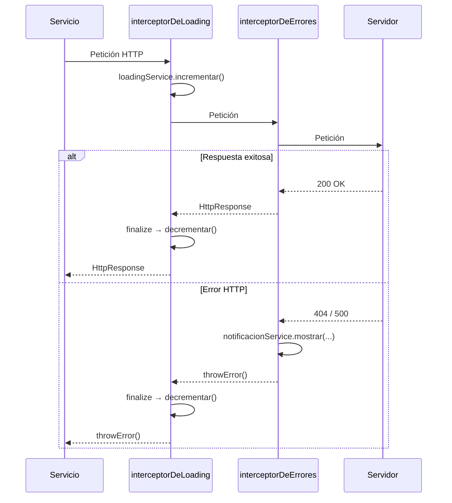

# Capítulo 15 - Parte 3: Interceptor de loading global y manejo centralizado de errores

> **Parte 3 de 4** · Capítulo 15 · PARTE VIII - Comunicación HTTP

Dos de los problemas más frecuentes en aplicaciones Angular son: mostrar un indicador de carga consistente mientras hay peticiones HTTP activas, y manejar los errores de red de forma uniforme sin duplicar el bloque `catchError` en cada servicio. En esta parte resolveremos ambos con interceptores funcionales y la potencia de los Signals.

---

## El servicio de loading con Signals

Antes de escribir el interceptor, necesitamos un servicio que lleve la cuenta de cuántas peticiones HTTP están activas en este momento. La idea es sencilla: si hay al menos una petición activa, mostramos el indicador de carga.

```typescript
// services/loading.service.ts
import { Injectable, signal, computed } from '@angular/core';

@Injectable({ providedIn: 'root' })
export class LoadingService {
  // Contador interno: cuántas peticiones están en vuelo
  private readonly _contador = signal<number>(0);

  // Señal pública derivada: true si hay al menos una petición activa
  readonly estaCargando = computed(() => this._contador() > 0);

  // El contador nunca debe ser negativo
  incrementar(): void {
    this._contador.update((n) => n + 1);
  }

  decrementar(): void {
    this._contador.update((n) => Math.max(0, n - 1));
  }
}
```

Usamos `Math.max(0, n - 1)` como guardia defensiva: si por algún motivo `decrementar` se llama más veces que `incrementar`, el contador no se vuelve negativo. El signal `estaCargando` es derivado (computed), por lo que Angular solo recalcula su valor cuando `_contador` cambia, y cualquier template o efecto que lo consuma se actualiza automáticamente.

---

## El interceptor de loading

Con el servicio listo, el interceptor es muy conciso. La clave es usar `finalize()` de RxJS, que se ejecuta siempre al terminar el observable, ya sea por éxito, error o cancelación:

```typescript
// interceptores/loading.interceptor.ts
import {
  HttpInterceptorFn,
  HttpRequest,
  HttpHandlerFn,
  HttpEvent,
} from '@angular/common/http';
import { inject } from '@angular/core';
import { Observable } from 'rxjs';
import { finalize } from 'rxjs/operators';
import { LoadingService } from '../services/loading.service';

export const interceptorDeLoading: HttpInterceptorFn = (
  solicitud: HttpRequest<unknown>,
  siguiente: HttpHandlerFn,
): Observable<HttpEvent<unknown>> => {
  const loadingService = inject(LoadingService);

  loadingService.incrementar();

  return siguiente(solicitud).pipe(
    finalize(() => loadingService.decrementar()),
  );
};
```

`finalize` es el operador correcto aquí, no `tap` con el callback de `complete`. La diferencia es que `finalize` se ejecuta incluso cuando el observable se cancela por unsubscribe (lo que ocurre, por ejemplo, cuando el usuario navega a otra ruta antes de que termine la petición). Esa consistencia es crítica para mantener el contador sincronizado.

---

## Usar el loading en los componentes

El componente de la barra de carga es el consumidor natural de `LoadingService`. Gracias a los Signals, no necesita suscribirse manualmente:

```typescript
// components/barra-carga/barra-carga.component.ts
import { Component, inject } from '@angular/core';
import { LoadingService } from '../../services/loading.service';

@Component({
  selector: 'app-barra-carga',
  standalone: true,
  template: `
    @if (loadingService.estaCargando()) {
      <div class="barra-carga" role="progressbar" aria-label="Cargando...">
        <div class="progreso-indeterminado"></div>
      </div>
    }
  `,
  styleUrl: './barra-carga.component.scss',
})
export class BarraCargaComponent {
  protected readonly loadingService = inject(LoadingService);
}
```

```html
<!-- app.component.html -->
<app-barra-carga />
<router-outlet />
```

La barra de carga vive en el componente raíz para que esté presente en toda la aplicación. Cuando `estaCargando()` cambia, Angular actualiza el DOM automáticamente gracias a la detección de cambios reactiva de los Signals.

---

## El servicio de notificaciones para errores

Antes de escribir el interceptor de errores, necesitamos una forma de mostrar mensajes al usuario. Un servicio simple de toast nos alcanza:

```typescript
// services/notificacion.service.ts
import { Injectable, signal } from '@angular/core';

export type TipoNotificacion = 'error' | 'advertencia' | 'info' | 'exito';

export interface Notificacion {
  id: number;
  tipo: TipoNotificacion;
  mensaje: string;
}

@Injectable({ providedIn: 'root' })
export class NotificacionService {
  private _siguiente_id = 0;
  readonly notificaciones = signal<Notificacion[]>([]);

  mostrar(tipo: TipoNotificacion, mensaje: string): void {
    const nueva: Notificacion = {
      id: this._siguiente_id++,
      tipo,
      mensaje,
    };
    this.notificaciones.update((lista) => [...lista, nueva]);

    setTimeout(() => this.eliminar(nueva.id), 5000);
  }

  eliminar(id: number): void {
    this.notificaciones.update((lista) =>
      lista.filter((n) => n.id !== id),
    );
  }
}
```

---

## El interceptor de manejo centralizado de errores

Ahora construimos el interceptor que captura los errores HTTP y muestra el mensaje apropiado según el código de estado:

```typescript
// interceptores/errores.interceptor.ts
import {
  HttpInterceptorFn,
  HttpRequest,
  HttpHandlerFn,
  HttpEvent,
  HttpErrorResponse,
} from '@angular/common/http';
import { inject } from '@angular/core';
import { Observable, throwError } from 'rxjs';
import { catchError } from 'rxjs/operators';
import { NotificacionService } from '../services/notificacion.service';

const MENSAJES_ERROR: Record<number, string> = {
  400: 'La solicitud contiene datos inválidos. Revisa los campos e intenta de nuevo.',
  401: 'Tu sesión ha expirado. Por favor, inicia sesión nuevamente.',
  403: 'No tienes permisos para realizar esta acción.',
  404: 'El recurso solicitado no fue encontrado.',
  408: 'La solicitud tardó demasiado. Verifica tu conexión.',
  409: 'Hay un conflicto con los datos actuales. Actualiza la página.',
  422: 'Los datos enviados no pudieron procesarse.',
  429: 'Demasiadas solicitudes. Espera un momento antes de intentar de nuevo.',
  500: 'Error interno del servidor. El equipo ha sido notificado.',
  502: 'El servidor no está disponible en este momento.',
  503: 'Servicio temporalmente no disponible. Intenta más tarde.',
};

export const interceptorDeErrores: HttpInterceptorFn = (
  solicitud: HttpRequest<unknown>,
  siguiente: HttpHandlerFn,
): Observable<HttpEvent<unknown>> => {
  const notificacionService = inject(NotificacionService);

  return siguiente(solicitud).pipe(
    catchError((error: unknown) => {
      if (error instanceof HttpErrorResponse) {
        const mensaje =
          MENSAJES_ERROR[error.status] ??
          `Error inesperado (${error.status}). Intenta de nuevo.`;

        const tipo = error.status >= 500 ? 'error' : 'advertencia';
        notificacionService.mostrar(tipo, mensaje);
      }

      // Siempre relanzamos para que el código que hizo la petición
      // pueda manejar el error en su propio contexto si lo necesita
      return throwError(() => error);
    }),
  );
};
```

El diccionario `MENSAJES_ERROR` centraliza los mensajes para que sean fáciles de actualizar o internacionalizar. Los errores 5xx se muestran como `'error'` (rojo) y los 4xx como `'advertencia'` (amarillo), porque los errores del cliente son a menudo recuperables.

---

## Excluir peticiones del interceptor de loading

Hay casos donde no queremos mostrar el spinner: auto-guardado silencioso, polling en background, actualizaciones de presencia. Podemos usar headers personalizados que el interceptor detecte y respete:

```typescript
// interceptores/loading.interceptor.ts (versión con exclusión)
import {
  HttpInterceptorFn,
  HttpRequest,
  HttpHandlerFn,
  HttpEvent,
} from '@angular/common/http';
import { inject } from '@angular/core';
import { Observable } from 'rxjs';
import { finalize } from 'rxjs/operators';
import { LoadingService } from '../services/loading.service';

const HEADER_SILENCIOSO = 'X-Sin-Loading';

export const interceptorDeLoading: HttpInterceptorFn = (
  solicitud: HttpRequest<unknown>,
  siguiente: HttpHandlerFn,
): Observable<HttpEvent<unknown>> => {
  const loadingService = inject(LoadingService);

  if (solicitud.headers.has(HEADER_SILENCIOSO)) {
    // Eliminamos el header antes de enviar al servidor
    const solicitudLimpia = solicitud.clone({
      headers: solicitud.headers.delete(HEADER_SILENCIOSO),
    });
    return siguiente(solicitudLimpia);
  }

  loadingService.incrementar();
  return siguiente(solicitud).pipe(
    finalize(() => loadingService.decrementar()),
  );
};
```

Para usarlo desde un servicio, simplemente agregamos el header especial:

```typescript
// services/presencia.service.ts (fragmento)
import { inject } from '@angular/core';
import { HttpClient, HttpHeaders } from '@angular/common/http';

export class PresenciaService {
  private readonly http = inject(HttpClient);

  actualizarPresencia(): void {
    this.http.post('/api/presencia/ping', {}, {
      headers: new HttpHeaders({ 'X-Sin-Loading': 'true' }),
    }).subscribe();
  }
}
```

---

## Diagrama del flujo combinado



---

## Puntos clave

- Un `signal<number>` como contador de peticiones activas, combinado con `computed(() => contador() > 0)`, es el patrón más limpio para un loading global reactivo con Signals.
- `finalize()` es el operador correcto para decrementar el contador: se ejecuta siempre, incluso cuando la petición se cancela por navegación o unsubscribe.
- El interceptor de errores centraliza los mensajes amigables en un diccionario keyed por código HTTP, lo que facilita el mantenimiento y la internacionalización.
- Siempre relanzamos el error después de notificar al usuario: el servicio consumidor puede necesitar actualizar su propio estado (limpiar un formulario, resetear un botón, etc.).
- Los headers personalizados como `X-Sin-Loading` son una forma elegante de dar a los servicios control sobre el comportamiento del interceptor sin acoplarlos directamente.

---

## ¿Qué sigue?

En la parte 4 exploraremos estrategias de caché HTTP en memoria usando `shareReplay(1)` y la lógica de reintentos automáticos con backoff exponencial mediante `retryWhen` y `timer`.
