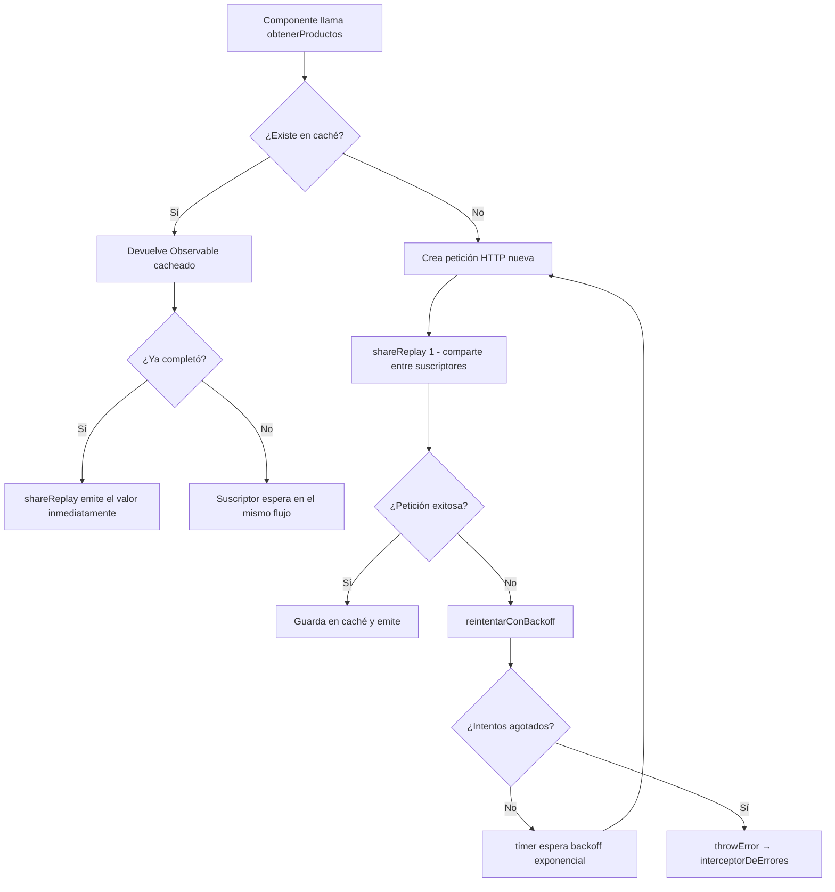

# Capítulo 15 - Parte 4: Estrategias de caché HTTP y retry con RxJS

> **Parte 4 de 4** · Capítulo 15 · PARTE VIII - Comunicación HTTP

Cuando una aplicación hace la misma petición HTTP repetidamente, estamos desperdiciando ancho de banda, aumentando la latencia percibida y sobrecargando el servidor. La caché en memoria es la solución más directa para datos que cambian poco. Y cuando la red falla, los reintentos automáticos con backoff exponencial son la diferencia entre una aplicación frágil y una resiliente. En esta parte construiremos ambas capacidades.

---

## ¿Cuándo cachear y cuándo no?

Antes de escribir código, aclaremos las reglas de oro:

**Cachear cuando:**
- Los datos cambian con poca frecuencia (catálogos, configuraciones, listas de referencia).
- Múltiples partes de la aplicación necesitan los mismos datos simultáneamente.
- El costo de una petición extra es significativo (latencia alta, API con límite de rate).

**No cachear cuando:**
- Los datos deben estar siempre frescos (saldo de cuenta, precio en tiempo real).
- La petición tiene efectos secundarios en el servidor (POST, PUT, DELETE, PATCH).
- El usuario tiene datos personalizados que dependen de su sesión o permisos.

La caché que construiremos vive en memoria: se borra al recargar la página o al cerrar el tab. No es una caché persistente como la del Service Worker. Es exactamente lo que necesitamos para el caso de uso de "datos de catálogo que no cambian durante la sesión".

---

## Caché en memoria con Map y shareReplay

La idea central es guardar el `Observable` de la petición HTTP, no el resultado. Esto nos permite que múltiples suscriptores compartan exactamente la misma petición usando `shareReplay(1)`:

```typescript
// services/catalogo.service.ts
import { Injectable, inject } from '@angular/core';
import { HttpClient } from '@angular/common/http';
import { Observable, shareReplay } from 'rxjs';

export interface Categoria {
  id: number;
  nombre: string;
  descripcion: string;
}

@Injectable({ providedIn: 'root' })
export class CatalogoService {
  private readonly http = inject(HttpClient);
  private readonly URL_BASE = '/api/catalogo';

  // La caché guarda Observables, no datos crudos
  private readonly cache = new Map<string, Observable<unknown>>();

  obtenerCategorias(): Observable<Categoria[]> {
    return this.obtenerConCache<Categoria[]>(`${this.URL_BASE}/categorias`);
  }

  obtenerCategoriasPorTipo(tipo: string): Observable<Categoria[]> {
    const url = `${this.URL_BASE}/categorias?tipo=${tipo}`;
    return this.obtenerConCache<Categoria[]>(url);
  }

  private obtenerConCache<T>(url: string): Observable<T> {
    const entrada = this.cache.get(url);

    if (entrada) {
      return entrada as Observable<T>;
    }

    const peticion$ = this.http.get<T>(url).pipe(
      shareReplay(1),
    );

    this.cache.set(url, peticion$);
    return peticion$;
  }
}
```

`shareReplay(1)` es el operador clave aquí. Cuando el primer suscriptor se conecta, dispara la petición HTTP. Si un segundo suscriptor llega mientras la petición está en vuelo, `shareReplay` le da el mismo observable en lugar de crear una nueva petición. Si llega después de que la petición completó, `shareReplay(1)` le retransmite el último valor cacheado inmediatamente. El `1` significa que guarda exactamente un valor en el buffer.

---

## ¿Por qué guardar el Observable y no el dato?

Si guardáramos el dato directamente, necesitaríamos manejar el estado de la petición: ¿ya llegó? ¿está pendiente? ¿falló? Con `shareReplay`, el Observable ya maneja todo eso. Los suscriptores que llegan durante la petición simplemente se suscriben al mismo flujo y reciben el resultado cuando llegue. Es más simple y más correcto.

---

## Invalidación de caché

La caché debe invalidarse cuando mutamos datos. Si el usuario crea una nueva categoría, la lista en caché ya no es válida:

```typescript
// services/catalogo.service.ts (continuación)
import { tap } from 'rxjs/operators';

// Dentro de CatalogoService:

crearCategoria(datos: Omit<Categoria, 'id'>): Observable<Categoria> {
  return this.http.post<Categoria>(`${this.URL_BASE}/categorias`, datos).pipe(
    tap(() => this.invalidarCacheDeUrl(`${this.URL_BASE}/categorias`)),
  );
}

actualizarCategoria(id: number, datos: Partial<Categoria>): Observable<Categoria> {
  return this.http.put<Categoria>(`${this.URL_BASE}/categorias/${id}`, datos).pipe(
    tap(() => this.invalidarCacheDeUrl(`${this.URL_BASE}/categorias`)),
  );
}

eliminarCategoria(id: number): Observable<void> {
  return this.http.delete<void>(`${this.URL_BASE}/categorias/${id}`).pipe(
    tap(() => this.invalidarCacheDeUrl(`${this.URL_BASE}/categorias`)),
  );
}

private invalidarCacheDeUrl(url: string): void {
  // Eliminamos todas las entradas que contienen esa URL base
  for (const clave of this.cache.keys()) {
    if (clave.startsWith(url)) {
      this.cache.delete(clave);
    }
  }
}

limpiarCacheCompleta(): void {
  this.cache.clear();
}
```

La invalidación por prefijo (`startsWith`) nos asegura de limpiar tanto `/categorias` como `/categorias?tipo=ropa` con una sola llamada.

---

## retry: reintentos automáticos simples

Para peticiones que pueden fallar por problemas de red transitorios, `retry(n)` reintenta la petición hasta n veces antes de propagar el error:

```typescript
// services/reportes.service.ts
import { Injectable, inject } from '@angular/core';
import { HttpClient } from '@angular/common/http';
import { Observable } from 'rxjs';
import { retry, shareReplay } from 'rxjs/operators';

export interface Reporte {
  id: string;
  titulo: string;
  datos: unknown;
}

@Injectable({ providedIn: 'root' })
export class ReportesService {
  private readonly http = inject(HttpClient);

  obtenerReporte(id: string): Observable<Reporte> {
    return this.http.get<Reporte>(`/api/reportes/${id}`).pipe(
      retry(3), // reintenta hasta 3 veces antes de fallar
      shareReplay(1),
    );
  }
}
```

`retry(3)` es suficiente para muchos casos, pero tiene un problema: reintenta inmediatamente, lo que puede saturar un servidor ya sobrecargado. Para eso necesitamos backoff exponencial.

---

## retryWhen con backoff exponencial

El backoff exponencial aumenta el tiempo de espera entre reintentos: 1 segundo, luego 2, luego 4, luego 8... Esto le da tiempo al servidor de recuperarse antes del siguiente intento:

```typescript
// utils/retry-con-backoff.ts
import { Observable, throwError, timer } from 'rxjs';
import { mergeMap, retryWhen } from 'rxjs/operators';

export interface OpcionesBackoff {
  intentosMaximos: number;
  escalaMs: number;
  erroresSoloDeRed: boolean;
}

const OPCIONES_DEFAULT: OpcionesBackoff = {
  intentosMaximos: 4,
  escalaMs: 1000,
  erroresSoloDeRed: true,
};

export function reintentarConBackoff(
  opciones: Partial<OpcionesBackoff> = {},
) {
  const config = { ...OPCIONES_DEFAULT, ...opciones };

  return retryWhen((errores$: Observable<unknown>) =>
    errores$.pipe(
      mergeMap((error: unknown, intento: number) => {
        const intentoActual = intento + 1;

        // Si es error de red o no filtramos por tipo, reintentamos
        const esErrorDeRed =
          error instanceof Error && error.message.includes('NetworkError');

        if (
          intentoActual >= config.intentosMaximos ||
          (config.erroresSoloDeRed && !esErrorDeRed)
        ) {
          return throwError(() => error);
        }

        const espera = config.escalaMs * Math.pow(2, intento);
        console.warn(`Reintento ${intentoActual} en ${espera}ms...`);

        return timer(espera);
      }),
    ),
  );
}
```

```typescript
// en el servicio
obtenerDatosConResiliencia(id: string): Observable<Reporte> {
  return this.http.get<Reporte>(`/api/reportes/${id}`).pipe(
    reintentarConBackoff({ intentosMaximos: 3, escalaMs: 500 }),
    shareReplay(1),
  );
}
```

Con `escalaMs: 500` y 3 intentos, las esperas serían 500ms, 1000ms y 2000ms: progresión razonable para no hacer esperar demasiado al usuario pero tampoco martillar el servidor.

---

## Servicio completo de catálogo con caché y reintentos

Veamos el servicio completo que combina caché, invalidación y reintentos:

```typescript
// services/catalogo-completo.service.ts
import { Injectable, inject } from '@angular/core';
import { HttpClient } from '@angular/common/http';
import { Observable } from 'rxjs';
import { shareReplay, tap } from 'rxjs/operators';
import { reintentarConBackoff } from '../utils/retry-con-backoff';

export interface Producto {
  id: number;
  nombre: string;
  precio: number;
  categoriaId: number;
}

@Injectable({ providedIn: 'root' })
export class CatalogoCompletoService {
  private readonly http = inject(HttpClient);
  private readonly cache = new Map<string, Observable<unknown>>();
  private readonly URL = '/api/v1';

  obtenerProductos(): Observable<Producto[]> {
    return this.conCache<Producto[]>(`${this.URL}/productos`);
  }

  obtenerProducto(id: number): Observable<Producto> {
    return this.conCache<Producto>(`${this.URL}/productos/${id}`);
  }

  crearProducto(datos: Omit<Producto, 'id'>): Observable<Producto> {
    return this.http.post<Producto>(`${this.URL}/productos`, datos).pipe(
      tap(() => this.invalidar(`${this.URL}/productos`)),
    );
  }

  private conCache<T>(url: string): Observable<T> {
    if (!this.cache.has(url)) {
      const obs$ = this.http.get<T>(url).pipe(
        reintentarConBackoff({ intentosMaximos: 3 }),
        shareReplay(1),
      );
      this.cache.set(url, obs$);
    }
    return this.cache.get(url) as Observable<T>;
  }

  private invalidar(prefijo: string): void {
    for (const clave of this.cache.keys()) {
      if (clave.startsWith(prefijo)) this.cache.delete(clave);
    }
  }
}
```

---

## Diagrama del flujo de caché y reintentos



---

## Puntos clave

- Cachear el `Observable` con `shareReplay(1)` es superior a cachear el dato crudo porque el observable maneja automáticamente el estado de petición pendiente, exitosa o fallida.
- La invalidación de caché en operaciones de mutación (POST/PUT/DELETE) es obligatoria; sin ella, la aplicación mostrará datos obsoletos hasta que el usuario recargue la página.
- `retry(n)` es simple y efectivo para peticiones idempotentes en redes inestables; `retryWhen` con `timer` permite implementar backoff exponencial para no sobrecargar servidores.
- El patrón de método privado `conCache<T>(url)` centraliza la lógica de caché en el servicio y evita duplicar el código en cada método público.
- La caché en memoria no sobrevive a recarga de página ni es compartida entre tabs; para esos casos se necesita IndexedDB, localStorage o un Service Worker con estrategia de caché.

---

## ¿Qué sigue?

Con este capítulo completamos la sección de comunicación HTTP. En el siguiente capítulo exploraremos las estrategias de manejo de estado a nivel de aplicación, donde veremos cómo Signals y los servicios con estado reemplazan a NgRx para la mayoría de los casos de uso sin la complejidad adicional de un store dedicado.
