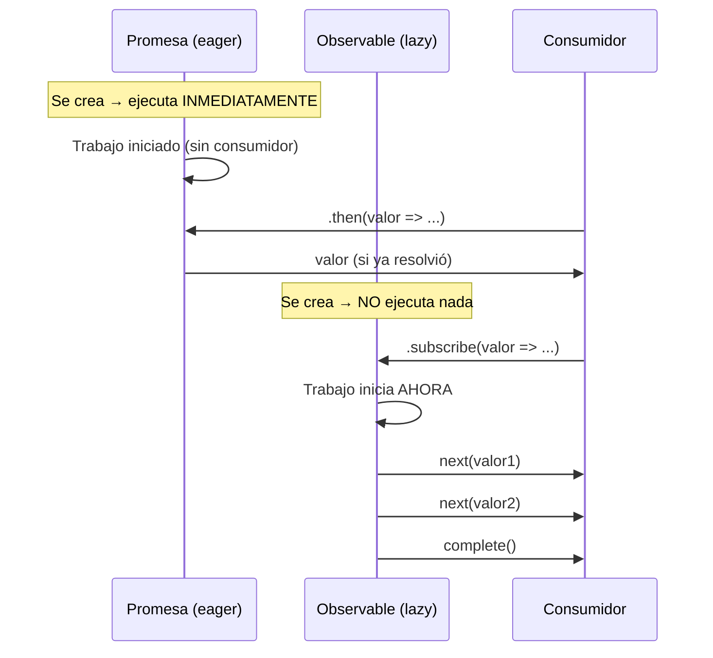

# Capítulo 16 - Parte 1: ¿Qué es la programación reactiva? Observables vs Promesas

> **Parte 1 de 4** · Capítulo 16 · PARTE IX - Programación Reactiva con RxJS

La programación reactiva es un paradigma donde los programas se construyen como reacciones a flujos de datos que cambian en el tiempo. En lugar de pedir datos cuando los necesitamos, declaramos qué queremos hacer cuando los datos lleguen. Este cambio de mentalidad, de "ir a buscar" a "reaccionar cuando llega", es la esencia de RxJS en Angular.

## Push vs Pull: el contrato fundamental

Todo sistema de comunicación de datos puede clasificarse según quién controla el flujo de información. En el modelo **pull**, el consumidor decide cuándo pedir datos: es lo que ocurre con funciones normales y con `async/await`. Llamas a la función, esperas, obtienes el resultado. El productor no sabe nada del consumidor hasta que este pregunta.

En el modelo **push**, el productor decide cuándo enviar datos. El consumidor simplemente registra su interés y espera. Los Observables de RxJS son push: cuando un observable tiene un valor, lo empuja hacia sus suscriptores sin que estos lo soliciten activamente en ese instante.

Esta distinción tiene consecuencias profundas. Con pull, el código fluye de arriba hacia abajo de forma predecible. Con push, el código se organiza en reacciones: "cuando llegue un evento de tipo X, haz Y". Angular está construido sobre push: los eventos del DOM, las respuestas HTTP, los cambios de ruta y los cambios de estado son todos flujos que empujan valores.

## Lazy vs Eager: cuándo empieza la ejecución

Una Promesa es **eager** (ansiosa): en el momento en que la creas, el trabajo ya comenzó. Si construyes una Promesa que hace una petición HTTP, esa petición se dispara inmediatamente, incluso si nunca consumes el resultado con `.then()`.

Un Observable es **lazy** (perezoso): no hace nada hasta que alguien se suscribe. Puedes definir un Observable complejo con múltiples transformaciones y ninguna línea de ese pipeline se ejecuta hasta el momento de la suscripción. Esto permite componer operaciones sin efectos secundarios prematuros.

```typescript
import { Observable } from 'rxjs';

// Esta función retorna un Observable - aún no ejecuta nada
function obtenerUsuario(id: number): Observable<string> {
  return new Observable<string>(observer => {
    // Este código solo corre cuando alguien se suscriba
    console.log('Iniciando búsqueda de usuario...');
    observer.next(`Usuario ${id}`);
    observer.complete();
  });
}

const usuario$ = obtenerUsuario(42); // No imprime nada todavía

// Solo aquí comienza la ejecución:
usuario$.subscribe(valor => console.log(valor));
// → "Iniciando búsqueda de usuario..."
// → "Usuario 42"
```

El símbolo `$` al final del nombre es una convención de la comunidad Angular/RxJS para indicar que una variable contiene un Observable. No es obligatorio pero sí altamente recomendado para la legibilidad.

## Unicast vs Multicast: una suscripción, una ejecución

Las Promesas son **multicast** por naturaleza: una misma Promesa puede tener múltiples consumidores `.then()` y todos reciben el mismo valor resuelto. La ejecución ocurre una sola vez.

Los Observables fríos (cold observables) son **unicast**: cada suscripción es una ejecución independiente del Observable. Si dos componentes se suscriben al mismo Observable HTTP, se realizan dos peticiones HTTP distintas. Esto puede sorprender a quien viene del mundo de las Promesas.

Más adelante veremos cómo convertir un Observable frío en uno multicast con operadores como `shareReplay` → Ver Capítulo 18, Parte 1.

## Diagrama comparativo: Promise vs Observable



La diferencia temporal más importante es esta: la Promesa inicia su trabajo en el momento de creación. El Observable inicia su trabajo en el momento de suscripción. Además, el Observable puede emitir múltiples valores a lo largo del tiempo, mientras que la Promesa resuelve exactamente una vez.

## Por qué RxJS encaja perfectamente con Angular

Angular eligió RxJS como biblioteca de reactividad por razones que van más allá de la moda. Veamos los tres ejes donde RxJS brilla en el contexto de Angular.

**Eventos del DOM y del usuario.** Clics, inputs, scroll, resize: todos son flujos de eventos que ocurren en el tiempo. RxJS convierte cualquier evento del DOM en un Observable con `fromEvent`, permitiendo aplicar transformaciones como debounce, throttle o filtrado sin escribir código imperativo complejo.

**Peticiones HTTP.** `HttpClient` de Angular retorna Observables, no Promesas. Esto permite cancelar peticiones en vuelo (algo imposible con Promesas nativas), reintentar automáticamente con backoff, y encadenar transformaciones con operadores sin anidar callbacks.

```typescript
import { inject } from '@angular/core';
import { HttpClient } from '@angular/common/http';
import { map, retry, catchError } from 'rxjs/operators';
import { EMPTY } from 'rxjs';

// En un servicio Angular
const http = inject(HttpClient);

const productos$ = http.get<{ items: string[] }>('/api/productos').pipe(
  map(respuesta => respuesta.items),  // transformar la respuesta
  retry(2),                           // reintentar hasta 2 veces si falla
  catchError(() => EMPTY)             // si aún falla, emitir nada
);
```

**Estado compartido entre componentes.** Cuando múltiples componentes necesitan reaccionar al mismo estado (usuario autenticado, carrito de compras, tema de la aplicación), un Observable centralizado en un servicio actúa como fuente de verdad reactiva. Los componentes se suscriben y reaccionan automáticamente a los cambios sin necesidad de pasar datos manualmente por la jerarquía de componentes.

La sinergia entre Angular y RxJS es tan profunda que el propio framework usa Observables internamente: el Router expone eventos de navegación como Observable, el `FormControl` expone `valueChanges` como Observable, y el sistema de HTTP funciona íntegramente sobre Observables.

## Puntos clave

- La programación reactiva reemplaza el modelo pull (pedir datos) por el modelo push (reaccionar cuando llegan)
- Las Promesas son eager (ejecutan al crearse) y unicast (un solo valor); los Observables son lazy (ejecutan al suscribirse) y pueden emitir múltiples valores
- Un Observable frío crea una ejecución independiente por cada suscripción
- Angular usa RxJS en tres áreas fundamentales: eventos del DOM, HTTP y estado compartido
- El sufijo `$` en nombres de variables indica un Observable por convención

## ¿Qué sigue?

En la Parte 2 diseccionamos la anatomía de un Observable: qué es un Observer, cómo funciona el contrato next/error/complete y qué sucede cuando llamamos a `unsubscribe()`.
