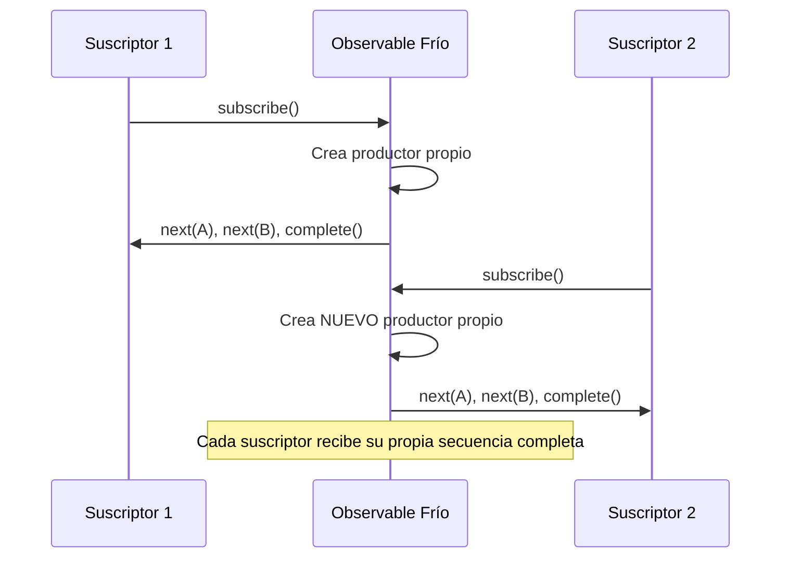

# Capítulo 16 - Parte 2: Observable, Observer, Subscription y el contrato reactivo

> **Parte 2 de 4** · Capítulo 16 · PARTE IX - Programación Reactiva con RxJS

Un Observable no es magia: es una función que acepta un Observer y, cuando se llama, ejecuta una serie de notificaciones hacia ese Observer. Entender esta mecánica interna es lo que separa a quien "usa RxJS" de quien "entiende RxJS". Cuando sabes exactamente qué ocurre bajo el capó, los bugs reactivos se vuelven obvios y las optimizaciones, naturales.

## Anatomía de un Observable

La forma más directa de entender un Observable es creando uno desde cero con el constructor `new Observable`. Recibe una función llamada "función suscriptora" que acepta un `Observer` como argumento:

```typescript
import { Observable, Observer } from 'rxjs';

const contador$ = new Observable<number>((observer: Observer<number>) => {
  // Enviamos valores con next()
  observer.next(1);
  observer.next(2);
  observer.next(3);
  // Señalizamos que no habrá más valores
  observer.complete();
});

// El código de arriba no ejecutó nada todavía
contador$.subscribe({
  next: valor => console.log('Valor:', valor),
  error: err => console.error('Error:', err),
  complete: () => console.log('Completado')
});
// → Valor: 1
// → Valor: 2
// → Valor: 3
// → Completado
```

Observa que la función suscriptora es simplemente código TypeScript normal. No hay asincronía implícita, no hay magia. El Observable es solo una abstracción sobre "cuando alguien se suscriba, ejecuta esta función".

## next, error y complete: el contrato de tres señales

Todo Observer implementa tres métodos. Este contrato es el núcleo de RxJS y nunca debe violarse:

**`next(valor)`** - Notifica un valor nuevo. Puede llamarse cero, una o infinitas veces. Es la notificación normal del flujo de datos.

**`error(err)`** - Notifica un error fatal. Después de llamar `error`, el Observable termina y nunca más emitirá `next` ni `complete`. El canal está cerrado.

**`complete()`** - Notifica que el stream terminó exitosamente. Después de llamar `complete`, el Observable nunca más emitirá `next` ni `error`. El canal está cerrado.

La regla crítica: **`error` y `complete` son terminales**. Una vez que cualquiera de los dos ocurre, el Observable se considera terminado. Cualquier `next` posterior es ignorado por RxJS internamente:

```typescript
import { Observable } from 'rxjs';

const mal$ = new Observable<number>(observer => {
  observer.next(1);
  observer.complete();      // termina el stream
  observer.next(2);         // esta línea se ignora automáticamente
  observer.error('tarde');  // también se ignora
});

mal$.subscribe({
  next: v => console.log(v),      // solo imprime: 1
  complete: () => console.log('fin') // imprime: fin
});
```

## El ciclo de vida de la Subscription

Cuando llamas a `.subscribe()`, obtienes un objeto `Subscription`. Este objeto representa la conexión activa entre el Observable y el Observer. Su método más importante es `unsubscribe()`, que desconecta al Observer y libera recursos:

```typescript
import { interval } from 'rxjs';

// interval emite 0, 1, 2, 3... cada segundo, infinitamente
const temporizador$ = interval(1000);

const suscripcion = temporizador$.subscribe(n => {
  console.log('Tick:', n);
});

// Después de 5 segundos, detenemos
setTimeout(() => {
  suscripcion.unsubscribe();
  console.log('Suscripción cancelada');
}, 5000);
// → Tick: 0, Tick: 1, Tick: 2, Tick: 3, Tick: 4, Suscripción cancelada
```

El Observable también puede exponer una **función de limpieza** que se ejecuta automáticamente cuando se desuscribe. Esto es crucial para registrar y desregistrar event listeners correctamente:

```typescript
import { Observable } from 'rxjs';

function fromClicksEnBoton(boton: HTMLButtonElement): Observable<MouseEvent> {
  return new Observable<MouseEvent>(observer => {
    const manejador = (evento: MouseEvent) => observer.next(evento);
    boton.addEventListener('click', manejador);

    // Esta función se llama al desuscribirse → limpieza garantizada
    return () => {
      boton.removeEventListener('click', manejador);
    };
  });
}
```

Sin esta función de limpieza retornada, el event listener quedaría vivo aunque nadie esté escuchando, causando el clásico memory leak reactivo.

## Cold vs Hot Observables

Esta distinción es una de las más importantes de RxJS y fuente frecuente de confusión.

Un **Observable frío** (cold) produce sus valores dentro de la función suscriptora. Cada suscripción tiene su propia ejecución independiente y su propio productor de datos. Los Observables de `HttpClient` son fríos: cada suscripción realiza una petición HTTP independiente.



Un **Observable caliente** (hot) produce valores independientemente de las suscripciones. Cuando te suscribes, recibes solo los valores que se emitan a partir de ese momento, como una radio: no puedes escuchar lo que ya se transmitió.

```typescript
import { Subject } from 'rxjs';

// Subject es el ejemplo más sencillo de Observable caliente
const eventos$ = new Subject<string>();

// Primer suscriptor
eventos$.subscribe(v => console.log('S1:', v));

eventos$.next('evento A');  // S1 recibe 'evento A'

// Segundo suscriptor se une tarde
eventos$.subscribe(v => console.log('S2:', v));

eventos$.next('evento B');  // Tanto S1 como S2 reciben 'evento B'
// S2 nunca recibe 'evento A' porque llegó después
```

Los Subjects son la manera estándar de crear Observables calientes en Angular, y los exploraremos en profundidad en la Parte 3.

## Puntos clave

- Un Observable es una función que acepta un Observer y ejecuta su lógica interna al ser suscrita
- El contrato `next` / `error` / `complete` es inviolable: `error` y `complete` terminan el stream de forma permanente
- `Subscription.unsubscribe()` desconecta al Observer y, si el Observable retornó una función de limpieza, la ejecuta
- Los Observables fríos crean un productor por suscripción; los calientes comparten un único productor entre todos los suscriptores
- No retornar la función de limpieza en el constructor de Observable es fuente de memory leaks

## ¿Qué sigue?

En la Parte 3 exploramos los Subjects: el mecanismo que permite que un Observable sea también un Observer, habilitando el patrón multicast que es la base del estado compartido en Angular.
