# Capítulo 16 - Parte 3: Subject, BehaviorSubject, ReplaySubject y AsyncSubject

> **Parte 3 de 4** · Capítulo 16 · PARTE IX - Programación Reactiva con RxJS

Los Subjects son el puente entre el mundo imperativo y el reactivo en RxJS. Si los Observables son ríos que fluyen solos, los Subjects son compuertas: tú controlas cuándo y qué valor fluye, y todos los suscriptores reciben la misma agua al mismo tiempo. Son la herramienta central para construir estado reactivo en Angular.

## Subject: Observable y Observer simultáneos

Un `Subject` implementa tanto la interfaz `Observable` (puedes suscribirte a él) como la interfaz `Observer` (puedes empujar valores hacia él con `next`, `error` y `complete`). Esta dualidad es lo que lo hace tan poderoso.

```typescript
import { Subject } from 'rxjs';

const notificaciones$ = new Subject<string>();

// Suscriptor A
notificaciones$.subscribe(msg => console.log('A recibió:', msg));

// Emitimos un valor - A lo recibe
notificaciones$.next('Primera notificación');

// Suscriptor B se une
notificaciones$.subscribe(msg => console.log('B recibió:', msg));

// Ambos reciben este valor
notificaciones$.next('Segunda notificación');

// → A recibió: Primera notificación
// → A recibió: Segunda notificación
// → B recibió: Segunda notificación
```

B nunca vio "Primera notificación" porque se suscribió después de que fue emitida. Esta es la naturaleza caliente (hot) del `Subject`: no hay memoria del pasado.

Un uso muy común en Angular es el Subject como bus de eventos entre componentes sin relación padre-hijo directa. El servicio expone el Subject (o mejor, su Observable) y cualquier componente puede emitir o escuchar:

```typescript
import { Injectable } from '@angular/core';
import { Subject } from 'rxjs';

@Injectable({ providedIn: 'root' })
export class BusDeEventosService {
  private _itemAgregado$ = new Subject<string>();

  // Exponemos solo el lado Observable (no el lado Observer)
  readonly itemAgregado$ = this._itemAgregado$.asObservable();

  agregarItem(nombre: string): void {
    this._itemAgregado$.next(nombre);
  }
}
```

## BehaviorSubject: con memoria del último valor

El `BehaviorSubject` es un `Subject` que recuerda su último valor emitido. Cualquier nuevo suscriptor recibe inmediatamente ese último valor, incluso si se suscribió después de que fue emitido. Además, requiere un valor inicial en su constructor.

Esto lo hace ideal para representar **estado**: el carrito de compras, el usuario autenticado, el tema de la aplicación, todos son valores que tienen un estado actual que los nuevos observadores deben conocer al conectarse.

```typescript
import { BehaviorSubject } from 'rxjs';

// El usuario comienza como null (no autenticado)
const usuario$ = new BehaviorSubject<string | null>(null);

// Podemos leer el valor actual de forma síncrona
console.log(usuario$.value); // → null

// Suscriptor A
usuario$.subscribe(u => console.log('A ve usuario:', u));
// → A ve usuario: null (recibe el valor inicial inmediatamente)

usuario$.next('Ana');
// → A ve usuario: Ana

// Suscriptor B se conecta tarde pero recibe el estado actual
usuario$.subscribe(u => console.log('B ve usuario:', u));
// → B ve usuario: Ana (recibe el último valor emitido)
```

La propiedad `.value` permite acceso síncrono al valor actual sin necesidad de suscripción. Esto es especialmente útil en guards, resolvers y lógica de negocio donde necesitas el valor en un punto específico del flujo de ejecución.

## ReplaySubject: con memoria de N valores

Un `ReplaySubject(n)` memoriza los últimos `n` valores y los reproduce a cualquier nuevo suscriptor. Es como un `BehaviorSubject` pero con historial configurable.

```typescript
import { ReplaySubject } from 'rxjs';

// Recuerda los últimos 3 valores
const historial$ = new ReplaySubject<number>(3);

historial$.next(10);
historial$.next(20);
historial$.next(30);
historial$.next(40); // El 10 ya no se recuerda (solo últimos 3)

// Nuevo suscriptor recibe 20, 30, 40 inmediatamente
historial$.subscribe(v => console.log('Recibido:', v));
// → Recibido: 20
// → Recibido: 30
// → Recibido: 40
```

También acepta un segundo parámetro de tiempo en milisegundos: `new ReplaySubject(n, tiempoMs)`, que descarta valores más antiguos que `tiempoMs` milisegundos, independientemente de cuántos sean. Esto es útil para cachés con expiración temporal.

## AsyncSubject: solo el último valor al completar

El `AsyncSubject` es el más especializado de los cuatro. Solo emite el último valor, y únicamente cuando el Subject se completa con `complete()`. Mientras no se complete, ningún suscriptor recibe nada. Si nunca se completa, nadie recibe nunca nada.

```typescript
import { AsyncSubject } from 'rxjs';

const resultado$ = new AsyncSubject<number>();

resultado$.subscribe(v => console.log('Resultado:', v));

resultado$.next(100); // No emite nada todavía
resultado$.next(200); // No emite nada todavía
resultado$.next(300); // No emite nada todavía
resultado$.complete(); // AHORA emite el último valor

// → Resultado: 300
```

Su caso de uso es poco frecuente pero claro: operaciones donde solo importa el valor final, no los intermedios. Equivale conceptualmente a una Promesa pero con la interfaz de Observable.

## Diagrama: cuándo emite cada Subject

```mermaid
flowchart TD
    subgraph Subject["Subject (caliente puro)"]
        S1[Nuevo suscriptor] -->|se suscribe| SN[No recibe pasado]
        SN -->|próximo next| SR[Recibe valores nuevos]
    end

    subgraph BehaviorSubject["BehaviorSubject(valorInicial)"]
        B1[Nuevo suscriptor] -->|se suscribe| BL[Recibe último valor inmediatamente]
        BL -->|próximo next| BR[Recibe valores nuevos]
    end

    subgraph ReplaySubject["ReplaySubject(n)"]
        R1[Nuevo suscriptor] -->|se suscribe| RN["Recibe últimos N valores"]
        RN -->|próximo next| RR[Recibe valores nuevos]
    end

    subgraph AsyncSubject["AsyncSubject"]
        A1[Nuevo suscriptor] -->|se suscribe| AW[Espera en silencio]
        AW -->|complete llamado| AL[Recibe SOLO el último valor]
    end
```



## Cuándo usar cada uno

La elección entre los cuatro tipos de Subject depende de qué información necesitan los suscriptores tardíos:

| Subject | Suscriptor tardío recibe | Caso típico en Angular |
|---|---|---|
| `Subject` | Nada del pasado | Bus de eventos, notificaciones efímeras |
| `BehaviorSubject` | Último valor (estado actual) | Estado de autenticación, configuración, carrito |
| `ReplaySubject(n)` | Últimos N valores | Historial de mensajes, caché con historial |
| `AsyncSubject` | Último valor al completar | Resultados de cálculos asíncronos únicos |

Para estado de aplicación, `BehaviorSubject` es casi siempre la elección correcta. Para eventos sin estado (como notificaciones de tipo "toast" que se muestran y desaparecen), `Subject` es suficiente.

## Puntos clave

- Un `Subject` es simultáneamente Observable y Observer: puedes suscribirte a él y empujar valores hacia él
- `BehaviorSubject(valorInicial)` requiere un valor inicial y entrega el último valor emitido a cualquier nuevo suscriptor; `.value` permite acceso síncrono
- `ReplaySubject(n)` reproduce los últimos N valores a cada nuevo suscriptor
- `AsyncSubject` solo emite cuando se completa, y solo el último valor; todos los intermedios se descartan
- Exponer siempre los Subjects como Observables con `.asObservable()` para proteger la encapsulación

## ¿Qué sigue?

En la Parte 4 exploramos las funciones creadoras de RxJS: `of`, `from`, `interval`, `timer`, `fromEvent` y otras utilidades para generar Observables a partir de valores, arrays, Promesas y eventos del DOM.
