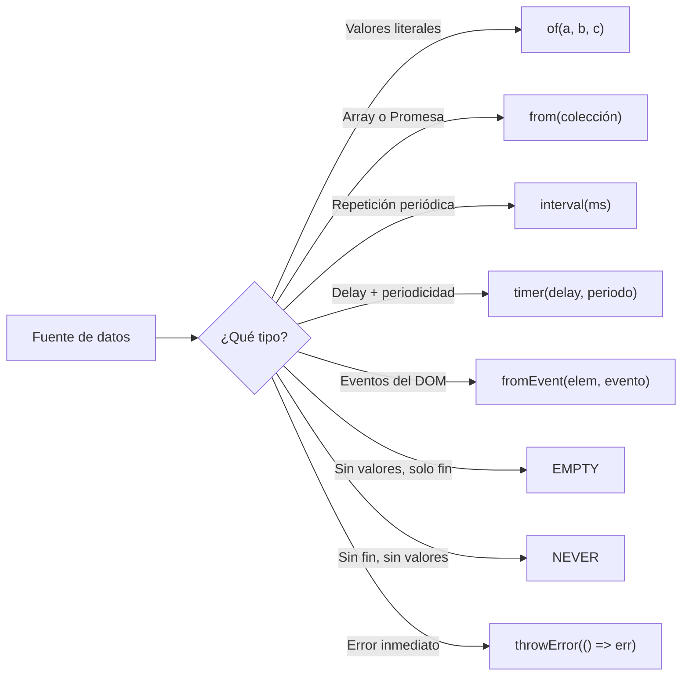

# Capítulo 16 - Parte 4: Creadores: of, from, interval, timer, fromEvent

> **Parte 4 de 4** · Capítulo 16 · PARTE IX - Programación Reactiva con RxJS

RxJS incluye un conjunto de funciones creadoras que convierten prácticamente cualquier fuente de datos en un Observable: valores literales, arrays, Promesas, eventos del DOM, temporizadores. Dominarlos elimina la necesidad de usar el constructor `new Observable` en la mayoría de los casos cotidianos, y hace el código más expresivo y conciso.

## `of`: valores síncronos como Observable

`of` convierte uno o varios valores en un Observable que los emite de forma síncrona y luego completa. Es la forma más simple de crear un Observable:

```typescript
import { of } from 'rxjs';

// Emite 1, 2, 3 de forma síncrona y completa
of(1, 2, 3).subscribe({
  next: v => console.log(v),
  complete: () => console.log('Fin')
});
// → 1, 2, 3, Fin

// También funciona con objetos
of({ nombre: 'Ana', edad: 30 }).subscribe(usuario => {
  console.log(usuario.nombre); // → Ana
});
```

En Angular, `of` es útil para crear Observables de valores mockeados en pruebas, para retornar valores por defecto en `catchError`, y para combinar con otros operadores sin necesitar datos asíncronos reales.

## `from`: arrays, Promesas e iterables

`from` es más versátil que `of`: convierte un array, un iterable, una Promesa o un Observable-like en un Observable. Cuando recibe un array, emite cada elemento individualmente (a diferencia de `of` que emite el array como un solo valor):

```typescript
import { from } from 'rxjs';

// Desde array: emite cada elemento individualmente
from([10, 20, 30]).subscribe(v => console.log(v));
// → 10, 20, 30

// Desde Promesa: emite el valor resuelto y completa
const promesa = fetch('/api/dato').then(r => r.json());
from(promesa).subscribe({
  next: datos => console.log(datos),
  error: err => console.error(err)
});

// Desde string (iterable): emite cada carácter
from('hola').subscribe(c => console.log(c));
// → h, o, l, a
```

La conversión de Promesas a Observables con `from` permite integrar APIs que retornan Promesas (como la Fetch API nativa) en pipelines reactivos de RxJS, aprovechando todos sus operadores.

## `interval`: temporizador infinito

`interval(milisegundos)` crea un Observable que emite números enteros incrementales (0, 1, 2...) con el intervalo especificado. El primer valor se emite después del primer intervalo, no inmediatamente. Nunca completa por sí solo:

```typescript
import { interval } from 'rxjs';
import { take } from 'rxjs/operators';

// Emite cada segundo, tomamos solo 5 valores
interval(1000).pipe(
  take(5) // limita a 5 emisiones y completa
).subscribe({
  next: n => console.log('Tick:', n),
  complete: () => console.log('Terminado')
});
// → Tick: 0 (al segundo 1)
// → Tick: 1 (al segundo 2)
// → ...
// → Tick: 4 (al segundo 5)
// → Terminado
```

En Angular, `interval` es útil para polling periódico, animaciones y cualquier tarea que deba repetirse en el tiempo.

## `timer`: delay inicial y período opcional

`timer` tiene dos formas. Con un argumento emite un único valor (0) después del delay y completa. Con dos argumentos funciona como `interval` pero con un delay inicial antes del primer tick:

```typescript
import { timer } from 'rxjs';

// Emite 0 después de 2 segundos y completa
timer(2000).subscribe(v => console.log('Ejecutado después de 2s:', v));

// Emite 0 a los 3s, luego 1, 2, 3... cada segundo
timer(3000, 1000).subscribe(n => {
  console.log('Contador:', n);
  // Aquí necesitarías desuscribirte o usar take()
});
```

La diferencia clave respecto a `interval`: `timer(0, 1000)` emite **inmediatamente** y luego cada segundo, mientras que `interval(1000)` espera un segundo antes de la primera emisión. En Angular, `timer` se usa frecuentemente para delays antes de redirigir al usuario, o para comenzar un polling después de un tiempo de gracia.

## `fromEvent`: eventos del DOM como Observable

`fromEvent` convierte cualquier fuente de eventos (elementos del DOM, EventEmitter de Node) en un Observable. Gestiona automáticamente el `addEventListener` y, al desuscribirse, el `removeEventListener`:

```typescript
import { fromEvent } from 'rxjs';
import { debounceTime, map } from 'rxjs/operators';
import { Component, OnInit, ElementRef, ViewChild, inject } from '@angular/core';

@Component({
  selector: 'app-buscador',
  standalone: true,
  template: `<input #campoBusqueda type="text" placeholder="Buscar...">`
})
export class BuscadorComponent implements OnInit {
  @ViewChild('campoBusqueda') campoBusqueda!: ElementRef<HTMLInputElement>;

  ngAfterViewInit(): void {
    // Convierte los eventos 'input' del campo en un stream reactivo
    fromEvent<InputEvent>(this.campoBusqueda.nativeElement, 'input').pipe(
      map(evento => (evento.target as HTMLInputElement).value),
      debounceTime(300) // espera 300ms de silencio antes de emitir
    ).subscribe(termino => {
      console.log('Buscando:', termino);
    });
  }
}
```

## `EMPTY` y `NEVER`: casos extremos útiles

`EMPTY` es un Observable que completa inmediatamente sin emitir ningún valor. `NEVER` es un Observable que nunca emite nada y nunca completa. Ambos son constantes, no funciones:

```typescript
import { EMPTY, NEVER } from 'rxjs';
import { catchError } from 'rxjs/operators';

// EMPTY: útil para silenciar errores devolviendo un stream vacío
const datosSeguro$ = obtenerDatos().pipe(
  catchError(() => EMPTY) // si falla, simplemente no emitir nada
);

// NEVER: útil en pruebas para simular Observables que nunca resuelven
```

## `throwError`: creando Observables de error

`throwError` crea un Observable que inmediatamente emite un error sin emitir ningún valor. En RxJS 7+ la forma correcta usa una función factory para evitar evaluar el error antes de la suscripción:

```typescript
import { throwError, of } from 'rxjs';
import { catchError } from 'rxjs/operators';

function validar(valor: number) {
  if (valor < 0) {
    // Factory function: el error se crea solo al suscribirse
    return throwError(() => new Error('El valor no puede ser negativo'));
  }
  return of(valor);
}

validar(-5).subscribe({
  next: v => console.log(v),
  error: err => console.error(err.message)
});
// → Error: El valor no puede ser negativo
```

## Resumen de creadores y sus casos de uso en Angular



## Puntos clave

- `of(a, b, c)` emite cada argumento síncronamente y completa; ideal para valores mock
- `from(array|promesa|iterable)` convierte estructuras existentes en Observables; `from(promesa)` integra código basado en Promesas al mundo RxJS
- `interval(ms)` emite infinitamente sin delay inicial; siempre limitar con `take()` o `takeUntil()`
- `timer(delay, periodo)` permite un retraso antes del primer tick, a diferencia de `interval`
- `fromEvent` gestiona el ciclo de vida del event listener automáticamente al desuscribirse
- `EMPTY` y `NEVER` son constantes, no funciones; `throwError` recibe una factory en RxJS 7+

## ¿Qué sigue?

En el Capítulo 17 profundizamos en los operadores de transformación: `map`, `switchMap`, `mergeMap`, `concatMap` y `exhaustMap`, que son las herramientas más poderosas y frecuentemente usadas de todo RxJS.
