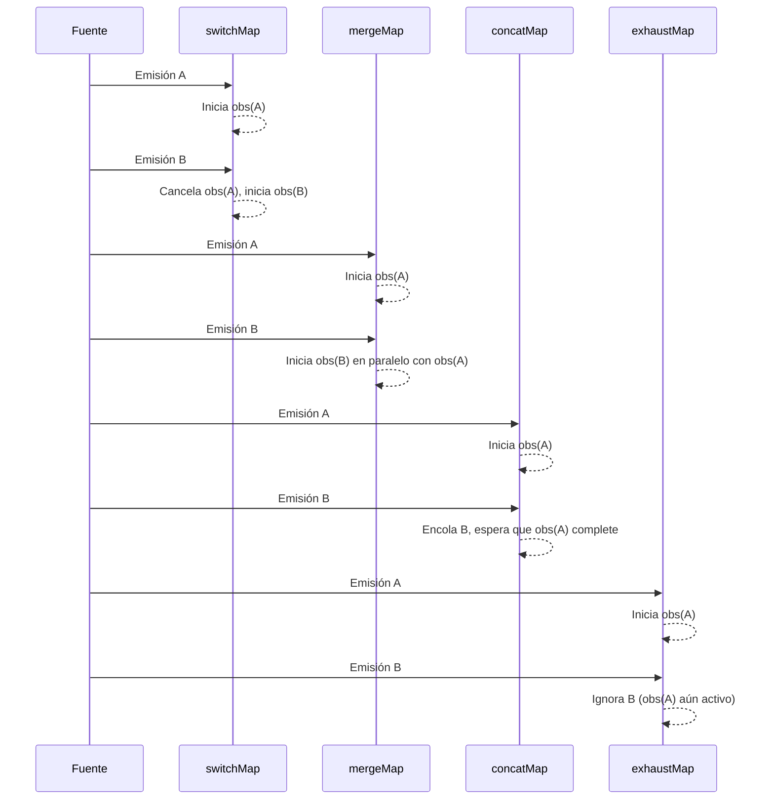

# Capítulo 17 - Parte 1: Transformación: map, switchMap, mergeMap, concatMap, exhaustMap

> **Parte 1 de 4** · Capítulo 17 · PARTE IX - Programación Reactiva con RxJS

Los operadores de transformación son el corazón de RxJS. Cuando trabajamos con Observables, rara vez queremos los valores tal como llegan: los transformamos, los aplanamos, los combinamos. En esta parte veremos el operador más fundamental -`map`- y los cuatro operadores de "aplanamiento" que todo desarrollador Angular debe dominar.

## map: la transformación elemental

`map` funciona exactamente igual que `Array.prototype.map`, pero para Observables. Toma cada valor emitido y lo transforma en otro valor usando una función proyectora.

```typescript
import { Component, OnInit } from '@angular/core';
import { HttpClient } from '@angular/common/http';
import { Observable } from 'rxjs';
import { map } from 'rxjs/operators';

interface ApiRespuesta {
  datos: { nombre: string; precio: number }[];
}

interface Producto {
  nombre: string;
  precioConIva: number;
}

@Component({
  selector: 'app-productos',
  template: `<ul><li *ngFor="let p of productos$ | async">{{ p.nombre }} - {{ p.precioConIva }}</li></ul>`
})
export class ProductosComponent implements OnInit {
  productos$!: Observable<Producto[]>;

  constructor(private http: HttpClient) {}

  ngOnInit(): void {
    this.productos$ = this.http.get<ApiRespuesta>('/api/productos').pipe(
      map(respuesta => respuesta.datos),
      map(items => items.map(item => ({
        nombre: item.nombre,
        precioConIva: item.precio * 1.19
      })))
    );
  }
}
```

La clave está en que `map` nunca cambia la naturaleza del stream: si el Observable original emite tres valores, el Observable resultante también emite tres valores (transformados). No crea nuevos Observables internos; simplemente convierte valores.

## Los operadores de aplanamiento: el problema que resuelven

Imaginemos que necesitamos hacer una petición HTTP cada vez que el usuario escribe en un campo de búsqueda. El stream de entrada emite strings (lo que escribe el usuario). Pero `http.get()` devuelve un Observable, no un string. Si usáramos `map`, obtendríamos un `Observable<Observable<Resultado>>` - un Observable de Observables, que es inútil directamente.

Los cuatro operadores que veremos resuelven exactamente esto: "aplanan" ese Observable de Observables en un único Observable de resultados. La diferencia crítica entre ellos es **cómo manejan las emisiones que llegan mientras ya hay una en proceso**.

## switchMap: cancela lo anterior, procesa lo nuevo

`switchMap` es el operador de aplanamiento más usado en Angular. Cuando llega un nuevo valor del Observable fuente, **cancela la suscripción al Observable interno anterior** y crea uno nuevo.

```typescript
import { Component, OnInit } from '@angular/core';
import { FormControl } from '@angular/forms';
import { HttpClient } from '@angular/common/http';
import { Observable } from 'rxjs';
import { switchMap, debounceTime, distinctUntilChanged } from 'rxjs/operators';

interface Resultado {
  id: number;
  titulo: string;
}

@Component({
  selector: 'app-buscador',
  template: `
    <input [formControl]="terminoBusqueda" placeholder="Buscar...">
    <ul><li *ngFor="let r of resultados$ | async">{{ r.titulo }}</li></ul>
  `
})
export class BuscadorComponent implements OnInit {
  terminoBusqueda = new FormControl('');
  resultados$!: Observable<Resultado[]>;

  constructor(private http: HttpClient) {}

  ngOnInit(): void {
    this.resultados$ = this.terminoBusqueda.valueChanges.pipe(
      debounceTime(300),
      distinctUntilChanged(),
      switchMap(termino =>
        this.http.get<Resultado[]>(`/api/buscar?q=${termino}`)
      )
    );
  }
}
```

Si el usuario escribe "ang" y luego inmediatamente "angu", la petición para "ang" se cancela automáticamente. Solo interesa la respuesta más reciente. Esto es exactamente lo que queremos en una búsqueda en tiempo real.

## mergeMap: paralelo sin cancelar

`mergeMap` (también conocido como `flatMap`) procesa cada Observable interno **en paralelo**. No cancela nada: si llegan tres valores mientras hay tres peticiones en vuelo, tendremos tres peticiones activas simultáneamente.

```typescript
import { Component } from '@angular/core';
import { HttpClient } from '@angular/common/http';
import { Subject, mergeMap } from 'rxjs';

interface Notificacion {
  usuarioId: number;
  mensaje: string;
}

@Component({
  selector: 'app-notificaciones',
  template: `<button (click)="registrar(1)">Registrar usuario 1</button>`
})
export class NotificacionesComponent {
  private registros$ = new Subject<number>();

  constructor(private http: HttpClient) {
    this.registros$.pipe(
      mergeMap(usuarioId =>
        this.http.post<Notificacion>('/api/registrar', { usuarioId })
      )
    ).subscribe(respuesta => console.log('Registrado:', respuesta));
  }

  registrar(usuarioId: number): void {
    this.registros$.next(usuarioId);
  }
}
```

Úsalo cuando las operaciones son **completamente independientes** entre sí y el orden de las respuestas no importa. Ideal para registrar métricas, enviar notificaciones independientes, o cargar thumbnails en paralelo.

## concatMap: ordena y espera

`concatMap` espera a que el Observable interno actual **complete** antes de suscribirse al siguiente. Las operaciones se ejecutan una a la vez, en el mismo orden en que llegaron las emisiones.

```typescript
import { Component } from '@angular/core';
import { HttpClient } from '@angular/common/http';
import { Subject, concatMap } from 'rxjs';

interface Paso {
  orden: number;
  descripcion: string;
}

@Component({
  selector: 'app-wizard',
  template: `<button (click)="guardarPaso(pasoActual)">Guardar y continuar</button>`
})
export class WizardComponent {
  pasoActual = 1;
  private pasos$ = new Subject<Paso>();

  constructor(private http: HttpClient) {
    this.pasos$.pipe(
      concatMap(paso =>
        this.http.post<void>('/api/wizard/paso', paso)
      )
    ).subscribe(() => console.log('Paso guardado en orden'));
  }

  guardarPaso(orden: number): void {
    this.pasos$.next({ orden, descripcion: `Paso ${orden} completado` });
    this.pasoActual++;
  }
}
```

Es ideal para operaciones que deben ejecutarse en secuencia estricta: pasos de un wizard, transacciones que dependen del resultado anterior, o animaciones encadenadas.

## exhaustMap: ignora mientras ocupa

`exhaustMap` es el más "egoísta" de los cuatro. Mientras el Observable interno actual está activo, **ignora completamente** cualquier nueva emisión de la fuente. Solo cuando termina el actual acepta un nuevo valor.

```typescript
import { Component } from '@angular/core';
import { HttpClient } from '@angular/common/http';
import { Subject, exhaustMap } from 'rxjs';

interface SesionUsuario {
  token: string;
  expira: string;
}

@Component({
  selector: 'app-login',
  template: `<button (click)="iniciarSesion()">Iniciar sesión</button>`
})
export class LoginComponent {
  private clics$ = new Subject<void>();

  constructor(private http: HttpClient) {
    this.clics$.pipe(
      exhaustMap(() =>
        this.http.post<SesionUsuario>('/api/auth/login', {
          usuario: 'admin',
          contrasena: 'secreto'
        })
      )
    ).subscribe(sesion => console.log('Sesión iniciada:', sesion.token));
  }

  iniciarSesion(): void {
    this.clics$.next();
  }
}
```

Si el usuario hace doble clic en "Iniciar sesión", el segundo clic se descarta. No habrá dos peticiones de login simultáneas. Es el guardián natural contra el doble envío de formularios.

## Diagrama comparativo de comportamiento



## Tabla de decisión rápida

| Situación | Operador |
|---|---|
| Búsqueda en tiempo real, autocompletado | `switchMap` |
| Peticiones independientes sin orden requerido | `mergeMap` |
| Pasos secuenciales, transacciones ordenadas | `concatMap` |
| Login, submit de formulario, evitar doble clic | `exhaustMap` |

## Puntos clave

- `map` transforma valores uno a uno sin cambiar la cantidad de emisiones ni crear Observables internos.
- `switchMap` es la elección por defecto para peticiones HTTP disparadas por eventos del usuario, porque cancela automáticamente las obsoletas.
- `mergeMap` puede causar condiciones de carrera si el orden de las respuestas importa; úsalo solo cuando las operaciones son realmente independientes.
- `concatMap` garantiza orden pero puede generar cuellos de botella si el Observable interno tarda demasiado.
- `exhaustMap` es el único que protege proactivamente contra el doble envío, sin necesitar flags booleanos adicionales.

## ¿Qué sigue?

En la siguiente parte exploraremos los operadores de filtrado -`filter`, `take`, `debounceTime` y `distinctUntilChanged`- para controlar qué valores pasan y cuándo llegan al suscriptor.
