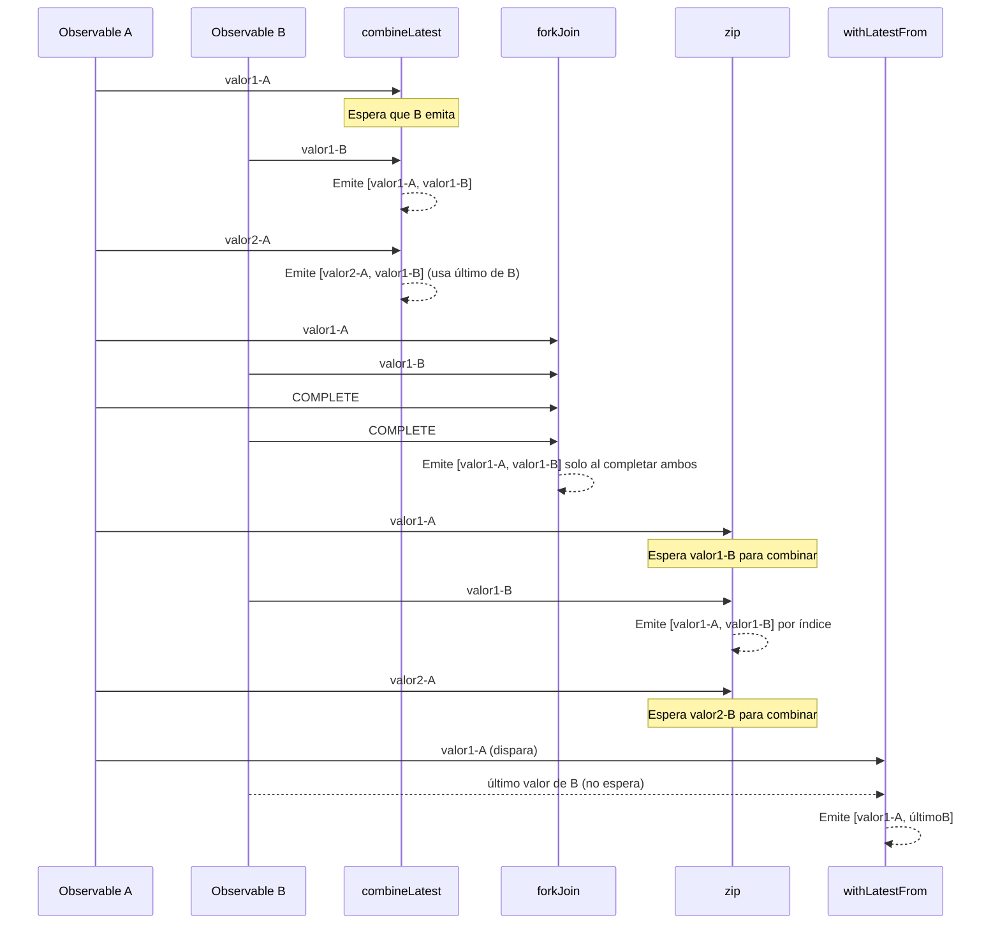

# Capítulo 17 - Parte 3: Combinación: combineLatest, forkJoin, zip, withLatestFrom

> **Parte 3 de 4** · Capítulo 17 · PARTE IX - Programación Reactiva con RxJS

En aplicaciones reales raramente trabajamos con un solo stream de datos. Necesitamos combinar el estado del usuario con los resultados de una API, sincronizar filtros de búsqueda, o cargar datos de múltiples endpoints en paralelo. RxJS tiene cuatro operadores principales para esto, y cada uno tiene una semántica distinta que debemos entender bien antes de elegir cuál usar.

## combineLatest: reaccionar cuando cualquiera cambia

`combineLatest` toma un array de Observables y emite un array con el **último valor de cada uno** cada vez que cualquiera de ellos emite. La condición de inicio: todos deben haber emitido al menos un valor antes de que `combineLatest` emita su primera combinación.

```typescript
import { Component, OnInit } from '@angular/core';
import { HttpClient } from '@angular/common/http';
import { BehaviorSubject, Observable, combineLatest } from 'rxjs';
import { switchMap, map } from 'rxjs/operators';

interface Filtros {
  categoria: string;
  ordenar: 'precio' | 'nombre';
}

interface Producto {
  id: number;
  nombre: string;
  categoria: string;
  precio: number;
}

@Component({
  selector: 'app-catalogo',
  template: `
    <select (change)="cambiarCategoria($event)">
      <option value="todos">Todos</option>
      <option value="ropa">Ropa</option>
    </select>
    <select (change)="cambiarOrden($event)">
      <option value="nombre">Por nombre</option>
      <option value="precio">Por precio</option>
    </select>
    <ul><li *ngFor="let p of productos$ | async">{{ p.nombre }}</li></ul>
  `
})
export class CatalogoComponent implements OnInit {
  private categoria$ = new BehaviorSubject<string>('todos');
  private ordenar$ = new BehaviorSubject<'precio' | 'nombre'>('nombre');
  productos$!: Observable<Producto[]>;

  constructor(private http: HttpClient) {}

  ngOnInit(): void {
    this.productos$ = combineLatest([this.categoria$, this.ordenar$]).pipe(
      switchMap(([categoria, ordenar]) =>
        this.http.get<Producto[]>(`/api/productos?cat=${categoria}&ord=${ordenar}`)
      )
    );
  }

  cambiarCategoria(evento: Event): void {
    this.categoria$.next((evento.target as HTMLSelectElement).value);
  }

  cambiarOrden(evento: Event): void {
    this.ordenar$.next((evento.target as HTMLSelectElement).value as 'precio' | 'nombre');
  }
}
```

Cada vez que el usuario cambia la categoría o el orden, `combineLatest` emite el nuevo par de valores y `switchMap` hace una nueva petición HTTP cancelando la anterior. El código es declarativo, sin una sola variable de estado mutable extra.

Un punto de atención: `combineLatest` **no emite nada** hasta que todos los Observables hayan emitido al menos una vez. Por eso usar `BehaviorSubject` (que emite el valor inicial inmediatamente) es ideal aquí.

## forkJoin: esperar que todos terminen

`forkJoin` es el equivalente reactivo de `Promise.all`. Espera a que **todos** los Observables completen y luego emite un único array con el último valor de cada uno. Si alguno lanza error, el error se propaga y los demás se cancelan.

```typescript
import { Component, OnInit } from '@angular/core';
import { HttpClient } from '@angular/common/http';
import { Observable, forkJoin } from 'rxjs';
import { map } from 'rxjs/operators';

interface Perfil {
  nombre: string;
  email: string;
}

interface Configuracion {
  tema: 'claro' | 'oscuro';
  idioma: string;
}

interface Permiso {
  nombre: string;
  activo: boolean;
}

interface DashboardData {
  perfil: Perfil;
  configuracion: Configuracion;
  permisos: Permiso[];
}

@Component({
  selector: 'app-dashboard',
  template: `<div *ngIf="datos$ | async as datos">Bienvenido, {{ datos.perfil.nombre }}</div>`
})
export class DashboardComponent implements OnInit {
  datos$!: Observable<DashboardData>;

  constructor(private http: HttpClient) {}

  ngOnInit(): void {
    this.datos$ = forkJoin({
      perfil: this.http.get<Perfil>('/api/usuario/perfil'),
      configuracion: this.http.get<Configuracion>('/api/usuario/config'),
      permisos: this.http.get<Permiso[]>('/api/usuario/permisos')
    }).pipe(
      map(resultado => resultado as DashboardData)
    );
  }
}
```

Nótese que pasamos un objeto con claves en lugar de un array. `forkJoin` respeta esta forma y devuelve un objeto con las mismas claves, lo que hace el código mucho más legible que trabajar con índices de un array.

Una advertencia importante: si alguno de los Observables nunca completa (como un `BehaviorSubject` o un Observable de eventos del DOM), `forkJoin` nunca emitirá. Solo úsalo con Observables que terminen, como peticiones HTTP.

## zip: sincronizar por índice

`zip` combina los valores de múltiples Observables **por posición**: el primer valor de obs1 con el primero de obs2, el segundo con el segundo, y así. Espera a que todos los Observables hayan emitido el valor en esa posición antes de combinarlos.

```typescript
import { zip, from, of } from 'rxjs';
import { map } from 'rxjs/operators';

// Imagina que procesamos lotes de datos donde cada Observable
// representa una fuente diferente del mismo item
const nombres$ = from(['Ana', 'Carlos', 'Diana']);
const edades$ = from([28, 35, 24]);
const roles$ = from(['admin', 'usuario', 'moderador']);

const usuarios$ = zip(nombres$, edades$, roles$).pipe(
  map(([nombre, edad, rol]) => ({ nombre, edad, rol }))
);

usuarios$.subscribe(u => console.log(u));
// { nombre: 'Ana', edad: 28, rol: 'admin' }
// { nombre: 'Carlos', edad: 35, rol: 'usuario' }
// { nombre: 'Diana', edad: 24, rol: 'moderador' }
```

`zip` es útil cuando tienes dos streams que naturalmente se sincronizan entre sí: por ejemplo, una lista de URLs de imágenes y sus metadatos, donde el elemento N de un stream corresponde al elemento N del otro.

## withLatestFrom: enriquecer sin esperar

`withLatestFrom` no es un operador de creación sino un **operador de pipeable**. Se usa dentro de un `pipe` y combina cada valor del Observable fuente con el **último valor** de otro Observable, sin esperar a que ese otro emita. Si el Observable secundario no ha emitido nada todavía, la emisión se descarta.

```typescript
import { Component, OnInit } from '@angular/core';
import { HttpClient } from '@angular/common/http';
import { BehaviorSubject, Subject } from 'rxjs';
import { withLatestFrom, switchMap } from 'rxjs/operators';

interface Usuario {
  id: number;
  nombre: string;
}

interface Pedido {
  usuarioId: number;
  items: string[];
}

@Component({
  selector: 'app-pedido',
  template: `<button (click)="realizarPedido()">Realizar pedido</button>`
})
export class PedidoComponent implements OnInit {
  private realizarPedido$ = new Subject<void>();
  private usuarioActual$ = new BehaviorSubject<Usuario>({ id: 1, nombre: 'Ana' });

  constructor(private http: HttpClient) {}

  ngOnInit(): void {
    this.realizarPedido$.pipe(
      withLatestFrom(this.usuarioActual$),
      switchMap(([, usuario]) =>
        this.http.post<Pedido>('/api/pedidos', {
          usuarioId: usuario.id,
          items: ['item1', 'item2']
        })
      )
    ).subscribe(pedido => console.log('Pedido creado:', pedido));
  }

  realizarPedido(): void {
    this.realizarPedido$.next();
  }
}
```

`withLatestFrom` brilla en efectos de NgRx, donde una acción necesita el estado actual del store para construir la petición HTTP, sin que el estado por sí mismo deba disparar nada.

## Diagrama comparativo de los cuatro operadores



## Guía de elección rápida

| Situación | Operador ideal |
|---|---|
| Combinar múltiples filtros activos | `combineLatest` |
| Cargar datos de N APIs al iniciar | `forkJoin` |
| Sincronizar dos streams por posición | `zip` |
| Acción necesita snapshot de estado | `withLatestFrom` |

## Puntos clave

- `combineLatest` requiere que todos los Observables hayan emitido al menos un valor; usa `BehaviorSubject` para evitar el "bloqueo inicial".
- `forkJoin` es el `Promise.all` de RxJS: ideal para peticiones paralelas, pero solo con Observables que terminen.
- `zip` combina por índice y es el menos usado de los cuatro; aparece más en procesamiento de datos que en UIs.
- `withLatestFrom` es asimétrico: el Observable fuente dispara la combinación, el segundo solo aporta su último valor.
- En efectos NgRx, `withLatestFrom(this.store.select(...)` es el patrón estándar para leer estado sin suscribirse directamente al store.

## ¿Qué sigue?

En la última parte de este capítulo veremos cómo manejar errores en cadenas de operadores usando `catchError`, `retry` y `retryWhen` con backoff exponencial.
