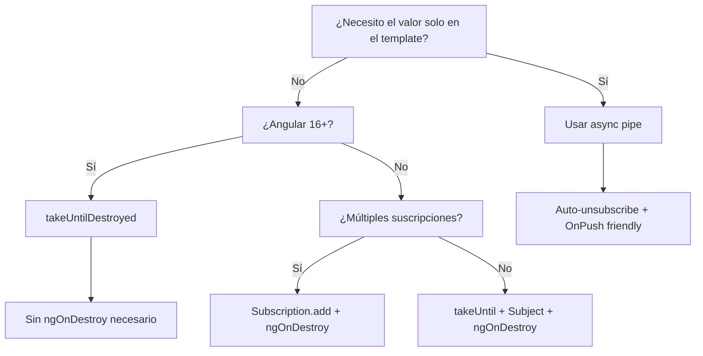

# Capítulo 18 - Parte 2: Evitando memory leaks: takeUntilDestroyed, async pipe

> **Parte 2 de 4** · Capítulo 18 · PARTE IX - Programación Reactiva con RxJS

Los memory leaks por suscripciones no canceladas son uno de los errores más comunes -y más difíciles de detectar- en aplicaciones Angular. Un componente destruido puede seguir recibiendo valores de un Observable durante minutos o para siempre si no gestionamos correctamente el ciclo de vida de las suscripciones. Veamos el problema, sus consecuencias y las soluciones modernas.

## El problema: suscripciones huérfanas

Cuando Angular destruye un componente (navegas a otra ruta, por ejemplo), ejecuta `ngOnDestroy`. Pero si dentro de `ngOnInit` creamos una suscripción sin cancelarla, esa suscripción sigue activa. El componente fue destruido por Angular, pero el Observable no lo sabe.

```typescript
import { Component, OnInit } from '@angular/core';
import { interval } from 'rxjs';

// PELIGROSO: memory leak garantizado
@Component({
  selector: 'app-problema',
  template: `<p>{{ contador }}</p>`
})
export class ProblemaComponent implements OnInit {
  contador = 0;

  ngOnInit(): void {
    // Esta suscripción NUNCA se cancela
    interval(1000).subscribe(n => {
      this.contador = n;
      // Esto sigue ejecutándose aunque el componente fue destruido
      // Angular intentará detectar cambios en un componente que ya no existe
    });
  }
}
```

Las consecuencias son:
- **Memory leak**: el componente no puede ser recolectado por el garbage collector porque la suscripción mantiene una referencia a él.
- **Errores silenciosos**: Angular puede lanzar `ExpressionChangedAfterItHasBeenCheckedError` o errores de componente destruido.
- **Comportamiento inesperado**: el código del suscriptor sigue ejecutándose en un contexto muerto.

## takeUntilDestroyed: la solución moderna (Angular 16+)

`takeUntilDestroyed()` de `@angular/core/rxjs-interop` es la forma canónica de gestionar el ciclo de vida de suscripciones en Angular moderno. Completa automáticamente el Observable cuando el contexto en el que se llama (el componente, la directiva, el pipe) es destruido.

```typescript
import { Component, OnInit } from '@angular/core';
import { interval } from 'rxjs';
import { takeUntilDestroyed } from '@angular/core/rxjs-interop';

@Component({
  selector: 'app-seguro',
  template: `<p>{{ contador }}</p>`
})
export class SeguroComponent implements OnInit {
  contador = 0;

  // takeUntilDestroyed necesita acceso al contexto de inyección
  // Se puede llamar en el constructor o con inject()
  private destruir = takeUntilDestroyed();

  ngOnInit(): void {
    interval(1000).pipe(
      this.destruir  // Cancela automáticamente cuando el componente se destruye
    ).subscribe(n => {
      this.contador = n;
    });
  }
}
```

La forma más limpia es llamar `takeUntilDestroyed()` directamente en el campo de la clase o en el constructor, donde el contexto de inyección está disponible:

```typescript
import { Component, OnInit } from '@angular/core';
import { HttpClient } from '@angular/common/http';
import { Observable } from 'rxjs';
import { switchMap, takeUntilDestroyed } from 'rxjs/operators';
import { takeUntilDestroyed as tud } from '@angular/core/rxjs-interop';
import { FormControl } from '@angular/forms';

interface Articulo {
  id: number;
  titulo: string;
  contenido: string;
}

@Component({
  selector: 'app-lector',
  template: `
    <input [formControl]="busqueda">
    <article *ngFor="let a of articulos">{{ a.titulo }}</article>
  `
})
export class LectorComponent implements OnInit {
  busqueda = new FormControl('');
  articulos: Articulo[] = [];

  // DestroyRef se inyecta implícitamente aquí
  private readonly destruirRef = tud();

  constructor(private http: HttpClient) {}

  ngOnInit(): void {
    this.busqueda.valueChanges.pipe(
      switchMap(termino =>
        this.http.get<Articulo[]>(`/api/articulos?q=${termino}`)
      ),
      this.destruirRef  // Aplica el operador con la referencia guardada
    ).subscribe(articulos => {
      this.articulos = articulos;
    });
  }
}
```

## DestroyRef: desuscribirse fuera de componentes

Cuando necesitamos gestionar el ciclo de vida en contextos fuera de un componente (un servicio con scope de componente, una función utilitaria), podemos inyectar `DestroyRef` directamente:

```typescript
import { Injectable, DestroyRef, inject } from '@angular/core';
import { HttpClient } from '@angular/common/http';
import { interval } from 'rxjs';
import { takeUntilDestroyed } from '@angular/core/rxjs-interop';

interface EstadisticasSistema {
  cpu: number;
  memoria: number;
}

// Servicio con scope de componente (no providedIn: 'root')
@Injectable()
export class MonitoreoService {
  private destroyRef = inject(DestroyRef);

  constructor(private http: HttpClient) {
    // Este polling se detiene cuando el componente que provee este servicio se destruye
    interval(5000).pipe(
      takeUntilDestroyed(this.destroyRef),
      switchMap(() => this.http.get<EstadisticasSistema>('/api/sistema/stats'))
    ).subscribe(stats => {
      console.log('CPU:', stats.cpu, '% | Memoria:', stats.memoria, 'MB');
    });
  }
}
```

La diferencia con `takeUntilDestroyed()` sin argumentos es que aquí pasamos explícitamente el `DestroyRef`, lo que nos permite usarlo en cualquier función o servicio donde hayamos inyectado esa referencia.

## async pipe: el enfoque preferido

El `async pipe` es la forma más segura y elegante de consumir Observables en templates. Se suscribe automáticamente al Observable cuando el componente se inicializa y cancela la suscripción cuando se destruye. Además, en componentes con `ChangeDetectionStrategy.OnPush`, marca el componente como "sucio" automáticamente cuando llega un nuevo valor.

```typescript
import { Component, OnInit, ChangeDetectionStrategy } from '@angular/core';
import { HttpClient } from '@angular/common/http';
import { Observable, combineLatest } from 'rxjs';
import { map } from 'rxjs/operators';
import { AsyncPipe, NgFor, NgIf } from '@angular/common';

interface Tarea {
  id: number;
  titulo: string;
  completada: boolean;
}

interface EstadoTareas {
  pendientes: Tarea[];
  completadas: Tarea[];
  total: number;
}

@Component({
  selector: 'app-tareas',
  standalone: true,
  imports: [AsyncPipe, NgFor, NgIf],
  changeDetection: ChangeDetectionStrategy.OnPush,
  template: `
    <ng-container *ngIf="estadoTareas$ | async as estado">
      <h2>Tareas pendientes ({{ estado.total }})</h2>
      <ul>
        <li *ngFor="let tarea of estado.pendientes">{{ tarea.titulo }}</li>
      </ul>
      <h3>Completadas: {{ estado.completadas.length }}</h3>
    </ng-container>
  `
})
export class TareasComponent implements OnInit {
  estadoTareas$!: Observable<EstadoTareas>;

  constructor(private http: HttpClient) {}

  ngOnInit(): void {
    this.estadoTareas$ = this.http.get<Tarea[]>('/api/tareas').pipe(
      map(tareas => ({
        pendientes: tareas.filter(t => !t.completada),
        completadas: tareas.filter(t => t.completada),
        total: tareas.length
      }))
    );
    // Sin suscripción manual. El async pipe gestiona todo.
  }
}
```

Cuándo preferir `async pipe` sobre suscripción manual:
- Cuando solo necesitamos el valor en el template.
- Cuando usamos `OnPush`: el `async pipe` activa la detección de cambios automáticamente.
- Cuando queremos simplificar el código (menos boilerplate).

Cuándo usar suscripción manual (con `takeUntilDestroyed`):
- Cuando necesitamos ejecutar lógica de negocio en respuesta a los valores (actualizar otros estados, llamar métodos, etc.).
- Cuando el valor necesita ser almacenado en una variable de clase para usarlo en métodos.

## Gestionar múltiples suscripciones con Subscription.add()

Cuando inevitablemente necesitamos múltiples suscripciones manuales, la clase `Subscription` tiene un método `add()` que permite agruparlas y cancelarlas todas a la vez:

```typescript
import { Component, OnInit, OnDestroy } from '@angular/core';
import { interval, fromEvent, Subscription } from 'rxjs';
import { HttpClient } from '@angular/common/http';
import { switchMap } from 'rxjs/operators';

interface Configuracion { tema: string; }

@Component({
  selector: 'app-multiple-subs',
  template: `<p>{{ contador }}</p>`
})
export class MultipleSuscripcionesComponent implements OnInit, OnDestroy {
  contador = 0;
  private suscripciones = new Subscription();

  constructor(private http: HttpClient) {}

  ngOnInit(): void {
    // Agregar múltiples suscripciones al grupo
    this.suscripciones.add(
      interval(1000).subscribe(n => (this.contador = n))
    );

    this.suscripciones.add(
      fromEvent(window, 'resize').subscribe(() =>
        console.log('Ventana redimensionada')
      )
    );

    this.suscripciones.add(
      this.http.get<Configuracion>('/api/config').subscribe(config =>
        console.log('Config cargada:', config.tema)
      )
    );
  }

  ngOnDestroy(): void {
    this.suscripciones.unsubscribe();  // Cancela TODAS de una vez
  }
}
```

Este patrón es válido pero en Angular 16+ generalmente preferimos `takeUntilDestroyed` para cada suscripción individual, ya que no requiere implementar `OnDestroy`.

## Resumen comparativo de estrategias



## Puntos clave

- Una suscripción no cancelada mantiene vivo el componente en memoria y puede ejecutar código sobre un componente destruido, causando errores difíciles de depurar.
- `takeUntilDestroyed()` de `@angular/core/rxjs-interop` es la solución moderna: elimina la necesidad de implementar `OnDestroy` para gestionar suscripciones.
- `DestroyRef` permite usar el mismo patrón en servicios y funciones fuera del contexto directo de un componente.
- `async pipe` es la opción más segura para templates: cancela automáticamente, funciona bien con `OnPush` y elimina todo el boilerplate de suscripción manual.
- `Subscription.add()` es útil para agrupar múltiples suscripciones cuando no podemos usar `takeUntilDestroyed` (código heredado, Angular 14 o menor).

## ¿Qué sigue?

En la siguiente parte exploraremos los operadores de acumulación -`scan`, `reduce`, `buffer` y sus variantes- para construir estado acumulativo y agrupar emisiones en el tiempo.
