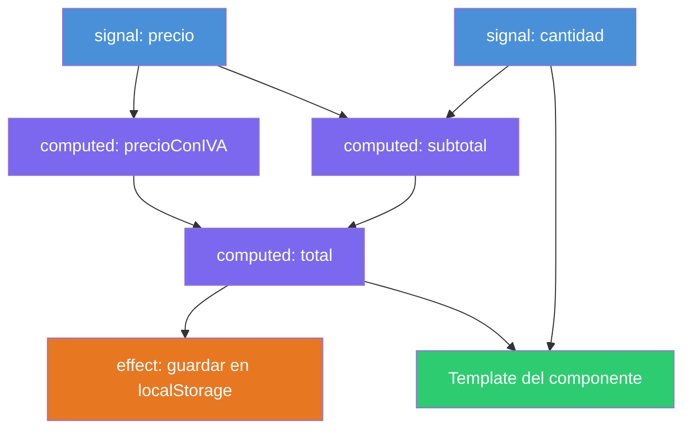

# Capítulo 19 - Parte 1: ¿Qué son los Signals y cómo cambian Angular?

> **Parte 1 de 4** · Capítulo 19 · PARTE X - Angular Signals: Reactividad Moderna

Angular siempre ha necesitado una respuesta a una pregunta fundamental: cuando un dato cambia, ¿cómo sabe el framework qué parte de la pantalla debe actualizarse? La respuesta que Angular usó durante casi una década fue Zone.js, una librería que intercepta todas las operaciones asíncronas del navegador -clics, peticiones HTTP, `setTimeout`, promesas- y dispara el mecanismo de Change Detection (detección de cambios) al finalizar cada una. El problema con este enfoque no es que sea incorrecto, sino que es demasiado amplio: no importa qué componente originó el cambio, Angular revisa el árbol completo de componentes por si acaso. En aplicaciones pequeñas esto es imperceptible, pero en aplicaciones con cientos de componentes se convierte en una fuente real de lentitud.

## El problema real de Zone.js

Imaginemos un árbol de componentes con 200 nodos. El usuario hace clic en un botón del componente más profundo del árbol, que actualiza el nombre de un producto. Zone.js intercepta el evento de clic, avisa a Angular, y Angular inicia un ciclo de detección de cambios que -dependiendo de la estrategia configurada- puede recorrer los 200 componentes para determinar cuáles necesitan re-renderizarse. La mayoría de ellos no han cambiado absolutamente nada, pero Angular no tiene forma de saberlo sin revisar.

La solución parcial ha sido la estrategia `OnPush` (→ Ver Capítulo 25, Parte 2), que le dice a Angular que solo revise un componente cuando sus inputs cambian o cuando un Observable al que está suscrito emite un nuevo valor. Esto mejora el rendimiento considerablemente, pero requiere que el desarrollador recuerde aplicarlo y que estructure su código de una manera específica. No es automático, ni es el comportamiento por defecto.

Los Signals resuelven este problema desde la raíz. En lugar de que Zone.js observe el mundo entero esperando que algo cambie, con Signals cada valor reactivo sabe exactamente quién depende de él. Cuando ese valor cambia, Angular actualiza solo los componentes y derivaciones que realmente lo usan. No hay revisión amplia del árbol, no hay zona de intercepción, no hay suposiciones: hay conocimiento preciso de las dependencias.

## ¿Qué es un Signal conceptualmente?

Un Signal es un contenedor de un valor que notifica a sus consumidores cuando ese valor cambia. La definición es simple, pero la potencia está en lo que implica: el seguimiento de dependencias es automático y transparente. Cuando un componente lee un Signal en su template, Angular registra internamente que ese componente depende de ese Signal. Cuando el Signal cambia, Angular sabe, sin necesidad de revisar nada más, que ese componente debe actualizarse.

Esto no es una idea nueva en el mundo del desarrollo front-end. Vue 3 tiene `ref` y `reactive`, SolidJS es completamente reactivo por Signals, y MobX popularizó el concepto hace años. Angular llegó más tarde a esta idea, pero lo hizo de forma deliberada: los Signals en Angular están profundamente integrados con el sistema de templates, el Change Detection, las herramientas de desarrollo y el sistema de inputs/outputs de componentes.

La diferencia clave respecto a un `BehaviorSubject`<sup>1</sup> de RxJS es que los Signals son síncronos y no requieren suscripción explícita ni desuscripción. Leer un Signal es tan simple como llamar a la función que lo representa: `contador()`. No hay `.subscribe()`, no hay `pipe()`, no hay riesgo de memory leak por olvidar desuscribirse.

<sup>1</sup> *BehaviorSubject*: tipo de Subject en RxJS que almacena el valor actual y lo emite a los nuevos suscriptores. Cubierto en el Capítulo 16.

## La trinidad reactiva: signal, computed y effect

Los Signals no funcionan solos. Angular introduce tres primitivas que trabajan juntas para construir sistemas reactivos completos:

**`signal`** es el punto de partida: un valor mutable con seguimiento de dependencias. Se crea una vez y se lee o modifica a lo largo de la vida del componente.

**`computed`** es una derivación: un valor calculado a partir de uno o más Signals. Nunca se modifica directamente; se recalcula automáticamente cuando alguna de sus dependencias cambia. Y solo recalcula cuando alguien lo lee después de que una dependencia cambió, no antes. Esto se llama evaluación perezosa (*lazy evaluation*).

**`effect`** es la puerta de salida hacia el mundo exterior: una función que se ejecuta automáticamente cuando los Signals que lee dentro de ella cambian. Se usa para sincronizar estado reactivo con efectos secundarios: guardar en localStorage, imprimir en consola durante el desarrollo, actualizar librerías de terceros que no son reactivas.

```typescript
import { Component, signal, computed, effect } from '@angular/core';

@Component({
  selector: 'app-contador',
  standalone: true,
  template: `
    <p>Contador: {{ contador() }}</p>
    <p>El doble: {{ doble() }}</p>
    <button (click)="incrementar()">+1</button>
  `
})
export class ContadorComponent {
  // Signal: valor mutable reactivo
  contador = signal(0);

  // Computed: derivación perezosa, solo recalcula si contador() cambió
  doble = computed(() => this.contador() * 2);

  constructor() {
    // Effect: se ejecuta cada vez que contador() cambia
    effect(() => {
      console.log(`Contador actualizado a: ${this.contador()}`);
    });
  }

  incrementar(): void {
    this.contador.update(v => v + 1);
  }
}
```

Lo que ocurre aquí es notable: el template lee `contador()` y `doble()`. Angular registra automáticamente que este componente depende de ambos Signals. Cuando `incrementar()` se llama, `contador` cambia, Angular detecta la dependencia directa, y solo este componente se actualizará. `doble` recalculará su valor porque su dependencia `contador` cambió. El `effect` se ejecutará para imprimir en consola. Todo esto ocurre sin Zone.js, sin suscripciones explícitas.

## El grafo reactivo de dependencias

Una forma de visualizar cómo funciona el sistema de Signals es como un grafo dirigido donde los nodos son Signals, Computeds o Effects, y los arcos representan dependencias de lectura:



Cuando `precio` cambia, Angular sabe que debe invalidar `precioConIVA`, `subtotal`, `total`, el efecto de localStorage, y el template. Y lo sabe con precisión quirúrgica, sin revisar el resto de la aplicación.

## Por qué Signals es el futuro de Angular

El equipo de Angular no introdujo Signals como una característica opcional que coexiste con el sistema anterior. La intención documentada en los RFCs (Request for Comments) del proyecto es que Signals sea la base de la reactividad en Angular de aquí en adelante. Angular 17 los estabilizó. Angular 18 introdujo Zoneless como opción experimental. Angular 20 promovió `resource()`, `httpResource()` y `linkedSignal()` a developer preview. Angular 21 consolidó Zoneless como estable. La dirección es clara: menos Zone.js, más Signals.

Para el desarrollador esto significa una inversión que vale la pena: entender Signals hoy es prepararse para el Angular de los próximos cinco años. No se trata de reescribir aplicaciones existentes de la noche a la mañana, sino de adoptar el nuevo modelo en código nuevo y migrar gradualmente donde tenga sentido.

## Puntos clave

- Zone.js dispara Change Detection en todo el árbol de componentes ante cualquier evento asíncrono, sin saber qué cambió realmente
- Un Signal es un valor reactivo que registra automáticamente quién lo lee y notifica solo a esos consumidores cuando cambia
- Las tres primitivas son `signal` (valor mutable), `computed` (derivación perezosa) y `effect` (puerta al mundo exterior)
- El grafo de dependencias es construido y mantenido automáticamente por Angular en tiempo de ejecución
- Signals es la dirección estratégica de Angular hacia un framework sin Zone.js

## ¿Qué sigue?

En la Parte 2 exploramos en profundidad cada una de las tres APIs -`signal()`, `computed()` y `effect()`- con todos sus métodos y casos de uso reales.
