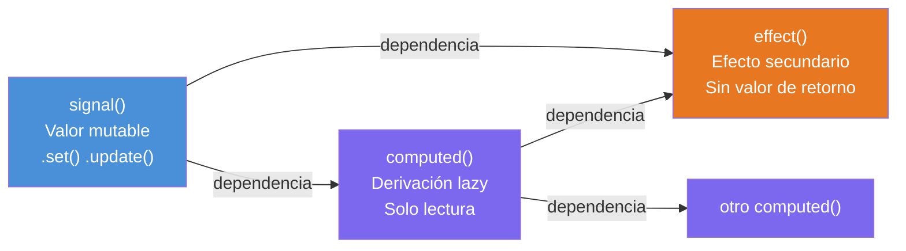

# Capítulo 19 - Parte 2: `signal()`, `computed()` y `effect()`: la trinidad reactiva

> **Parte 2 de 4** · Capítulo 19 · PARTE X - Angular Signals: Reactividad Moderna

Habiendo entendido el modelo conceptual de Signals (→ Parte 1), es momento de conocer la API concreta. Angular expone tres funciones -`signal()`, `computed()` y `effect()`- que forman el vocabulario completo de la reactividad basada en Signals. Cada una tiene un propósito preciso y un conjunto de métodos bien definido. Usarlas correctamente desde el principio evita los errores más comunes que aparecen cuando se mezclan sin entender sus contratos.

## `signal<T>(valorInicial)`: el valor mutable reactivo

La función `signal()` crea un Signal con un valor inicial. TypeScript infiere el tipo del valor genérico `T` a partir del argumento que se le pasa, aunque siempre es posible anotarlo explícitamente cuando se necesita mayor precisión.

```typescript
import { Component, signal } from '@angular/core';

@Component({
  selector: 'app-ejemplo-signal',
  standalone: true,
  template: `<p>{{ nombre() }} tiene {{ edad() }} años</p>`
})
export class EjemploSignalComponent {
  // Inferencia de tipo automática: Signal<string> y Signal<number>
  nombre = signal('Ana');
  edad = signal(30);

  // Anotación explícita cuando se quiere precisión (ej: tipo unión)
  estado = signal<'activo' | 'inactivo'>('activo');
}
```

Para leer el valor de un Signal se llama como función: `nombre()`. Para modificarlo existen tres métodos según el caso de uso.

**`.set(nuevoValor)`** reemplaza el valor completamente. Es el método más directo:

```typescript
import { signal } from '@angular/core';

const contador = signal(0);
contador.set(10); // El Signal ahora vale 10
```

**`.update(fn)`** recibe una función que toma el valor actual y retorna el nuevo. Es ideal cuando el nuevo valor depende del anterior:

```typescript
import { signal } from '@angular/core';

const contador = signal(0);

// Equivalente a: contador.set(contador() + 1)
contador.update(valorActual => valorActual + 1);

// Para arrays: agregar un elemento sin mutar la referencia original
const items = signal<string[]>([]);
items.update(lista => [...lista, 'nuevo item']);
```

**`.mutate(fn)`** -disponible en versiones anteriores de Angular 17- permitía mutar directamente el objeto interno del Signal. Este método fue deprecado y eliminado en Angular 17.3+ porque rompía la inmutabilidad y hacía el seguimiento de cambios impredecible. En su lugar, se usa `.update()` con desestructuración o spread:

```typescript
import { signal } from '@angular/core';

// Forma correcta en Angular 17+: no mutar, sino reemplazar
const perfil = signal({ nombre: 'Ana', edad: 30 });

// Reemplazar con spread para mantener inmutabilidad
perfil.update(p => ({ ...p, edad: 31 }));
```

## `computed(() => ...)`: derivación reactiva perezosa

`computed()` crea un Signal de solo lectura cuyo valor se calcula a partir de otros Signals. La función que se le pasa se ejecuta la primera vez que alguien lee el computed, y solo vuelve a ejecutarse si alguna de las dependencias que leyó durante esa ejecución ha cambiado. Esto se denomina evaluación perezosa (*lazy evaluation*<sup>1</sup>): no recalcula innecesariamente.

<sup>1</sup> *Lazy evaluation*: estrategia de evaluación que retrasa el cálculo de un valor hasta que es realmente necesario.

```typescript
import { Component, signal, computed } from '@angular/core';

@Component({
  selector: 'app-carrito',
  standalone: true,
  template: `
    <p>Productos: {{ cantidadProductos() }}</p>
    <p>Subtotal: {{ subtotal() | currency:'USD' }}</p>
    <p>Total con IVA: {{ totalConIva() | currency:'USD' }}</p>
  `
})
export class CarritoComponent {
  productos = signal([
    { nombre: 'Teclado', precio: 45, cantidad: 2 },
    { nombre: 'Mouse', precio: 20, cantidad: 1 },
  ]);

  // Computed que depende de productos()
  cantidadProductos = computed(() =>
    this.productos().reduce((acc, p) => acc + p.cantidad, 0)
  );

  subtotal = computed(() =>
    this.productos().reduce((acc, p) => acc + p.precio * p.cantidad, 0)
  );

  // Computed que depende de otro computed - el grafo se construye automáticamente
  totalConIva = computed(() => this.subtotal() * 1.19);
}
```

Si `productos` cambia, `cantidadProductos`, `subtotal` y `totalConIva` se invalidarán. Pero el recálculo solo ocurrirá cuando el template los lea, no antes. Esto es especialmente valioso con cálculos costosos: si el template no está visible, el computed no se ejecuta.

Un computed también puede depender de múltiples Signals independientes. Angular rastrea todas las lecturas que ocurren dentro de la función y construye el grafo de dependencias dinámicamente en cada ejecución.

## `effect(() => ...)`: la puerta al mundo exterior

Un `effect` es una función que se ejecuta automáticamente cada vez que uno o más de los Signals que lee dentro de ella cambian. A diferencia de `computed`, un effect no produce un valor: su propósito es generar efectos secundarios. Angular ejecuta el effect por primera vez de manera síncrona durante la inicialización del contexto de inyección, y luego lo re-ejecuta después de cada cambio en sus dependencias.

```typescript
import { Component, signal, effect, OnInit } from '@angular/core';

@Component({
  selector: 'app-preferencias',
  standalone: true,
  template: `
    <label>
      Tema:
      <select (change)="cambiarTema($event)">
        <option value="claro">Claro</option>
        <option value="oscuro">Oscuro</option>
      </select>
    </label>
  `
})
export class PreferenciasComponent {
  tema = signal<'claro' | 'oscuro'>('claro');

  constructor() {
    // El effect se registra en el contexto de inyección del constructor
    effect(() => {
      // Lee tema() - Angular registra esta dependencia automáticamente
      const temaActual = this.tema();
      localStorage.setItem('tema', temaActual);
      document.body.classList.toggle('tema-oscuro', temaActual === 'oscuro');
    });
  }

  cambiarTema(evento: Event): void {
    const select = evento.target as HTMLSelectElement;
    this.tema.set(select.value as 'claro' | 'oscuro');
  }
}
```

### Limpieza en effects

Un effect puede registrar una función de limpieza que se ejecuta antes de cada re-ejecución del effect, o cuando el componente se destruye. Esto es útil para cancelar suscripciones a APIs del navegador o liberar recursos:

```typescript
import { effect, signal } from '@angular/core';

const intervaloMs = signal(1000);

effect((onCleanup) => {
  const ms = intervaloMs();
  const id = setInterval(() => console.log('tick'), ms);

  // onCleanup se ejecuta antes de la próxima ejecución del effect
  onCleanup(() => clearInterval(id));
});
```

### Effects que modifican Signals: `allowSignalWrites`

Por defecto, Angular lanza un error si un `effect` intenta modificar un Signal. Esto previene ciclos reactivos infinitos donde un effect modifica un Signal que lo dispara nuevamente. Cuando el caso de uso lo requiere de forma genuina, se puede habilitar con la opción `allowSignalWrites`:

```typescript
import { effect, signal } from '@angular/core';

const origen = signal(0);
const espejo = signal(0);

// Sin allowSignalWrites, esto lanzaría un error en desarrollo
effect(() => {
  espejo.set(origen() * 2);
}, { allowSignalWrites: true });
```

Esta opción debe usarse con criterio. Si el efecto del cambio en `espejo` disparara effects que modifican `origen`, se formaría un ciclo. Angular detecta algunos ciclos en desarrollo, pero no todos, por lo que la disciplina del desarrollador es necesaria aquí.

## Comparación de las tres primitivas



La regla de oro: si necesitas un valor derivado de otros valores reactivos, usa `computed`. Si necesitas reaccionar a cambios para hacer algo en el mundo exterior (DOM, localStorage, consola, APIs externas), usa `effect`. Si necesitas un valor que el usuario o la lógica puede cambiar directamente, usa `signal`.

## Puntos clave

- `signal<T>(inicial)` crea un valor mutable; `.set()` reemplaza, `.update()` transforma con función
- El método `.mutate()` fue deprecado en Angular 17+; usar `.update()` con spread para objetos
- `computed()` crea derivaciones de solo lectura con evaluación perezosa: recalcula solo cuando una dependencia cambió y alguien lo lee
- `effect()` se usa exclusivamente para efectos secundarios; soporta función de limpieza con `onCleanup`
- `allowSignalWrites: true` permite que un effect modifique Signals, pero debe usarse con cautela para evitar ciclos

## ¿Qué sigue?

En la Parte 3 vemos cómo Signals transformaron la comunicación entre componentes con las nuevas APIs `input()`, `model()` y `output()`, que reemplazan `@Input`, `@Output` y `EventEmitter`.
