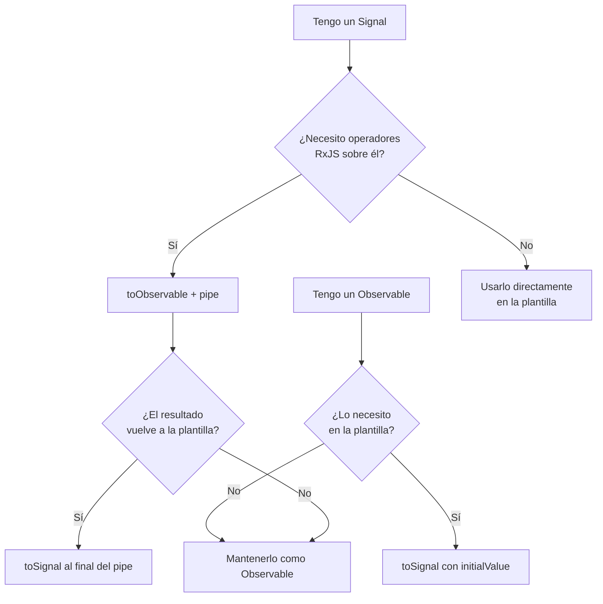

# Capítulo 19 - Parte 4: toSignal() y toObservable(): puente entre Signals y RxJS

> **Parte 4 de 4** · Capítulo 19 · PARTE X - Angular Signals: Reactividad Moderna

En las tres partes anteriores construimos una base sólida con `signal()`, `computed()` y `effect()`. Ahora cerramos el capítulo con el tema que más preguntas genera en equipos que migran proyectos reales: ¿cómo convivimos con el ecosistema RxJS que ya tenemos? La respuesta la dan dos funciones del paquete `@angular/core/rxjs-interop`: `toSignal()` y `toObservable()`. Son literalmente el puente entre los dos mundos, y entender cuándo cruzarlo en cada dirección es lo que separa un código limpio de un código confuso.

## De Observable a Signal con toSignal()

Imaginemos que tenemos un servicio que devuelve un `Observable<Producto[]>` desde HTTP. Hasta ahora, en la plantilla teníamos que usar `async pipe` o suscribirse manualmente. Con `toSignal()` convertimos ese Observable en un Signal que la plantilla consume de forma directa, sin `async`, sin gestión de suscripciones, sin `ngOnDestroy`.

```typescript
// catalogo.component.ts
import { Component, inject, computed } from '@angular/core';
import { toSignal } from '@angular/core/rxjs-interop';
import { ProductoService } from './producto.service';
import { Producto } from './producto.model';

@Component({
  selector: 'app-catalogo',
  standalone: true,
  template: `
    @if (cargando()) {
      <p>Cargando productos...</p>
    } @else {
      <ul>
        @for (p of productos(); track p.id) {
          <li>{{ p.nombre }} - {{ p.precio | currency }}</li>
        }
      </ul>
      <p>Total: {{ totalProductos() }} artículos</p>
    }
  `,
})
export class CatalogoComponent {
  private readonly productoService = inject(ProductoService);

  readonly productos = toSignal(
    this.productoService.obtenerTodos(),
    { initialValue: [] as Producto[] }
  );

  readonly cargando = computed(() => this.productos().length === 0);
  readonly totalProductos = computed(() => this.productos().length);
}
```

Analicemos los detalles. El parámetro `initialValue` es obligatorio cuando el Observable no emite de forma síncrona (que es el caso de HTTP). Sin él, TypeScript inferiría el tipo como `Producto[] | undefined`, y tendríamos que manejar ese `undefined` en toda la plantilla. Con `initialValue: []` arrancamos con un arreglo vacío y el tipo queda limpio como `Producto[]`.

`toSignal()` crea la suscripción automáticamente y la destruye cuando el contexto de inyección donde fue llamado se destruye. Es decir, si lo llamamos en el constructor del componente (o en una propiedad de clase con inicialización directa), se limpia solo. No necesitamos `takeUntilDestroyed()` ni nada extra.

## El parámetro requireSync

Hay casos donde sabemos que el Observable emitirá síncronamente: un `BehaviorSubject`, un `of(valor)`, o un Observable que viene de un `startWith()`. En esos casos podemos usar `requireSync: true` y Angular no exigirá `initialValue`:

```typescript
import { Component, inject } from '@angular/core';
import { toSignal } from '@angular/core/rxjs-interop';
import { of, startWith } from 'rxjs';
import { ConfigService } from './config.service';

@Component({
  selector: 'app-config',
  standalone: true,
  template: `<p>Tema: {{ tema() }}</p>`,
})
export class ConfigComponent {
  private readonly configService = inject(ConfigService);

  // configService.tema$ es un BehaviorSubject, emite síncronamente
  readonly tema = toSignal(this.configService.tema$, { requireSync: true });

  // Observable garantizado síncrono con startWith
  readonly version = toSignal(
    this.configService.version$.pipe(startWith('1.0.0')),
    { requireSync: true }
  );
}
```

Si usamos `requireSync: true` con un Observable que no emite síncronamente, Angular lanzará un error en tiempo de ejecución. Es una salvaguarda útil: nos obliga a ser explícitos sobre nuestras garantías.

## De Signal a Observable con toObservable()

El camino inverso es igualmente necesario. Supongamos que el usuario escribe en un campo de búsqueda y almacenamos el texto en un Signal. Queremos aplicar `debounceTime` y `switchMap` para evitar peticiones innecesarias, algo que los operadores de RxJS hacen de maravilla. `toObservable()` convierte nuestro Signal en un stream para aprovechar ese poder:

```typescript
// buscador.component.ts
import { Component, signal, inject } from '@angular/core';
import { toSignal, toObservable } from '@angular/core/rxjs-interop';
import { debounceTime, distinctUntilChanged, switchMap } from 'rxjs';
import { ProductoService } from './producto.service';
import { Producto } from './producto.model';
import { FormsModule } from '@angular/forms';

@Component({
  selector: 'app-buscador',
  standalone: true,
  imports: [FormsModule],
  template: `
    <input [(ngModel)]="textoBusqueda" placeholder="Buscar..." />
    @if (buscando()) {
      <p>Buscando...</p>
    }
    <ul>
      @for (r of resultados(); track r.id) {
        <li>{{ r.nombre }}</li>
      }
    </ul>
  `,
})
export class BuscadorComponent {
  private readonly productoService = inject(ProductoService);

  readonly textoBusqueda = signal('');
  readonly buscando = signal(false);

  readonly resultados = toSignal(
    toObservable(this.textoBusqueda).pipe(
      debounceTime(300),
      distinctUntilChanged(),
      switchMap(texto => {
        this.buscando.set(true);
        return this.productoService.buscar(texto);
      }),
    ),
    { initialValue: [] as Producto[] }
  );
}
```

Este patrón es la combinación más poderosa: el estado de entrada vive en un Signal (simple, legible, bindeable con `[(ngModel)]`), pero el procesamiento asíncrono usa RxJS (con `debounceTime`, `switchMap` y `distinctUntilChanged`), y el resultado final regresa como Signal para que la plantilla lo consuma sin `async pipe`.

## Casos de uso prácticos

Veamos un resumen de los escenarios más comunes:

```typescript
import { Component, signal, inject } from '@angular/core';
import { HttpClient } from '@angular/common/http';
import { toSignal, toObservable } from '@angular/core/rxjs-interop';
import { switchMap, tap, catchError } from 'rxjs/operators';
import { of } from 'rxjs';

@Component({
  selector: 'app-detalle',
  standalone: true,
  template: `
    <select (change)="cambiarId($event)">
      <option value="1">Producto 1</option>
      <option value="2">Producto 2</option>
    </select>
    <pre>{{ detalle() | json }}</pre>
  `,
})
export class DetalleComponent {
  private readonly http = inject(HttpClient);

  readonly idSeleccionado = signal<number>(1);

  readonly detalle = toSignal(
    toObservable(this.idSeleccionado).pipe(
      switchMap(id =>
        this.http.get<Record<string, unknown>>(`/api/productos/${id}`).pipe(
          catchError(() => of(null))
        )
      )
    ),
    { initialValue: null }
  );

  cambiarId(event: Event): void {
    const valor = (event.target as HTMLSelectElement).value;
    this.idSeleccionado.set(Number(valor));
  }
}
```

## Errores comunes al usar estos puentes

El error más frecuente es llamar a `toSignal()` o `toObservable()` fuera de un contexto de inyección. Ambas funciones necesitan el contexto para registrar la destrucción automática de la suscripción.

```typescript
// MAL: llamado fuera del constructor o inicializador de propiedad
export class MiComponent {
  readonly datos = signal<string[]>([]);

  ngOnInit(): void {
    // Error en tiempo de ejecución: no hay contexto de inyección
    const datosSignal = toSignal(of(['a', 'b']));
  }
}

// BIEN: en inicializador de propiedad (dentro del constructor implícito)
export class MiComponentBien {
  readonly datos = toSignal(of(['a', 'b']), { requireSync: true });
}
```

Si genuinamente necesitamos crear el Signal después de la construcción, podemos pasar el `Injector` explícitamente:

```typescript
import { Component, inject, Injector, OnInit, signal } from '@angular/core';
import { toSignal } from '@angular/core/rxjs-interop';
import { of } from 'rxjs';

@Component({ selector: 'app-tardio', standalone: true, template: '' })
export class TardioComponent implements OnInit {
  private readonly injector = inject(Injector);
  datosSignal = signal<string[]>([]);

  ngOnInit(): void {
    const temporal = toSignal(of(['a', 'b']), {
      injector: this.injector,
      requireSync: true,
    });
    this.datosSignal.set(temporal());
  }
}
```

## Cuándo usar cada conversión

El diagrama siguiente resume la decisión:



La regla de oro es sencilla: convertir en la frontera, no en el interior. Los Signals viven en los componentes; los Observables viven en los servicios y en el procesamiento asíncrono complejo. `toSignal()` y `toObservable()` son las puertas de entrada y salida entre ambos mundos.

## Puntos clave

- `toSignal(obs$, { initialValue })` convierte un Observable en Signal y gestiona la suscripción automáticamente; siempre debe llamarse en un contexto de inyección.
- `requireSync: true` elimina la necesidad de `initialValue` pero exige que el Observable emita síncronamente o lanzará un error en tiempo de ejecución.
- `toObservable(miSignal)` convierte un Signal en stream para aprovechar operadores como `debounceTime`, `switchMap` y `distinctUntilChanged`.
- El patrón más potente es `toSignal(toObservable(signal).pipe(...))`: estado de entrada como Signal, procesamiento como RxJS, resultado como Signal.
- Llamar estas funciones fuera de un contexto de inyección es el error más común; si es necesario, pasa el `Injector` explícitamente.

## ¿Qué sigue?

En el capítulo 20 damos el siguiente paso: veremos cómo usar Signals para gestionar estado local complejo en componentes, reemplazando patrones basados en `BehaviorSubject` con código más simple y legible.
